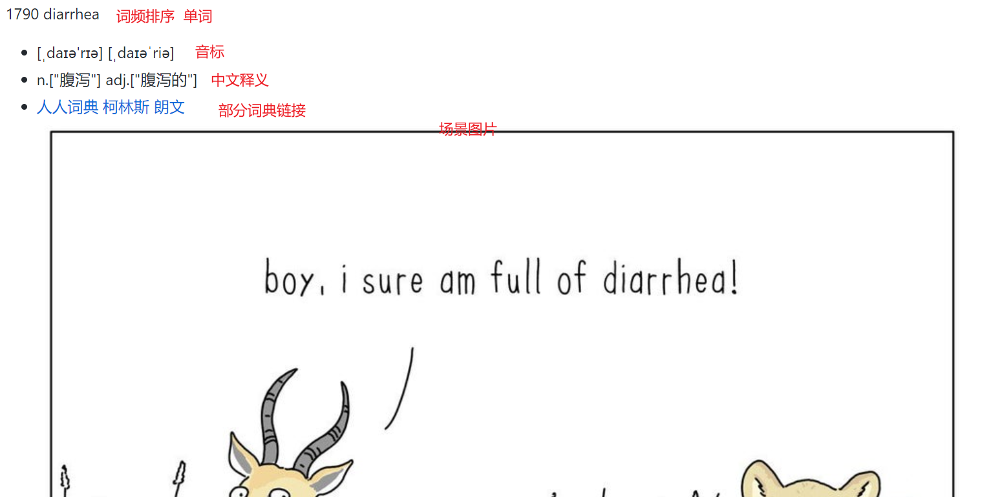

# 项目介绍
为英语单词收集实用、丰富、令人印象深刻的使用场景，帮助学习者更好的记忆单词

# 背景
兴趣是最好的老师，一个对《哈利波特》不感兴趣的人，能通过读原版书学习英语吗？一个不喜欢唱歌的人，能通过学习英语歌曲学习英语吗？回想一下，有些事情，我们不用刻意去记，也会深深映入脑子中

比如看过《飞出个未来》的人可能一辈子也不会忘记这个场景

比如我前几天看了一个 [reddit帖子](https://www.reddit.com/r/funny/comments/sxhpjo/deterrent) ，`diarrhea` 这个词感觉自己很难忘记了

# COCA 词库介绍
[如何积累20000词汇量（COCA词频）](https://zhuanlan.zhihu.com/p/20800565)

# 单词本说明

# Anki 导入功能
本仓库现已支持将词汇导入到 Anki 进行学习。详细的导入步骤和使用说明请参考 [README_ANKI.md](README_ANKI.md)。

# 其他推荐的词汇学习软件
除了 Anki 外，还有其他一些优秀的词汇学习软件：

1. **Quizlet**：提供简单易用的界面和多种学习模式
2. **Memrise**：使用间隔重复系统和助记技巧帮助记忆
3. **SuperMemo**：使用科学的间隔重复算法
4. **百词斩**：专为中国用户设计的英语词汇学习软件
5. **扇贝单词**：提供丰富的例句和记忆方法

# 🤝 贡献 | Contributing
为 20000 个单词收集场景图片是个巨大的工程，还好 [人人词典](https://www.91dict.com/) 已经从影视作品中收集了大量的资源

但我认为是不够的，不经过精心筛选，影视中的很多场景也无法给人留下深刻的印象，因此还需要大量的人工收集

收集来源建议：
- 搞笑图片：[9gag](https://9gag.com/) [imgur](https://imgur.com/) [reddit](https://www.reddit.com/)
- stand-up：[米国脱口秀](https://space.bilibili.com/142371069?from=search&seid=9413455629274285401&spm_id_from=333.337.0.0)
- 情景喜剧：如《生活大爆炸》《老友记》等
- 其它影视作品