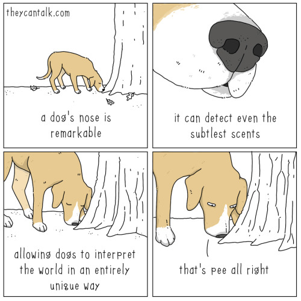

2601 utility 
- [ju:ˈtɪləti]  [juˈtɪləti] 
- n.["功用，效用","有用的物体或器械","公用事业公司","公用事业"]  adj.["有多种用途的","各种工作都会做的","能在数个位置作替补的","为获得经济价值而饲养"]   
- [人人词典](https://www.91dict.com/words?w=utility) [柯林斯](https://www.collinsdictionary.com/zh/dictionary/english/utility) [朗文](https://www.ldoceonline.com/dictionary/utility) 

2602 precisely 
- [prɪˈsaɪsli]  [prɪˈsaɪsli] 
- adv.["精确地","恰好地","严谨地，严格地","一丝不苟地"]   
- [人人词典](https://www.91dict.com/words?w=precisely) [柯林斯](https://www.collinsdictionary.com/zh/dictionary/english/precisely) [朗文](https://www.ldoceonline.com/dictionary/precisely) 

2603 arise 
- [əˈraɪz]  [əˈraɪz] 
- vi.& vt.["产生","出现","起身，起立","起源于，产生于"]   
- [人人词典](https://www.91dict.com/words?w=arise) [柯林斯](https://www.collinsdictionary.com/zh/dictionary/english/arise) [朗文](https://www.ldoceonline.com/dictionary/arise) 

2604 armed 
- [ɑ:md]  [ɑ:rmd] 
- adj.["武装的","有把手的","有防卫器官的"]  v.["“arm”的过去式和过去分词"]   
- [人人词典](https://www.91dict.com/words?w=armed) [柯林斯](https://www.collinsdictionary.com/zh/dictionary/english/armed) [朗文](https://www.ldoceonline.com/dictionary/armed) 

2605 nevertheless 
- [ˌnevəðəˈles]  [ˌnevərðəˈles] 
- adv.["然而","尽管如此","不过","仍然"]  conj.["然而","尽管如此"]   
- [人人词典](https://www.91dict.com/words?w=nevertheless) [柯林斯](https://www.collinsdictionary.com/zh/dictionary/english/nevertheless) [朗文](https://www.ldoceonline.com/dictionary/nevertheless) 

2606 highway 
- [ˈhaɪweɪ]  [ˈhaɪˌwe] 
- n.["公路","公用通道","干线","途径，方法"]   
- [人人词典](https://www.91dict.com/words?w=highway) [柯林斯](https://www.collinsdictionary.com/zh/dictionary/english/highway) [朗文](https://www.ldoceonline.com/dictionary/highway) 

2607 clinical 
- [ˈklɪnɪkl]  [ˈklɪnɪkəl] 
- adj.["临床的","诊所的","冷静的","简陋的"]   
- [人人词典](https://www.91dict.com/words?w=clinical) [柯林斯](https://www.collinsdictionary.com/zh/dictionary/english/clinical) [朗文](https://www.ldoceonline.com/dictionary/clinical) 

2608 routine 
- [ru:ˈti:n]  [ruˈtin] 
- n.["常规","例行程序","生活乏味","（演出中的）一套动作"]  adj.["例行的","常规的","日常的","普通的"]   
- [人人词典](https://www.91dict.com/words?w=routine) [柯林斯](https://www.collinsdictionary.com/zh/dictionary/english/routine) [朗文](https://www.ldoceonline.com/dictionary/routine) 

2609 schedule 
- [ˈʃedju:l]  [ˈskedʒu:l] 
- n.["时刻表，进度表","清单，明细表","预定计划","目录"]  vt.["排定，安排","将…列表","为…作目录"]   
- [人人词典](https://www.91dict.com/words?w=schedule) [柯林斯](https://www.collinsdictionary.com/zh/dictionary/english/schedule) [朗文](https://www.ldoceonline.com/dictionary/schedule) 

2610 wage 
- [weɪdʒ]  [wedʒ] 
- n.["工资","报应"]  vt.& vi.["实行，进行，作（战等）","〈方〉雇佣","〈古〉打赌，抵押，担保"]   
- [人人词典](https://www.91dict.com/words?w=wage) [柯林斯](https://www.collinsdictionary.com/zh/dictionary/english/wage) [朗文](https://www.ldoceonline.com/dictionary/wage) 

2611 normally 
- [ˈnɔ:məli]  [ˈnɔ:rməli] 
- adv.["正常地","通常地，一般地","按说","论理"]   
- [人人词典](https://www.91dict.com/words?w=normally) [柯林斯](https://www.collinsdictionary.com/zh/dictionary/english/normally) [朗文](https://www.ldoceonline.com/dictionary/normally) 

2612 phrase 
- [freɪz]  [frez] 
- n.["<语>短语","成语","说法","乐句"]  vt.["叙述，措词"]  vt.& vi.["划分乐句，分乐节（尤指为奏乐或歌唱）"]   
- [人人词典](https://www.91dict.com/words?w=phrase) [柯林斯](https://www.collinsdictionary.com/zh/dictionary/english/phrase) [朗文](https://www.ldoceonline.com/dictionary/phrase) 

2613 ingredient 
- [ɪnˈgri:diənt]  [ɪnˈgri:diənt] 
- n.["（混合物的）组成部分","（烹调的）原料","（构成）要素","因素"]   
- [人人词典](https://www.91dict.com/words?w=ingredient) [柯林斯](https://www.collinsdictionary.com/zh/dictionary/english/ingredient) [朗文](https://www.ldoceonline.com/dictionary/ingredient) 

2614 stake 
- [steɪk]  [stek] 
- n.["桩","刑柱","股份","（在公司、计划等中的）重大利益"]  vt.["用桩支撑","以…下注[打赌]","用桩区分，界分"]   
- [人人词典](https://www.91dict.com/words?w=stake) [柯林斯](https://www.collinsdictionary.com/zh/dictionary/english/stake) [朗文](https://www.ldoceonline.com/dictionary/stake) 

2615 Muslim 
- [ˈmʊzlɪm]  [ˈmʌzləm, ˈmʊz-, ˈmʌs-, ˈmʊs-] 
- n.["穆斯林，伊斯兰教信徒"]  adj.["穆斯林的，伊斯兰教信徒的"]   
- [人人词典](https://www.91dict.com/words?w=Muslim) [柯林斯](https://www.collinsdictionary.com/zh/dictionary/english/Muslim) [朗文](https://www.ldoceonline.com/dictionary/Muslim) 

2616 dream 
- [dri:m]  [drim] 
- vi.["梦想","做梦","梦见","想到"]  vt.& vi.["做梦，向往"]  vt.["梦想","做梦","想到"]  n.["梦想","愿望","梦"]  adj.["梦的","理想的","不切实际的"]   
- [人人词典](https://www.91dict.com/words?w=dream) [柯林斯](https://www.collinsdictionary.com/zh/dictionary/english/dream) [朗文](https://www.ldoceonline.com/dictionary/dream) 

2617 fiber 
- ['faɪbə]  ['faɪbə] 
- n.["光纤","（织物的）质地","纤维，纤维物质"]   
- [人人词典](https://www.91dict.com/words?w=fiber) [柯林斯](https://www.collinsdictionary.com/zh/dictionary/english/fiber) [朗文](https://www.ldoceonline.com/dictionary/fiber) 

2618 activist 
- [ˈæktɪvɪst]  [ˈæktəvɪst] 
- n.["激进主义分子","积极分子","积极行动者"]  adj.["激进主义的","激进主义分子的"]   
- [人人词典](https://www.91dict.com/words?w=activist) [柯林斯](https://www.collinsdictionary.com/zh/dictionary/english/activist) [朗文](https://www.ldoceonline.com/dictionary/activist) 

2619 Islamic 
- []  [] 
- adj.["伊斯兰教的","清真"]   
- [人人词典](https://www.91dict.com/words?w=Islamic) [柯林斯](https://www.collinsdictionary.com/zh/dictionary/english/Islamic) [朗文](https://www.ldoceonline.com/dictionary/Islamic) 

2620 snap 
- [snæp]  [snæp] 
- vt.& vi.["猛地咬住","呵斥","折断"]  vt.["拍照","用子母扣扣","[棒球]快速传（球）","拍…的快照"]  n.["（树枝等的）突然折断","严厉的话","突然的撕咬","尤指关上或断裂的声音)啪嗒声"]  vi.["啪啪作响","（目光）闪耀","（牙齿等）咯咯作响","（精神）突然崩溃"]  adj.["容易的","喀嗒一声扣下的","仓促的"]  adv.["噼啪作响地","啪嗒一声","猛然"]   
- [人人词典](https://www.91dict.com/words?w=snap) [柯林斯](https://www.collinsdictionary.com/zh/dictionary/english/snap) [朗文](https://www.ldoceonline.com/dictionary/snap) 

2621 terrorism 
- [ˈterərɪzəm]  [ˈtɛrəˌrɪzəm] 
- n.["恐怖主义，恐怖手段","威吓，胁迫","恐怖状态","恐怖统治"]   
- [人人词典](https://www.91dict.com/words?w=terrorism) [柯林斯](https://www.collinsdictionary.com/zh/dictionary/english/terrorism) [朗文](https://www.ldoceonline.com/dictionary/terrorism) 

2622 refugee 
- [ˌrefjuˈdʒi:]  [ˌrɛfjʊˈdʒi] 
- n.["避难者，难民"]   
- [人人词典](https://www.91dict.com/words?w=refugee) [柯林斯](https://www.collinsdictionary.com/zh/dictionary/english/refugee) [朗文](https://www.ldoceonline.com/dictionary/refugee) 

2623 incorporate 
- [ɪnˈkɔ:pəreɪt]  [ɪnˈkɔ:rpəreɪt] 
- vt.["组成公司","包含","使混合","使具体化"]  vi.["包含","吸收","合并","混合"]   
- [人人词典](https://www.91dict.com/words?w=incorporate) [柯林斯](https://www.collinsdictionary.com/zh/dictionary/english/incorporate) [朗文](https://www.ldoceonline.com/dictionary/incorporate) 

2624 hip 
- [hɪp]  [hɪp] 
- n.["臀部","[建筑学]屋脊","臀围（尺寸）","臀部…的"]  adj.["（衣服、音乐等方面）时髦的，赶时髦的"]  vt.["使…的髋关节脱臼，损伤…的髋部","[建筑学]给（房屋）建屋脊","使知晓，使了解，告诉","使消息灵通"]   
- [人人词典](https://www.91dict.com/words?w=hip) [柯林斯](https://www.collinsdictionary.com/zh/dictionary/english/hip) [朗文](https://www.ldoceonline.com/dictionary/hip) 

2625 ultimate 
- [ˈʌltɪmət]  [ˈʌltəmɪt] 
- adj.["最后的","极限的","首要的","最大的"]  n.["终极","顶点","基本原理","基本事实"]   
- [人人词典](https://www.91dict.com/words?w=ultimate) [柯林斯](https://www.collinsdictionary.com/zh/dictionary/english/ultimate) [朗文](https://www.ldoceonline.com/dictionary/ultimate) 

2626 switch 
- [swɪtʃ]  [swɪtʃ] 
- n.["开关","转换，转换器","软鞭子","[信]接线台"]  vt.& vi.["转变，改变","转换","关闭电流","鞭打"]  vt.["转换","挥动（棍棒、鞭子等）","迅速转动","鞭打"]  vi.["交换","调换"]   
- [人人词典](https://www.91dict.com/words?w=switch) [柯林斯](https://www.collinsdictionary.com/zh/dictionary/english/switch) [朗文](https://www.ldoceonline.com/dictionary/switch) 

2627 corporation 
- [ˌkɔ:pəˈreɪʃn]  [ˌkɔ:rpəˈreɪʃn] 
- n.["公司","法人","社团，团体","〈口〉（凸出的）大肚子"]   
- [人人词典](https://www.91dict.com/words?w=corporation) [柯林斯](https://www.collinsdictionary.com/zh/dictionary/english/corporation) [朗文](https://www.ldoceonline.com/dictionary/corporation) 

2628 valuable 
- [ˈvæljuəbl]  [ˈvæljuəbəl, ˈvæljə-] 
- adj.["贵重的，宝贵的","有价值的","可评估的"]  n.["贵重物品，财宝"]   
- [人人词典](https://www.91dict.com/words?w=valuable) [柯林斯](https://www.collinsdictionary.com/zh/dictionary/english/valuable) [朗文](https://www.ldoceonline.com/dictionary/valuable) 

2629 assumption 
- [əˈsʌmpʃn]  [əˈsʌmpʃən] 
- n.["假定，假设","承担","想当然","采取"]   
- [人人词典](https://www.91dict.com/words?w=assumption) [柯林斯](https://www.collinsdictionary.com/zh/dictionary/english/assumption) [朗文](https://www.ldoceonline.com/dictionary/assumption) 

2630 gear 
- [gɪə(r)]  [gɪr] 
- n.["齿轮","排挡","传动装置","衣服 "]  vi.["接上","调和"]  vt.["使适应","装上齿轮","用齿轮连接"]   
- [人人词典](https://www.91dict.com/words?w=gear) [柯林斯](https://www.collinsdictionary.com/zh/dictionary/english/gear) [朗文](https://www.ldoceonline.com/dictionary/gear) 

2631 graduate 
- [ˈgrædʒuət]  [ˈɡrædʒuˌet] 
- vi.["渐变","渐渐变为（与into连用）","渐渐消逝（与away连用）","取得资格（与as连用）"]  vt.["授予学位或毕业证书","从…接受学位","分成等级","标以刻度"]  n.["<美>毕业生","<英>大学毕业生","（已经取得学士学位正在攻读高级学位的）研究生","量筒"]  adj.["<美>毕业了的，研究生的","有（学士）学位的"]   
- [人人词典](https://www.91dict.com/words?w=graduate) [柯林斯](https://www.collinsdictionary.com/zh/dictionary/english/graduate) [朗文](https://www.ldoceonline.com/dictionary/graduate) 

2632 barrier 
- [ˈbæriə(r)]  [ˈbæriɚ] 
- n.["障碍","屏障","栅栏","分界线"]  vt.["把…关入栅栏","用栅栏围住"]   
- [人人词典](https://www.91dict.com/words?w=barrier) [柯林斯](https://www.collinsdictionary.com/zh/dictionary/english/barrier) [朗文](https://www.ldoceonline.com/dictionary/barrier) 

2633 minor 
- [ˈmaɪnə(r)]  [ˈmaɪnɚ] 
- adj.["较小的，少数的，小…","未成年的","[乐]小调的，小音阶的","（两同姓男孩中）年幼的"]  n.["未成年人","副修科目","小公司","[逻辑学]小前提"]  vi.["[主美国英语]副修，选修，兼修"]   
- [人人词典](https://www.91dict.com/words?w=minor) [柯林斯](https://www.collinsdictionary.com/zh/dictionary/english/minor) [朗文](https://www.ldoceonline.com/dictionary/minor) 

2634 provision 
- [prəˈvɪʒn]  [prəˈvɪʒən] 
- n.["规定，条项，条款","预备，准备，设备","供应，（一批）供应品","生活物质，储备物资"]  vt.& vi.["为…提供所需物品（尤指食物）"]   
- [人人词典](https://www.91dict.com/words?w=provision) [柯林斯](https://www.collinsdictionary.com/zh/dictionary/english/provision) [朗文](https://www.ldoceonline.com/dictionary/provision) 

2635 killer 
- [ˈkɪlə(r)]  [ˈkɪlɚ] 
- n.["凶手，杀人者","止痛药","宰杀的器具","〈俚〉鬼门关"]   
- [人人词典](https://www.91dict.com/words?w=killer) [柯林斯](https://www.collinsdictionary.com/zh/dictionary/english/killer) [朗文](https://www.ldoceonline.com/dictionary/killer) 

2636 assign 
- [əˈsaɪn]  [əˈsaɪn] 
- vt.["分派，选派，分配","归于，归属","[法律] 把（财产，权利、利息）从一人转让给另一人","把…编制"]  n.["[常用复数][法律]受让人，接受财产等转让的人，受托者"]   
- [人人词典](https://www.91dict.com/words?w=assign) [柯林斯](https://www.collinsdictionary.com/zh/dictionary/english/assign) [朗文](https://www.ldoceonline.com/dictionary/assign) 

2637 gang 
- [gæŋ]  [ɡæŋ] 
- n.["帮派，团体","盗贼等的)一帮","（工具，机械等的）一套","〈美俚〉棒球队"]  vt.["使结成一帮","成群地袭击"]  vi.["结伙行动"]   
- [人人词典](https://www.91dict.com/words?w=gang) [柯林斯](https://www.collinsdictionary.com/zh/dictionary/english/gang) [朗文](https://www.ldoceonline.com/dictionary/gang) 

2638 developing 
- [dɪˈveləpɪŋ]  [dɪˈvɛləpɪŋ] 
- adj.["发展中的","显色","开发","显像"]   
- [人人词典](https://www.91dict.com/words?w=developing) [柯林斯](https://www.collinsdictionary.com/zh/dictionary/english/developing) [朗文](https://www.ldoceonline.com/dictionary/developing) 

2639 classic 
- [ˈklæsɪk]  [ ˈklæsɪk] 
- adj.["典型的","传统式样的","著名的","有趣的"]  n.["文豪","文学名著","优秀的典范","古希腊与古罗马的文化研究（尤指对其语言与文学的研究）"]   
- [人人词典](https://www.91dict.com/words?w=classic) [柯林斯](https://www.collinsdictionary.com/zh/dictionary/english/classic) [朗文](https://www.ldoceonline.com/dictionary/classic) 

2640 chemical 
- [ˈkemɪkl]  [ˈkɛmɪkəl] 
- adj.["化学的","用化学方法制造的，化学作用的"]  n.["化学药品，化学制品"]   
- [人人词典](https://www.91dict.com/words?w=chemical) [柯林斯](https://www.collinsdictionary.com/zh/dictionary/english/chemical) [朗文](https://www.ldoceonline.com/dictionary/chemical) 

2641 wave 
- [weɪv]  [wev] 
- n.["波浪，波动","挥手","涌现的人（或事物）","汹涌的行动（或思想）态势"]  vi.["摇摆，起伏"]  vt.& vi.["（一端固定地）飘扬","挥手指引","挥动…示意","略呈波形"]  vt.["挥手表示","挥舞","使…略呈波形","烫（发）"]   
- [人人词典](https://www.91dict.com/words?w=wave) [柯林斯](https://www.collinsdictionary.com/zh/dictionary/english/wave) [朗文](https://www.ldoceonline.com/dictionary/wave) 

2642 label 
- [ˈleɪbl]  [ˈleɪbl] 
- n.["标签","称标记，符号","[建] 门或窗户上面的线脚"]  vt.["贴标签于","把…称为","把…列为","[化]用放射性元素使（元素或原子等）示踪"]   
- [人人词典](https://www.91dict.com/words?w=label) [柯林斯](https://www.collinsdictionary.com/zh/dictionary/english/label) [朗文](https://www.ldoceonline.com/dictionary/label) 

2643 teen 
- [ti:n]  [tin] 
- n.["青少年（等于teenager）","伤害，损坏","痛苦，悲伤","愤怒"]  adj.["十几岁的","13-19岁的"]   
- [人人词典](https://www.91dict.com/words?w=teen) [柯林斯](https://www.collinsdictionary.com/zh/dictionary/english/teen) [朗文](https://www.ldoceonline.com/dictionary/teen) 

2644 index 
- [ˈɪndeks]  [ˈɪnˌdɛks] 
- n.["索引","<数>指数","指示","标志"]  vt.["给…编索引","把…编入索引","[经济学]按生活指数调整（工资、价格等）"]  vi.["[机械学]转位"]   
- [人人词典](https://www.91dict.com/words?w=index) [柯林斯](https://www.collinsdictionary.com/zh/dictionary/english/index) [朗文](https://www.ldoceonline.com/dictionary/index) 

2645 vacation 
- [vəˈkeɪʃn]  [veˈkeʃən, və-] 
- n.["假期，休假","[古] 空出，撤出，辞去"]  vi.["度假"]   
- [人人词典](https://www.91dict.com/words?w=vacation) [柯林斯](https://www.collinsdictionary.com/zh/dictionary/english/vacation) [朗文](https://www.ldoceonline.com/dictionary/vacation) 

2646 advocate 
- [ˈædvəkeɪt]  [ˈædvəˌket] 
- vt.["提倡","拥护","鼓吹","为…辩护"]  n.["（辩护）律师","提倡者","支持者"]   
- [人人词典](https://www.91dict.com/words?w=advocate) [柯林斯](https://www.collinsdictionary.com/zh/dictionary/english/advocate) [朗文](https://www.ldoceonline.com/dictionary/advocate) 

2647 draft 
- [drɑ:ft]  [dræft] 
- n.["汇票","草稿","选派","（尤指房间、烟囱、炉子等供暖系统中的）（小股）气流"]  vt.["起草","制定","征募"]  vi.["拟稿","绘样","作草图"]  adj.["初步画出或（写出）的","（设计、草图、提纲或版本）正在起草中的，草拟的","以草稿形式的","草图的"]   
- [人人词典](https://www.91dict.com/words?w=draft) [柯林斯](https://www.collinsdictionary.com/zh/dictionary/english/draft) [朗文](https://www.ldoceonline.com/dictionary/draft) 

2648 extraordinary 
- [ɪkˈstrɔ:dnri]  [ɪkˈstrɔ:rdəneri] 
- adj.["非凡的","特别的","非常奇特的"]   
- [人人词典](https://www.91dict.com/words?w=extraordinary) [柯林斯](https://www.collinsdictionary.com/zh/dictionary/english/extraordinary) [朗文](https://www.ldoceonline.com/dictionary/extraordinary) 

2649 heaven 
- [ˈhevn]  [ˈhɛvən] 
- n.["天","天堂","上帝","极乐"]   
- [人人词典](https://www.91dict.com/words?w=heaven) [柯林斯](https://www.collinsdictionary.com/zh/dictionary/english/heaven) [朗文](https://www.ldoceonline.com/dictionary/heaven) 

2650 rough 
- [rʌf]  [rʌf] 
- adj.["粗糙的，崎岖不平的","粗鲁的","狂暴的，汹涌的","未经加工的"]  vt.["粗暴地对待","使粗糙","草拟"]  n.["粗糙的部分","艰难，苦难","（高尔夫球场的）深草区"]  adv.["粗暴地"]  vi.["举止粗野"]   
- [人人词典](https://www.91dict.com/words?w=rough) [柯林斯](https://www.collinsdictionary.com/zh/dictionary/english/rough) [朗文](https://www.ldoceonline.com/dictionary/rough) 

2651 yell 
- [jel]  [jɛl] 
- vt.& vi.["叫喊，大声叫","叫喊着说"]  n.["叫喊，大声叫","（拉拉队鼓动运动员的）呼喊声"]   
- [人人词典](https://www.91dict.com/words?w=yell) [柯林斯](https://www.collinsdictionary.com/zh/dictionary/english/yell) [朗文](https://www.ldoceonline.com/dictionary/yell) 

2652 pregnant 
- [ˈpregnənt]  [ˈprɛɡnənt] 
- adj.["怀孕的","孕育着…的","富于想象的","富于成果的"]   
- [人人词典](https://www.91dict.com/words?w=pregnant) [柯林斯](https://www.collinsdictionary.com/zh/dictionary/english/pregnant) [朗文](https://www.ldoceonline.com/dictionary/pregnant) 

2653 distant 
- [ˈdɪstənt]  [ˈdɪstənt] 
- adj.["遥远的","冷漠的，冷淡的","远离的，远隔的","不太清晰的"]   
- [人人词典](https://www.91dict.com/words?w=distant) [柯林斯](https://www.collinsdictionary.com/zh/dictionary/english/distant) [朗文](https://www.ldoceonline.com/dictionary/distant) 

2654 drama 
- [ˈdrɑ:mə]  [ˈdrɑmə, ˈdræmə] 
- n.["戏剧，剧本","戏剧效果","戏剧文学[艺术]","戏剧性事件[场面]"]   
- [人人词典](https://www.91dict.com/words?w=drama) [柯林斯](https://www.collinsdictionary.com/zh/dictionary/english/drama) [朗文](https://www.ldoceonline.com/dictionary/drama) 

2655 satellite 
- [ˈsætəlaɪt]  [ˈsætlˌaɪt] 
- n.["卫星","人造卫星","卫星国","卫星区"]  v.["通过通讯卫星播送[传播]"]   
- [人人词典](https://www.91dict.com/words?w=satellite) [柯林斯](https://www.collinsdictionary.com/zh/dictionary/english/satellite) [朗文](https://www.ldoceonline.com/dictionary/satellite) 

2656 personally 
- [ˈpɜ:sənəli]  [ˈpɜ:rsənəli] 
- adv.["亲自地","就个人而言","个别地","私人地（与工作相对）"]   
- [人人词典](https://www.91dict.com/words?w=personally) [柯林斯](https://www.collinsdictionary.com/zh/dictionary/english/personally) [朗文](https://www.ldoceonline.com/dictionary/personally) 

2657 wonder 
- [ˈwʌndə(r)]  [ˈwʌndɚ] 
- adj.["奇妙的","钦佩的","远超过预期的"]  n.["惊奇","奇观","奇人","奇迹"]  vt.["对…感到好奇","惊奇","感到诧异","想弄明白"]  vi.["怀疑，想知道","惊讶"]   
- [人人词典](https://www.91dict.com/words?w=wonder) [柯林斯](https://www.collinsdictionary.com/zh/dictionary/english/wonder) [朗文](https://www.ldoceonline.com/dictionary/wonder) 

2658 clock 
- [klɒk]  [klɑ:k] 
- n.["钟，时钟","计时器","秒表","仪表"]  vt.["记录（时间或速度）","测…的速度"]  vi.["打卡","记下时间"]   
- [人人词典](https://www.91dict.com/words?w=clock) [柯林斯](https://www.collinsdictionary.com/zh/dictionary/english/clock) [朗文](https://www.ldoceonline.com/dictionary/clock) 

2659 chocolate 
- [ˈtʃɒklət]  [ˈtʃɑ:klət] 
- n.["巧克力","巧克力糖","巧克力色"]  adj.["（含有）巧克力的","巧克力色的"]   
- [人人词典](https://www.91dict.com/words?w=chocolate) [柯林斯](https://www.collinsdictionary.com/zh/dictionary/english/chocolate) [朗文](https://www.ldoceonline.com/dictionary/chocolate) 

2660 Italian 
- [ɪ'tælɪən]  [ɪˈtæljən] 
- n.["意大利人","意大利语","意大利国民"]  adj.["意大利的","意大利人的","意大利语的","意大利文化的"]   
- [人人词典](https://www.91dict.com/words?w=Italian) [柯林斯](https://www.collinsdictionary.com/zh/dictionary/english/Italian) [朗文](https://www.ldoceonline.com/dictionary/Italian) 

2661 Canadian 
- [kəˈneɪdiən]  [kəˈnediən] 
- adj.["加拿大人的","加拿大的","加拿大语言的","加拿大文化的"]  n.["加拿大人"]   
- [人人词典](https://www.91dict.com/words?w=Canadian) [柯林斯](https://www.collinsdictionary.com/zh/dictionary/english/Canadian) [朗文](https://www.ldoceonline.com/dictionary/Canadian) 

2662 ceiling 
- [ˈsi:lɪŋ]  [ˈsilɪŋ] 
- n.["天花板","最高限度","云幕高度","隔板，舱室垫板"]   
- [人人词典](https://www.91dict.com/words?w=ceiling) [柯林斯](https://www.collinsdictionary.com/zh/dictionary/english/ceiling) [朗文](https://www.ldoceonline.com/dictionary/ceiling) 

2663 sweep 
- [swi:p]  [swip] 
- vt.["打扫，清理","扫除","彻底搜索","掠过"]  vi.["打扫","扫过","蜿蜒","大范围伸展"]  n.["打扫","延伸","挥动","全胜"]   
- [人人词典](https://www.91dict.com/words?w=sweep) [柯林斯](https://www.collinsdictionary.com/zh/dictionary/english/sweep) [朗文](https://www.ldoceonline.com/dictionary/sweep) 

2664 advertising 
- [ˈædvətaɪzɪŋ]  [ˈædvərtaɪzɪŋ] 
- n.["广告","做广告，登广告","广告业"]  adj.["广告的","广告业的"]  v.["公告","为…做广告(advertise的ing形式)"]   
- [人人词典](https://www.91dict.com/words?w=advertising) [柯林斯](https://www.collinsdictionary.com/zh/dictionary/english/advertising) [朗文](https://www.ldoceonline.com/dictionary/advertising) 

2665 universal 
- [ˌju:nɪˈvɜ:sl]  [ˌju:nɪˈvɜ:rsl] 
- adj.["普遍的，一般的","通用的，万能的","全世界的","宇宙的"]  n.["[逻辑学]全称命题","[哲学]一般概念","一般性"]   
- [人人词典](https://www.91dict.com/words?w=universal) [柯林斯](https://www.collinsdictionary.com/zh/dictionary/english/universal) [朗文](https://www.ldoceonline.com/dictionary/universal) 

2666 spin 
- [spɪn]  [spɪn] 
- vi.["纺纱","吐（丝），作（茧），结网","快速旋转","眩晕"]  vt.["纺（线）","吐丝，将…抽成丝","讲述，尤指通过想象地","使延长，使延伸"]  n.["旋转的行为","快速的旋运动","眩晕","疾驰"]   
- [人人词典](https://www.91dict.com/words?w=spin) [柯林斯](https://www.collinsdictionary.com/zh/dictionary/english/spin) [朗文](https://www.ldoceonline.com/dictionary/spin) 

2667 house 
- [haʊs]  [haʊs] 
- n.["房屋","全家人","（从事某种生意的）公司","（英国）下议院"]  v.["给…提供住房","收藏","安置"]   
- [人人词典](https://www.91dict.com/words?w=house) [柯林斯](https://www.collinsdictionary.com/zh/dictionary/english/house) [朗文](https://www.ldoceonline.com/dictionary/house) 

2668 button 
- [ˈbʌtn]  [ˈbʌtn] 
- n.["按钮，电钮","纽扣，扣子","扣状物","[植]芽"]  vt.["用纽扣扣紧","用纽扣装饰，钉钮扣于","在…上装钮扣"]  vi.["扣住","装有钮扣","扣上钮扣"]   
- [人人词典](https://www.91dict.com/words?w=button) [柯林斯](https://www.collinsdictionary.com/zh/dictionary/english/button) [朗文](https://www.ldoceonline.com/dictionary/button) 

2669 bell 
- [bel]  [bɛl] 
- n.["钟，铃","钟声，铃声","钟状物","[建]圆屋顶"]  vt.["敲钟","系铃于，给…装上铃","使成铃状","把…放在钟形罩内"]  vi.["使象钟状地张开","鸣钟"]   
- [人人词典](https://www.91dict.com/words?w=bell) [柯林斯](https://www.collinsdictionary.com/zh/dictionary/english/bell) [朗文](https://www.ldoceonline.com/dictionary/bell) 

2670 rank 
- [ræŋk]  [ræŋk] 
- n.["阶层，等级","军衔","次序，顺序","行列"]  vt.& vi.["排列，使成横排","把…分类"]  vt.["排列","超过，高于","把…分等级"]  vi.["位于","使成横排","抱怨","吹毛求疵，揭疮疤"]  adj.["讨厌的","极端的","繁茂的","恶臭的"]   
- [人人词典](https://www.91dict.com/words?w=rank) [柯林斯](https://www.collinsdictionary.com/zh/dictionary/english/rank) [朗文](https://www.ldoceonline.com/dictionary/rank) 

2671 darkness 
- [ˈdɑ:knəs]  [ˈdɑ:rknəs] 
- n.["黑暗","阴郁","模糊","无知"]   
- [人人词典](https://www.91dict.com/words?w=darkness) [柯林斯](https://www.collinsdictionary.com/zh/dictionary/english/darkness) [朗文](https://www.ldoceonline.com/dictionary/darkness) 

2672 ahead 
- [əˈhed]  [əˈhɛd] 
- adv.["在（某人或某事物的）前面","向前","预先","在将来，为未来"]   
- [人人词典](https://www.91dict.com/words?w=ahead) [柯林斯](https://www.collinsdictionary.com/zh/dictionary/english/ahead) [朗文](https://www.ldoceonline.com/dictionary/ahead) 

2673 clothing 
- [ˈkləʊðɪŋ]  [ˈkloʊðɪŋ] 
- n.["衣服","服装","[航]帆装"]  v.["覆盖(clothe的现在分词)","给…提供衣服"]   
- [人人词典](https://www.91dict.com/words?w=clothing) [柯林斯](https://www.collinsdictionary.com/zh/dictionary/english/clothing) [朗文](https://www.ldoceonline.com/dictionary/clothing) 

2674 super 
- [ˈsu:pə(r)]  [ˈsupɚ] 
- adj.["超级的，极度的，过分的，超等的，极好的","面积的，平方的"]  n.["特级品，特大号商品"]  adv.["非常，过分地"]  v.["用上浆纱布装（书脊）","担任跑龙套角色"]   
- [人人词典](https://www.91dict.com/words?w=super) [柯林斯](https://www.collinsdictionary.com/zh/dictionary/english/super) [朗文](https://www.ldoceonline.com/dictionary/super) 

2675 yield 
- [ji:ld]  [jild] 
- vt.["屈服，投降","生产","获利","不再反对"]  vi.["放弃，屈服","生利","退让，退位"]  n.["产量，产额","投资的收益","屈服，击穿","产品"]   
- [人人词典](https://www.91dict.com/words?w=yield) [柯林斯](https://www.collinsdictionary.com/zh/dictionary/english/yield) [朗文](https://www.ldoceonline.com/dictionary/yield) 

2676 fence 
- [fens]  [fɛns] 
- n.["栅栏，篱笆","围墙","防护物","剑术"]  vt.["用篱笆围住","防护","练习剑术"]  vi.["练习击剑","搪塞","围以栅栏","跳过栅栏"]   
- [人人词典](https://www.91dict.com/words?w=fence) [柯林斯](https://www.collinsdictionary.com/zh/dictionary/english/fence) [朗文](https://www.ldoceonline.com/dictionary/fence) 

2677 portrait 
- [ˈpɔ:treɪt]  [ˈpɔ:rtrət] 
- n.["肖像，肖像画","模型，标本","半身雕塑像","人物描写"]   
- [人人词典](https://www.91dict.com/words?w=portrait) [柯林斯](https://www.collinsdictionary.com/zh/dictionary/english/portrait) [朗文](https://www.ldoceonline.com/dictionary/portrait) 

2678 paint 
- [peɪnt]  [pent] 
- n.["颜料，涂料","绘画作品","胭脂等化妆品","色彩，装饰"]  vt.["涂色于","绘画","（用语言，文字等）描写","擦脂粉等"]  vi.["描绘","绘画","化妆"]   
- [人人词典](https://www.91dict.com/words?w=paint) [柯林斯](https://www.collinsdictionary.com/zh/dictionary/english/paint) [朗文](https://www.ldoceonline.com/dictionary/paint) 

2679 survival 
- [səˈvaɪvl]  [sərˈvaɪvl] 
- n.["幸存，生存","幸存者","遗物","遗风"]   
- [人人词典](https://www.91dict.com/words?w=survival) [柯林斯](https://www.collinsdictionary.com/zh/dictionary/english/survival) [朗文](https://www.ldoceonline.com/dictionary/survival) 

2680 roughly 
- [ˈrʌfli]  [ˈrʌflɪ] 
- adv.["粗略地","大体上","大致上","粗暴地"]   
- [人人词典](https://www.91dict.com/words?w=roughly) [柯林斯](https://www.collinsdictionary.com/zh/dictionary/english/roughly) [朗文](https://www.ldoceonline.com/dictionary/roughly) 

2681 lawsuit 
- [ˈlɔ:su:t]  [ˈlɔˌsut] 
- n.["诉讼","诉讼案件"]   
- [人人词典](https://www.91dict.com/words?w=lawsuit) [柯林斯](https://www.collinsdictionary.com/zh/dictionary/english/lawsuit) [朗文](https://www.ldoceonline.com/dictionary/lawsuit) 

2682 bottom 
- [ˈbɒtəm]  [ˈbɑ:təm] 
- n.["底部","末端","臀部","尽头"]  adj.["底部的"]  vt.["装底","测量深浅","查明真相"]  vi.["到达底部","建立基础"]   
- [人人词典](https://www.91dict.com/words?w=bottom) [柯林斯](https://www.collinsdictionary.com/zh/dictionary/english/bottom) [朗文](https://www.ldoceonline.com/dictionary/bottom) 

2683 testimony 
- [ˈtestɪməni]  [ˈtestɪmoʊni] 
- n.["（法庭上证人的）证词","证明，证据","表示，表明","声明，宣言"]   
- [人人词典](https://www.91dict.com/words?w=testimony) [柯林斯](https://www.collinsdictionary.com/zh/dictionary/english/testimony) [朗文](https://www.ldoceonline.com/dictionary/testimony) 

2684 bunch 
- [bʌntʃ]  [bʌntʃ] 
- n.["束，串，捆","一串，一群","一帮，一伙","[非正式用语]大量"]  vt.["聚成一串，形成一串","聚成一组","使起褶：使（织物）起褶"]  vi.["形成一串，形成一组","打褶","膨胀，凸出"]   
- [人人词典](https://www.91dict.com/words?w=bunch) [柯林斯](https://www.collinsdictionary.com/zh/dictionary/english/bunch) [朗文](https://www.ldoceonline.com/dictionary/bunch) 

2685 beat 
- [bi:t]  [bit] 
- vi.["（心脏等）跳动","搜索","（风、雨等）吹打","（鼓）咚咚地响"]  vt.& vi.["接连地击打"]  vt.["打败","敲打","控制","避免"]  n.["节拍","（鼓的）一击","管区"]  adj.["[美国口语]大吃一惊的","[常作 B-]“反传统一代”成员的","摇滚音乐的","[口语]（体力或情绪上）疲劳不堪的"]   
- [人人词典](https://www.91dict.com/words?w=beat) [柯林斯](https://www.collinsdictionary.com/zh/dictionary/english/beat) [朗文](https://www.ldoceonline.com/dictionary/beat) 

2686 wind 
- [wɪnd]  [wɪnd] 
- n.["风","气流","吞下的气","管乐器"]  vt.["蜿蜒","缠绕","上发条","使喘不过气来"]  adj.["管乐的"]   
- [人人词典](https://www.91dict.com/words?w=wind) [柯林斯](https://www.collinsdictionary.com/zh/dictionary/english/wind) [朗文](https://www.ldoceonline.com/dictionary/wind) 

2687 found 
- [faʊnd]  [faʊnd] 
- vt.["创办，成立，建立"]  v.["发现（ find的过去式）","找到","到达","发觉"]   
- [人人词典](https://www.91dict.com/words?w=found) [柯林斯](https://www.collinsdictionary.com/zh/dictionary/english/found) [朗文](https://www.ldoceonline.com/dictionary/found) 

2688 burden 
- [ˈbɜ:dn]  [ˈbɜ:rdn] 
- n.["负担，包袱","责任，义务","载货量","（诗歌，发言等的）重点"]  vt.["使烦恼，劳累","向（车，船等）上装货"]   
- [人人词典](https://www.91dict.com/words?w=burden) [柯林斯](https://www.collinsdictionary.com/zh/dictionary/english/burden) [朗文](https://www.ldoceonline.com/dictionary/burden) 

2689 react 
- [riˈækt]  [riˈækt] 
- vi.["反应，作出反应","影响","起反作用"]  vt.["使发生相互作用","使起化学反应","反抗","再演，重演"]   
- [人人词典](https://www.91dict.com/words?w=react) [柯林斯](https://www.collinsdictionary.com/zh/dictionary/english/react) [朗文](https://www.ldoceonline.com/dictionary/react) 

2690 chamber 
- [ˈtʃeɪmbə(r)]  [ˈtʃembɚ] 
- n.["室，卧室，会客室","内庭","[多用于英国]律师的办公室","议事厅"]  vt.["限制，幽禁，封闭或限制","使备有房间"]   
- [人人词典](https://www.91dict.com/words?w=chamber) [柯林斯](https://www.collinsdictionary.com/zh/dictionary/english/chamber) [朗文](https://www.ldoceonline.com/dictionary/chamber) 

2691 furniture 
- [ˈfɜ:nɪtʃə(r)]  [ˈfɜ:rnɪtʃə(r)] 
- n.["家具","设备","附属品"]   
- [人人词典](https://www.91dict.com/words?w=furniture) [柯林斯](https://www.collinsdictionary.com/zh/dictionary/english/furniture) [朗文](https://www.ldoceonline.com/dictionary/furniture) 

2692 cooperation 
- [kəʊˌɒpəˈreɪʃn]  [koˌɑpəˈreʃən] 
- n.["合作"," 协作","协助","配合"]   
- [人人词典](https://www.91dict.com/words?w=cooperation) [柯林斯](https://www.collinsdictionary.com/zh/dictionary/english/cooperation) [朗文](https://www.ldoceonline.com/dictionary/cooperation) 

2693 string 
- [strɪŋ]  [strɪŋ] 
- n.["绳子，带子","线丝，植物纤维","串","[计算机科学]字符串"]  vt.["上弦，调弦","使排成一行或一系列","绑，系或用线挂起","延伸或扩展"]   
- [人人词典](https://www.91dict.com/words?w=string) [柯林斯](https://www.collinsdictionary.com/zh/dictionary/english/string) [朗文](https://www.ldoceonline.com/dictionary/string) 

2694 ceremony 
- [ˈserəməni]  [ˈserəmoʊni] 
- n.["典礼，仪式","礼仪，礼节","虚礼，客气"]   
- [人人词典](https://www.91dict.com/words?w=ceremony) [柯林斯](https://www.collinsdictionary.com/zh/dictionary/english/ceremony) [朗文](https://www.ldoceonline.com/dictionary/ceremony) 

2695 communicate 
- [kəˈmju:nɪkeɪt]  [kəˈmjunɪˌket] 
- vt.["传达，表达","显示：清晰地揭示","表明","传染：扩散"]  vi.["通讯","交际","相连","相通"]   
- [人人词典](https://www.91dict.com/words?w=communicate) [柯林斯](https://www.collinsdictionary.com/zh/dictionary/english/communicate) [朗文](https://www.ldoceonline.com/dictionary/communicate) 

2696 taste 
- [teɪst]  [test] 
- n.["体验","滋味","味觉","风味"]  vt.& vi.["尝，品尝"]  vt.["吃","喝","浅尝"]  vi.["尝味","略进（饮食）","（少量地）吃","有某种味道"]   
- [人人词典](https://www.91dict.com/words?w=taste) [柯林斯](https://www.collinsdictionary.com/zh/dictionary/english/taste) [朗文](https://www.ldoceonline.com/dictionary/taste) 

2697 cheek 
- [tʃi:k]  [tʃik] 
- n.["脸颊，脸蛋","无礼而放肆的行为，厚颜","半边屁股","两侧相对的物体"]  vt.["对…无礼地说话"]   
- [人人词典](https://www.91dict.com/words?w=cheek) [柯林斯](https://www.collinsdictionary.com/zh/dictionary/english/cheek) [朗文](https://www.ldoceonline.com/dictionary/cheek) 

2698 lost 
- [lɒst]  [lɔ:st] 
- adj.["失去的","迷路的","不知所措的"]  v.["遗失，失去（ lose的过去式和过去分词）","（使）失去（所需要的东西，尤指钱）","（因事故、年老、死亡等）损失","浪费"]   
- [人人词典](https://www.91dict.com/words?w=lost) [柯林斯](https://www.collinsdictionary.com/zh/dictionary/english/lost) [朗文](https://www.ldoceonline.com/dictionary/lost) 

2699 profile 
- [ˈprəʊfaɪl]  [ˈproʊfaɪl] 
- n.["侧面，半面","外形，轮廓","[航]翼型","人物简介"]  vt.["描…的轮廓","给…画侧面图","为（某人）写传略","[机]铣出…的轮廓"]   
- [人人词典](https://www.91dict.com/words?w=profile) [柯林斯](https://www.collinsdictionary.com/zh/dictionary/english/profile) [朗文](https://www.ldoceonline.com/dictionary/profile) 

2700 mechanism 
- [ˈmekənɪzəm]  [ˈmɛkəˌnɪzəm] 
- n.["[生]机制，机能，[乐]机理","（机械）结构，机械装置[作用]，（故事的）结构","[艺]手法，技巧，途径","机械作用"]   
- [人人词典](https://www.91dict.com/words?w=mechanism) [柯林斯](https://www.collinsdictionary.com/zh/dictionary/english/mechanism) [朗文](https://www.ldoceonline.com/dictionary/mechanism) 

2701 disagree 
- [ˌdɪsəˈgri:]  [ˌdɪsəˈɡri] 
- vi.["不同意","不一致","不适合","不符"]   
- [人人词典](https://www.91dict.com/words?w=disagree) [柯林斯](https://www.collinsdictionary.com/zh/dictionary/english/disagree) [朗文](https://www.ldoceonline.com/dictionary/disagree) 

2702 like 
- [laɪk]  [laɪk] 
- vt.["喜欢","（与 would 或 should 连用表示客气）想","想要","喜欢做"]  prep.["（表示属性）像","（表示方式）如同","（询问意见）…怎么样","（表示列举）比如"]  adj.["相似的","相同的"]  n.["相类似的人[事物]","喜好","爱好","（尤指被视为没有某人或某物那么好的）种类，类型"]  conj.["像…一样","如同","好像","仿佛"]  adv.["（非正式口语，代替 as）和…一样","如","（非正式口语，思考说下句话、解释或举例时用）大概","可能"]   
- [人人词典](https://www.91dict.com/words?w=like) [柯林斯](https://www.collinsdictionary.com/zh/dictionary/english/like) [朗文](https://www.ldoceonline.com/dictionary/like) 

2703 penalty 
- [ˈpenəlti]  [ˈpɛnəlti] 
- n.["惩罚","刑罚","害处","足球点球"]   
- [人人词典](https://www.91dict.com/words?w=penalty) [柯林斯](https://www.collinsdictionary.com/zh/dictionary/english/penalty) [朗文](https://www.ldoceonline.com/dictionary/penalty) 

2704 match 
- [mætʃ]  [mætʃ] 
- n.["比赛","对手","相配的人（或物）","火柴"]  vt.["相同","适应","使较量","使等同于"]  vt.& vi.["使相配，使相称"]   
- [人人词典](https://www.91dict.com/words?w=match) [柯林斯](https://www.collinsdictionary.com/zh/dictionary/english/match) [朗文](https://www.ldoceonline.com/dictionary/match) 

2705 ie 
- []  [] 
- abbr.["Ireland 爱尔兰共和国"]   
- [人人词典](https://www.91dict.com/words?w=ie) [柯林斯](https://www.collinsdictionary.com/zh/dictionary/english/ie) [朗文](https://www.ldoceonline.com/dictionary/ie) 

2706 advance 
- [ədˈvɑ:ns]  [ədˈvæns] 
- vt.["（使）前进","将…提前","预付","提出"]  vi.["（数量等）增加","向前推（至下一步）","上涨"]  n.["增长","借款","（价格、价值的）上涨","预付款"]  adj.["预先的","先行的"]   
- [人人词典](https://www.91dict.com/words?w=advance) [柯林斯](https://www.collinsdictionary.com/zh/dictionary/english/advance) [朗文](https://www.ldoceonline.com/dictionary/advance) 

2707 resort 
- [rɪˈzɔ:t]  [rɪˈzɔ:rt] 
- vi.["求助于或诉诸某事物，采取某手段或方法应急或作为对策"]  n.["求助，凭借，诉诸","热闹场所，娱乐场，度假胜地","采用的办法","常去，人多，人群"]   
- [人人词典](https://www.91dict.com/words?w=resort) [柯林斯](https://www.collinsdictionary.com/zh/dictionary/english/resort) [朗文](https://www.ldoceonline.com/dictionary/resort) 

2708 destruction 
- [dɪˈstrʌkʃn]  [dɪˈstrʌkʃən] 
- n.["破坏，毁灭，消灭，灭亡，扑灭，驱除","摧毁","毁灭的原因，破坏手段","杀害"]   
- [人人词典](https://www.91dict.com/words?w=destruction) [柯林斯](https://www.collinsdictionary.com/zh/dictionary/english/destruction) [朗文](https://www.ldoceonline.com/dictionary/destruction) 

2709 bear 
- [beə(r)]  [ber] 
- n.["熊","（在证券市场等）卖空的人","蛮横的人"]  vt.["忍受","承担","支撑","生育"]  vi.["生（孩子）","结（果实）","与…有关"]  adj.["跌价的","股票行情下跌的","卖空者的"]   
- [人人词典](https://www.91dict.com/words?w=bear) [柯林斯](https://www.collinsdictionary.com/zh/dictionary/english/bear) [朗文](https://www.ldoceonline.com/dictionary/bear) 

2710 unlikely 
- [ʌnˈlaɪkli]  [ʌnˈlaɪkli] 
- adj.["未必的，不一定有把握的","不太可能的","不可能发生的","不像是真的"]   
- [人人词典](https://www.91dict.com/words?w=unlikely) [柯林斯](https://www.collinsdictionary.com/zh/dictionary/english/unlikely) [朗文](https://www.ldoceonline.com/dictionary/unlikely) 

2711 tissue 
- [ˈtɪʃu:]  [ˈtɪʃu] 
- n.["薄纸，棉纸","[生]组织","一套"]   
- [人人词典](https://www.91dict.com/words?w=tissue) [柯林斯](https://www.collinsdictionary.com/zh/dictionary/english/tissue) [朗文](https://www.ldoceonline.com/dictionary/tissue) 

2712 constitutional 
- [ˌkɒnstɪˈtju:ʃənl]  [ˌkɑ:nstəˈtu:ʃənl] 
- adj.["宪法的，符合宪法的","本质的","体质上的","保健的"]  n.["保健运动","保健散步"]   
- [人人词典](https://www.91dict.com/words?w=constitutional) [柯林斯](https://www.collinsdictionary.com/zh/dictionary/english/constitutional) [朗文](https://www.ldoceonline.com/dictionary/constitutional) 

2713 pant 
- [pænt]  [pænt] 
- n.["喘气，喘息","气喘","喷气声"]  vi.["喘气，喘息","喘着气说，气喘吁吁地讲","热望，渴望，想","（机车等）喷气"]  vt.["气喘"]   
- [人人词典](https://www.91dict.com/words?w=pant) [柯林斯](https://www.collinsdictionary.com/zh/dictionary/english/pant) [朗文](https://www.ldoceonline.com/dictionary/pant) 

2714 stranger 
- [ˈstreɪndʒə(r)]  [ˈstrendʒɚ] 
- n.["陌生人，不认识的人","外地人","局外人","门外汉"]  adj.["不熟悉的，陌生的(strange)的比较级"]   
- [人人词典](https://www.91dict.com/words?w=stranger) [柯林斯](https://www.collinsdictionary.com/zh/dictionary/english/stranger) [朗文](https://www.ldoceonline.com/dictionary/stranger) 

2715 infection 
- [ɪnˈfekʃn]  [ɪnˈfɛkʃən] 
- n.["<医>传染，感染","传染病，染毒物","影响"]   
- [人人词典](https://www.91dict.com/words?w=infection) [柯林斯](https://www.collinsdictionary.com/zh/dictionary/english/infection) [朗文](https://www.ldoceonline.com/dictionary/infection) 

2716 cabinet 
- [ˈkæbɪnət]  [ˈkæbənɪt] 
- n.["内阁","柜橱","（有特殊用途的）小房间","展览艺术品的小陈列室"]  adj.["内阁的","秘密的","通常陈列于柜橱内的，可保存的","细木工制作的"]   
- [人人词典](https://www.91dict.com/words?w=cabinet) [柯林斯](https://www.collinsdictionary.com/zh/dictionary/english/cabinet) [朗文](https://www.ldoceonline.com/dictionary/cabinet) 

2717 broken 
- [ˈbrəʊkən]  [ˈbroʊkən] 
- adj.["破碎的，打碎的","（腿，臂等）已骨折的","（线条）虚线的，断续的","被打断的"]  v.["打破，折断(break的过去分词)","打破（纪录）","损坏"]   
- [人人词典](https://www.91dict.com/words?w=broken) [柯林斯](https://www.collinsdictionary.com/zh/dictionary/english/broken) [朗文](https://www.ldoceonline.com/dictionary/broken) 

2718 apple 
- [ˈæpl]  [ˈæpəl] 
- n.["苹果","苹果树","苹果公司"]   
- [人人词典](https://www.91dict.com/words?w=apple) [柯林斯](https://www.collinsdictionary.com/zh/dictionary/english/apple) [朗文](https://www.ldoceonline.com/dictionary/apple) 

2719 electric 
- [ɪˈlektrɪk]  [ɪˈlɛktrɪk] 
- adj.["电的，带电的","发电的，导电的","令人激动的","电动的"]  n.["电动车辆","带电体"]   
- [人人词典](https://www.91dict.com/words?w=electric) [柯林斯](https://www.collinsdictionary.com/zh/dictionary/english/electric) [朗文](https://www.ldoceonline.com/dictionary/electric) 

2720 proceed 
- [prəˈsi:d]  [proʊˈsi:d] 
- vi.["进行","前进","（沿特定路线）行进","（尤指打断后）继续说"]  n.["收入，获利"]   
- [人人词典](https://www.91dict.com/words?w=proceed) [柯林斯](https://www.collinsdictionary.com/zh/dictionary/english/proceed) [朗文](https://www.ldoceonline.com/dictionary/proceed) 

2721 track 
- [træk]  [træk] 
- n.["小路，小道","痕迹，踪迹","轨道，音轨","方针，路线"]  vt.["跟踪","监看，监测","追踪"]  vi.["沿着轨道前进","沿着一条路走，旅行","位于一队列中"]   
- [人人词典](https://www.91dict.com/words?w=track) [柯林斯](https://www.collinsdictionary.com/zh/dictionary/english/track) [朗文](https://www.ldoceonline.com/dictionary/track) 

2722 bet 
- [bet]  [bet] 
- n.["打赌，赌博，赌注","被下赌注的对象","可能性"]  vi.["当然，的确","打赌(on,against,with)"]  vt.["赌博","与…打赌","下赌注","确信"]   
- [人人词典](https://www.91dict.com/words?w=bet) [柯林斯](https://www.collinsdictionary.com/zh/dictionary/english/bet) [朗文](https://www.ldoceonline.com/dictionary/bet) 

2723 literary 
- [ˈlɪtərəri]  [ˈlɪtəreri] 
- adj.["文学（上）的","精通文学的","爱好文学的","从事文学研究（或写作）的"]   
- [人人词典](https://www.91dict.com/words?w=literary) [柯林斯](https://www.collinsdictionary.com/zh/dictionary/english/literary) [朗文](https://www.ldoceonline.com/dictionary/literary) 

2724 virus 
- [ˈvaɪrəs]  [ˈvaɪrəs] 
- n.["病毒","病毒性疾病","毒素，毒害","[计算机科学]计算机病毒"]   
- [人人词典](https://www.91dict.com/words?w=virus) [柯林斯](https://www.collinsdictionary.com/zh/dictionary/english/virus) [朗文](https://www.ldoceonline.com/dictionary/virus) 

2725 stupid 
- [ˈstju:pɪd]  [ˈstu:pɪd] 
- adj.["愚蠢的","迟钝的","乏味的","晕眩的，昏迷不醒的"]  n.["<口>傻子，笨蛋"]   
- [人人词典](https://www.91dict.com/words?w=stupid) [柯林斯](https://www.collinsdictionary.com/zh/dictionary/english/stupid) [朗文](https://www.ldoceonline.com/dictionary/stupid) 

2726 dispute 
- [dɪˈspju:t]  [dɪˈspjut] 
- vt.& vi.["辩论，争论"]  vt.["就…进行争论，辩论","对…的真实或有效进行争论，怀疑","争夺，竞争","抵抗，抵制"]  n.["辩论","争端","（劳资）纠纷","罢工"]  vi.["激烈争辩","争执","争吵","吵架"]   
- [人人词典](https://www.91dict.com/words?w=dispute) [柯林斯](https://www.collinsdictionary.com/zh/dictionary/english/dispute) [朗文](https://www.ldoceonline.com/dictionary/dispute) 

2727 fortune 
- [ˈfɔ:tʃu:n]  [ˈfɔ:rtʃu:n] 
- n.["（某人的）命运","富有","幸运","[常作复数]（人生事件中的）时运"]  vt.["给予财富"]  vi.["偶然发生"]   
- [人人词典](https://www.91dict.com/words?w=fortune) [柯林斯](https://www.collinsdictionary.com/zh/dictionary/english/fortune) [朗文](https://www.ldoceonline.com/dictionary/fortune) 

2728 strategic 
- [strəˈti:dʒɪk]  [strəˈtidʒɪk] 
- adj.["战略（上）的","战略性的","有战略意义的","至关重要的"]   
- [人人词典](https://www.91dict.com/words?w=strategic) [柯林斯](https://www.collinsdictionary.com/zh/dictionary/english/strategic) [朗文](https://www.ldoceonline.com/dictionary/strategic) 

2729 assistant 
- [əˈsɪstənt]  [əˈsɪstənt] 
- n.["助手，助理","[化学]（染色的）助剂","辅助物","店员，伙计"]  adj.["助理的","辅助的","有帮助的","副的"]   
- [人人词典](https://www.91dict.com/words?w=assistant) [柯林斯](https://www.collinsdictionary.com/zh/dictionary/english/assistant) [朗文](https://www.ldoceonline.com/dictionary/assistant) 

2730 overcome 
- [ˌəʊvəˈkʌm]  [ˌoʊvərˈkʌm] 
- vt.& vi.["战胜，克服","压倒，制服，…不堪"]  vt.["被（烟、感情等）熏[压]倒，使受不了"]  vi.["受到…的极大影响"]   
- [人人词典](https://www.91dict.com/words?w=overcome) [柯林斯](https://www.collinsdictionary.com/zh/dictionary/english/overcome) [朗文](https://www.ldoceonline.com/dictionary/overcome) 

2731 remarkable 
- [rɪˈmɑ:kəbl]  [rɪˈmɑ:rkəbl] 
- adj.["异常的，引人注目的，","卓越的","显著的","非凡的，非常（好）的"]   
- [人人词典](https://www.91dict.com/words?w=remarkable) [柯林斯](https://www.collinsdictionary.com/zh/dictionary/english/remarkable) [朗文](https://www.ldoceonline.com/dictionary/remarkable) 

2732 occupy 
- [ˈɒkjupaɪ]  [ˈɑ:kjupaɪ] 
- vt.["占领","使用，住在…","使从事，使忙碌","任职"]   
- [人人词典](https://www.91dict.com/words?w=occupy) [柯林斯](https://www.collinsdictionary.com/zh/dictionary/english/occupy) [朗文](https://www.ldoceonline.com/dictionary/occupy) 

2733 statistics 
- [stə'tɪstɪks]  [stəˈtɪstɪks] 
- n.["统计，统计学，统计法，统计资料","统计数字","“statistic”的复数"]   
- [人人词典](https://www.91dict.com/words?w=statistics) [柯林斯](https://www.collinsdictionary.com/zh/dictionary/english/statistics) [朗文](https://www.ldoceonline.com/dictionary/statistics) 

2734 shopping 
- [ˈʃɒpɪŋ]  [ˈʃɑ:pɪŋ] 
- n.["购物，买东西","工作室，制作室","车间","家庭作坊"]  vi.["选购：为寻找商品或便宜货而逛商店","到处寻找：为得到某物而寻找它"]  vt.["逛（某一个商店）或（在某一个商店）买东西"]   
- [人人词典](https://www.91dict.com/words?w=shopping) [柯林斯](https://www.collinsdictionary.com/zh/dictionary/english/shopping) [朗文](https://www.ldoceonline.com/dictionary/shopping) 

2735 cousin 
- [ˈkʌzn]  ['kʌzn] 
- n.["堂[表]兄弟姊妹","远亲，同辈"]   
- [人人词典](https://www.91dict.com/words?w=cousin) [柯林斯](https://www.collinsdictionary.com/zh/dictionary/english/cousin) [朗文](https://www.ldoceonline.com/dictionary/cousin) 

2736 encounter 
- [ɪnˈkaʊntə(r)]  [ɛnˈkaʊntɚ] 
- vt.["不期而遇","遭遇","对抗"]  n.["相遇，碰见","遭遇战","对决，冲突"]  vi.["碰见，尤指不期而遇"]   
- [人人词典](https://www.91dict.com/words?w=encounter) [柯林斯](https://www.collinsdictionary.com/zh/dictionary/english/encounter) [朗文](https://www.ldoceonline.com/dictionary/encounter) 

2737 wipe 
- [waɪp]  [waɪp] 
- vt.["擦，拭","擦去，消除","涂上","刷卡"]  n.["擦，拭","抹布，毛巾","用力打"]  vi.["擦，抹","打，揍"]   
- [人人词典](https://www.91dict.com/words?w=wipe) [柯林斯](https://www.collinsdictionary.com/zh/dictionary/english/wipe) [朗文](https://www.ldoceonline.com/dictionary/wipe) 

2738 initially 
- [ɪˈnɪʃəli]  [ɪˈnɪʃəli] 
- adv.["开始","最初"]   
- [人人词典](https://www.91dict.com/words?w=initially) [柯林斯](https://www.collinsdictionary.com/zh/dictionary/english/initially) [朗文](https://www.ldoceonline.com/dictionary/initially) 

2739 blind 
- [blaɪnd]  [blaɪnd] 
- adj.["失明的","盲目的，轻率的","供盲人用的","隐蔽的"]  vt.["弄瞎，使失明","蒙蔽，欺瞒","使变暗","使昏聩"]  n.["掩饰","借口","百叶窗"]  adv.["盲目地","看不见地"]   
- [人人词典](https://www.91dict.com/words?w=blind) [柯林斯](https://www.collinsdictionary.com/zh/dictionary/english/blind) [朗文](https://www.ldoceonline.com/dictionary/blind) 

2740 white 
- [waɪt]  [hwaɪt, waɪt] 
- adj.["白色的，纯洁的","无色的，透明的","白衣的","白种人的"]  n.["白色","白种人","空白","白色颜料"]  vt.["（书写，印刷等）留出空白处","使变白色，刷白","漂白"]   
- [人人词典](https://www.91dict.com/words?w=white) [柯林斯](https://www.collinsdictionary.com/zh/dictionary/english/white) [朗文](https://www.ldoceonline.com/dictionary/white) 

2741 port 
- [pɔ:t]  [pɔ:rt] 
- n.["港口","（事情的）意义","（计算机与其他设备的）接口","（船、飞机等的）左舷"]  vt.["举枪","持枪","左转舵"]  vi.["转向左舷"]  adj.["左舷的，左侧的"]  vt.& vi.["转舵（向左），把（舵）转向左边"]  adv.["向左舷，向左"]   
- [人人词典](https://www.91dict.com/words?w=port) [柯林斯](https://www.collinsdictionary.com/zh/dictionary/english/port) [朗文](https://www.ldoceonline.com/dictionary/port) 

2742 honor 
- ['ɒnə(r)]  [ˈɑnɚ] 
- n.["尊敬","敬意","荣誉","光荣"]  vt.["尊敬，给以荣誉"]  ["[英国英语] =honour"]   
- [人人词典](https://www.91dict.com/words?w=honor) [柯林斯](https://www.collinsdictionary.com/zh/dictionary/english/honor) [朗文](https://www.ldoceonline.com/dictionary/honor) 

2743 electricity 
- [ɪˌlekˈtrɪsəti]  [ɪlɛkˈtrɪsɪti,ˌilɛk-] 
- n.["电力","电流，静电","高涨的情绪","紧张"]   
- [人人词典](https://www.91dict.com/words?w=electricity) [柯林斯](https://www.collinsdictionary.com/zh/dictionary/english/electricity) [朗文](https://www.ldoceonline.com/dictionary/electricity) 

2744 genetic 
- [dʒəˈnetɪk]  [dʒəˈnɛtɪk] 
- adj.["遗传的","基因的","起源的，起因的","演变的"]   
- [人人词典](https://www.91dict.com/words?w=genetic) [柯林斯](https://www.collinsdictionary.com/zh/dictionary/english/genetic) [朗文](https://www.ldoceonline.com/dictionary/genetic) 

2745 adviser 
- [ədˈvaɪzə(r)]  [ædˈvaɪzɚ] 
- n.["顾问，劝告者","（美大学）指导教授，导师"]   
- [人人词典](https://www.91dict.com/words?w=adviser) [柯林斯](https://www.collinsdictionary.com/zh/dictionary/english/adviser) [朗文](https://www.ldoceonline.com/dictionary/adviser) 

2746 pay 
- [peɪ]  [pe] 
- vt.& vi.["付款","偿还","补偿","（对…）有利"]  vt.["给予","支付"]  n.["工资","薪水","报答"]  adj.["收费的","需付费的"]   
- [人人词典](https://www.91dict.com/words?w=pay) [柯林斯](https://www.collinsdictionary.com/zh/dictionary/english/pay) [朗文](https://www.ldoceonline.com/dictionary/pay) 

2747 spokesman 
- [ˈspəʊksmən]  [ˈspoʊksmən] 
- n.["发言人，代言人"]   
- [人人词典](https://www.91dict.com/words?w=spokesman) [柯林斯](https://www.collinsdictionary.com/zh/dictionary/english/spokesman) [朗文](https://www.ldoceonline.com/dictionary/spokesman) 

2748 retain 
- [rɪˈteɪn]  [rɪˈten] 
- vt.["保持","留在心中，记住","雇用","付定金保留"]   
- [人人词典](https://www.91dict.com/words?w=retain) [柯林斯](https://www.collinsdictionary.com/zh/dictionary/english/retain) [朗文](https://www.ldoceonline.com/dictionary/retain) 

2749 latter 
- [ˈlætə(r)]  [ˈlætɚ] 
- adj.["后者的","末了的","较后的"]   
- [人人词典](https://www.91dict.com/words?w=latter) [柯林斯](https://www.collinsdictionary.com/zh/dictionary/english/latter) [朗文](https://www.ldoceonline.com/dictionary/latter) 

2750 incentive 
- [ɪnˈsentɪv]  [ɪnˈsɛntɪv] 
- n.["动机","刺激","诱因","鼓励"]  adj.["刺激性的","鼓励性质的"]   
- [人人词典](https://www.91dict.com/words?w=incentive) [柯林斯](https://www.collinsdictionary.com/zh/dictionary/english/incentive) [朗文](https://www.ldoceonline.com/dictionary/incentive) 

2751 slave 
- [sleɪv]  [slev] 
- n.["奴隶","…。的奴隶，耽迷于…的人","奴隶般受控的人，苦工","[机]从动装置"]  vi.["奴隶般地工作，做苦工","买卖奴隶，运输奴隶"]   
- [人人词典](https://www.91dict.com/words?w=slave) [柯林斯](https://www.collinsdictionary.com/zh/dictionary/english/slave) [朗文](https://www.ldoceonline.com/dictionary/slave) 

2752 chemical 
- [ˈkemɪkl]  [ˈkɛmɪkəl] 
- adj.["化学的","用化学方法制造的，化学作用的"]  n.["化学药品，化学制品"]   
- [人人词典](https://www.91dict.com/words?w=chemical) [柯林斯](https://www.collinsdictionary.com/zh/dictionary/english/chemical) [朗文](https://www.ldoceonline.com/dictionary/chemical) 

2753 translate 
- [trænsˈleɪt]  [trænsˈlet, trænz-, ˈtrænsˌlet, ˈtrænz-] 
- vt.& vi.["翻译","解释","转化","被翻译"]   
- [人人词典](https://www.91dict.com/words?w=translate) [柯林斯](https://www.collinsdictionary.com/zh/dictionary/english/translate) [朗文](https://www.ldoceonline.com/dictionary/translate) 

2754 accurate 
- [ˈækjərət]  [ˈækjərɪt] 
- adj.["精确的，准确的","正确无误的"]   
- [人人词典](https://www.91dict.com/words?w=accurate) [柯林斯](https://www.collinsdictionary.com/zh/dictionary/english/accurate) [朗文](https://www.ldoceonline.com/dictionary/accurate) 

2755 whereas 
- [ˌweərˈæz]  [ˌwerˈæz] 
- conj.["鉴于","然而","反之"]  n.["“鉴于…”：正式文件的介绍性陈述，开场白","条件性陈述"]   
- [人人词典](https://www.91dict.com/words?w=whereas) [柯林斯](https://www.collinsdictionary.com/zh/dictionary/english/whereas) [朗文](https://www.ldoceonline.com/dictionary/whereas) 

2756 terror 
- [ˈterə(r)]  [ˈtɛrɚ] 
- n.["恐怖","恐怖的缘由","恐怖行为","令人讨厌的人"]   
- [人人词典](https://www.91dict.com/words?w=terror) [柯林斯](https://www.collinsdictionary.com/zh/dictionary/english/terror) [朗文](https://www.ldoceonline.com/dictionary/terror) 

2757 though 
- [ðəʊ]  [ðoʊ] 
- conj.["虽然，尽管","即使","纵然"]  adv.["可是，但是","不过","然而","话虽这样说"]  prep.["但"]   
- [人人词典](https://www.91dict.com/words?w=though) [柯林斯](https://www.collinsdictionary.com/zh/dictionary/english/though) [朗文](https://www.ldoceonline.com/dictionary/though) 

2758 expansion 
- [ɪkˈspænʃn]  [ɪkˈspænʃən] 
- n.["扩大","扩张","扩张物","膨胀物"]   
- [人人词典](https://www.91dict.com/words?w=expansion) [柯林斯](https://www.collinsdictionary.com/zh/dictionary/english/expansion) [朗文](https://www.ldoceonline.com/dictionary/expansion) 

2759 elite 
- [eɪˈli:t]  [ɪˈlit, eˈlit] 
- n.["<法>精华","精锐，精英","上层集团","（统称）掌权人物"]   
- [人人词典](https://www.91dict.com/words?w=elite) [柯林斯](https://www.collinsdictionary.com/zh/dictionary/english/elite) [朗文](https://www.ldoceonline.com/dictionary/elite) 

2760 Olympic 
- [əˈlɪmpɪk]  [oˈlɪmpɪk] 
- adj.["奥林匹斯山的，奥林匹亚的；奥林匹克的"]  n.["奥林匹克运动会比赛项目","[用复数][the Olympic] = Olympic Games"]   
- [人人词典](https://www.91dict.com/words?w=Olympic) [柯林斯](https://www.collinsdictionary.com/zh/dictionary/english/Olympic) [朗文](https://www.ldoceonline.com/dictionary/Olympic) 

2761 dirt 
- [dɜ:t]  [dɜ:rt] 
- n.["泥土","污垢，污泥","下流想法","恶意中伤的话"]   
- [人人词典](https://www.91dict.com/words?w=dirt) [柯林斯](https://www.collinsdictionary.com/zh/dictionary/english/dirt) [朗文](https://www.ldoceonline.com/dictionary/dirt) 

2762 odd 
- [ɒd]  [ɑ:d] 
- adj.["古怪的","奇数的","剩余的","临时的"]  n.["奇特的事物","怪人","[高尔夫球]多于对方的一次击球"]   
- [人人词典](https://www.91dict.com/words?w=odd) [柯林斯](https://www.collinsdictionary.com/zh/dictionary/english/odd) [朗文](https://www.ldoceonline.com/dictionary/odd) 

2763 rice 
- [raɪs]  [raɪs] 
- n.["稻","稻米， 大米"]  vt.["筛选"]   
- [人人词典](https://www.91dict.com/words?w=rice) [柯林斯](https://www.collinsdictionary.com/zh/dictionary/english/rice) [朗文](https://www.ldoceonline.com/dictionary/rice) 

2764 bullet 
- [ˈbʊlɪt]  [ˈbʊlɪt] 
- n.["子弹，弹药","弹丸","[印]着重号"]   
- [人人词典](https://www.91dict.com/words?w=bullet) [柯林斯](https://www.collinsdictionary.com/zh/dictionary/english/bullet) [朗文](https://www.ldoceonline.com/dictionary/bullet) 

2765 tight 
- [taɪt]  [taɪt] 
- adj.["紧的，牢固的","绷紧的","不漏的","密集的，紧凑的"]  adv.["紧紧地","牢固地"]   
- [人人词典](https://www.91dict.com/words?w=tight) [柯林斯](https://www.collinsdictionary.com/zh/dictionary/english/tight) [朗文](https://www.ldoceonline.com/dictionary/tight) 

2766 Bible 
- [ˈbaɪbəl]  [ˈbaɪbəl] 
- n.["圣经","有权威的书"]   
- [人人词典](https://www.91dict.com/words?w=Bible) [柯林斯](https://www.collinsdictionary.com/zh/dictionary/english/Bible) [朗文](https://www.ldoceonline.com/dictionary/Bible) 

2767 chart 
- [tʃɑ:t]  [tʃɑ:rt] 
- n.["图表","航海图","排行榜"]  vt.["绘制地图","记录","记述","跟踪（进展或发展）"]   
- [人人词典](https://www.91dict.com/words?w=chart) [柯林斯](https://www.collinsdictionary.com/zh/dictionary/english/chart) [朗文](https://www.ldoceonline.com/dictionary/chart) 

2768 solar 
- [ˈsəʊlə(r)]  [ˈsoʊlə(r)] 
- adj.["太阳的，日光的","利用太阳能的","根据太阳决定或测定的"]  n.["日光浴室"]   
- [人人词典](https://www.91dict.com/words?w=solar) [柯林斯](https://www.collinsdictionary.com/zh/dictionary/english/solar) [朗文](https://www.ldoceonline.com/dictionary/solar) 

2769 decline 
- [dɪˈklaɪn]  [dɪˈklaɪn] 
- n.["下降","（力量、健康、品格、权力、价值等的）衰退","下倾","（人、生命等的）衰退期"]  vt.& vi.["辞谢，谢绝（邀请等）"]  vi.["（道路、物体等）下倾","（太阳）落下","（在品格、价值上）降低","衰落，谢绝"]  vt.["谢绝，婉拒"]   
- [人人词典](https://www.91dict.com/words?w=decline) [柯林斯](https://www.collinsdictionary.com/zh/dictionary/english/decline) [朗文](https://www.ldoceonline.com/dictionary/decline) 

2770 conservative 
- [kənˈsɜ:vətɪv]  [kənˈsɜ:rvətɪv] 
- n.["保守的人","（英国）保守党党员，保守党支持者"]  adj.["保守的","（英国）保守党的","（式样等）不时新的"]   
- [人人词典](https://www.91dict.com/words?w=conservative) [柯林斯](https://www.collinsdictionary.com/zh/dictionary/english/conservative) [朗文](https://www.ldoceonline.com/dictionary/conservative) 

2771 process 
- [ˈprəʊses]  [ˈproʊses] 
- n.["过程","工序","做事方法","工艺流程"]  vt.["加工","处理","审阅","审核"]  vi.["列队行进"]  adj.["经过特殊加工（或处理）的"]   
- [人人词典](https://www.91dict.com/words?w=process) [柯林斯](https://www.collinsdictionary.com/zh/dictionary/english/process) [朗文](https://www.ldoceonline.com/dictionary/process) 

2772 square 
- [skweə(r)]  [skwer] 
- n.["正方形","广场","平方","方格"]  adj.["成直角的","平方的","（尤指在生意上）公平的","正方形的"]  adv.["四四方方地","成直角地","正直地","坚定地"]  vt.["使成正方形","使成直角","检测…的角度","调整，改正"]  vi.["一致","成方形"]   
- [人人词典](https://www.91dict.com/words?w=square) [柯林斯](https://www.collinsdictionary.com/zh/dictionary/english/square) [朗文](https://www.ldoceonline.com/dictionary/square) 

2773 stick 
- [stɪk]  [stɪk] 
- vt.& vi.["粘贴","张贴","插入","刺入"]  vt.["容忍","产生作用","（尤指迅速或随手）放置","阻延或推迟"]  n.["棍棒，棍枝","枝条","操纵杆","球棍"]   
- [人人词典](https://www.91dict.com/words?w=stick) [柯林斯](https://www.collinsdictionary.com/zh/dictionary/english/stick) [朗文](https://www.ldoceonline.com/dictionary/stick) 

2774 concentration 
- [ˌkɒnsnˈtreɪʃn]  [ˌkɑ:nsnˈtreɪʃn] 
- n.["集中","专心","关注","浓度"]   
- [人人词典](https://www.91dict.com/words?w=concentration) [柯林斯](https://www.collinsdictionary.com/zh/dictionary/english/concentration) [朗文](https://www.ldoceonline.com/dictionary/concentration) 

2775 complicated 
- [ˈkɒmplɪkeɪtɪd]  [ˈkɑ:mplɪkeɪtɪd] 
- adj.["结构复杂的","混乱的，麻烦的"]  v.["使复杂化( complicate的过去式)"]   
- [人人词典](https://www.91dict.com/words?w=complicated) [柯林斯](https://www.collinsdictionary.com/zh/dictionary/english/complicated) [朗文](https://www.ldoceonline.com/dictionary/complicated) 

2776 gently 
- [ˈdʒentli]  [ˈdʒentli] 
- adv.["温柔地","轻轻地","有礼貌地","文雅地"]   
- [人人词典](https://www.91dict.com/words?w=gently) [柯林斯](https://www.collinsdictionary.com/zh/dictionary/english/gently) [朗文](https://www.ldoceonline.com/dictionary/gently) 

2777 champion 
- [ˈtʃæmpiən]  ['tʃæmpɪən] 
- n.["冠军","捍卫者，拥护者","战士"]  vt.["为…而斗争，捍卫，声援"]  adj.["优胜的","第一流的"]   
- [人人词典](https://www.91dict.com/words?w=champion) [柯林斯](https://www.collinsdictionary.com/zh/dictionary/english/champion) [朗文](https://www.ldoceonline.com/dictionary/champion) 

2778 scenario 
- [səˈnɑ:riəʊ]  [səˈnærioʊ] 
- n.["（行动的）方案","剧情概要","分镜头剧本"]   
- [人人词典](https://www.91dict.com/words?w=scenario) [柯林斯](https://www.collinsdictionary.com/zh/dictionary/english/scenario) [朗文](https://www.ldoceonline.com/dictionary/scenario) 

2779 telescope 
- [ˈtelɪskəʊp]  [ˈtelɪskoʊp] 
- n.["望远镜"]  vt.& vi.["（使某物）变短（叠缩在一起）","（使某物）叠缩，嵌入"]  vt.["压缩某物使其少占空间或时间"]   
- [人人词典](https://www.91dict.com/words?w=telescope) [柯林斯](https://www.collinsdictionary.com/zh/dictionary/english/telescope) [朗文](https://www.ldoceonline.com/dictionary/telescope) 

2780 reflection 
- [rɪˈflekʃn]  [rɪˈflɛkʃən] 
- n.["反映","（关于某课题的）思考","（声、光、热等的）反射","映像"]   
- [人人词典](https://www.91dict.com/words?w=reflection) [柯林斯](https://www.collinsdictionary.com/zh/dictionary/english/reflection) [朗文](https://www.ldoceonline.com/dictionary/reflection) 

2781 revolution 
- [ˌrevəˈlu:ʃn]  [ˌrɛvəˈluʃən] 
- n.["革命","彻底改变","旋转","运行，公转"]   
- [人人词典](https://www.91dict.com/words?w=revolution) [柯林斯](https://www.collinsdictionary.com/zh/dictionary/english/revolution) [朗文](https://www.ldoceonline.com/dictionary/revolution) 

2782 strip 
- [strɪp]  [strɪp] 
- vi.["剥光","表演脱衣舞","剥除"]  vt.["除去，剥去","剥夺","删除","清除，拆除"]  n.["长条，条板","带状地带（或森林、湖面等）","（足球队员的）运动服"]   
- [人人词典](https://www.91dict.com/words?w=strip) [柯林斯](https://www.collinsdictionary.com/zh/dictionary/english/strip) [朗文](https://www.ldoceonline.com/dictionary/strip) 

2783 interpret 
- [ɪnˈtɜ:prɪt]  [ɪnˈtɜ:rprɪt] 
- vt.["解释","理解","诠释，体现","口译"]  vi.["作解释","作口译"]   
- [人人词典](https://www.91dict.com/words?w=interpret) [柯林斯](https://www.collinsdictionary.com/zh/dictionary/english/interpret) [朗文](https://www.ldoceonline.com/dictionary/interpret)
  

2784 friendly 
- [ˈfrendli]  [ˈfrɛndli] 
- adj.["友好的，亲密的","有帮助的","互助的"]  adv.["友好地，朋友般地"]   
- [人人词典](https://www.91dict.com/words?w=friendly) [柯林斯](https://www.collinsdictionary.com/zh/dictionary/english/friendly) [朗文](https://www.ldoceonline.com/dictionary/friendly) 

2785 tournament 
- [ˈtʊənəmənt]  [ˈtʊrnəmənt] 
- n.["锦标赛，联赛","中世纪的骑士比武","锦标赛"]   
- [人人词典](https://www.91dict.com/words?w=tournament) [柯林斯](https://www.collinsdictionary.com/zh/dictionary/english/tournament) [朗文](https://www.ldoceonline.com/dictionary/tournament) 

2786 fiction 
- [ˈfɪkʃn]  [ˈfɪkʃən] 
- n.["小说，虚构的文学作品","虚构的或想像出的事，并非完全真实的事","编造，虚构"]   
- [人人词典](https://www.91dict.com/words?w=fiction) [柯林斯](https://www.collinsdictionary.com/zh/dictionary/english/fiction) [朗文](https://www.ldoceonline.com/dictionary/fiction) 

2787 detect 
- [dɪˈtekt]  [dɪˈtɛkt] 
- vt.["查明，发现","洞察","侦察，侦查","[电子学]检波"]   
- [人人词典](https://www.91dict.com/words?w=detect) [柯林斯](https://www.collinsdictionary.com/zh/dictionary/english/detect) [朗文](https://www.ldoceonline.com/dictionary/detect) 

2788 balance 
- [ˈbæləns]  [ˈbæləns] 
- n.["平衡","天平","平衡力","（酿酒配料的）均衡"]  vt.& vi.["（使）平衡","（使）均衡","（使）相抵","权衡"]  vt.["结平（账目）","使（在某物上）保持平衡","使（各部分）协调","用天平称"]  vi.["微微摇摆","倾斜后又复平衡","动摇","被补偿"]   
- [人人词典](https://www.91dict.com/words?w=balance) [柯林斯](https://www.collinsdictionary.com/zh/dictionary/english/balance) [朗文](https://www.ldoceonline.com/dictionary/balance) 

2789 likely 
- [ˈlaɪkli]  [ˈlaɪkli] 
- adj.["可能的","适合的","有希望的"]  adv.["可能","或许","大概","多半"]   
- [人人词典](https://www.91dict.com/words?w=likely) [柯林斯](https://www.collinsdictionary.com/zh/dictionary/english/likely) [朗文](https://www.ldoceonline.com/dictionary/likely) 

2790 tremendous 
- [trəˈmendəs]  [trɪˈmɛndəs] 
- adj.["极大的，巨大的","可怕的，惊人的","极好的"]   
- [人人词典](https://www.91dict.com/words?w=tremendous) [柯林斯](https://www.collinsdictionary.com/zh/dictionary/english/tremendous) [朗文](https://www.ldoceonline.com/dictionary/tremendous) 

2791 lifetime 
- [ˈlaɪftaɪm]  [ˈlaɪfˌtaɪm] 
- n.["一生，寿命","有生之年","存在期，有效期"]  na.["终生","终身保障","[核]寿命"]   
- [人人词典](https://www.91dict.com/words?w=lifetime) [柯林斯](https://www.collinsdictionary.com/zh/dictionary/english/lifetime) [朗文](https://www.ldoceonline.com/dictionary/lifetime) 

2792 recommendation 
- [ˌrekəmenˈdeɪʃn]  [ˌrɛkəmɛnˈdeʃən] 
- n.["推荐","推荐信","建议","可取之处"]   
- [人人词典](https://www.91dict.com/words?w=recommendation) [柯林斯](https://www.collinsdictionary.com/zh/dictionary/english/recommendation) [朗文](https://www.ldoceonline.com/dictionary/recommendation) 

2793 flow 
- [fləʊ]  [floʊ] 
- vi.["流","垂","流出","（谈话、文体等）流畅"]  n.["流动","滔滔不绝","涨潮","连贯"]  vt.["使泛滥","淹没","排出"]   
- [人人词典](https://www.91dict.com/words?w=flow) [柯林斯](https://www.collinsdictionary.com/zh/dictionary/english/flow) [朗文](https://www.ldoceonline.com/dictionary/flow) 

2794 senator 
- [ˈsenətə(r)]  [ˈsɛnətɚ] 
- n.["参议员"]   
- [人人词典](https://www.91dict.com/words?w=senator) [柯林斯](https://www.collinsdictionary.com/zh/dictionary/english/senator) [朗文](https://www.ldoceonline.com/dictionary/senator) 

2795 market 
- [ˈmɑ:kɪt]  [ˈmɑ:rkɪt] 
- n.["交易","市集","需求","交易情况，行情"]  vt.["在市场上出售某物","推销"]  vi.["<美>去市场买东西"]   
- [人人词典](https://www.91dict.com/words?w=market) [柯林斯](https://www.collinsdictionary.com/zh/dictionary/english/market) [朗文](https://www.ldoceonline.com/dictionary/market) 

2796 hunting 
- [ˈhʌntɪŋ]  [ˈhʌntɪŋ] 
- n.["打猎","搜索，追寻","[电]（同步电动机的）速度偏差"]  v.["打猎(hunt的现在分词)"]   
- [人人词典](https://www.91dict.com/words?w=hunting) [柯林斯](https://www.collinsdictionary.com/zh/dictionary/english/hunting) [朗文](https://www.ldoceonline.com/dictionary/hunting) 

2797 salad 
- [ˈsæləd]  [ˈsæləd] 
- n.["色拉"]   
- [人人词典](https://www.91dict.com/words?w=salad) [柯林斯](https://www.collinsdictionary.com/zh/dictionary/english/salad) [朗文](https://www.ldoceonline.com/dictionary/salad) 

2798 guarantee 
- [ˌgærənˈti:]  [ˌɡærənˈti] 
- n.["保证，担保","保证人，保证书","抵押品"]  vt.["保证，担保"]   
- [人人词典](https://www.91dict.com/words?w=guarantee) [柯林斯](https://www.collinsdictionary.com/zh/dictionary/english/guarantee) [朗文](https://www.ldoceonline.com/dictionary/guarantee) 

2799 innocent 
- [ˈɪnəsnt]  [ˈɪnəsənt] 
- adj.["无辜的，无罪的","清白的","天真无邪的","无知的"]  n.["无辜者","头脑简单的人","天真无邪的人"]   
- [人人词典](https://www.91dict.com/words?w=innocent) [柯林斯](https://www.collinsdictionary.com/zh/dictionary/english/innocent) [朗文](https://www.ldoceonline.com/dictionary/innocent) 

2800 boundary 
- [ˈbaʊndri]  [ˈbaʊndəri, -dri] 
- n.["分界线","范围","（球场）边线"]   
- [人人词典](https://www.91dict.com/words?w=boundary) [柯林斯](https://www.collinsdictionary.com/zh/dictionary/english/boundary) [朗文](https://www.ldoceonline.com/dictionary/boundary) 

