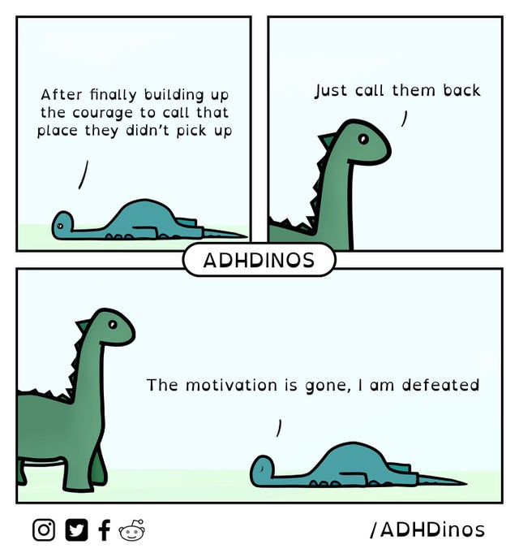

3001 chapter 
- [ˈtʃæptə(r)]  [ˈtʃæptɚ] 
- n.["章，回","（俱乐部、协会等的）分会","人生或历史上的重要时期"]  vt.["把…分成章节"]   
- [人人词典](https://www.91dict.com/words?w=chapter) [柯林斯](https://www.collinsdictionary.com/zh/dictionary/english/chapter) [朗文](https://www.ldoceonline.com/dictionary/chapter) 

3002 fellow 
- [ˈfeləʊ]  [ˈfeloʊ] 
- n.["同伴","男子","（大学的）研究员","（某些学院或大学的）董事"]  adj.["同伴的","同事的","同类的","同情况的"]  vt.["使…与另一个对等","使…与另一个匹敌"]   
- [人人词典](https://www.91dict.com/words?w=fellow) [柯林斯](https://www.collinsdictionary.com/zh/dictionary/english/fellow) [朗文](https://www.ldoceonline.com/dictionary/fellow) 

3003 divorce 
- [dɪ'vɔ:s]  [dɪˈvɔ:rs] 
- n.["离婚","分离"]  vt.["与…离婚","分离"]  vt.& vi.["与（某人）离婚，判（某人）离婚"]   
- [人人词典](https://www.91dict.com/words?w=divorce) [柯林斯](https://www.collinsdictionary.com/zh/dictionary/english/divorce) [朗文](https://www.ldoceonline.com/dictionary/divorce) 

3004 owe 
- [əʊ]  [oʊ] 
- vt.["欠…债","感激","应归功于","怀有情感"]   
- [人人词典](https://www.91dict.com/words?w=owe) [柯林斯](https://www.collinsdictionary.com/zh/dictionary/english/owe) [朗文](https://www.ldoceonline.com/dictionary/owe) 

3005 pipe 
- [paɪp]  [paɪp] 
- n.["管子","烟斗","管乐器","（管风琴的）音管"]  vt.["以管输送","用管乐器演奏","尖声唱"]  vi.["吹奏管乐器","尖叫","尖声地说（或唱），尖声啼鸣","[航海] 吹长哨"]   
- [人人词典](https://www.91dict.com/words?w=pipe) [柯林斯](https://www.collinsdictionary.com/zh/dictionary/english/pipe) [朗文](https://www.ldoceonline.com/dictionary/pipe) 

3006 athletic 
- [æθˈletɪk]  [æθˈlɛtɪk] 
- adj.["运动员的","运动的","体格健壮的","行动敏捷的"]   
- [人人词典](https://www.91dict.com/words?w=athletic) [柯林斯](https://www.collinsdictionary.com/zh/dictionary/english/athletic) [朗文](https://www.ldoceonline.com/dictionary/athletic) 

3007 slight 
- [slaɪt]  [slaɪt] 
- adj.["微小的","细小的","不结实的","无须重视的"]  n.["轻蔑，忽视，冷落"]  vt.["轻蔑，忽视，怠慢"]   
- [人人词典](https://www.91dict.com/words?w=slight) [柯林斯](https://www.collinsdictionary.com/zh/dictionary/english/slight) [朗文](https://www.ldoceonline.com/dictionary/slight) 

3008 math 
- [mæθ]  [mæθ] 
- n.["数学（等于mathematics）"]   
- [人人词典](https://www.91dict.com/words?w=math) [柯林斯](https://www.collinsdictionary.com/zh/dictionary/english/math) [朗文](https://www.ldoceonline.com/dictionary/math) 

3009 shade 
- [ʃeɪd]  [ʃed] 
- n.["遮阳，遮棚","挡风物","玻璃罩","（画的）阴暗部分"]  vt.["遮蔽","险胜","加灯罩","画阴影于…之上"]  vi.["逐渐变化"]   
- [人人词典](https://www.91dict.com/words?w=shade) [柯林斯](https://www.collinsdictionary.com/zh/dictionary/english/shade) [朗文](https://www.ldoceonline.com/dictionary/shade) 

3010 tail 
- [teɪl]  [tel] 
- n.["尾","尾部","燕尾服","尾随者"]  vt.["跟踪","装上尾巴"]  vi.["队伍单行行进时拉长或产生间隔","侦察队两两散开","[建筑学] 嵌上，搭上"]   
- [人人词典](https://www.91dict.com/words?w=tail) [柯林斯](https://www.collinsdictionary.com/zh/dictionary/english/tail) [朗文](https://www.ldoceonline.com/dictionary/tail) 

3011 sustain 
- [səˈsteɪn]  [səˈsten] 
- vt.["维持","支撑，支持","遭受，忍受","供养"]   
- [人人词典](https://www.91dict.com/words?w=sustain) [柯林斯](https://www.collinsdictionary.com/zh/dictionary/english/sustain) [朗文](https://www.ldoceonline.com/dictionary/sustain) 

3012 mount 
- [maʊnt]  [maʊnt] 
- vt.& vi.["登上","骑上"]  vi.["增加","上升"]  vt.["安装，架置","镶嵌，嵌入","准备上演","成立（军队等）"]  n.["山峰","攀，登","运载工具","底座"]   
- [人人词典](https://www.91dict.com/words?w=mount) [柯林斯](https://www.collinsdictionary.com/zh/dictionary/english/mount) [朗文](https://www.ldoceonline.com/dictionary/mount) 

3013 obligation 
- [ˌɒblɪˈgeɪʃn]  [ˌɑ:blɪˈgeɪʃn] 
- n.["义务，责任","证券，契约","债务","恩惠"]   
- [人人词典](https://www.91dict.com/words?w=obligation) [柯林斯](https://www.collinsdictionary.com/zh/dictionary/english/obligation) [朗文](https://www.ldoceonline.com/dictionary/obligation) 

3014 angle 
- [ˈæŋgl]  [ˈæŋɡəl] 
- n.["角","[比喻]（考虑、问题的）角度","观点","轮廓鲜明的突出体"]  vt.["使形成（或弯成）角度","把…放置成一角度","调整（或对准）…的角度","使（新闻、报道等）带有倾向性"]  vi.["垂钓","斜移","弯曲成一角度","从（某角度）报道"]   
- [人人词典](https://www.91dict.com/words?w=angle) [柯林斯](https://www.collinsdictionary.com/zh/dictionary/english/angle) [朗文](https://www.ldoceonline.com/dictionary/angle) 

3015 palm 
- [pɑ:m]  [pɑ:m] 
- n.["手掌","手心","棕榈树 ","由Palm公司发明的一种PDA上的操作系统"]  v.["将…藏于掌中"]   
- [人人词典](https://www.91dict.com/words?w=palm) [柯林斯](https://www.collinsdictionary.com/zh/dictionary/english/palm) [朗文](https://www.ldoceonline.com/dictionary/palm) 

3016 differ 
- [ˈdɪfə(r)]  [ˈdɪfɚ] 
- vi.["不同，相异","不同意，意见相左","争吵"]   
- [人人词典](https://www.91dict.com/words?w=differ) [柯林斯](https://www.collinsdictionary.com/zh/dictionary/english/differ) [朗文](https://www.ldoceonline.com/dictionary/differ) 

3017 custom 
- [ˈkʌstəm]  [ˈkʌstəm] 
- n.["习惯，惯例","海关，关税","经常光顾","[总称]（经常性的）顾客"]  adj.["（衣服等）定做的，定制的"]   
- [人人词典](https://www.91dict.com/words?w=custom) [柯林斯](https://www.collinsdictionary.com/zh/dictionary/english/custom) [朗文](https://www.ldoceonline.com/dictionary/custom) 

3018 store 
- [stɔ:(r)]  [stɔr, stor] 
- n.["商店","贮存物","仓库","大量"]  v.["贮存","（在计算机里）存储"]   
- [人人词典](https://www.91dict.com/words?w=store) [柯林斯](https://www.collinsdictionary.com/zh/dictionary/english/store) [朗文](https://www.ldoceonline.com/dictionary/store) 

3019 economist 
- [ɪˈkɒnəmɪst]  [ɪˈkɑ:nəmɪst] 
- n.["经济学家，经济专家"]   
- [人人词典](https://www.91dict.com/words?w=economist) [柯林斯](https://www.collinsdictionary.com/zh/dictionary/english/economist) [朗文](https://www.ldoceonline.com/dictionary/economist) 

3020 fifteen 
- [ˌfɪfˈti:n]  [fɪfˈtin] 
- n.["十五","十五个人组成的橄榄球队"]   
- [人人词典](https://www.91dict.com/words?w=fifteen) [柯林斯](https://www.collinsdictionary.com/zh/dictionary/english/fifteen) [朗文](https://www.ldoceonline.com/dictionary/fifteen) 

3021 soup 
- [su:p]  [sup] 
- n.["汤，羹","浓雾","硝化甘油炸药","困境"]  vt.["加大马力"]   
- [人人词典](https://www.91dict.com/words?w=soup) [柯林斯](https://www.collinsdictionary.com/zh/dictionary/english/soup) [朗文](https://www.ldoceonline.com/dictionary/soup) 

3022 celebration 
- [ˌselɪˈbreɪʃn]  [ˌselɪˈbreɪʃn] 
- n.["庆祝","庆祝会（仪式）","颂扬"]   
- [人人词典](https://www.91dict.com/words?w=celebration) [柯林斯](https://www.collinsdictionary.com/zh/dictionary/english/celebration) [朗文](https://www.ldoceonline.com/dictionary/celebration) 

3023 efficient 
- [ɪˈfɪʃnt]  [ɪˈfɪʃənt] 
- adj.["有效率的","（直接）生效的","能干的","（因省钱、省时或省力等而）收效大的"]   
- [人人词典](https://www.91dict.com/words?w=efficient) [柯林斯](https://www.collinsdictionary.com/zh/dictionary/english/efficient) [朗文](https://www.ldoceonline.com/dictionary/efficient) 

3024 damage 
- [ˈdæmɪdʒ]  [ˈdæmɪdʒ] 
- vt.& vi.["损害，毁坏"]  n.["损害，损毁","赔偿金"]   
- [人人词典](https://www.91dict.com/words?w=damage) [柯林斯](https://www.collinsdictionary.com/zh/dictionary/english/damage) [朗文](https://www.ldoceonline.com/dictionary/damage) 

3025 composition 
- [ˌkɒmpəˈzɪʃn]  [ˌkɑ:mpəˈzɪʃn] 
- n.["作文，作曲","创作","构图，布置","妥协，和解"]   
- [人人词典](https://www.91dict.com/words?w=composition) [柯林斯](https://www.collinsdictionary.com/zh/dictionary/english/composition) [朗文](https://www.ldoceonline.com/dictionary/composition) 

3026 satisfy 
- [ˈsætɪsfaɪ]  [ˈsætɪsˌfaɪ] 
- vt.& vi.["使满意，满足"]  vt.["使确信","符合，达到（要求、规定、标准等）","消除","履行"]  vi.["使满足或足够","使满意"]   
- [人人词典](https://www.91dict.com/words?w=satisfy) [柯林斯](https://www.collinsdictionary.com/zh/dictionary/english/satisfy) [朗文](https://www.ldoceonline.com/dictionary/satisfy) 

3027 pile 
- [paɪl]  [paɪl] 
- n.["桩","一堆","绒头","摞"]  vt.["堆起","堆叠","放置","装入"]  vi.["蜂拥，拥挤"]   
- [人人词典](https://www.91dict.com/words?w=pile) [柯林斯](https://www.collinsdictionary.com/zh/dictionary/english/pile) [朗文](https://www.ldoceonline.com/dictionary/pile) 

3028 briefly 
- [ˈbri:fli]  [ˈbriːfli] 
- adv.["短暂地","简单地","简略地","略略"]   
- [人人词典](https://www.91dict.com/words?w=briefly) [柯林斯](https://www.collinsdictionary.com/zh/dictionary/english/briefly) [朗文](https://www.ldoceonline.com/dictionary/briefly) 

3029 carbon 
- [ˈkɑ:bən]  [ˈkɑ:rbən] 
- n.["[化学]碳","（一张）复写纸","[电]碳精棒[片，粉]，碳精电极","复写的副本"]  adj.["碳的","碳处理的"]   
- [人人词典](https://www.91dict.com/words?w=carbon) [柯林斯](https://www.collinsdictionary.com/zh/dictionary/english/carbon) [朗文](https://www.ldoceonline.com/dictionary/carbon) 

3030 closer 
- ['kləʊzə]  ['kloʊzə] 
- adj.["靠近的"]  n.["关闭者","砌墙边之砖石","最后的节目"]   
- [人人词典](https://www.91dict.com/words?w=closer) [柯林斯](https://www.collinsdictionary.com/zh/dictionary/english/closer) [朗文](https://www.ldoceonline.com/dictionary/closer) 

3031 consume 
- [kənˈsju:m]  [kənˈsu:m] 
- vt.["消耗，消费","耗尽，毁灭","吃光，喝光","烧毁"]   
- [人人词典](https://www.91dict.com/words?w=consume) [柯林斯](https://www.collinsdictionary.com/zh/dictionary/english/consume) [朗文](https://www.ldoceonline.com/dictionary/consume) 

3032 scheme 
- [ski:m]  [skim] 
- vt.& vi.["策划，图谋"]  n.["计划","体系","阴谋"]  vt.["设计，计划","谋划，图谋"]  vi.["密谋，制定计划"]   
- [人人词典](https://www.91dict.com/words?w=scheme) [柯林斯](https://www.collinsdictionary.com/zh/dictionary/english/scheme) [朗文](https://www.ldoceonline.com/dictionary/scheme) 

3033 crack 
- [kræk]  [kræk] 
- vt.["破裂，打开","（使…）开裂","说（笑话）","开瓶"]  vi.["断裂，折断","碎裂声，爆裂声","镜子破裂了","失去控制，衰退"]  n.["裂缝","试图","缝隙","（可听到响声的）重击"]  adj.["训练有素的","技艺高超的","优秀的","一流的"]   
- [人人词典](https://www.91dict.com/words?w=crack) [柯林斯](https://www.collinsdictionary.com/zh/dictionary/english/crack) [朗文](https://www.ldoceonline.com/dictionary/crack) 

3034 frequency 
- [ˈfri:kwənsi]  [ˈfrikwənsi] 
- n.["频繁性","[数][物]频率，次数","频率分布"]   
- [人人词典](https://www.91dict.com/words?w=frequency) [柯林斯](https://www.collinsdictionary.com/zh/dictionary/english/frequency) [朗文](https://www.ldoceonline.com/dictionary/frequency) 

3035 tobacco 
- [təˈbækəʊ]  [təˈbækoʊ] 
- n.["烟草，烟叶","烟草制品","卷烟","纸烟"]   
- [人人词典](https://www.91dict.com/words?w=tobacco) [柯林斯](https://www.collinsdictionary.com/zh/dictionary/english/tobacco) [朗文](https://www.ldoceonline.com/dictionary/tobacco) 

3036 survivor 
- [səˈvaɪvə(r)]  [sərˈvaɪvə(r)] 
- n.["幸存者，残存者","生还者","遗物，残存物","重新正常生活的人"]   
- [人人词典](https://www.91dict.com/words?w=survivor) [柯林斯](https://www.collinsdictionary.com/zh/dictionary/english/survivor) [朗文](https://www.ldoceonline.com/dictionary/survivor) 

3037 besides 
- [bɪˈsaɪdz]  [bɪˈsaɪdz] 
- adv.["而且","此外","以及","更"]  prep.["（表示排斥）除…之外（还有）","在…之外（还有），…之余兼"]   
- [人人词典](https://www.91dict.com/words?w=besides) [柯林斯](https://www.collinsdictionary.com/zh/dictionary/english/besides) [朗文](https://www.ldoceonline.com/dictionary/besides) 

3038 in 
- [ɪn]  [ɪn] 
- prep.["采用（某种方式）","穿着，带着","（表示位置）在…里面，（表示领域，范围）在…以内","（表示品质、能力等）在…之中"]  adv.["在家","进入，到达","流行","当选"]  adj.["在内的，朝内的","在位的，执政的","[口语]流行的，时髦的","（车等）到站的"]  n.["执政党，掌权者","知情者","<美口>入口，门路","<体>（板球或棒球）攻球的一方"]   
- [人人词典](https://www.91dict.com/words?w=in) [柯林斯](https://www.collinsdictionary.com/zh/dictionary/english/in) [朗文](https://www.ldoceonline.com/dictionary/in) 

3039 psychologist 
- [saɪˈkɒlədʒɪst]  [saɪˈkɑ:lədʒɪst] 
- n.["心理学研究者，心理学家"]   
- [人人词典](https://www.91dict.com/words?w=psychologist) [柯林斯](https://www.collinsdictionary.com/zh/dictionary/english/psychologist) [朗文](https://www.ldoceonline.com/dictionary/psychologist) 

3040 wealthy 
- [ˈwelθi]  [ˈwɛlθi] 
- adj.["富有的","充分的"]  n.["富人，有钱人，阔人"]   
- [人人词典](https://www.91dict.com/words?w=wealthy) [柯林斯](https://www.collinsdictionary.com/zh/dictionary/english/wealthy) [朗文](https://www.ldoceonline.com/dictionary/wealthy) 

3041 galaxy 
- [ˈgæləksi]  [ˈɡæləksi] 
- n.["星系","银河系","一群显赫的（出色的）人物"]   
- [人人词典](https://www.91dict.com/words?w=galaxy) [柯林斯](https://www.collinsdictionary.com/zh/dictionary/english/galaxy) [朗文](https://www.ldoceonline.com/dictionary/galaxy) 

3042 given 
- [ˈgɪvn]  [ˈɡɪvən] 
- adj.["指定的，确定的","假设的，假定的","有…倾向的","赠送的"]  prep.["（表示原因）考虑到","（表示假设）倘若，假定"]  n.["假设"]  v.["给予，赠送( give的过去分词)"]   
- [人人词典](https://www.91dict.com/words?w=given) [柯林斯](https://www.collinsdictionary.com/zh/dictionary/english/given) [朗文](https://www.ldoceonline.com/dictionary/given) 

3043 fund 
- [fʌnd]  [fʌnd] 
- n.["基金","储备","现款","特别基金管理机构"]  vt.["积存","为…提供资金","提供资金偿付（债款等）的本息","把（短期借款）转为有固定利息的长期借款"]   
- [人人词典](https://www.91dict.com/words?w=fund) [柯林斯](https://www.collinsdictionary.com/zh/dictionary/english/fund) [朗文](https://www.ldoceonline.com/dictionary/fund) 

3044 ski 
- [ski:]  [ski] 
- n.["滑雪","滑雪板","滑水橇","滑行装置"]  v.["滑雪，滑冰"]   
- [人人词典](https://www.91dict.com/words?w=ski) [柯林斯](https://www.collinsdictionary.com/zh/dictionary/english/ski) [朗文](https://www.ldoceonline.com/dictionary/ski) 

3045 limitation 
- [ˌlɪmɪˈteɪʃn]  [ˌlɪmɪˈteʃən] 
- n.["限制","局限","极限","起限制作用的规则（或事实、条件）"]   
- [人人词典](https://www.91dict.com/words?w=limitation) [柯林斯](https://www.collinsdictionary.com/zh/dictionary/english/limitation) [朗文](https://www.ldoceonline.com/dictionary/limitation) 

3046 OK 
- [əʊˈkeɪ]  [oˈke] 
- adj.["好的","还不错的","很好的"]   
- [人人词典](https://www.91dict.com/words?w=OK) [柯林斯](https://www.collinsdictionary.com/zh/dictionary/english/OK) [朗文](https://www.ldoceonline.com/dictionary/OK) 

3047 trace 
- [treɪs]  [tres] 
- vt.["跟踪，追踪","追溯，探索","探索","查找"]  vi.["沿着一小径或道路前进","可以追溯的"]  n.["痕迹，踪迹","微量，极少量","[植]（脉）迹","痕迹"]   
- [人人词典](https://www.91dict.com/words?w=trace) [柯林斯](https://www.collinsdictionary.com/zh/dictionary/english/trace) [朗文](https://www.ldoceonline.com/dictionary/trace) 

3048 appointment 
- [əˈpɔɪntmənt]  [əˈpɔɪntmənt] 
- n.["约会","任命","职务","职位"]   
- [人人词典](https://www.91dict.com/words?w=appointment) [柯林斯](https://www.collinsdictionary.com/zh/dictionary/english/appointment) [朗文](https://www.ldoceonline.com/dictionary/appointment) 

3049 preference 
- [ˈprefrəns]  [ˈprɛfərəns, ˈprɛfrəns] 
- n.["偏爱","优先权","偏爱的事物","（债权人）受优先偿还的权利"]   
- [人人词典](https://www.91dict.com/words?w=preference) [柯林斯](https://www.collinsdictionary.com/zh/dictionary/english/preference) [朗文](https://www.ldoceonline.com/dictionary/preference) 

3050 meter 
- [ˈmi:tə(r)]  [ˈmitɚ] 
- n.["计量器","计量仪"]  v.["用仪表测量"]   
- [人人词典](https://www.91dict.com/words?w=meter) [柯林斯](https://www.collinsdictionary.com/zh/dictionary/english/meter) [朗文](https://www.ldoceonline.com/dictionary/meter) 

3051 explosion 
- [ɪkˈspləʊʒn]  [ɪkˈsploʊʒn] 
- n.["爆炸，炸裂","爆发","扩张，激增","（感情，尤指愤怒的）突然爆发"]   
- [人人词典](https://www.91dict.com/words?w=explosion) [柯林斯](https://www.collinsdictionary.com/zh/dictionary/english/explosion) [朗文](https://www.ldoceonline.com/dictionary/explosion) 

3052 arrest 
- [əˈrest]  [əˈrɛst] 
- vt.["逮捕，拘捕","止住，阻止，抑制","吸引（注意）"]  vi.["心跳停止"]  n.["拘留","停止，阻止","制动（装置）"]   
- [人人词典](https://www.91dict.com/words?w=arrest) [柯林斯](https://www.collinsdictionary.com/zh/dictionary/english/arrest) [朗文](https://www.ldoceonline.com/dictionary/arrest) 

3053 publicly 
- ['pʌblɪklɪ]  [ˈpʌblɪkli] 
- adv.["公开地","由公众（或政府）","为公众所同意","以公众名义"]   
- [人人词典](https://www.91dict.com/words?w=publicly) [柯林斯](https://www.collinsdictionary.com/zh/dictionary/english/publicly) [朗文](https://www.ldoceonline.com/dictionary/publicly) 

3054 incredible 
- [ɪnˈkredəbl]  [ɪnˈkrɛdəbəl] 
- adj.["不可思议的","惊人的","难以置信的","未必可能的"]   
- [人人词典](https://www.91dict.com/words?w=incredible) [柯林斯](https://www.collinsdictionary.com/zh/dictionary/english/incredible) [朗文](https://www.ldoceonline.com/dictionary/incredible) 

3055 fighter 
- [ˈfaɪtə(r)]  [ˈfaɪtɚ] 
- n.["战士（尤指士兵或拳击者）","[航]战斗机，歼击机","斗争者，奋斗者","好斗的人"]   
- [人人词典](https://www.91dict.com/words?w=fighter) [柯林斯](https://www.collinsdictionary.com/zh/dictionary/english/fighter) [朗文](https://www.ldoceonline.com/dictionary/fighter) 

3056 rapid 
- [ˈræpɪd]  [ˈræpɪd] 
- adj.["快速的","[摄]感光快的","险峻的"]  n.["急流","高速交通工具，高速交通网"]   
- [人人词典](https://www.91dict.com/words?w=rapid) [柯林斯](https://www.collinsdictionary.com/zh/dictionary/english/rapid) [朗文](https://www.ldoceonline.com/dictionary/rapid) 

3057 admission 
- [ədˈmɪʃn]  [ædˈmɪʃən] 
- n.["准许进入","承认","坦白","入场费"]   
- [人人词典](https://www.91dict.com/words?w=admission) [柯林斯](https://www.collinsdictionary.com/zh/dictionary/english/admission) [朗文](https://www.ldoceonline.com/dictionary/admission) 

3058 hunter 
- [ˈhʌntə(r)]  [ˈhʌntɚ] 
- n.["猎人","猎犬","猎狐马，猎食其他动物的野兽","亨特"]   
- [人人词典](https://www.91dict.com/words?w=hunter) [柯林斯](https://www.collinsdictionary.com/zh/dictionary/english/hunter) [朗文](https://www.ldoceonline.com/dictionary/hunter) 

3059 educate 
- [ˈedʒukeɪt]  [ˈɛdʒəˌket] 
- vt.& vi.["教育，教导","训练，培养"]  vt.["使理解或接受"]   
- [人人词典](https://www.91dict.com/words?w=educate) [柯林斯](https://www.collinsdictionary.com/zh/dictionary/english/educate) [朗文](https://www.ldoceonline.com/dictionary/educate) 

3060 painful 
- [ˈpeɪnfl]  [ˈpenfəl] 
- adj.["痛苦的","（肉体）疼的","费力的，（工作）困难的","讨厌的，使人厌烦的"]   
- [人人词典](https://www.91dict.com/words?w=painful) [柯林斯](https://www.collinsdictionary.com/zh/dictionary/english/painful) [朗文](https://www.ldoceonline.com/dictionary/painful) 

3061 friendship 
- [ˈfrendʃɪp]  [ˈfrɛndˌʃɪp] 
- n.["友情，友谊","友善的关系","友善，好意"]   
- [人人词典](https://www.91dict.com/words?w=friendship) [柯林斯](https://www.collinsdictionary.com/zh/dictionary/english/friendship) [朗文](https://www.ldoceonline.com/dictionary/friendship) 

3062 aide 
- [eɪd]  [ed] 
- n.["助手","副官","侍从武官"]   
- [人人词典](https://www.91dict.com/words?w=aide) [柯林斯](https://www.collinsdictionary.com/zh/dictionary/english/aide) [朗文](https://www.ldoceonline.com/dictionary/aide) 

3063 infant 
- [ˈɪnfənt]  ['ɪnfənt] 
- n.["婴儿，幼儿","未成年人","初学者，生手"]  adj.["婴儿的，幼儿的","幼稚的，幼小的","初期的","未成年的"]   
- [人人词典](https://www.91dict.com/words?w=infant) [柯林斯](https://www.collinsdictionary.com/zh/dictionary/english/infant) [朗文](https://www.ldoceonline.com/dictionary/infant) 

3064 calculate 
- [ˈkælkjuleɪt]  [ˈkælkjəˌlet] 
- vt.& vi.["计算","估计","打算，计划","旨在"]  vt.["预测，推测"]   
- [人人词典](https://www.91dict.com/words?w=calculate) [柯林斯](https://www.collinsdictionary.com/zh/dictionary/english/calculate) [朗文](https://www.ldoceonline.com/dictionary/calculate) 

3065 fifty 
- [ˈfɪfti]  [ˈfɪfti] 
- n.["五十个人","五十岁","五十年代","编号为五十的东西"]  num.["五十","五十个"]  adj.["五十的","五十个的","许多的"]   
- [人人词典](https://www.91dict.com/words?w=fifty) [柯林斯](https://www.collinsdictionary.com/zh/dictionary/english/fifty) [朗文](https://www.ldoceonline.com/dictionary/fifty) 

3066 rid 
- [rɪd]  [rɪd] 
- vt.["使摆脱，解除，免除"]   
- [人人词典](https://www.91dict.com/words?w=rid) [柯林斯](https://www.collinsdictionary.com/zh/dictionary/english/rid) [朗文](https://www.ldoceonline.com/dictionary/rid) 

3067 porch 
- [pɔ:tʃ]  [pɔ:rtʃ] 
- n.["门廊","游廊，走廊"]   
- [人人词典](https://www.91dict.com/words?w=porch) [柯林斯](https://www.collinsdictionary.com/zh/dictionary/english/porch) [朗文](https://www.ldoceonline.com/dictionary/porch) 

3068 tendency 
- [ˈtendənsi]  [ˈtɛndənsi] 
- n.["倾向，趋势","（话或作品等的）旨趣，意向","性情","癖好"]   
- [人人词典](https://www.91dict.com/words?w=tendency) [柯林斯](https://www.collinsdictionary.com/zh/dictionary/english/tendency) [朗文](https://www.ldoceonline.com/dictionary/tendency) 

3069 uniform 
- [ˈju:nɪfɔ:m]  [ˈju:nɪfɔ:rm] 
- n.["制服","军服","通讯中用以代表字母 u 的词"]  adj.["（形状，性质等）一样的","规格一致的","始终如一的"]  v.["使规格一律","使均一","使穿制服"]   
- [人人词典](https://www.91dict.com/words?w=uniform) [柯林斯](https://www.collinsdictionary.com/zh/dictionary/english/uniform) [朗文](https://www.ldoceonline.com/dictionary/uniform) 

3070 formation 
- [fɔ:ˈmeɪʃn]  [fɔ:rˈmeɪʃn] 
- n.["形成","构成，结构","形成物","编队，队形"]   
- [人人词典](https://www.91dict.com/words?w=formation) [柯林斯](https://www.collinsdictionary.com/zh/dictionary/english/formation) [朗文](https://www.ldoceonline.com/dictionary/formation) 

3071 scholarship 
- [ˈskɒləʃɪp]  [ˈskɑ:lərʃɪp] 
- n.["奖学金","学术","学识"]   
- [人人词典](https://www.91dict.com/words?w=scholarship) [柯林斯](https://www.collinsdictionary.com/zh/dictionary/english/scholarship) [朗文](https://www.ldoceonline.com/dictionary/scholarship) 

3072 reservation 
- [ˌrezəˈveɪʃn]  [ˌrezərˈveɪʃn] 
- n.["保留","预订，预约","保留地，专用地"]   
- [人人词典](https://www.91dict.com/words?w=reservation) [柯林斯](https://www.collinsdictionary.com/zh/dictionary/english/reservation) [朗文](https://www.ldoceonline.com/dictionary/reservation) 

3073 efficiency 
- [ɪˈfɪʃnsi]  [ɪˈfɪʃənsi] 
- n.["效率，效能","实力，能力","[物]性能","功效"]   
- [人人词典](https://www.91dict.com/words?w=efficiency) [柯林斯](https://www.collinsdictionary.com/zh/dictionary/english/efficiency) [朗文](https://www.ldoceonline.com/dictionary/efficiency) 

3074 waste 
- [weɪst]  [west] 
- n.["浪费，白费，挥霍钱财","废料，废品，废物","荒地，荒芜","消耗（量），损耗"]  vt.& vi.["徒劳","（使）损耗","（使）消瘦","浪费"]  vt.["破坏","干掉","（游戏或比赛中）大胜"]  adj.["废弃的， 无用的， 荒芜的"]   
- [人人词典](https://www.91dict.com/words?w=waste) [柯林斯](https://www.collinsdictionary.com/zh/dictionary/english/waste) [朗文](https://www.ldoceonline.com/dictionary/waste) 

3075 qualify 
- [ˈkwɒlɪfaɪ]  [ˈkwɑ:lɪfaɪ] 
- vt.& vi.["（使）具有资格","有权","达标"]  vt.["限定，修饰","描述，形容","使合适","证明…合格"]  vi.["合格或成为合格","取得…的资格"]   
- [人人词典](https://www.91dict.com/words?w=qualify) [柯林斯](https://www.collinsdictionary.com/zh/dictionary/english/qualify) [朗文](https://www.ldoceonline.com/dictionary/qualify) 

3076 mall 
- [mɔ:l]  [mɔl, mæl] 
- n.["购物中心","林荫路","铁圈球场"]   
- [人人词典](https://www.91dict.com/words?w=mall) [柯林斯](https://www.collinsdictionary.com/zh/dictionary/english/mall) [朗文](https://www.ldoceonline.com/dictionary/mall) 

3077 derive 
- [dɪˈraɪv]  [dɪˈraɪv] 
- vt.& vi.["得到，导出","源于，来自","（从…中）提取"]   
- [人人词典](https://www.91dict.com/words?w=derive) [柯林斯](https://www.collinsdictionary.com/zh/dictionary/english/derive) [朗文](https://www.ldoceonline.com/dictionary/derive) 

3078 scandal 
- [ˈskændl]  [ˈskændl] 
- n.["丑闻，丑名，丑事，丑行，丢脸的事件，舞弊案件，耻辱","流言蜚语","闲话","诽谤"]   
- [人人词典](https://www.91dict.com/words?w=scandal) [柯林斯](https://www.collinsdictionary.com/zh/dictionary/english/scandal) [朗文](https://www.ldoceonline.com/dictionary/scandal) 

3079 PC 
- [ˌpi: ˈsi:]  [ˌpi:'si:] 
- abbr.["personal computer 个人计算机","巡逻车(Patrol Car)"]   
- [人人词典](https://www.91dict.com/words?w=PC) [柯林斯](https://www.collinsdictionary.com/zh/dictionary/english/PC) [朗文](https://www.ldoceonline.com/dictionary/PC) 

3080 helpful 
- [ˈhelpfl]  [ˈhɛlpfəl] 
- adj.["给予帮助的，有益的","愿意帮忙的"]   
- [人人词典](https://www.91dict.com/words?w=helpful) [柯林斯](https://www.collinsdictionary.com/zh/dictionary/english/helpful) [朗文](https://www.ldoceonline.com/dictionary/helpful) 

3081 impress 
- [ɪmˈpres]  [ɪmˈprɛs] 
- vt.["印","给…以深刻印象","使铭记"]  n.["印象","印记"]   
- [人人词典](https://www.91dict.com/words?w=impress) [柯林斯](https://www.collinsdictionary.com/zh/dictionary/english/impress) [朗文](https://www.ldoceonline.com/dictionary/impress) 

3082 heel 
- [hi:l]  [hil] 
- n.["脚后跟，踵","（鞋、袜等的后跟）","（四足动物的）后脚","踵状物"]  vt.& vi.["（使）倾斜"]  vt.["给（鞋等）修理后跟"]   
- [人人词典](https://www.91dict.com/words?w=heel) [柯林斯](https://www.collinsdictionary.com/zh/dictionary/english/heel) [朗文](https://www.ldoceonline.com/dictionary/heel) 

3083 resemble 
- [rɪˈzembl]  [rɪˈzɛmbəl] 
- vt.["与…相像，类似于"]   
- [人人词典](https://www.91dict.com/words?w=resemble) [柯林斯](https://www.collinsdictionary.com/zh/dictionary/english/resemble) [朗文](https://www.ldoceonline.com/dictionary/resemble) 

3084 privacy 
- [ˈprɪvəsi]  [ˈpraɪvəsi] 
- n.["隐私，秘密","隐居","私事","不受公众干扰的状态"]   
- [人人词典](https://www.91dict.com/words?w=privacy) [柯林斯](https://www.collinsdictionary.com/zh/dictionary/english/privacy) [朗文](https://www.ldoceonline.com/dictionary/privacy) 

3085 fabric 
- [ˈfæbrɪk]  [ˈfæbrɪk] 
- n.["织物","布","构造","（建筑物的）结构（如墙、地面、屋顶）：质地"]   
- [人人词典](https://www.91dict.com/words?w=fabric) [柯林斯](https://www.collinsdictionary.com/zh/dictionary/english/fabric) [朗文](https://www.ldoceonline.com/dictionary/fabric) 

3086 surprise 
- [səˈpraɪz]  [sərˈpraɪz] 
- vt.["使惊奇","突袭","意外发现"]  n.["惊喜，惊奇","意外的事"]   
- [人人词典](https://www.91dict.com/words?w=surprise) [柯林斯](https://www.collinsdictionary.com/zh/dictionary/english/surprise) [朗文](https://www.ldoceonline.com/dictionary/surprise) 

3087 contest 
- [ˈkɒntest]  [ˈkɑ:ntest] 
- vt.["竞争，为…而奋争","辩驳"]  vi.["争斗","竞争","争夺"]   
- [人人词典](https://www.91dict.com/words?w=contest) [柯林斯](https://www.collinsdictionary.com/zh/dictionary/english/contest) [朗文](https://www.ldoceonline.com/dictionary/contest) 

3088 proportion 
- [prəˈpɔ:ʃn]  [prəˈpɔ:rʃn] 
- n.["比，比率","[数学]比例（法）","面积","相称，平衡"]  vt.["使成比例","使相称","使均衡"]   
- [人人词典](https://www.91dict.com/words?w=proportion) [柯林斯](https://www.collinsdictionary.com/zh/dictionary/english/proportion) [朗文](https://www.ldoceonline.com/dictionary/proportion) 

3089 guideline 
- [ˈgaɪdlaɪn]  [ˈɡaɪdˌlaɪn] 
- n.["指导方针","指导原则"]   
- [人人词典](https://www.91dict.com/words?w=guideline) [柯林斯](https://www.collinsdictionary.com/zh/dictionary/english/guideline) [朗文](https://www.ldoceonline.com/dictionary/guideline) 

3090 rifle 
- [ˈraɪfl]  [ˈraɪfəl] 
- n.["步枪","来福枪"]  vt.& vi.["快速搜寻","匆忙翻找 ","偷窃","盗取"]   
- [人人词典](https://www.91dict.com/words?w=rifle) [柯林斯](https://www.collinsdictionary.com/zh/dictionary/english/rifle) [朗文](https://www.ldoceonline.com/dictionary/rifle) 

3091 maintenance 
- [ˈmeɪntənəns]  [ˈmentənəns] 
- n.["维持，保持","保养，保管","维护","维修"]   
- [人人词典](https://www.91dict.com/words?w=maintenance) [柯林斯](https://www.collinsdictionary.com/zh/dictionary/english/maintenance) [朗文](https://www.ldoceonline.com/dictionary/maintenance) 

3092 conviction 
- [kənˈvɪkʃn]  [kənˈvɪkʃən] 
- n.["定罪","说服","确信","信念"]   
- [人人词典](https://www.91dict.com/words?w=conviction) [柯林斯](https://www.collinsdictionary.com/zh/dictionary/english/conviction) [朗文](https://www.ldoceonline.com/dictionary/conviction) 

3093 trick 
- [trɪk]  [trɪk] 
- n.["戏法，把戏","计谋，诀窍","骗局","恶作剧"]  vt.["哄骗，欺骗","打扮"]  adj.["弄虚作假的","有诀窍的","欺诈的"]   
- [人人词典](https://www.91dict.com/words?w=trick) [柯林斯](https://www.collinsdictionary.com/zh/dictionary/english/trick) [朗文](https://www.ldoceonline.com/dictionary/trick) 

3094 organic 
- [ɔ:ˈgænɪk]  [ɔ:rˈgænɪk] 
- adj.["有机（体）的","有组织的，系统的","器官的","根本的"]   
- [人人词典](https://www.91dict.com/words?w=organic) [柯林斯](https://www.collinsdictionary.com/zh/dictionary/english/organic) [朗文](https://www.ldoceonline.com/dictionary/organic) 

3095 tent 
- [tent]  [tɛnt] 
- n.["帐篷","帐篷状物","塞子"]  vi.["住帐蓬"]  vt.["用帐蓬遮盖","向…供应帐逢","将塞条嵌进（伤口）","观察，看护，照料"]   
- [人人词典](https://www.91dict.com/words?w=tent) [柯林斯](https://www.collinsdictionary.com/zh/dictionary/english/tent) [朗文](https://www.ldoceonline.com/dictionary/tent) 

3096 examination 
- [ɪgˌzæmɪˈneɪʃn]  [ɪɡˌzæmɪˈneɪʃn] 
- n.["检查","考试","询问，审问"]   
- [人人词典](https://www.91dict.com/words?w=examination) [柯林斯](https://www.collinsdictionary.com/zh/dictionary/english/examination) [朗文](https://www.ldoceonline.com/dictionary/examination) 

3097 publisher 
- [ˈpʌblɪʃə(r)]  [ˈpʌblɪʃɚ] 
- n.["出版者，出版商，出版社","公布者，发表者","〈美〉办报者"]   
- [人人词典](https://www.91dict.com/words?w=publisher) [柯林斯](https://www.collinsdictionary.com/zh/dictionary/english/publisher) [朗文](https://www.ldoceonline.com/dictionary/publisher) 

3098 strengthen 
- [ˈstreŋθn]  [ˈstrɛŋkθən,ˈstrɛŋ-,ˈstrɛn-] 
- vt.["加强，巩固","勉励，激励","增加…的艺术效果","（价格）上涨"]  vi.["变强","变坚挺"]   
- [人人词典](https://www.91dict.com/words?w=strengthen) [柯林斯](https://www.collinsdictionary.com/zh/dictionary/english/strengthen) [朗文](https://www.ldoceonline.com/dictionary/strengthen) 

3099 French 
- [frentʃ]  [frɛntʃ] 
- adj.["法国的，法国人的","法语的"]  n.["法语","法国人"]   
- [人人词典](https://www.91dict.com/words?w=French) [柯林斯](https://www.collinsdictionary.com/zh/dictionary/english/French) [朗文](https://www.ldoceonline.com/dictionary/French) 

3100 proposed 
- [prəʊ'pəʊzd]  [prə'poʊzd] 
- adj.["被提议的，所推荐的"]  v.["提议，建议( propose的过去式和过去分词 )","打算","提供（解释）","提出（行动，计划或供表决的方案等）"]   
- [人人词典](https://www.91dict.com/words?w=proposed) [柯林斯](https://www.collinsdictionary.com/zh/dictionary/english/proposed) [朗文](https://www.ldoceonline.com/dictionary/proposed) 

3101 myth 
- [mɪθ]  [mɪθ] 
- n.["神话","神怪故事","奇人，奇事","虚构的人，虚构的事"]  v.["使神话化"]   
- [人人词典](https://www.91dict.com/words?w=myth) [柯林斯](https://www.collinsdictionary.com/zh/dictionary/english/myth) [朗文](https://www.ldoceonline.com/dictionary/myth) 

3102 sophisticated 
- [səˈfɪstɪkeɪtɪd]  [səˈfɪstɪˌketɪd] 
- adj.["复杂的","精致的","富有经验的","深奥微妙的"]  v.["使变得世故","使迷惑","篡改(sophisticate的过去分词形式)"]   
- [人人词典](https://www.91dict.com/words?w=sophisticated) [柯林斯](https://www.collinsdictionary.com/zh/dictionary/english/sophisticated) [朗文](https://www.ldoceonline.com/dictionary/sophisticated) 

3103 cow 
- [kaʊ]  [kaʊ] 
- n.["奶牛，乳牛","母兽","雌（象，鲸等）","<侮辱>对女性的蔑称"]  vt.["恐吓","吓唬","威胁"]   
- [人人词典](https://www.91dict.com/words?w=cow) [柯林斯](https://www.collinsdictionary.com/zh/dictionary/english/cow) [朗文](https://www.ldoceonline.com/dictionary/cow) 

3104 etc 
- ['etk]  ['etk] 
- adv.["等等及其他","诸如此类"]  abbr.["[拉丁语]et cetera（常读作 and so forth）"]   
- [人人词典](https://www.91dict.com/words?w=etc) [柯林斯](https://www.collinsdictionary.com/zh/dictionary/english/etc) [朗文](https://www.ldoceonline.com/dictionary/etc) 

3105 standing 
- [ˈstændɪŋ]  [ˈstændɪŋ] 
- n.["起立，站立","身份，地位","持续时间"]  adj.["长期有效的","直立的","固定的"]  v.["站立","坚持不变"]   
- [人人词典](https://www.91dict.com/words?w=standing) [柯林斯](https://www.collinsdictionary.com/zh/dictionary/english/standing) [朗文](https://www.ldoceonline.com/dictionary/standing) 

3106 asleep 
- [əˈsli:p]  [əˈslip] 
- adj.["睡着的","休眠的","麻木的","已死的"]  adv.["熟睡地","处于麻木不仁的状态","长眠"]   
- [人人词典](https://www.91dict.com/words?w=asleep) [柯林斯](https://www.collinsdictionary.com/zh/dictionary/english/asleep) [朗文](https://www.ldoceonline.com/dictionary/asleep) 

3107 tennis 
- [ˈtenɪs]  ['tenɪs] 
- n.["网球（运动）"]   
- [人人词典](https://www.91dict.com/words?w=tennis) [柯林斯](https://www.collinsdictionary.com/zh/dictionary/english/tennis) [朗文](https://www.ldoceonline.com/dictionary/tennis) 

3108 nerve 
- [nɜ:v]  [nɜ:rv] 
- n.["神经","勇气，胆量","[植] 叶脉","中枢"]  vt.["鼓励，激励","鼓起勇气"]   
- [人人词典](https://www.91dict.com/words?w=nerve) [柯林斯](https://www.collinsdictionary.com/zh/dictionary/english/nerve) [朗文](https://www.ldoceonline.com/dictionary/nerve) 

3109 barrel 
- [ˈbærəl]  [ˈbærəl] 
- n.["桶","一桶之量","圆筒，活塞筒，滚筒","圆筒"]  adj.["桶状的"]  vt.["装进桶里，放进桶里"]  vi.["高速行驶"]   
- [人人词典](https://www.91dict.com/words?w=barrel) [柯林斯](https://www.collinsdictionary.com/zh/dictionary/english/barrel) [朗文](https://www.ldoceonline.com/dictionary/barrel) 

3110 bombing 
- [ˈbɒmɪŋ]  [ˈbɑ:mɪŋ] 
- n.["轰炸，投弹"]  v.["轰炸，投弹于( bomb的现在分词 )","失败，不及格","快速前进"]   
- [人人词典](https://www.91dict.com/words?w=bombing) [柯林斯](https://www.collinsdictionary.com/zh/dictionary/english/bombing) [朗文](https://www.ldoceonline.com/dictionary/bombing) 

3111 membership 
- [ˈmembəʃɪp]  [ˈmembərʃɪp] 
- n.["会员资格","会员身份","会员全体"]   
- [人人词典](https://www.91dict.com/words?w=membership) [柯林斯](https://www.collinsdictionary.com/zh/dictionary/english/membership) [朗文](https://www.ldoceonline.com/dictionary/membership) 

3112 ratio 
- [ˈreɪʃiəʊ]  [ˈreɪʃioʊ] 
- n.["比，比率","比例","系数"]  vt.["求出比值，除，使…成比例","将（相片）按比例放大[缩小]"]   
- [人人词典](https://www.91dict.com/words?w=ratio) [柯林斯](https://www.collinsdictionary.com/zh/dictionary/english/ratio) [朗文](https://www.ldoceonline.com/dictionary/ratio) 

3113 menu 
- [ˈmenju:]  [ˈmɛnju, ˈmenju] 
- n.["菜单","菜，菜肴"]   
- [人人词典](https://www.91dict.com/words?w=menu) [柯林斯](https://www.collinsdictionary.com/zh/dictionary/english/menu) [朗文](https://www.ldoceonline.com/dictionary/menu) 

3114 purchase 
- [ˈpɜ:tʃəs]  [ˈpɜ:rtʃəs] 
- v.["购买","采购","换得","依靠机械力移动"]  n.["购买","购买行为","购置物","紧握"]   
- [人人词典](https://www.91dict.com/words?w=purchase) [柯林斯](https://www.collinsdictionary.com/zh/dictionary/english/purchase) [朗文](https://www.ldoceonline.com/dictionary/purchase) 

3115 controversial 
- [ˌkɒntrəˈvɜ:ʃl]  [ˌkɑ:ntrəˈvɜ:rʃl] 
- adj.["有争议的，引起争议的，被争论的","好争论的"]   
- [人人词典](https://www.91dict.com/words?w=controversial) [柯林斯](https://www.collinsdictionary.com/zh/dictionary/english/controversial) [朗文](https://www.ldoceonline.com/dictionary/controversial) 

3116 desperate 
- [ˈdespərət]  [ˈdɛspərɪt] 
- adj.["绝望的","由绝望而引起的","铤而走险的，孤注一掷的","急切的，极度渴望的"]   
- [人人词典](https://www.91dict.com/words?w=desperate) [柯林斯](https://www.collinsdictionary.com/zh/dictionary/english/desperate) [朗文](https://www.ldoceonline.com/dictionary/desperate) 

3117 rate 
- [reɪt]  [ret] 
- n.["速度","比率","等级","（利息等的）费率"]  vt.["估价","值得","责骂","定级"]  vt.& vi.["认为，把…算作"]  vi.["被评价","被认为","被列入","申斥"]   
- [人人词典](https://www.91dict.com/words?w=rate) [柯林斯](https://www.collinsdictionary.com/zh/dictionary/english/rate) [朗文](https://www.ldoceonline.com/dictionary/rate) 

3118 lifestyle 
- [ˈlaɪfstaɪl]  [ˈlaɪfˌstaɪl] 
- n.["生活方式"]   
- [人人词典](https://www.91dict.com/words?w=lifestyle) [柯林斯](https://www.collinsdictionary.com/zh/dictionary/english/lifestyle) [朗文](https://www.ldoceonline.com/dictionary/lifestyle) 

3119 humor 
- ['hju:mə]  [ˈhjumɚ] 
- n.["幽默，心情，诙谐"]  vt.["迎合，牵就，顺应"]   
- [人人词典](https://www.91dict.com/words?w=humor) [柯林斯](https://www.collinsdictionary.com/zh/dictionary/english/humor) [朗文](https://www.ldoceonline.com/dictionary/humor) 

3120 loud 
- [laʊd]  [laʊd] 
- adj.["响亮的，大声的，高声的","响亮的，洪亮的，高亢的","高声的，激烈的","刺眼的，太招摇的"]  adv.["大声地，高声地，响亮地"]   
- [人人词典](https://www.91dict.com/words?w=loud) [柯林斯](https://www.collinsdictionary.com/zh/dictionary/english/loud) [朗文](https://www.ldoceonline.com/dictionary/loud) 

3121 glove 
- [glʌv]  [ɡlʌv] 
- n.["手套","棒球手套","拳击手套"]  vt.["给…戴手套","用…的手套"]   
- [人人词典](https://www.91dict.com/words?w=glove) [柯林斯](https://www.collinsdictionary.com/zh/dictionary/english/glove) [朗文](https://www.ldoceonline.com/dictionary/glove) 

3122 suspect 
- [səˈspekt]  [səˈspɛkt] 
- vt.["猜疑（是）","怀疑，不信任","怀疑…有罪"]  n.["嫌疑犯"]  vi.["怀疑"]   
- [人人词典](https://www.91dict.com/words?w=suspect) [柯林斯](https://www.collinsdictionary.com/zh/dictionary/english/suspect) [朗文](https://www.ldoceonline.com/dictionary/suspect) 

3123 sufficient 
- [səˈfɪʃnt]  [səˈfɪʃənt] 
- adj.["足够的","充足的","充分的"]   
- [人人词典](https://www.91dict.com/words?w=sufficient) [柯林斯](https://www.collinsdictionary.com/zh/dictionary/english/sufficient) [朗文](https://www.ldoceonline.com/dictionary/sufficient) 

3124 narrative 
- [ˈnærətɪv]  [ˈnærətɪv] 
- n.["记叙文","故事","叙述，记事","叙述手法"]  adj.["叙述的，叙事体的","善于叙述的"]   
- [人人词典](https://www.91dict.com/words?w=narrative) [柯林斯](https://www.collinsdictionary.com/zh/dictionary/english/narrative) [朗文](https://www.ldoceonline.com/dictionary/narrative) 

3125 photographer 
- [fəˈtɒgrəfə(r)]  [fəˈtɑ:grəfə(r)] 
- n.["摄影师","摄影家","照相师"]   
- [人人词典](https://www.91dict.com/words?w=photographer) [柯林斯](https://www.collinsdictionary.com/zh/dictionary/english/photographer) [朗文](https://www.ldoceonline.com/dictionary/photographer) 

3126 helicopter 
- [ˈhelɪkɒptə(r)]  [ˈhelɪkɑ:ptə(r)] 
- n.["直升机，直升飞机"]  vt.["用直升飞机载送"]  vi.["乘直升飞机"]   
- [人人词典](https://www.91dict.com/words?w=helicopter) [柯林斯](https://www.collinsdictionary.com/zh/dictionary/english/helicopter) [朗文](https://www.ldoceonline.com/dictionary/helicopter) 

3127 Catholic 
- [ˈkæθlɪk]  [ˈkæθəlɪk, ˈkæθlɪk] 
- adj.["天主教的","统括一切的","包罗万象的","宽容大量的"]  n.["旧教徒","旧教信奉者"]   
- [人人词典](https://www.91dict.com/words?w=Catholic) [柯林斯](https://www.collinsdictionary.com/zh/dictionary/english/Catholic) [朗文](https://www.ldoceonline.com/dictionary/Catholic) 

3128 modest 
- [ˈmɒdɪst]  [ˈmɑ:dɪst] 
- adj.["谦虚的，谦逊的","适度的，适中的","端庄的","羞怯的"]   
- [人人词典](https://www.91dict.com/words?w=modest) [柯林斯](https://www.collinsdictionary.com/zh/dictionary/english/modest) [朗文](https://www.ldoceonline.com/dictionary/modest) 

3129 provider 
- [prəˈvaɪdə(r)]  [prəˈvaɪdɚ] 
- n.["供应者，提供者，（尤指）维持家庭生计者"]   
- [人人词典](https://www.91dict.com/words?w=provider) [柯林斯](https://www.collinsdictionary.com/zh/dictionary/english/provider) [朗文](https://www.ldoceonline.com/dictionary/provider) 

3130 delay 
- [dɪˈleɪ]  [dɪˈle] 
- n.["延迟，拖延","耽搁","被耽搁或推迟的时间"]  vt.["延期，推迟","耽搁"]  vi.["延缓，延期"]   
- [人人词典](https://www.91dict.com/words?w=delay) [柯林斯](https://www.collinsdictionary.com/zh/dictionary/english/delay) [朗文](https://www.ldoceonline.com/dictionary/delay) 

3131 agricultural 
- [ˌæɡrɪ'kʌltʃərəl]  [ˌæɡrɪ'kʌltʃərəl] 
- adj.["农业的，耕种的","农艺的，农学的"]   
- [人人词典](https://www.91dict.com/words?w=agricultural) [柯林斯](https://www.collinsdictionary.com/zh/dictionary/english/agricultural) [朗文](https://www.ldoceonline.com/dictionary/agricultural) 

3132 explode 
- [ɪkˈspləʊd]  [ɪkˈsploʊd] 
- vi.["爆[突]发，发怒","激增，迅速扩大"]  vt.["（使）爆炸","突然（发出巨响，活跃起来，迸发感情）","推翻","驳倒"]   
- [人人词典](https://www.91dict.com/words?w=explode) [柯林斯](https://www.collinsdictionary.com/zh/dictionary/english/explode) [朗文](https://www.ldoceonline.com/dictionary/explode) 

3133 stroke 
- [strəʊk]  [stroʊk] 
- n.["一击","击球","划水动作","中风"]  vt.["划掉","轻抚","轻触","敲击"]  vi.["击球","作尾桨手，指挥划桨"]   
- [人人词典](https://www.91dict.com/words?w=stroke) [柯林斯](https://www.collinsdictionary.com/zh/dictionary/english/stroke) [朗文](https://www.ldoceonline.com/dictionary/stroke) 

3134 scope 
- [skəʊp]  [skoʊp] 
- n.["（处理、研究事务的）范围","眼界，见识","（活动或能力的）余地","广袤，地域"]  v.["审视，仔细研究"]   
- [人人词典](https://www.91dict.com/words?w=scope) [柯林斯](https://www.collinsdictionary.com/zh/dictionary/english/scope) [朗文](https://www.ldoceonline.com/dictionary/scope) 

3135 punishment 
- [ˈpʌnɪʃmənt]  [ˈpʌnɪʃmənt] 
- n.["刑罚，惩罚","严厉对待","<口>给吃苦头"]   
- [人人词典](https://www.91dict.com/words?w=punishment) [柯林斯](https://www.collinsdictionary.com/zh/dictionary/english/punishment) [朗文](https://www.ldoceonline.com/dictionary/punishment) 

3136 handful 
- [ˈhændfʊl]  [ˈhændˌfʊl] 
- n.["少数，少量","一把（的量）","难以控制的人（或动物）","棘手事"]   
- [人人词典](https://www.91dict.com/words?w=handful) [柯林斯](https://www.collinsdictionary.com/zh/dictionary/english/handful) [朗文](https://www.ldoceonline.com/dictionary/handful) 

3137 badly 
- [ˈbædli]  [ˈbædli] 
- adv.["非常，在很大程度上","坏，拙劣地","不利地，有害地"]   
- [人人词典](https://www.91dict.com/words?w=badly) [柯林斯](https://www.collinsdictionary.com/zh/dictionary/english/badly) [朗文](https://www.ldoceonline.com/dictionary/badly) 

3138 horizon 
- [həˈraɪzn]  [həˈraɪzn] 
- n.["地平线","范围","界限","眼界"]   
- [人人词典](https://www.91dict.com/words?w=horizon) [柯林斯](https://www.collinsdictionary.com/zh/dictionary/english/horizon) [朗文](https://www.ldoceonline.com/dictionary/horizon) 

3139 curious 
- [ˈkjʊəriəs]  [ˈkjʊriəs] 
- adj.["好奇的"," 好求知的","奇妙的"," 稀奇的"]   
- [人人词典](https://www.91dict.com/words?w=curious) [柯林斯](https://www.collinsdictionary.com/zh/dictionary/english/curious) [朗文](https://www.ldoceonline.com/dictionary/curious) 

3140 downtown 
- [ˌdaʊnˈtaʊn]  [ˈdaʊnˌtaʊn] 
- n.["市中心区","（市中）商业区"]  adj.["商业区的，闹市区的"]  adv.["在商业（闹市）区","到闹市区"]   
- [人人词典](https://www.91dict.com/words?w=downtown) [柯林斯](https://www.collinsdictionary.com/zh/dictionary/english/downtown) [朗文](https://www.ldoceonline.com/dictionary/downtown) 

3141 girlfriend 
- [ˈgɜ:lfrend]  [ˈgɜ:rlfrend] 
- n.["女朋友","女性朋友"]   
- [人人词典](https://www.91dict.com/words?w=girlfriend) [柯林斯](https://www.collinsdictionary.com/zh/dictionary/english/girlfriend) [朗文](https://www.ldoceonline.com/dictionary/girlfriend) 

3142 prompt 
- [prɒmpt]  [prɑ:mpt] 
- adj.["敏捷的","迅速的","立刻的","准时的"]  v.["促使","导致","鼓励","提示"]  n.["激励","提示符","提词","提示"]  adv.["准时地"]   
- [人人词典](https://www.91dict.com/words?w=prompt) [柯林斯](https://www.collinsdictionary.com/zh/dictionary/english/prompt) [朗文](https://www.ldoceonline.com/dictionary/prompt) 

3143 request 
- [rɪˈkwest]  [rɪˈkwɛst] 
- n.["要求","需要","所请求的事物","申请书"]  vt.["（下级对上级的）请求","请求得到","索取","邀请[常接不定式或从句]"]   
- [人人词典](https://www.91dict.com/words?w=request) [柯林斯](https://www.collinsdictionary.com/zh/dictionary/english/request) [朗文](https://www.ldoceonline.com/dictionary/request) 

3144 cholesterol 
- [kəˈlestərɒl]  [kəˈlestərɔ:l] 
- n.["胆固醇"]   
- [人人词典](https://www.91dict.com/words?w=cholesterol) [柯林斯](https://www.collinsdictionary.com/zh/dictionary/english/cholesterol) [朗文](https://www.ldoceonline.com/dictionary/cholesterol) 

3145 absorb 
- [əbˈsɔ:b]  [əbˈsɔ:rb] 
- vt.["吸收（液体、气体等）","吸引（注意）","吞并，合并","忍受，承担（费用）"]   
- [人人词典](https://www.91dict.com/words?w=absorb) [柯林斯](https://www.collinsdictionary.com/zh/dictionary/english/absorb) [朗文](https://www.ldoceonline.com/dictionary/absorb) 

3146 adjustment 
- [əˈdʒʌstmənt]  [əˈdʒʌstmənt] 
- n.["调解，调整","调节器","调解，调停","（赔偿损失的）清算"]   
- [人人词典](https://www.91dict.com/words?w=adjustment) [柯林斯](https://www.collinsdictionary.com/zh/dictionary/english/adjustment) [朗文](https://www.ldoceonline.com/dictionary/adjustment) 

3147 taxpayer 
- [ˈtækspeɪə(r)]  [ˈtæksˌpeɚ] 
- n.["纳税人，纳税的机构","所收租金只够支付地产税的建筑物"]   
- [人人词典](https://www.91dict.com/words?w=taxpayer) [柯林斯](https://www.collinsdictionary.com/zh/dictionary/english/taxpayer) [朗文](https://www.ldoceonline.com/dictionary/taxpayer) 

3148 eager 
- [ˈi:gə(r)]  [ˈiɡɚ] 
- adj.["渴望的","热切的，热情洋溢的","热心的","急切"]   
- [人人词典](https://www.91dict.com/words?w=eager) [柯林斯](https://www.collinsdictionary.com/zh/dictionary/english/eager) [朗文](https://www.ldoceonline.com/dictionary/eager) 

3149 principal 
- [ˈprɪnsəpl]  [ˈprɪnsəpəl] 
- adj.["最重要的","主要的","资本的","本金的"]  n.["首长，负责人","主要演员，主角","[法]委托人，当事人","本金"]   
- [人人词典](https://www.91dict.com/words?w=principal) [柯林斯](https://www.collinsdictionary.com/zh/dictionary/english/principal) [朗文](https://www.ldoceonline.com/dictionary/principal) 

3150 detailed 
- [ˈdi:teɪld]  [dɪˈteld,ˈdiˌteld] 
- adj.["详细的，明细的","精细的","复杂的","详尽的"]  v.["详细说明(detail的过去分词)"]   
- [人人词典](https://www.91dict.com/words?w=detailed) [柯林斯](https://www.collinsdictionary.com/zh/dictionary/english/detailed) [朗文](https://www.ldoceonline.com/dictionary/detailed) 

3151 motivation 
- [ˌməʊtɪ'veɪʃn]  [ˌmotəˈveʃən] 
- n.["动机","动力","诱因"]   
- [人人词典](https://www.91dict.com/words?w=motivation) [柯林斯](https://www.collinsdictionary.com/zh/dictionary/english/motivation) [朗文](https://www.ldoceonline.com/dictionary/motivation) 
- 
- 
3152 assignment 
- [əˈsaɪnmənt]  [əˈsaɪnmənt] 
- n.["分给，分配","任务，工作，（课外）作业","<美>任命","指定，委派"]   
- [人人词典](https://www.91dict.com/words?w=assignment) [柯林斯](https://www.collinsdictionary.com/zh/dictionary/english/assignment) [朗文](https://www.ldoceonline.com/dictionary/assignment) 

3153 restriction 
- [rɪˈstrɪkʃn]  [rɪˈstrɪkʃən] 
- n.["限制，限定","拘束，束缚","管制"]   
- [人人词典](https://www.91dict.com/words?w=restriction) [柯林斯](https://www.collinsdictionary.com/zh/dictionary/english/restriction) [朗文](https://www.ldoceonline.com/dictionary/restriction) 

3154 across 
- [əˈkrɒs]  [əˈkrɔ:s] 
- prep.["穿过","横穿，横过","与…交叉","在…对面"]  adv.["横过，越过","在对面","交叉","斜对面"]   
- [人人词典](https://www.91dict.com/words?w=across) [柯林斯](https://www.collinsdictionary.com/zh/dictionary/english/across) [朗文](https://www.ldoceonline.com/dictionary/across) 

3155 Palestinian 
- []  [] 
- adj.["巴勒斯坦的"]  n.["巴勒斯坦人[居民]"]   
- [人人词典](https://www.91dict.com/words?w=Palestinian) [柯林斯](https://www.collinsdictionary.com/zh/dictionary/english/Palestinian) [朗文](https://www.ldoceonline.com/dictionary/Palestinian) 

3156 laboratory 
- [ləˈbɒrətri]  [ˈlæbrətɔ:ri] 
- n.["实验室","实验课","研究室","药厂"]   
- [人人词典](https://www.91dict.com/words?w=laboratory) [柯林斯](https://www.collinsdictionary.com/zh/dictionary/english/laboratory) [朗文](https://www.ldoceonline.com/dictionary/laboratory) 

3157 workshop 
- [ˈwɜ:kʃɒp]  [ˈwɜ:rkʃɑ:p] 
- n.["车间","专题讨论会，研究会","创作室","实习班，实验班"]   
- [人人词典](https://www.91dict.com/words?w=workshop) [柯林斯](https://www.collinsdictionary.com/zh/dictionary/english/workshop) [朗文](https://www.ldoceonline.com/dictionary/workshop) 

3158 differently 
- ['dɪfrəntlɪ]  [ˈdɪfərəntlɪ] 
- adv.["不同地，相异地"]   
- [人人词典](https://www.91dict.com/words?w=differently) [柯林斯](https://www.collinsdictionary.com/zh/dictionary/english/differently) [朗文](https://www.ldoceonline.com/dictionary/differently) 

3159 auto 
- [ˈɔ:təʊ]  [ˈɔ:toʊ] 
- n.["<美>汽车"]  vi.["乘汽车"]   
- [人人词典](https://www.91dict.com/words?w=auto) [柯林斯](https://www.collinsdictionary.com/zh/dictionary/english/auto) [朗文](https://www.ldoceonline.com/dictionary/auto) 

3160 romantic 
- [rəʊˈmæntɪk]  [roʊˈmæntɪk] 
- adj.["浪漫的，谈情说爱的，多情的，风流的，香艳的","空想的，虚构的，怪诞的，想入非非的，不实际的，难实行的（计划等）","传奇（式）的，小说般的，情节离奇的","浪漫主义的"]  n.["富于浪漫气息的人","浪漫主义作家[画家等]，浪漫派诗人[艺术家]","浪漫思想[行为]"]   
- [人人词典](https://www.91dict.com/words?w=romantic) [柯林斯](https://www.collinsdictionary.com/zh/dictionary/english/romantic) [朗文](https://www.ldoceonline.com/dictionary/romantic) 

3161 cotton 
- [ˈkɒtn]  [ˈkɑ:tn] 
- n.["棉","棉线","棉织物","（其他植物所生的绒毛状的）棉状物"]  vi.["喜欢","赞成","一致","交往"]   
- [人人词典](https://www.91dict.com/words?w=cotton) [柯林斯](https://www.collinsdictionary.com/zh/dictionary/english/cotton) [朗文](https://www.ldoceonline.com/dictionary/cotton) 

3162 motor 
- [ˈməʊtə(r)]  [ˈmoʊtə(r)] 
- n.["马达，发动机，[火箭]助推器","原动者，原动力","汽车","[解]运动肌，运动神经"]  vi.["开[乘]汽车"]  vt.["用汽车运送"]  adj.["有引擎的","由发动机推动的","机动车的","肌肉运动的"]   
- [人人词典](https://www.91dict.com/words?w=motor) [柯林斯](https://www.collinsdictionary.com/zh/dictionary/english/motor) [朗文](https://www.ldoceonline.com/dictionary/motor) 

3163 sue 
- [su:]  [su] 
- vt.& vi.["控告，控诉，和…打官司","请求","起诉","提起（诉讼）要求判决"]   
- [人人词典](https://www.91dict.com/words?w=sue) [柯林斯](https://www.collinsdictionary.com/zh/dictionary/english/sue) [朗文](https://www.ldoceonline.com/dictionary/sue) 

3164 flavor 
- ['fleɪvə]  [ˈflevɚ] 
- n.["味","韵味","特点","香料"]  vt.["给…调味","给…增添风趣"]   
- [人人词典](https://www.91dict.com/words?w=flavor) [柯林斯](https://www.collinsdictionary.com/zh/dictionary/english/flavor) [朗文](https://www.ldoceonline.com/dictionary/flavor) 

3165 overlook 
- [ˌəʊvəˈlʊk]  [ˌoʊvərˈlʊk] 
- vt.["忽视，忽略","瞭望","检查","远眺"]  n.["从高处眺望到的景色","忽视，忽略","可眺望四周的高地"]   
- [人人词典](https://www.91dict.com/words?w=overlook) [柯林斯](https://www.collinsdictionary.com/zh/dictionary/english/overlook) [朗文](https://www.ldoceonline.com/dictionary/overlook) 

3166 float 
- [fləʊt]  [floʊt] 
- vt.& vi.["（使）浮动","（使）漂浮","自由浮动"]  vi.["游荡"]  vt.["提出，提请考虑","（股票）上市"]  n.["彩车","漂浮物","浮板","浮有冰淇淋的饮料"]   
- [人人词典](https://www.91dict.com/words?w=float) [柯林斯](https://www.collinsdictionary.com/zh/dictionary/english/float) [朗文](https://www.ldoceonline.com/dictionary/float) 

3167 undergo 
- [ˌʌndəˈgəʊ]  [ˌʌndərˈgoʊ] 
- vt.["经历，经验","遭受，承受"]   
- [人人词典](https://www.91dict.com/words?w=undergo) [柯林斯](https://www.collinsdictionary.com/zh/dictionary/english/undergo) [朗文](https://www.ldoceonline.com/dictionary/undergo) 

3168 sequence 
- [ˈsi:kwəns]  [ˈsikwəns, -ˌkwɛns] 
- n.["[数]数列，序列","顺序","连续","片断插曲"]  vt.["使按顺序排列，安排顺序","[生化]确定…的顺序，确定…的化学结构序列"]   
- [人人词典](https://www.91dict.com/words?w=sequence) [柯林斯](https://www.collinsdictionary.com/zh/dictionary/english/sequence) [朗文](https://www.ldoceonline.com/dictionary/sequence) 

3169 demonstration 
- [ˌdemənˈstreɪʃn]  [ˌdɛmənˈstreʃən] 
- n.["游行示威","示范","证明","表露"]   
- [人人词典](https://www.91dict.com/words?w=demonstration) [柯林斯](https://www.collinsdictionary.com/zh/dictionary/english/demonstration) [朗文](https://www.ldoceonline.com/dictionary/demonstration) 

3170 jet 
- [dʒet]  [dʒɛt] 
- n.["喷嘴，喷雾","喷气式飞机","喷射流","煤玉"]  vi.["乘喷气式飞机","射出"]  adj.["黑玉制的或黑玉似的","象炭一般黑的"]  vt.["喷射，喷出"]   
- [人人词典](https://www.91dict.com/words?w=jet) [柯林斯](https://www.collinsdictionary.com/zh/dictionary/english/jet) [朗文](https://www.ldoceonline.com/dictionary/jet) 

3171 orange 
- [ˈɒrɪndʒ]  [ˈɔ:rɪndʒ] 
- n.["桔子，橙子","[植]桔树","橙色","桔色"]  adj.["橙色的","橘色的","桔红色的"]   
- [人人词典](https://www.91dict.com/words?w=orange) [柯林斯](https://www.collinsdictionary.com/zh/dictionary/english/orange) [朗文](https://www.ldoceonline.com/dictionary/orange) 

3172 consumption 
- [kənˈsʌmpʃn]  [kənˈsʌmpʃən] 
- n.["消费","肺病","耗尽","[医学]消耗性疾病"]   
- [人人词典](https://www.91dict.com/words?w=consumption) [柯林斯](https://www.collinsdictionary.com/zh/dictionary/english/consumption) [朗文](https://www.ldoceonline.com/dictionary/consumption) 

3173 assert 
- [əˈsɜ:t]  [əˈsɜ:rt] 
- vt.["声称，断言","维护，坚持","坚持自己的主张","生效"]   
- [人人词典](https://www.91dict.com/words?w=assert) [柯林斯](https://www.collinsdictionary.com/zh/dictionary/english/assert) [朗文](https://www.ldoceonline.com/dictionary/assert) 

3174 blade 
- [bleɪd]  [bled] 
- n.["刀片，剑","（壳、草等的）叶片","桨叶","浮华少年"]   
- [人人词典](https://www.91dict.com/words?w=blade) [柯林斯](https://www.collinsdictionary.com/zh/dictionary/english/blade) [朗文](https://www.ldoceonline.com/dictionary/blade) 

3175 temporary 
- [ˈtemprəri]  [ˈtempəreri] 
- adj.["临时的，暂时的","短暂的"]  n.["临时工，临时雇员"]   
- [人人词典](https://www.91dict.com/words?w=temporary) [柯林斯](https://www.collinsdictionary.com/zh/dictionary/english/temporary) [朗文](https://www.ldoceonline.com/dictionary/temporary) 

3176 medication 
- [ˌmedɪˈkeɪʃn]  [ˌmɛdɪˈkeʃən] 
- n.["药物，药剂","药物治疗","药物处理","加入药物"]   
- [人人词典](https://www.91dict.com/words?w=medication) [柯林斯](https://www.collinsdictionary.com/zh/dictionary/english/medication) [朗文](https://www.ldoceonline.com/dictionary/medication) 

3177 print 
- [prɪnt]  [prɪnt] 
- n.["（由底片印出的）照片","印刷字体","印痕","印成的图画"]  vt.["（在松软的表面）压印","把…付印"]  vt.& vi.["用印刷体写","冲洗（照片）","登载","在纸上印"]   
- [人人词典](https://www.91dict.com/words?w=print) [柯林斯](https://www.collinsdictionary.com/zh/dictionary/english/print) [朗文](https://www.ldoceonline.com/dictionary/print) 

3178 cabin 
- [ˈkæbɪn]  [ˈkæbɪn] 
- n.["<美>小木屋","客舱","（轮船上工作或生活的）隔间"]  vt.["把…关在小屋里","使受拘束"]  vi.["住在小屋里"]   
- [人人词典](https://www.91dict.com/words?w=cabin) [柯林斯](https://www.collinsdictionary.com/zh/dictionary/english/cabin) [朗文](https://www.ldoceonline.com/dictionary/cabin) 

3179 bite 
- [baɪt]  [baɪt] 
- vt.& vi.["咬","叮"]  n.["咬","咬伤","疼痛","受骗"]  vi.["刺痛","咬饵","有咬（或叮）的习性","（人）上当"]  vt.["（辣椒，胡椒等）刺激","（齿轮，螺丝，钳子，锚等）咬住","（利器等）刺进","（寒风等）刺骨"]  abbr.["机内测试设备(Built-In Test Equipment)"]   
- [人人词典](https://www.91dict.com/words?w=bite) [柯林斯](https://www.collinsdictionary.com/zh/dictionary/english/bite) [朗文](https://www.ldoceonline.com/dictionary/bite) 

3180 relative 
- [ˈrelətɪv]  [ˈrɛlətɪv] 
- adj.["相关的","相对的","相互有关的","比较而言的"]  n.["亲属，亲戚","相关物","亲缘植物（或动物）","[语法学]关系词"]   
- [人人词典](https://www.91dict.com/words?w=relative) [柯林斯](https://www.collinsdictionary.com/zh/dictionary/english/relative) [朗文](https://www.ldoceonline.com/dictionary/relative) 

3181 edition 
- [ɪˈdɪʃn]  [ɪˈdɪʃən] 
- n.["版次，版本","（报纸、杂志的）一份","（广播、电视节目的）一期","（书、报、杂志等的）一版印刷总数"]   
- [人人词典](https://www.91dict.com/words?w=edition) [柯林斯](https://www.collinsdictionary.com/zh/dictionary/english/edition) [朗文](https://www.ldoceonline.com/dictionary/edition) 

3182 valley 
- [ˈvæli]  [ˈvæli] 
- n.["山谷，溪谷，峡谷，谷地，深谷","流域","[建筑]屋顶排水沟，屋面斜沟"]   
- [人人词典](https://www.91dict.com/words?w=valley) [柯林斯](https://www.collinsdictionary.com/zh/dictionary/english/valley) [朗文](https://www.ldoceonline.com/dictionary/valley) 

3183 yours 
- [jɔ:z]  [jərz] 
- pron.["你（们）的东西","你的责任[义务]","你的家属","来信，尊函"]  adj.["你（们）的（东西）","信末署名前用语"]   
- [人人词典](https://www.91dict.com/words?w=yours) [柯林斯](https://www.collinsdictionary.com/zh/dictionary/english/yours) [朗文](https://www.ldoceonline.com/dictionary/yours) 

3184 pitch 
- [pɪtʃ]  [pɪtʃ] 
- n.["场地","最高点","音高","说教"]  vt.["用沥青涂","扔，投","树起，搭起","定位于"]  vi.["抛，扔","[棒球]当投手","搭帐篷","向前跌或冲"]   
- [人人词典](https://www.91dict.com/words?w=pitch) [柯林斯](https://www.collinsdictionary.com/zh/dictionary/english/pitch) [朗文](https://www.ldoceonline.com/dictionary/pitch) 

3185 pine 
- [paɪn]  [paɪn] 
- n.["松树","松木","凤梨，菠萝"]  vi.["憔悴","痛苦","渴望"]  vt.["为…悲哀","哀悼","消瘦","渴望，渴慕"]  adj.["似松的","松木的"]   
- [人人词典](https://www.91dict.com/words?w=pine) [柯林斯](https://www.collinsdictionary.com/zh/dictionary/english/pine) [朗文](https://www.ldoceonline.com/dictionary/pine) 

3186 brilliant 
- [ˈbrɪliənt]  [ˈbrɪljənt] 
- adj.["明亮的","<非正式>美好的","闪耀的","才华横溢的"]  n.["宝石","钻石"]   
- [人人词典](https://www.91dict.com/words?w=brilliant) [柯林斯](https://www.collinsdictionary.com/zh/dictionary/english/brilliant) [朗文](https://www.ldoceonline.com/dictionary/brilliant) 

3187 versus 
- [ˈvɜ:səs]  [ˈvɜ:rsəs] 
- prep.["（表示两队或双方对阵）对","（比较两种不同想法、选择等）与…相对","对抗"]   
- [人人词典](https://www.91dict.com/words?w=versus) [柯林斯](https://www.collinsdictionary.com/zh/dictionary/english/versus) [朗文](https://www.ldoceonline.com/dictionary/versus) 

3188 manufacturing 
- [ˌmænjuˈfæktʃərɪŋ]  [ˌmænjəˈfæktʃərɪŋ] 
- n.["制造业，工业"]  adj.["制造业的，制造的"]  v.["（大规模）制造( manufacture的现在分词 )","捏造","加工","粗制滥造（文学作品）"]   
- [人人词典](https://www.91dict.com/words?w=manufacturing) [柯林斯](https://www.collinsdictionary.com/zh/dictionary/english/manufacturing) [朗文](https://www.ldoceonline.com/dictionary/manufacturing) 

3189 risk 
- [rɪsk]  [rɪsk] 
- n.["危险，冒险","保险额","被保险人或物"]  vt.["冒…的危险","使…冒风险（或面临危险）"]   
- [人人词典](https://www.91dict.com/words?w=risk) [柯林斯](https://www.collinsdictionary.com/zh/dictionary/english/risk) [朗文](https://www.ldoceonline.com/dictionary/risk) 

3190 Christian 
- [ˈkrɪstʃən]  [ˈkrɪstʃən] 
- n.["基督教徒，信徒","克里斯琴","<口>人类，文明人，正派人","[电影]克里斯蒂安"]  adj.["信基督教的，基督教的，基督教徒的","<口>人（类）的，文明的，<口>正派的，高尚的"]   
- [人人词典](https://www.91dict.com/words?w=Christian) [柯林斯](https://www.collinsdictionary.com/zh/dictionary/english/Christian) [朗文](https://www.ldoceonline.com/dictionary/Christian) 

3191 complex 
- [ˈkɒmpleks]  [kəmˈpleks] 
- adj.["复杂的","难懂的","复合的"]  n.["建筑群","相关联的一组事物","情结","不正常的忧虑"]   
- [人人词典](https://www.91dict.com/words?w=complex) [柯林斯](https://www.collinsdictionary.com/zh/dictionary/english/complex) [朗文](https://www.ldoceonline.com/dictionary/complex) 

3192 absolute 
- [ˈæbsəlu:t]  [ˈæbsəˌlut] 
- adj.["绝对的，完全的","不受任何限制[约束]的","无条件的","有无上权力或权威的"]  n.["绝对","绝对事物"]   
- [人人词典](https://www.91dict.com/words?w=absolute) [柯林斯](https://www.collinsdictionary.com/zh/dictionary/english/absolute) [朗文](https://www.ldoceonline.com/dictionary/absolute) 

3193 chef 
- [ʃef]  [ʃɛf] 
- n.["厨师，大师傅"]   
- [人人词典](https://www.91dict.com/words?w=chef) [柯林斯](https://www.collinsdictionary.com/zh/dictionary/english/chef) [朗文](https://www.ldoceonline.com/dictionary/chef) 

3194 discrimination 
- [dɪˌskrɪmɪˈneɪʃn]  [dɪˌskrɪməˈneʃən] 
- n.["歧视","辨别，区别","辨别力，识别力","不公平的待遇"]   
- [人人词典](https://www.91dict.com/words?w=discrimination) [柯林斯](https://www.collinsdictionary.com/zh/dictionary/english/discrimination) [朗文](https://www.ldoceonline.com/dictionary/discrimination) 

3195 offensive 
- [əˈfensɪv]  [əˈfɛnsɪv] 
- adj.["无礼的，冒犯的，唐突的","讨厌的，令人不快的","进攻（性）的，攻击的，攻势的"]  n.["进攻，攻势"]   
- [人人词典](https://www.91dict.com/words?w=offensive) [柯林斯](https://www.collinsdictionary.com/zh/dictionary/english/offensive) [朗文](https://www.ldoceonline.com/dictionary/offensive) 

3196 German 
- [ˈdʒɜ:mən]  [ˈdʒɜ:rmən] 
- adj.["德国的","德国人/语的","德国文化的"]  n.["德国人，德语"]   
- [人人词典](https://www.91dict.com/words?w=German) [柯林斯](https://www.collinsdictionary.com/zh/dictionary/english/German) [朗文](https://www.ldoceonline.com/dictionary/German) 

3197 suit 
- [su:t]  [sut] 
- n.["一套外衣","西装，套装","诉讼","恳求"]  vt.["适合于（某人）","尤指服装、颜色等相配","合身","适宜"]  vi.["合适，相称"]   
- [人人词典](https://www.91dict.com/words?w=suit) [柯林斯](https://www.collinsdictionary.com/zh/dictionary/english/suit) [朗文](https://www.ldoceonline.com/dictionary/suit) 

3198 boom 
- [bu:m]  [bum] 
- vi.["发出隆隆声","快速发展","暴涨"]  vt.["以低沉而有回响的声音发出","使繁荣","使迅速发展"]  n.["隆隆声","繁荣","激增"]   
- [人人词典](https://www.91dict.com/words?w=boom) [柯林斯](https://www.collinsdictionary.com/zh/dictionary/english/boom) [朗文](https://www.ldoceonline.com/dictionary/boom) 

3199 register 
- [ˈredʒɪstə(r)]  [ˈrɛdʒɪstɚ] 
- n.["登记，注册","记录","登记簿","自动记录器"]  vt.["登记，注册","（仪表等）指示","表示，表达","（感情）流露"]  vi.["登记，注册","留下印象","完全符合","[印刷]对齐"]   
- [人人词典](https://www.91dict.com/words?w=register) [柯林斯](https://www.collinsdictionary.com/zh/dictionary/english/register) [朗文](https://www.ldoceonline.com/dictionary/register) 

3200 appoint 
- [əˈpɔɪnt]  [əˈpɔɪnt] 
- vt.["任命，委派","约定，指定","装设，布置"]   
- [人人词典](https://www.91dict.com/words?w=appoint) [柯林斯](https://www.collinsdictionary.com/zh/dictionary/english/appoint) [朗文](https://www.ldoceonline.com/dictionary/appoint) 

