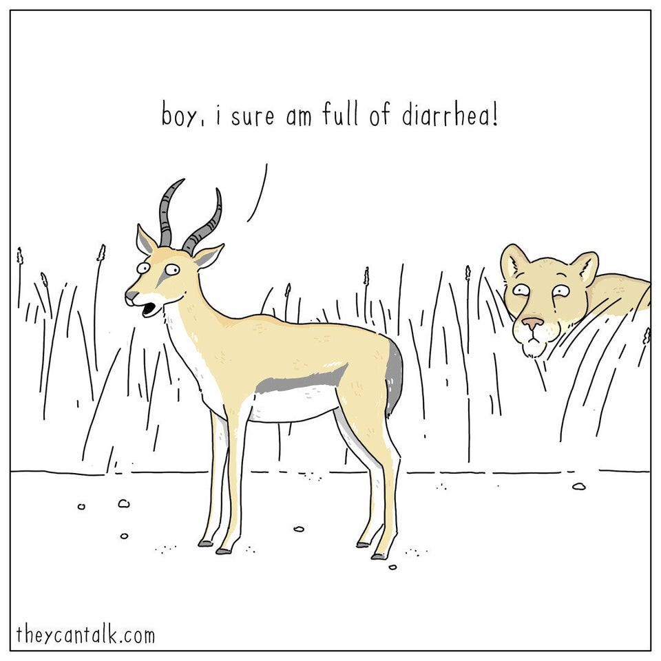

10601 lecturer 
- [ˈlektʃərə(r)]  [ˈlɛktʃəɚ] 
- n.["（大学或学院中的）讲课者，授课者，（英美大学中的）讲师","演讲者"]   
- [人人词典](https://www.91dict.com/words?w=lecturer) [柯林斯](https://www.collinsdictionary.com/zh/dictionary/english/lecturer) [朗文](https://www.ldoceonline.com/dictionary/lecturer) 

10602 disgrace 
- [dɪsˈgreɪs]  [dɪsˈɡres] 
- n.["丢脸","耻辱","不光彩","丢脸的人（或事）"]  vt.["使丢脸","使失宠","使受耻辱","贬黜"]   
- [人人词典](https://www.91dict.com/words?w=disgrace) [柯林斯](https://www.collinsdictionary.com/zh/dictionary/english/disgrace) [朗文](https://www.ldoceonline.com/dictionary/disgrace) 

10603 beaten 
- [ˈbi:tn]  [ˈbitn] 
- adj.["被打败的","锤薄的","耗损的，常走的","筋疲力尽的"]  v.["（心脏等）跳动( beat的过去分词)","击打","（风、雨等）吹打"]   
- [人人词典](https://www.91dict.com/words?w=beaten) [柯林斯](https://www.collinsdictionary.com/zh/dictionary/english/beaten) [朗文](https://www.ldoceonline.com/dictionary/beaten) 

10604 moratorium 
- [ˌmɒrəˈtɔ:riəm]  [ˌmɔ:rəˈtɔ:riəm] 
- n.["（行动，活动等的）暂停，暂禁","[法]延期偿付权，延缓偿付期"]   
- [人人词典](https://www.91dict.com/words?w=moratorium) [柯林斯](https://www.collinsdictionary.com/zh/dictionary/english/moratorium) [朗文](https://www.ldoceonline.com/dictionary/moratorium) 

10605 sprig 
- [sprɪg]  [sprɪɡ] 
- n.["小树枝，幼枝","扁头钉","<谑>子孙","小伙子，少年"]  v.["用小枝装饰，加小枝花样","用钉子钉","使草蔓生","钉扁头钉"]   
- [人人词典](https://www.91dict.com/words?w=sprig) [柯林斯](https://www.collinsdictionary.com/zh/dictionary/english/sprig) [朗文](https://www.ldoceonline.com/dictionary/sprig) 

10606 embryonic 
- [ˌembriˈɒnɪk]  [ˌembriˈɑ:nɪk] 
- adj.["胚芽的，胎儿的","初期的"]   
- [人人词典](https://www.91dict.com/words?w=embryonic) [柯林斯](https://www.collinsdictionary.com/zh/dictionary/english/embryonic) [朗文](https://www.ldoceonline.com/dictionary/embryonic) 

10607 contaminant 
- [kənˈtæmɪnənt]  [kənˈtæmənənt] 
- n.["污染物，致污物"]   
- [人人词典](https://www.91dict.com/words?w=contaminant) [柯林斯](https://www.collinsdictionary.com/zh/dictionary/english/contaminant) [朗文](https://www.ldoceonline.com/dictionary/contaminant) 

10608 resurgence 
- [rɪˈsɜ:dʒəns]  [rɪˈsɜ:rdʒəns] 
- n.["复苏，复活","中断之后的继续","再起","回潮"]   
- [人人词典](https://www.91dict.com/words?w=resurgence) [柯林斯](https://www.collinsdictionary.com/zh/dictionary/english/resurgence) [朗文](https://www.ldoceonline.com/dictionary/resurgence) 

10609 brilliantly 
- ['brɪlɪəntlɪ]  [ˈbrɪljəntlɪ] 
- adv.["灿烂地，出色地","灿然"]   
- [人人词典](https://www.91dict.com/words?w=brilliantly) [柯林斯](https://www.collinsdictionary.com/zh/dictionary/english/brilliantly) [朗文](https://www.ldoceonline.com/dictionary/brilliantly) 

10610 convertible 
- [kənˈvɜ:təbl]  [kənˈvɜ:rtəbl] 
- adj.["可改变的","可变换的","（货币）可以自由兑换的","（汽车等）有折篷的"]  n.["敞篷车"]   
- [人人词典](https://www.91dict.com/words?w=convertible) [柯林斯](https://www.collinsdictionary.com/zh/dictionary/english/convertible) [朗文](https://www.ldoceonline.com/dictionary/convertible) 

10611 winery 
- [ˈwaɪnəri]  ['waɪnərɪ] 
- n.["葡萄酒酿造厂"]   
- [人人词典](https://www.91dict.com/words?w=winery) [柯林斯](https://www.collinsdictionary.com/zh/dictionary/english/winery) [朗文](https://www.ldoceonline.com/dictionary/winery) 

10612 anew 
- [əˈnju:]  [əˈnu:] 
- adv.["再，重新"]   
- [人人词典](https://www.91dict.com/words?w=anew) [柯林斯](https://www.collinsdictionary.com/zh/dictionary/english/anew) [朗文](https://www.ldoceonline.com/dictionary/anew) 

10613 grad 
- [græd]  [ɡræd] 
- n.["毕业生，校友","研究生"]   
- [人人词典](https://www.91dict.com/words?w=grad) [柯林斯](https://www.collinsdictionary.com/zh/dictionary/english/grad) [朗文](https://www.ldoceonline.com/dictionary/grad) 

10614 fledgling 
- [ˈfledʒlɪŋ]  [ˈflɛdʒlɪŋ] 
- n.["（刚学会飞的）幼鸟","无经验的人","乳臭小儿"]  adj.["刚开始的","无经验的"]   
- [人人词典](https://www.91dict.com/words?w=fledgling) [柯林斯](https://www.collinsdictionary.com/zh/dictionary/english/fledgling) [朗文](https://www.ldoceonline.com/dictionary/fledgling) 

10615 audible 
- [ˈɔ:dəbl]  [ˈɔdəbəl] 
- adj.["听得见的"]   
- [人人词典](https://www.91dict.com/words?w=audible) [柯林斯](https://www.collinsdictionary.com/zh/dictionary/english/audible) [朗文](https://www.ldoceonline.com/dictionary/audible) 

10616 fuse 
- [fju:z]  [fjuz] 
- vi.["熔化","融合"]  vt.["使融合","使融化","给…装信管"]  n.["保险丝","导火线","雷管","引信"]   
- [人人词典](https://www.91dict.com/words?w=fuse) [柯林斯](https://www.collinsdictionary.com/zh/dictionary/english/fuse) [朗文](https://www.ldoceonline.com/dictionary/fuse) 

10617 disapproval 
- [ˌdɪsəˈpru:vl]  [ˌdɪsəˈpruvəl] 
- n.["不赞同，反对","非难"]   
- [人人词典](https://www.91dict.com/words?w=disapproval) [柯林斯](https://www.collinsdictionary.com/zh/dictionary/english/disapproval) [朗文](https://www.ldoceonline.com/dictionary/disapproval) 

10618 fabricate 
- [ˈfæbrɪkeɪt]  [ˈfæbrɪˌket] 
- vt.["制造","装配","捏造"]   
- [人人词典](https://www.91dict.com/words?w=fabricate) [柯林斯](https://www.collinsdictionary.com/zh/dictionary/english/fabricate) [朗文](https://www.ldoceonline.com/dictionary/fabricate) 

10619 year-old 
- undefined 
- undefined 
- [人人词典](https://www.91dict.com/words?w=year-old) [柯林斯](https://www.collinsdictionary.com/zh/dictionary/english/year-old) [朗文](https://www.ldoceonline.com/dictionary/year-old) 

10620 sow 
- [səʊ]  [soʊ] 
- vt.& vi.["播（种），播种于"]  vt.["灌输","激起","散布","煽动"]  n.["母猪"]   
- [人人词典](https://www.91dict.com/words?w=sow) [柯林斯](https://www.collinsdictionary.com/zh/dictionary/english/sow) [朗文](https://www.ldoceonline.com/dictionary/sow) 

10621 disguise 
- [dɪsˈgaɪz]  [dɪsˈɡaɪz] 
- vt.["隐瞒，掩饰","伪装，假装","化装","掩盖"]  n.["伪装","伪装品","用作伪装的东西","托辞，借口"]   
- [人人词典](https://www.91dict.com/words?w=disguise) [柯林斯](https://www.collinsdictionary.com/zh/dictionary/english/disguise) [朗文](https://www.ldoceonline.com/dictionary/disguise) 

10622 modernize 
- [ˈmɒdənaɪz]  [ˈmɑ:dərnaɪz] 
- vt.["使现代化，使适应现代需要"]  vi.["现代化，使用现代方法"]  n.["现代化事物"]   
- [人人词典](https://www.91dict.com/words?w=modernize) [柯林斯](https://www.collinsdictionary.com/zh/dictionary/english/modernize) [朗文](https://www.ldoceonline.com/dictionary/modernize) 

10623 pharmacist 
- [ˈfɑ:məsɪst]  [ˈfɑ:rməsɪst] 
- n.["药剂师"]   
- [人人词典](https://www.91dict.com/words?w=pharmacist) [柯林斯](https://www.collinsdictionary.com/zh/dictionary/english/pharmacist) [朗文](https://www.ldoceonline.com/dictionary/pharmacist) 

10624 hardy 
- [ˈhɑ:di]  [ˈhɑ:rdi] 
- adj.["强壮的","大胆，勇敢的","鲁莽的","[植]耐寒的"]  n.["强壮的人","耐旱植物","方柄凿"]   
- [人人词典](https://www.91dict.com/words?w=hardy) [柯林斯](https://www.collinsdictionary.com/zh/dictionary/english/hardy) [朗文](https://www.ldoceonline.com/dictionary/hardy) 

10625 snap 
- [snæp]  [snæp] 
- vt.& vi.["猛地咬住","呵斥","折断"]  vt.["拍照","用子母扣扣","[棒球]快速传（球）","拍…的快照"]  n.["（树枝等的）突然折断","严厉的话","突然的撕咬","尤指关上或断裂的声音)啪嗒声"]  vi.["啪啪作响","（目光）闪耀","（牙齿等）咯咯作响","（精神）突然崩溃"]  adj.["容易的","喀嗒一声扣下的","仓促的"]  adv.["噼啪作响地","啪嗒一声","猛然"]   
- [人人词典](https://www.91dict.com/words?w=snap) [柯林斯](https://www.collinsdictionary.com/zh/dictionary/english/snap) [朗文](https://www.ldoceonline.com/dictionary/snap) 

10626 stoop 
- [stu:p]  [stup] 
- n.["门廊，游廊","自贬","弯腰，驼背","屈服"]  vt.& vi.["屈服，忍辱","弯腰","倾斜","自贬"]   
- [人人词典](https://www.91dict.com/words?w=stoop) [柯林斯](https://www.collinsdictionary.com/zh/dictionary/english/stoop) [朗文](https://www.ldoceonline.com/dictionary/stoop) 

10627 pantry 
- [ˈpæntri]  [ˈpæntri] 
- n.["餐具室，食品储存室","〈美俚〉胃"]   
- [人人词典](https://www.91dict.com/words?w=pantry) [柯林斯](https://www.collinsdictionary.com/zh/dictionary/english/pantry) [朗文](https://www.ldoceonline.com/dictionary/pantry) 

10628 avocado 
- [ˌævəˈkɑ:dəʊ]  [ˌævəˈkɑ:doʊ] 
- n.["<植>鳄梨，鳄梨树","暗黄绿色"]  adj.["暗黄绿色的"]   
- [人人词典](https://www.91dict.com/words?w=avocado) [柯林斯](https://www.collinsdictionary.com/zh/dictionary/english/avocado) [朗文](https://www.ldoceonline.com/dictionary/avocado) 

10629 trim 
- [trɪm]  [trɪm] 
- vt.["修剪","整理","装饰"]  adj.["整齐的，整洁的","修长的","苗条的"]  n.["整齐","修剪","健康状态","装束"]  vi.["削减"]   
- [人人词典](https://www.91dict.com/words?w=trim) [柯林斯](https://www.collinsdictionary.com/zh/dictionary/english/trim) [朗文](https://www.ldoceonline.com/dictionary/trim) 

10630 brandy 
- [ˈbrændi]  [ˈbrændi] 
- n.["白兰地酒"]  v.["把…在白兰地酒中浸泡"]   
- [人人词典](https://www.91dict.com/words?w=brandy) [柯林斯](https://www.collinsdictionary.com/zh/dictionary/english/brandy) [朗文](https://www.ldoceonline.com/dictionary/brandy) 

10631 getaway 
- [ˈgetəweɪ]  [ˈɡɛtəˌwe] 
- n.["（尤指犯罪后的）逃跑","（比赛的）开始"]   
- [人人词典](https://www.91dict.com/words?w=getaway) [柯林斯](https://www.collinsdictionary.com/zh/dictionary/english/getaway) [朗文](https://www.ldoceonline.com/dictionary/getaway) 

10632 trusted 
- []  [] 
- adj.["可[置]信的，无错的"]  v.["相信，信任( trust的过去式和过去分词 )","认为可靠","想","希望"]   
- [人人词典](https://www.91dict.com/words?w=trusted) [柯林斯](https://www.collinsdictionary.com/zh/dictionary/english/trusted) [朗文](https://www.ldoceonline.com/dictionary/trusted) 

10633 unused 
- [ˌʌnˈju:zd]  [ˌʌnˈju:zd] 
- adj.["未用过的","不用的，空着的","不习惯的","无经验的"]   
- [人人词典](https://www.91dict.com/words?w=unused) [柯林斯](https://www.collinsdictionary.com/zh/dictionary/english/unused) [朗文](https://www.ldoceonline.com/dictionary/unused) 

10634 casserole 
- [ˈkæsərəʊl]  [ˈkæsəroʊl] 
- n.["焙盘","砂锅","焙盘菜","砂锅菜"]   
- [人人词典](https://www.91dict.com/words?w=casserole) [柯林斯](https://www.collinsdictionary.com/zh/dictionary/english/casserole) [朗文](https://www.ldoceonline.com/dictionary/casserole) 

10635 bare 
- [beə(r)]  [ber] 
- adj.["光秃秃的","（房间、柜子等）空的","赤裸的","刚好够的"]  vt.["使赤裸","使露出","揭开","脱（衣服）"]   
- [人人词典](https://www.91dict.com/words?w=bare) [柯林斯](https://www.collinsdictionary.com/zh/dictionary/english/bare) [朗文](https://www.ldoceonline.com/dictionary/bare) 

10636 cycle 
- [ˈsaɪkl]  [ˈsaɪkəl] 
- n.["循环，周期","自行车","时代，一段时间","整套"]  vi.["周而复始，循环","骑自行车","轮转"]  vt.["运转，循环","使轮转"]   
- [人人词典](https://www.91dict.com/words?w=cycle) [柯林斯](https://www.collinsdictionary.com/zh/dictionary/english/cycle) [朗文](https://www.ldoceonline.com/dictionary/cycle) 

10637 predictive 
- [prɪˈdɪktɪv]  [prɪˈdɪktɪv] 
- adj.["预言性的，成为前兆的"]   
- [人人词典](https://www.91dict.com/words?w=predictive) [柯林斯](https://www.collinsdictionary.com/zh/dictionary/english/predictive) [朗文](https://www.ldoceonline.com/dictionary/predictive) 

10638 collateral 
- [kəˈlætərəl]  [kəˈlætərəl] 
- n.["担保物","旁系亲属"]  adj.["并行的","附属的","旁系的"]   
- [人人词典](https://www.91dict.com/words?w=collateral) [柯林斯](https://www.collinsdictionary.com/zh/dictionary/english/collateral) [朗文](https://www.ldoceonline.com/dictionary/collateral) 

10639 sublime 
- [səˈblaɪm]  [səˈblaɪm] 
- adj.["庄严的，雄伟的","令人赞叹的","极端的","傲慢的"]  n.["庄严，崇高","高无上，顶点"]  vt.["（使）升华，精练","（使）变高尚"]  vi.["升华","变高尚"]   
- [人人词典](https://www.91dict.com/words?w=sublime) [柯林斯](https://www.collinsdictionary.com/zh/dictionary/english/sublime) [朗文](https://www.ldoceonline.com/dictionary/sublime) 

10640 complexion 
- [kəmˈplekʃn]  [kəmˈplɛkʃən] 
- n.["肤色，面色，气色","形式，局面"]   
- [人人词典](https://www.91dict.com/words?w=complexion) [柯林斯](https://www.collinsdictionary.com/zh/dictionary/english/complexion) [朗文](https://www.ldoceonline.com/dictionary/complexion) 

10641 decency 
- [ˈdi:snsi]  [ˈdisənsi] 
- n.["正派","正直","体面","社会上高尚文雅行为的标准"]   
- [人人词典](https://www.91dict.com/words?w=decency) [柯林斯](https://www.collinsdictionary.com/zh/dictionary/english/decency) [朗文](https://www.ldoceonline.com/dictionary/decency) 

10642 plaid 
- [plæd]  [plæd] 
- n.["彩格呢","格子图案","毛呢长披肩（苏格兰民族服饰）"]  adj.["有格子图案的"]   
- [人人词典](https://www.91dict.com/words?w=plaid) [柯林斯](https://www.collinsdictionary.com/zh/dictionary/english/plaid) [朗文](https://www.ldoceonline.com/dictionary/plaid) 

10643 notwithstanding 
- [ˌnɒtwɪθˈstændɪŋ]  [ˌnɑ:twɪθˈstændɪŋ] 
- prep.["尽管","虽然"]  adv.["尽管如此，仍然","还是"]  conj.["虽然，尽管"]   
- [人人词典](https://www.91dict.com/words?w=notwithstanding) [柯林斯](https://www.collinsdictionary.com/zh/dictionary/english/notwithstanding) [朗文](https://www.ldoceonline.com/dictionary/notwithstanding) 

10644 internship 
- [ˈɪntɜ:nʃɪp]  [ˈɪntɜ:rnʃɪp] 
- n.["<美>实习医师，实习医师期"]   
- [人人词典](https://www.91dict.com/words?w=internship) [柯林斯](https://www.collinsdictionary.com/zh/dictionary/english/internship) [朗文](https://www.ldoceonline.com/dictionary/internship) 

10645 forestry 
- [ˈfɒrɪstri]  [ˈfɔ:rɪstri] 
- n.["林学","林业","造林术","林地"]   
- [人人词典](https://www.91dict.com/words?w=forestry) [柯林斯](https://www.collinsdictionary.com/zh/dictionary/english/forestry) [朗文](https://www.ldoceonline.com/dictionary/forestry) 

10646 infiltrate 
- [ˈɪnfɪltreɪt]  [ɪnˈfɪlˌtret, ˈɪnfɪl-] 
- vt.& vi.["（使）渗透，（使）渗入","（使）潜入"]  n.["渗透物"]   
- [人人词典](https://www.91dict.com/words?w=infiltrate) [柯林斯](https://www.collinsdictionary.com/zh/dictionary/english/infiltrate) [朗文](https://www.ldoceonline.com/dictionary/infiltrate) 

10647 testosterone 
- [teˈstɒstərəʊn]  [teˈstɑ:stəroʊn] 
- n.["[生化]睾酮","睾丸素（男性荷尔蒙的一种）"]   
- [人人词典](https://www.91dict.com/words?w=testosterone) [柯林斯](https://www.collinsdictionary.com/zh/dictionary/english/testosterone) [朗文](https://www.ldoceonline.com/dictionary/testosterone) 

10648 paramedic 
- [ˌpærəˈmedɪk]  [ˌpærəˈmɛdɪk] 
- n.["<美>护理人员，医务辅助人员"]   
- [人人词典](https://www.91dict.com/words?w=paramedic) [柯林斯](https://www.collinsdictionary.com/zh/dictionary/english/paramedic) [朗文](https://www.ldoceonline.com/dictionary/paramedic) 

10649 wrench 
- [rentʃ]  [rɛntʃ] 
- n.["扳手","扭伤","突然的悲痛"]  vt.["扭伤","扭转","歪曲"]   
- [人人词典](https://www.91dict.com/words?w=wrench) [柯林斯](https://www.collinsdictionary.com/zh/dictionary/english/wrench) [朗文](https://www.ldoceonline.com/dictionary/wrench) 

10650 tendon 
- [ˈtendən]  [ˈtɛndən] 
- n.["<解>筋，腱"]   
- [人人词典](https://www.91dict.com/words?w=tendon) [柯林斯](https://www.collinsdictionary.com/zh/dictionary/english/tendon) [朗文](https://www.ldoceonline.com/dictionary/tendon) 

10651 accessibility 
- [əkˌsesə'bɪlətɪ]  [əkˌsesə'bɪlətɪ] 
- n.["易接近，可到达","学习资料利用率","可诣达性","可达性"]   
- [人人词典](https://www.91dict.com/words?w=accessibility) [柯林斯](https://www.collinsdictionary.com/zh/dictionary/english/accessibility) [朗文](https://www.ldoceonline.com/dictionary/accessibility) 

10652 pixel 
- [ˈpɪksl]  [ˈpɪksəl, -ˌsɛl] 
- n.["（显示器或电视机图像的）像素"]   
- [人人词典](https://www.91dict.com/words?w=pixel) [柯林斯](https://www.collinsdictionary.com/zh/dictionary/english/pixel) [朗文](https://www.ldoceonline.com/dictionary/pixel) 

10653 enlightened 
- [ɪnˈlaɪtnd]  [] 
- adj.["开明的","有知识的","有见识的","进步的"]  v.["启发","开导"]   
- [人人词典](https://www.91dict.com/words?w=enlightened) [柯林斯](https://www.collinsdictionary.com/zh/dictionary/english/enlightened) [朗文](https://www.ldoceonline.com/dictionary/enlightened) 

10654 interrogate 
- [ɪnˈterəgeɪt]  [ɪnˈtɛrəˌɡet] 
- vt.["询问，审问","提出问题","[计]询问"]  vi.["审问","质问"]   
- [人人词典](https://www.91dict.com/words?w=interrogate) [柯林斯](https://www.collinsdictionary.com/zh/dictionary/english/interrogate) [朗文](https://www.ldoceonline.com/dictionary/interrogate) 

10655 zucchini 
- [zuˈki:ni]  [zʊ'ki:nɪ] 
- n.["夏季产南瓜之一种","(US) N [C/U] 绿皮密生西葫芦 [英=courgette]"]   
- [人人词典](https://www.91dict.com/words?w=zucchini) [柯林斯](https://www.collinsdictionary.com/zh/dictionary/english/zucchini) [朗文](https://www.ldoceonline.com/dictionary/zucchini) 

10656 ecstatic 
- [ɪkˈstætɪk]  [ɛkˈstætɪk] 
- adj.["狂喜的","入迷的，出神的"]  n.["狂喜的人"]   
- [人人词典](https://www.91dict.com/words?w=ecstatic) [柯林斯](https://www.collinsdictionary.com/zh/dictionary/english/ecstatic) [朗文](https://www.ldoceonline.com/dictionary/ecstatic) 

10657 grieving 
- []  [] 
- v.["感到悲痛，伤心( grieve的现在分词 )","使…伤心"]   
- [人人词典](https://www.91dict.com/words?w=grieving) [柯林斯](https://www.collinsdictionary.com/zh/dictionary/english/grieving) [朗文](https://www.ldoceonline.com/dictionary/grieving) 

10658 waive 
- [weɪv]  [wev] 
- vt.["宣布放弃","搁置","推迟","放弃（权利、要求等）"]   
- [人人词典](https://www.91dict.com/words?w=waive) [柯林斯](https://www.collinsdictionary.com/zh/dictionary/english/waive) [朗文](https://www.ldoceonline.com/dictionary/waive) 

10659 find 
- [faɪnd]  [faɪnd] 
- v.["发现","找到","查明","发觉"]  n.["发现物","被发现的人"]   
- [人人词典](https://www.91dict.com/words?w=find) [柯林斯](https://www.collinsdictionary.com/zh/dictionary/english/find) [朗文](https://www.ldoceonline.com/dictionary/find) 

10660 stitch 
- [stɪtʃ]  [stɪtʃ] 
- n.["（缝纫或编织中的）一针","缝法","衣服","（缝合伤口的）缝线"]  vt.["缝","缝补","缝合裂口","缝缀"]  vi.["缝针，缝纫"]   
- [人人词典](https://www.91dict.com/words?w=stitch) [柯林斯](https://www.collinsdictionary.com/zh/dictionary/english/stitch) [朗文](https://www.ldoceonline.com/dictionary/stitch) 

10661 chatter 
- [ˈtʃætə(r)]  [ˈtʃætɚ] 
- vi.["唠叨，喋喋不休","（鸟等）鸣，啁啾","（牙齿，机器等）振动，打颤","运动时摇摆或嘎嘎作响"]  vt.["不加思索地说出"]  n.["闲聊","咔哒声","（动物的）啁啾声","潺潺流水声"]   
- [人人词典](https://www.91dict.com/words?w=chatter) [柯林斯](https://www.collinsdictionary.com/zh/dictionary/english/chatter) [朗文](https://www.ldoceonline.com/dictionary/chatter) 

10662 disintegrate 
- [dɪsˈɪntɪgreɪt]  [dɪsˈɪntɪˌɡret] 
- vt.["使某物碎裂，崩裂","使某物衰微，瓦解，分崩离析"]  vi.["碎裂，崩裂","衰微，瓦解，分崩离析"]   
- [人人词典](https://www.91dict.com/words?w=disintegrate) [柯林斯](https://www.collinsdictionary.com/zh/dictionary/english/disintegrate) [朗文](https://www.ldoceonline.com/dictionary/disintegrate) 

10663 Headnote 
- undefined 
- undefined 
- [人人词典](https://www.91dict.com/words?w=Headnote) [柯林斯](https://www.collinsdictionary.com/zh/dictionary/english/Headnote) [朗文](https://www.ldoceonline.com/dictionary/Headnote) 

10664 conceivable 
- [kənˈsi:vəbl]  [kənˈsiːvəbl] 
- adj.["可想到的，可相信的，可想像的，可能的"]   
- [人人词典](https://www.91dict.com/words?w=conceivable) [柯林斯](https://www.collinsdictionary.com/zh/dictionary/english/conceivable) [朗文](https://www.ldoceonline.com/dictionary/conceivable) 

10665 obliterate 
- [əˈblɪtəreɪt]  [əˈblɪtəˌret,oˈblɪt-] 
- vt.["涂去，擦掉","使消失","使被忘却","忘掉"]   
- [人人词典](https://www.91dict.com/words?w=obliterate) [柯林斯](https://www.collinsdictionary.com/zh/dictionary/english/obliterate) [朗文](https://www.ldoceonline.com/dictionary/obliterate) 

10666 hanging 
- [ˈhæŋɪŋ]  [ˈhæŋɪŋ] 
- n.["绞死","绞刑","（墙上装饰用的）帘子","帷幔"]  adj.["应处以死刑的","量刑偏重的"]  v.["悬( hang的现在分词 )","（被）绞死","贴","逗留"]   
- [人人词典](https://www.91dict.com/words?w=hanging) [柯林斯](https://www.collinsdictionary.com/zh/dictionary/english/hanging) [朗文](https://www.ldoceonline.com/dictionary/hanging) 

10667 thaw 
- [θɔ:]  [θɔ] 
- vi.["解冻，融雪","变缓和","变得不冷淡"]  vt.["使融化"]  n.["融雪","温暖气候","放松"]   
- [人人词典](https://www.91dict.com/words?w=thaw) [柯林斯](https://www.collinsdictionary.com/zh/dictionary/english/thaw) [朗文](https://www.ldoceonline.com/dictionary/thaw) 

10668 visitation 
- [ˌvɪzɪˈteɪʃn]  [ˌvɪzɪˈteʃən] 
- n.["访问","探望","天罚","天降的祸福"]   
- [人人词典](https://www.91dict.com/words?w=visitation) [柯林斯](https://www.collinsdictionary.com/zh/dictionary/english/visitation) [朗文](https://www.ldoceonline.com/dictionary/visitation) 

10669 hypertension 
- [ˌhaɪpəˈtenʃn]  [ˌhaɪpərˈtenʃn] 
- n.["高血压","过度紧张"]   
- [人人词典](https://www.91dict.com/words?w=hypertension) [柯林斯](https://www.collinsdictionary.com/zh/dictionary/english/hypertension) [朗文](https://www.ldoceonline.com/dictionary/hypertension) 

10670 zipper 
- [ˈzɪpə(r)]  [ˈzɪpɚ] 
- n.["<美>拉链","用拉链的人，装拉链的包"]  vi.["拉上拉链"]  vt.["用拉链扣上"]   
- [人人词典](https://www.91dict.com/words?w=zipper) [柯林斯](https://www.collinsdictionary.com/zh/dictionary/english/zipper) [朗文](https://www.ldoceonline.com/dictionary/zipper) 

10671 detach 
- [dɪˈtætʃ]  [dɪˈtætʃ] 
- vt.["分离，拆开","派遣","分派","使超然"]   
- [人人词典](https://www.91dict.com/words?w=detach) [柯林斯](https://www.collinsdictionary.com/zh/dictionary/english/detach) [朗文](https://www.ldoceonline.com/dictionary/detach) 

10672 extravagant 
- [ɪkˈstrævəgənt]  [ɪkˈstrævəɡənt] 
- adj.["过度的，过分的","奢侈的，浪费的","放肆的","大量的"]   
- [人人词典](https://www.91dict.com/words?w=extravagant) [柯林斯](https://www.collinsdictionary.com/zh/dictionary/english/extravagant) [朗文](https://www.ldoceonline.com/dictionary/extravagant) 

10673 rover 
- [ˈrəʊvə(r)]  [ˈroʊvə(r)] 
- n.["流浪者，漫游者"]   
- [人人词典](https://www.91dict.com/words?w=rover) [柯林斯](https://www.collinsdictionary.com/zh/dictionary/english/rover) [朗文](https://www.ldoceonline.com/dictionary/rover) 

10674 brew 
- [bru:]  [bru] 
- vt.["酿造","泡，煮","策划，酿成"]  vi.["以酿造麦酒或啤酒为职业","被冲泡","即将发生"]  n.["酿造的饮料","啤酒"]   
- [人人词典](https://www.91dict.com/words?w=brew) [柯林斯](https://www.collinsdictionary.com/zh/dictionary/english/brew) [朗文](https://www.ldoceonline.com/dictionary/brew) 

10675 biopsy 
- [ˈbaɪɒpsi]  [ˈbaɪɑ:psi] 
- n.["活组织检查，活体检视"]   
- [人人词典](https://www.91dict.com/words?w=biopsy) [柯林斯](https://www.collinsdictionary.com/zh/dictionary/english/biopsy) [朗文](https://www.ldoceonline.com/dictionary/biopsy) 

10676 Belgian 
- ['beldʒən]  [ˈbɛldʒən] 
- n.["比利时人"]  adj.["比利时的"]   
- [人人词典](https://www.91dict.com/words?w=Belgian) [柯林斯](https://www.collinsdictionary.com/zh/dictionary/english/Belgian) [朗文](https://www.ldoceonline.com/dictionary/Belgian) 

10677 exploratory 
- [ɪkˈsplɒrətri]  [ɪkˈsplɔ:rətɔ:ri] 
- adj.["探索的，考察的，探索的","“explorative”的变体","试探性"]   
- [人人词典](https://www.91dict.com/words?w=exploratory) [柯林斯](https://www.collinsdictionary.com/zh/dictionary/english/exploratory) [朗文](https://www.ldoceonline.com/dictionary/exploratory) 

10678 clientele 
- [ˌkli:ənˈtel]  [ˌklaɪənˈtel] 
- n.["诉讼委托人","顾客，客户","被保护者，追随者"]   
- [人人词典](https://www.91dict.com/words?w=clientele) [柯林斯](https://www.collinsdictionary.com/zh/dictionary/english/clientele) [朗文](https://www.ldoceonline.com/dictionary/clientele) 

10679 snore 
- [snɔ:(r)]  [snɔr, snor] 
- vi.["打呼噜，打鼾"]  n.["呼噜，鼾声"]   
- [人人词典](https://www.91dict.com/words?w=snore) [柯林斯](https://www.collinsdictionary.com/zh/dictionary/english/snore) [朗文](https://www.ldoceonline.com/dictionary/snore) 

10680 slate 
- [sleɪt]  [slet] 
- n.["石板","板岩，页岩","行为记录","石板色，深蓝灰色"]  vt.["用石板瓦盖，用板岩覆盖（例如屋顶）","把…加到竞选者的名单上","安排或指定"]  adj.["石板的","石板色的，深蓝灰色的"]   
- [人人词典](https://www.91dict.com/words?w=slate) [柯林斯](https://www.collinsdictionary.com/zh/dictionary/english/slate) [朗文](https://www.ldoceonline.com/dictionary/slate) 

10681 transplant 
- [trænsˈplɑ:nt]  [trænsˈplænt] 
- vt.["移植","移种","移民，迁移","移植（器官、皮肤、头发等）"]  n.["（器官、皮肤、头发等的）移植","移植物","移植者"]  vi.["迁移","移居","经得起移植"]   
- [人人词典](https://www.91dict.com/words?w=transplant) [柯林斯](https://www.collinsdictionary.com/zh/dictionary/english/transplant) [朗文](https://www.ldoceonline.com/dictionary/transplant) 

10682 zinc 
- [zɪŋk]  [zɪŋk] 
- n.["[化]锌"]  vt.["镀锌于…","在…上镀锌"]   
- [人人词典](https://www.91dict.com/words?w=zinc) [柯林斯](https://www.collinsdictionary.com/zh/dictionary/english/zinc) [朗文](https://www.ldoceonline.com/dictionary/zinc) 

10683 mediocre 
- [ˌmi:diˈəʊkə(r)]  [ˌmi:diˈoʊkər] 
- adj.["普通的","中等的","质量中等偏下的","碌"]   
- [人人词典](https://www.91dict.com/words?w=mediocre) [柯林斯](https://www.collinsdictionary.com/zh/dictionary/english/mediocre) [朗文](https://www.ldoceonline.com/dictionary/mediocre) 

10684 heartland 
- [ˈhɑ:tlænd]  [ˈhɑ:rtlænd] 
- n.["心脏地带","中心区域"]   
- [人人词典](https://www.91dict.com/words?w=heartland) [柯林斯](https://www.collinsdictionary.com/zh/dictionary/english/heartland) [朗文](https://www.ldoceonline.com/dictionary/heartland) 

10685 entrust 
- [ɪnˈtrʌst]  [ɪnˈtrʌst] 
- vt.["委托，托付"]   
- [人人词典](https://www.91dict.com/words?w=entrust) [柯林斯](https://www.collinsdictionary.com/zh/dictionary/english/entrust) [朗文](https://www.ldoceonline.com/dictionary/entrust) 

10686 adrenaline 
- [ə'drenəlɪn]  [əˈdrɛnəlɪn] 
- n.["<生化>肾上腺素","<喻>刺激物","激励因素","一阵兴奋（或激动）"]   
- [人人词典](https://www.91dict.com/words?w=adrenaline) [柯林斯](https://www.collinsdictionary.com/zh/dictionary/english/adrenaline) [朗文](https://www.ldoceonline.com/dictionary/adrenaline) 

10687 sparse 
- [spɑ:s]  [spɑ:rs] 
- adj.["稀疏的","稀少的"]   
- [人人词典](https://www.91dict.com/words?w=sparse) [柯林斯](https://www.collinsdictionary.com/zh/dictionary/english/sparse) [朗文](https://www.ldoceonline.com/dictionary/sparse) 

10688 endowment 
- [ɪnˈdaʊmənt]  [ɛnˈdaʊmənt] 
- n.["捐赠","基金","天赋","养老保险"]   
- [人人词典](https://www.91dict.com/words?w=endowment) [柯林斯](https://www.collinsdictionary.com/zh/dictionary/english/endowment) [朗文](https://www.ldoceonline.com/dictionary/endowment) 

10689 cutback 
- [ˈkʌtbæk]  [ˈkʌtˌbæk] 
- n.["削减，缩减","（电影等）倒叙","[园]剪枝","回冲浪峰"]   
- [人人词典](https://www.91dict.com/words?w=cutback) [柯林斯](https://www.collinsdictionary.com/zh/dictionary/english/cutback) [朗文](https://www.ldoceonline.com/dictionary/cutback) 

10690 present-day 
- [ˈprezəntˈdeɪ]  [ˈprɛzəntˈdeɪ] 
- adj.["现在的","当今的，现代的"]   
- [人人词典](https://www.91dict.com/words?w=present-day) [柯林斯](https://www.collinsdictionary.com/zh/dictionary/english/present-day) [朗文](https://www.ldoceonline.com/dictionary/present-day) 

10691 beacon 
- [ˈbi:kən]  [ˈbikən] 
- n.["灯塔，信号浮标","烽火","指路明灯","警标，界标"]  vt.["照亮，指引","为…设置信标","用灯指引"]  vi.["像灯塔般照耀"]   
- [人人词典](https://www.91dict.com/words?w=beacon) [柯林斯](https://www.collinsdictionary.com/zh/dictionary/english/beacon) [朗文](https://www.ldoceonline.com/dictionary/beacon) 

10692 reorganization 
- [rɪˌɔ:ɡənaɪ'zeɪʃn]  [riˌɔrɡənɪˈzeʃən] 
- n.["改组","改编","重新制定","整顿"]   
- [人人词典](https://www.91dict.com/words?w=reorganization) [柯林斯](https://www.collinsdictionary.com/zh/dictionary/english/reorganization) [朗文](https://www.ldoceonline.com/dictionary/reorganization) 

10693 aye 
- [aɪ]  [aɪ] 
- n.["赞成票","投票赞成者","（回答）是"]  adv.["赞成"]   
- [人人词典](https://www.91dict.com/words?w=aye) [柯林斯](https://www.collinsdictionary.com/zh/dictionary/english/aye) [朗文](https://www.ldoceonline.com/dictionary/aye) 

10694 sacrament 
- [ˈsækrəmənt]  [ˈsækrəmənt] 
- n.["（天主教的）圣事","圣礼","神圣的东西","庄严的誓言"]   
- [人人词典](https://www.91dict.com/words?w=sacrament) [柯林斯](https://www.collinsdictionary.com/zh/dictionary/english/sacrament) [朗文](https://www.ldoceonline.com/dictionary/sacrament) 

10695 incremental 
- [ˌɪŋkrə'mentl]  [ˌɪŋkrə'mentl] 
- adj.["增加的"]   
- [人人词典](https://www.91dict.com/words?w=incremental) [柯林斯](https://www.collinsdictionary.com/zh/dictionary/english/incremental) [朗文](https://www.ldoceonline.com/dictionary/incremental) 

10696 remedial 
- [rɪˈmi:diəl]  [rɪˈmidiəl] 
- adj.["治疗的，医治的","补救的，挽回的","补习的","纠正的"]   
- [人人词典](https://www.91dict.com/words?w=remedial) [柯林斯](https://www.collinsdictionary.com/zh/dictionary/english/remedial) [朗文](https://www.ldoceonline.com/dictionary/remedial) 

10697 narrate 
- [nəˈreɪt]  [ˈnærˌeɪt, næˈreɪt] 
- vt.["讲，谈到，叙述","做旁白说明","讲故事"]  vi.["叙述，讲述"]   
- [人人词典](https://www.91dict.com/words?w=narrate) [柯林斯](https://www.collinsdictionary.com/zh/dictionary/english/narrate) [朗文](https://www.ldoceonline.com/dictionary/narrate) 

10698 inflammatory 
- [ɪnˈflæmətri]  [ɪnˈflæmətɔ:ri] 
- adj.["令人激动的","有煽动性的","炎性的，发炎的"]   
- [人人词典](https://www.91dict.com/words?w=inflammatory) [柯林斯](https://www.collinsdictionary.com/zh/dictionary/english/inflammatory) [朗文](https://www.ldoceonline.com/dictionary/inflammatory) 

10699 discipline 
- [ˈdɪsəplɪn]  [ˈdɪsəplɪn] 
- vt.["训练","使有纪律","处罚","使有条理"]  n.["训练","纪律","学科","符合行为准则的行为（或举止）"]   
- [人人词典](https://www.91dict.com/words?w=discipline) [柯林斯](https://www.collinsdictionary.com/zh/dictionary/english/discipline) [朗文](https://www.ldoceonline.com/dictionary/discipline) 

10700 excerpt 
- [ˈeksɜ:pt]  [ˈeksɜ:rpt] 
- n.["摘录","引用","摘要","节录"]  vt.["摘录","摘要","引用","节要"]  vi.["摘录","引用"]   
- [人人词典](https://www.91dict.com/words?w=excerpt) [柯林斯](https://www.collinsdictionary.com/zh/dictionary/english/excerpt) [朗文](https://www.ldoceonline.com/dictionary/excerpt) 

10701 taut 
- [tɔ:t]  [tɔt] 
- adj.["紧的，绷紧的","整洁的，整齐的","紧张的"]   
- [人人词典](https://www.91dict.com/words?w=taut) [柯林斯](https://www.collinsdictionary.com/zh/dictionary/english/taut) [朗文](https://www.ldoceonline.com/dictionary/taut) 

10702 caste 
- [kɑ:st]  [kæst] 
- n.["（印度社会中的）种姓","印度的世袭阶级","等级（制度）"]   
- [人人词典](https://www.91dict.com/words?w=caste) [柯林斯](https://www.collinsdictionary.com/zh/dictionary/english/caste) [朗文](https://www.ldoceonline.com/dictionary/caste) 

10703 glisten 
- [ˈglɪsn]  [ˈɡlɪsən] 
- vi.["闪耀，闪亮"]  n.["闪光，闪耀"]   
- [人人词典](https://www.91dict.com/words?w=glisten) [柯林斯](https://www.collinsdictionary.com/zh/dictionary/english/glisten) [朗文](https://www.ldoceonline.com/dictionary/glisten) 

10704 outright 
- [ˈaʊtraɪt]  [ˈaʊtˈraɪt, -ˌraɪt] 
- adv.["完全地","彻底地","坦率地，不客气地","即刻，马上"]  adj.["完全的，彻底的","直率的","明白的","总共的"]   
- [人人词典](https://www.91dict.com/words?w=outright) [柯林斯](https://www.collinsdictionary.com/zh/dictionary/english/outright) [朗文](https://www.ldoceonline.com/dictionary/outright) 

10705 solid 
- [ˈsɒlɪd]  [ˈsɑ:lɪd] 
- adj.["固体的","实心的","结实的，可靠的","可信赖的"]  n.["固体","立体图形","立方体"]   
- [人人词典](https://www.91dict.com/words?w=solid) [柯林斯](https://www.collinsdictionary.com/zh/dictionary/english/solid) [朗文](https://www.ldoceonline.com/dictionary/solid) 

10706 speck 
- [spek]  [spɛk] 
- n.["污点","微粒"]  vt.["使有斑点"]   
- [人人词典](https://www.91dict.com/words?w=speck) [柯林斯](https://www.collinsdictionary.com/zh/dictionary/english/speck) [朗文](https://www.ldoceonline.com/dictionary/speck) 

10707 roast 
- [rəʊst]  [roʊst] 
- vt.& vi.["烤，烘，焙"]  vt.["嘲讽，挖苦"]  n.["烤肉","户外烧烤野餐"]  adj.["烤好的，烤制的"]   
- [人人词典](https://www.91dict.com/words?w=roast) [柯林斯](https://www.collinsdictionary.com/zh/dictionary/english/roast) [朗文](https://www.ldoceonline.com/dictionary/roast) 

10708 unanimously 
- [jʊ'nænɪməslɪ]  [jʊˈnænəməslɪ] 
- adv.["无异议地，全体一致地"]   
- [人人词典](https://www.91dict.com/words?w=unanimously) [柯林斯](https://www.collinsdictionary.com/zh/dictionary/english/unanimously) [朗文](https://www.ldoceonline.com/dictionary/unanimously) 

10709 gymnastics 
- [dʒɪmˈnæstɪks]  [dʒɪmˈnæstɪks] 
- n.["体操，体育","体操运动"]   
- [人人词典](https://www.91dict.com/words?w=gymnastics) [柯林斯](https://www.collinsdictionary.com/zh/dictionary/english/gymnastics) [朗文](https://www.ldoceonline.com/dictionary/gymnastics) 

10710 gritty 
- [ˈgrɪti]  [ˈɡrɪti] 
- adj.["多沙的，含砂的","勇敢的，坚毅的，坚定的"]   
- [人人词典](https://www.91dict.com/words?w=gritty) [柯林斯](https://www.collinsdictionary.com/zh/dictionary/english/gritty) [朗文](https://www.ldoceonline.com/dictionary/gritty) 

10711 completed 
- [kəm'pli:tɪd]  [kəm'pli:tɪd] 
- adj.["完整的，包含全部内容的"]  v.["完成","使完善( complete的过去式和过去分词 )","使完整","填写（表格）"]   
- [人人词典](https://www.91dict.com/words?w=completed) [柯林斯](https://www.collinsdictionary.com/zh/dictionary/english/completed) [朗文](https://www.ldoceonline.com/dictionary/completed) 

10712 pleasantly 
- ['plezntlɪ]  [ˈplɛzn:tlɪ] 
- adv.["愉快地","快活地","和气地","和蔼地"]   
- [人人词典](https://www.91dict.com/words?w=pleasantly) [柯林斯](https://www.collinsdictionary.com/zh/dictionary/english/pleasantly) [朗文](https://www.ldoceonline.com/dictionary/pleasantly) 

10713 saloon 
- [səˈlu:n]  [səˈlun] 
- n.["大厅","酒吧，酒馆","展览场，公共大厅","大轿车"]   
- [人人词典](https://www.91dict.com/words?w=saloon) [柯林斯](https://www.collinsdictionary.com/zh/dictionary/english/saloon) [朗文](https://www.ldoceonline.com/dictionary/saloon) 

10714 rift 
- [rɪft]  [rɪft] 
- n.["裂缝，裂口","不和"]  vt.["使断裂","使分开"]  vi.["裂开"]   
- [人人词典](https://www.91dict.com/words?w=rift) [柯林斯](https://www.collinsdictionary.com/zh/dictionary/english/rift) [朗文](https://www.ldoceonline.com/dictionary/rift) 

10715 curfew 
- [ˈkɜ:fju:]  [ˈkɜ:rfju:] 
- n.["宵禁，戒严","晚钟，晚钟时刻"]   
- [人人词典](https://www.91dict.com/words?w=curfew) [柯林斯](https://www.collinsdictionary.com/zh/dictionary/english/curfew) [朗文](https://www.ldoceonline.com/dictionary/curfew) 

10716 tattered 
- [ˈtætəd]  [ˈtætərd] 
- adj.["破烂的，衣衫褴褛的"]  v.["扯碎，撕碎( tatter的过去式和过去分词)"]   
- [人人词典](https://www.91dict.com/words?w=tattered) [柯林斯](https://www.collinsdictionary.com/zh/dictionary/english/tattered) [朗文](https://www.ldoceonline.com/dictionary/tattered) 

10717 courtship 
- [ˈkɔ:tʃɪp]  [ˈkɔ:rtʃɪp] 
- n.["求爱期，追求期","求爱，求婚","[动]求偶（现象）"]   
- [人人词典](https://www.91dict.com/words?w=courtship) [柯林斯](https://www.collinsdictionary.com/zh/dictionary/english/courtship) [朗文](https://www.ldoceonline.com/dictionary/courtship) 

10718 roast 
- [rəʊst]  [roʊst] 
- vt.& vi.["烤，烘，焙"]  vt.["嘲讽，挖苦"]  n.["烤肉","户外烧烤野餐"]  adj.["烤好的，烤制的"]   
- [人人词典](https://www.91dict.com/words?w=roast) [柯林斯](https://www.collinsdictionary.com/zh/dictionary/english/roast) [朗文](https://www.ldoceonline.com/dictionary/roast) 

10719 swell 
- [swel]  [swɛl] 
- vt.& vi.["增强","肿胀","膨胀","充满（激情）"]  n.["汹涌","重要人士","（尤指身体部位）凸起的形状","声音渐强"]  adj.["极好的","了不起的","非常棒的"]   
- [人人词典](https://www.91dict.com/words?w=swell) [柯林斯](https://www.collinsdictionary.com/zh/dictionary/english/swell) [朗文](https://www.ldoceonline.com/dictionary/swell) 

10720 rendition 
- [renˈdɪʃn]  [rɛnˈdɪʃən] 
- n.["演奏","翻译","给予","引渡逃奴"]   
- [人人词典](https://www.91dict.com/words?w=rendition) [柯林斯](https://www.collinsdictionary.com/zh/dictionary/english/rendition) [朗文](https://www.ldoceonline.com/dictionary/rendition) 

10721 orgasm 
- [ˈɔ:gæzəm]  [ˈɔ:rgæzəm] 
- n.["极端的兴奋","[医]情欲亢进","性高潮"]   
- [人人词典](https://www.91dict.com/words?w=orgasm) [柯林斯](https://www.collinsdictionary.com/zh/dictionary/english/orgasm) [朗文](https://www.ldoceonline.com/dictionary/orgasm) 

10722 objectivity 
- [ˌɒbdʒek'tɪvətɪ]  [ˌɑbdʒɛkˈtɪvɪti] 
- n.["客观性，客观现实"]   
- [人人词典](https://www.91dict.com/words?w=objectivity) [柯林斯](https://www.collinsdictionary.com/zh/dictionary/english/objectivity) [朗文](https://www.ldoceonline.com/dictionary/objectivity) 

10723 undecided 
- [ˌʌndɪˈsaɪdɪd]  [ˌʌndɪˈsaɪdɪd] 
- adj.["未解决","未确定","（天气等）不稳定的","犹豫不定"]   
- [人人词典](https://www.91dict.com/words?w=undecided) [柯林斯](https://www.collinsdictionary.com/zh/dictionary/english/undecided) [朗文](https://www.ldoceonline.com/dictionary/undecided) 

10724 gracefully 
- ['ɡreɪsfəlɪ]  [ˈɡresfəlɪ] 
- adv.["优美地","优雅地","雅致地","温文地"]   
- [人人词典](https://www.91dict.com/words?w=gracefully) [柯林斯](https://www.collinsdictionary.com/zh/dictionary/english/gracefully) [朗文](https://www.ldoceonline.com/dictionary/gracefully) 

10725 slick 
- [slɪk]  [slɪk] 
- adj.["光滑的","熟练的，灵巧的","机灵的，聪明的","华而不实的"]  n.["光滑之处","[机]平滑器","[机]修光工具","一层浮油"]  vt.["使光滑，使光亮","使美观","使齐整","占…的便宜"]  adv.["灵活地","聪明地","熟练地，巧妙地"]   
- [人人词典](https://www.91dict.com/words?w=slick) [柯林斯](https://www.collinsdictionary.com/zh/dictionary/english/slick) [朗文](https://www.ldoceonline.com/dictionary/slick) 

10726 Kuwaiti 
- [kʊ'weɪtɪ]  [kʊ'weɪtɪ] 
- n.["科威特人"]  adj.["科威特的，科威特人的"]   
- [人人词典](https://www.91dict.com/words?w=Kuwaiti) [柯林斯](https://www.collinsdictionary.com/zh/dictionary/english/Kuwaiti) [朗文](https://www.ldoceonline.com/dictionary/Kuwaiti) 

10727 encyclopedia 
- [ɪnˌsaɪklə'pi:dɪə]  [ɛnˌsaɪkləˈpidiə] 
- n.["百科全书"]  na.["“encyclopaedia”的变体"]   
- [人人词典](https://www.91dict.com/words?w=encyclopedia) [柯林斯](https://www.collinsdictionary.com/zh/dictionary/english/encyclopedia) [朗文](https://www.ldoceonline.com/dictionary/encyclopedia) 

10728 preseason 
- [pri:'si:zn]  [pri:'si:zən] 
- adj.["活跃季节前的，旺季前的"]   
- [人人词典](https://www.91dict.com/words?w=preseason) [柯林斯](https://www.collinsdictionary.com/zh/dictionary/english/preseason) [朗文](https://www.ldoceonline.com/dictionary/preseason) 

10729 shortfall 
- [ˈʃɔ:tfɔ:l]  [ˈʃɔ:rtfɔ:l] 
- n.["缺少","不足之数","亏空"]   
- [人人词典](https://www.91dict.com/words?w=shortfall) [柯林斯](https://www.collinsdictionary.com/zh/dictionary/english/shortfall) [朗文](https://www.ldoceonline.com/dictionary/shortfall) 

10730 Pentagon 
- []  [] 
- ["[地名] [美国] 五角大楼〈弗吉尼亚州〉"]   
- [人人词典](https://www.91dict.com/words?w=Pentagon) [柯林斯](https://www.collinsdictionary.com/zh/dictionary/english/Pentagon) [朗文](https://www.ldoceonline.com/dictionary/Pentagon) 

10731 cellphone 
- [ˈselfəʊn]  [ˈselfoʊn] 
- n.["蜂窝式便携无线电话，大哥大","手机"]   
- [人人词典](https://www.91dict.com/words?w=cellphone) [柯林斯](https://www.collinsdictionary.com/zh/dictionary/english/cellphone) [朗文](https://www.ldoceonline.com/dictionary/cellphone) 

10732 progressively 
- [prəˈgresɪvli]  [prəˈɡrɛsɪvlɪ] 
- adv.["前进地，日益增加地","逐步"]   
- [人人词典](https://www.91dict.com/words?w=progressively) [柯林斯](https://www.collinsdictionary.com/zh/dictionary/english/progressively) [朗文](https://www.ldoceonline.com/dictionary/progressively) 

10733 pen 
- [pen]  [pɛn] 
- n.["笔，笔尖","笔法，文笔","作家","围栏"]  vt.["写","把…关入栏中","关押，囚禁"]   
- [人人词典](https://www.91dict.com/words?w=pen) [柯林斯](https://www.collinsdictionary.com/zh/dictionary/english/pen) [朗文](https://www.ldoceonline.com/dictionary/pen) 

10734 melting 
- [ˈmeltɪŋ]  [] 
- adj.["熔化的","融化的","溶解的","混合的"]  v.["（使）融[溶，熔]化( melt的现在分词 )","溶解","（使）消散，消失","（使）软化，变得温柔"]   
- [人人词典](https://www.91dict.com/words?w=melting) [柯林斯](https://www.collinsdictionary.com/zh/dictionary/english/melting) [朗文](https://www.ldoceonline.com/dictionary/melting) 

10735 admirable 
- [ˈædmərəbl]  [ˈædmərəbəl] 
- adj.["令人钦佩的","极好的，绝妙的","值得赞扬的","可贵"]   
- [人人词典](https://www.91dict.com/words?w=admirable) [柯林斯](https://www.collinsdictionary.com/zh/dictionary/english/admirable) [朗文](https://www.ldoceonline.com/dictionary/admirable) 

10736 satire 
- [ˈsætaɪə(r)]  ['sætaɪər] 
- n.["讽刺","讽刺文学","讽刺作品"]   
- [人人词典](https://www.91dict.com/words?w=satire) [柯林斯](https://www.collinsdictionary.com/zh/dictionary/english/satire) [朗文](https://www.ldoceonline.com/dictionary/satire) 

10737 biomass 
- [ˈbaɪəʊmæs]  [ˈbaɪoʊmæs] 
- n.["（单位面积或体积内）生物的数量"]   
- [人人词典](https://www.91dict.com/words?w=biomass) [柯林斯](https://www.collinsdictionary.com/zh/dictionary/english/biomass) [朗文](https://www.ldoceonline.com/dictionary/biomass) 

10738 victimization 
- [ˌvɪktɪmaɪ'zeɪʃn]  [ˌvɪktɪmaɪ'zeɪʃn] 
- n.["牺牲，欺骗","害人"]   
- [人人词典](https://www.91dict.com/words?w=victimization) [柯林斯](https://www.collinsdictionary.com/zh/dictionary/english/victimization) [朗文](https://www.ldoceonline.com/dictionary/victimization) 

10739 dues 
- [du:s]  [du:s] 
- n.["税，应付款，该缴之款","应有的权利，应得到的东西( due的名词复数 )","应缴款（如俱乐部会费）","会费"]   
- [人人词典](https://www.91dict.com/words?w=dues) [柯林斯](https://www.collinsdictionary.com/zh/dictionary/english/dues) [朗文](https://www.ldoceonline.com/dictionary/dues) 

10740 pride 
- [praɪd]  [praɪd] 
- n.["自尊","骄傲","自满","（狮）群"]  vt.["以…而自豪， 得意于…"]  vi.["自豪，骄傲，得意"]   
- [人人词典](https://www.91dict.com/words?w=pride) [柯林斯](https://www.collinsdictionary.com/zh/dictionary/english/pride) [朗文](https://www.ldoceonline.com/dictionary/pride) 

10741 extraction 
- [ɪkˈstrækʃn]  [ɪkˈstrækʃən] 
- n.["取出，抽出","血统，家世，出身","[化]提取（法），萃取（法），回收物，提出物，精炼","[数]开方，求根"]   
- [人人词典](https://www.91dict.com/words?w=extraction) [柯林斯](https://www.collinsdictionary.com/zh/dictionary/english/extraction) [朗文](https://www.ldoceonline.com/dictionary/extraction) 

10742 affidavit 
- [ˌæfəˈdeɪvɪt]  [ˌæfɪˈdevɪt] 
- n.["<法>宣誓口供","宣誓书"]   
- [人人词典](https://www.91dict.com/words?w=affidavit) [柯林斯](https://www.collinsdictionary.com/zh/dictionary/english/affidavit) [朗文](https://www.ldoceonline.com/dictionary/affidavit) 

10743 shy 
- [ʃaɪ]  [ʃaɪ] 
- adj.["害羞的","怕羞的","害怕（做）","<美>缺乏的"]  vi.["惊退，畏缩","避开（某人）","（用石子，球等）乱投"]  n.["投掷","（马）惊退，惊逸","投扔，乱丢"]   
- [人人词典](https://www.91dict.com/words?w=shy) [柯林斯](https://www.collinsdictionary.com/zh/dictionary/english/shy) [朗文](https://www.ldoceonline.com/dictionary/shy) 

10744 bloody 
- [ˈblʌdi]  [ˈblʌdi] 
- adj.["血腥的，残忍的","血一样的","血染的","嗜杀的，残忍的"]  adv.["非常，很"]  v.["血污，血染","使流血"]   
- [人人词典](https://www.91dict.com/words?w=bloody) [柯林斯](https://www.collinsdictionary.com/zh/dictionary/english/bloody) [朗文](https://www.ldoceonline.com/dictionary/bloody) 

10745 principally 
- [ˈprɪnsəpli]  [ˈprɪnsəpli] 
- adv.["主要地，大部分"]   
- [人人词典](https://www.91dict.com/words?w=principally) [柯林斯](https://www.collinsdictionary.com/zh/dictionary/english/principally) [朗文](https://www.ldoceonline.com/dictionary/principally) 

10746 behold 
- [bɪˈhəʊld]  [bɪˈhoʊld] 
- vt.["看到，注视","领悟"]  vi.["瞧","用在祈使句中以引起人注意"]  int.["瞧，看呀"]   
- [人人词典](https://www.91dict.com/words?w=behold) [柯林斯](https://www.collinsdictionary.com/zh/dictionary/english/behold) [朗文](https://www.ldoceonline.com/dictionary/behold) 

10747 beforehand 
- [bɪˈfɔ:hænd]  [bɪˈfɔ:rhænd] 
- adv.["事先，预先","提前"]  adj.["提前的","预先准备好的"]   
- [人人词典](https://www.91dict.com/words?w=beforehand) [柯林斯](https://www.collinsdictionary.com/zh/dictionary/english/beforehand) [朗文](https://www.ldoceonline.com/dictionary/beforehand) 

10748 cubicle 
- [ˈkju:bɪkl]  [ˈkjubɪkəl] 
- n.["小卧室，斗室"]   
- [人人词典](https://www.91dict.com/words?w=cubicle) [柯林斯](https://www.collinsdictionary.com/zh/dictionary/english/cubicle) [朗文](https://www.ldoceonline.com/dictionary/cubicle) 

10749 proportional 
- [prəˈpɔ:ʃənl]  [prəˈpɔ:rʃənl] 
- adj.["比例的，成比例的","相称的，均衡的"]  n.["[数]比例项，比例量"]   
- [人人词典](https://www.91dict.com/words?w=proportional) [柯林斯](https://www.collinsdictionary.com/zh/dictionary/english/proportional) [朗文](https://www.ldoceonline.com/dictionary/proportional) 

10750 preserve 
- [prɪˈzɜ:v]  [prɪˈzɜ:rv] 
- vt.["保护","保持，保存","腌制食物","防腐处理"]  vi.["保鲜","保持原状","做蜜饯","禁猎"]  n.["蜜饯","防护用品","禁猎地","独占的事物（或范围）"]   
- [人人词典](https://www.91dict.com/words?w=preserve) [柯林斯](https://www.collinsdictionary.com/zh/dictionary/english/preserve) [朗文](https://www.ldoceonline.com/dictionary/preserve) 

10751 dart 
- [dɑ:t]  [dɑ:rt] 
- vt.["投掷，投射","使迅速突然移动"]  vi.["向前冲，飞奔"]  n.["飞镖，标枪","急驰，飞奔","（虫的）螯","飞快的移动"]   
- [人人词典](https://www.91dict.com/words?w=dart) [柯林斯](https://www.collinsdictionary.com/zh/dictionary/english/dart) [朗文](https://www.ldoceonline.com/dictionary/dart) 

10752 remorse 
- [rɪˈmɔ:s]  [rɪˈmɔ:rs] 
- n.["懊悔","悔恨","自责","同情"]   
- [人人词典](https://www.91dict.com/words?w=remorse) [柯林斯](https://www.collinsdictionary.com/zh/dictionary/english/remorse) [朗文](https://www.ldoceonline.com/dictionary/remorse) 

10753 wring 
- [rɪŋ]  [rɪŋ] 
- vt.["绞，拧","扭干，绞出","折磨，使苦恼","曲解"]  vi.["蠕动","扭动","感到痛苦","感到苦恼"]  n.["绞，扭","紧紧握手","剧痛"]   
- [人人词典](https://www.91dict.com/words?w=wring) [柯林斯](https://www.collinsdictionary.com/zh/dictionary/english/wring) [朗文](https://www.ldoceonline.com/dictionary/wring) 

10754 yen 
- [jen]  [jɛn] 
- n.["日元","渴望，热望"]  vi.["渴望"]   
- [人人词典](https://www.91dict.com/words?w=yen) [柯林斯](https://www.collinsdictionary.com/zh/dictionary/english/yen) [朗文](https://www.ldoceonline.com/dictionary/yen) 

10755 margarine 
- [ˌmɑ:dʒəˈri:n]  [ˈmɑ:rdʒərən] 
- n.["人造奶油","人造黄油"]   
- [人人词典](https://www.91dict.com/words?w=margarine) [柯林斯](https://www.collinsdictionary.com/zh/dictionary/english/margarine) [朗文](https://www.ldoceonline.com/dictionary/margarine) 

10756 lookout 
- [ˈlʊkaʊt]  [ˈlʊkˌaʊt] 
- n.["守望","远景，前途","瞭望台","警戒"]   
- [人人词典](https://www.91dict.com/words?w=lookout) [柯林斯](https://www.collinsdictionary.com/zh/dictionary/english/lookout) [朗文](https://www.ldoceonline.com/dictionary/lookout) 

10757 pew 
- [pju:]  [pju] 
- n.["座位","教堂长椅","会众"]  v.["排座位"]   
- [人人词典](https://www.91dict.com/words?w=pew) [柯林斯](https://www.collinsdictionary.com/zh/dictionary/english/pew) [朗文](https://www.ldoceonline.com/dictionary/pew) 

10758 neural 
- [ˈnjʊərəl]  [ˈnʊrəl] 
- adj.["神经的","背的，背侧的"]   
- [人人词典](https://www.91dict.com/words?w=neural) [柯林斯](https://www.collinsdictionary.com/zh/dictionary/english/neural) [朗文](https://www.ldoceonline.com/dictionary/neural) 

10759 Austrian 
- ['ɒstrɪən]  ['ɔ:strɪrn] 
- n.["奥地利人"]   
- [人人词典](https://www.91dict.com/words?w=Austrian) [柯林斯](https://www.collinsdictionary.com/zh/dictionary/english/Austrian) [朗文](https://www.ldoceonline.com/dictionary/Austrian) 

10760 sewing 
- [ˈsəʊɪŋ]  [ˈsoʊɪŋ] 
- n.["缝纫","缝纫机","针线活","缝纫物"]  v.["缝制"]   
- [人人词典](https://www.91dict.com/words?w=sewing) [柯林斯](https://www.collinsdictionary.com/zh/dictionary/english/sewing) [朗文](https://www.ldoceonline.com/dictionary/sewing) 

10761 junior 
- [ˈdʒu:niə(r)]  [ˈdʒunjɚ] 
- adj.["较年幼的，较年小的","三年级的，低年级的","资历较浅的","后进的"]  n.["年少者，青少年","晚辈","三年级生","职位较低者"]   
- [人人词典](https://www.91dict.com/words?w=junior) [柯林斯](https://www.collinsdictionary.com/zh/dictionary/english/junior) [朗文](https://www.ldoceonline.com/dictionary/junior) 

10762 pedestal 
- [ˈpedɪstl]  [ˈpɛdɪstəl] 
- n.["底座，基座","根底，基础","[机]托轴架","受人尊敬的地位"]  v.["搁在架上","支持","给…加台脚"]   
- [人人词典](https://www.91dict.com/words?w=pedestal) [柯林斯](https://www.collinsdictionary.com/zh/dictionary/english/pedestal) [朗文](https://www.ldoceonline.com/dictionary/pedestal) 

10763 batting 
- ['bætɪŋ]  [ˈbætɪŋ] 
- n.["拍打","（用在被中等的）棉花胎","棉套","棉絮"]   
- [人人词典](https://www.91dict.com/words?w=batting) [柯林斯](https://www.collinsdictionary.com/zh/dictionary/english/batting) [朗文](https://www.ldoceonline.com/dictionary/batting) 

10764 tedious 
- [ˈti:diəs]  [ˈtidiəs] 
- adj.["单调沉闷的","冗长乏味的","令人生厌的"]   
- [人人词典](https://www.91dict.com/words?w=tedious) [柯林斯](https://www.collinsdictionary.com/zh/dictionary/english/tedious) [朗文](https://www.ldoceonline.com/dictionary/tedious) 

10765 cot 
- [kɒt]  [kɑ:t] 
- n.["小床","小房子"]   
- [人人词典](https://www.91dict.com/words?w=cot) [柯林斯](https://www.collinsdictionary.com/zh/dictionary/english/cot) [朗文](https://www.ldoceonline.com/dictionary/cot) 

10766 nostalgic 
- [nɒ'stældʒɪk]  [nɒ'stældʒɪk] 
- adj.["怀旧的","乡愁的","令人怀念的"]   
- [人人词典](https://www.91dict.com/words?w=nostalgic) [柯林斯](https://www.collinsdictionary.com/zh/dictionary/english/nostalgic) [朗文](https://www.ldoceonline.com/dictionary/nostalgic) 

10767 dignified 
- [ˈdɪgnɪfaɪd]  [ˈdɪɡnəˌfaɪd] 
- adj.["有尊严的","庄严的","高贵的","厚重"]   
- [人人词典](https://www.91dict.com/words?w=dignified) [柯林斯](https://www.collinsdictionary.com/zh/dictionary/english/dignified) [朗文](https://www.ldoceonline.com/dictionary/dignified) 

10768 relentlessly 
- [rɪ'lentləslɪ]  [rɪˈlɛntlɪslɪ] 
- adv.["无情地","残酷地","不懈地","不屈不挠地"]   
- [人人词典](https://www.91dict.com/words?w=relentlessly) [柯林斯](https://www.collinsdictionary.com/zh/dictionary/english/relentlessly) [朗文](https://www.ldoceonline.com/dictionary/relentlessly) 

10769 folded 
- ['fəʊldɪd]  ['foʊldɪd] 
- adj.["折叠的"]  v.["折叠，对折交叠( fold的过去式和过去分词 )","包围","包起","笼罩"]   
- [人人词典](https://www.91dict.com/words?w=folded) [柯林斯](https://www.collinsdictionary.com/zh/dictionary/english/folded) [朗文](https://www.ldoceonline.com/dictionary/folded) 

10770 scroll 
- [skrəʊl]  [skroʊl] 
- n.["（常用于录写正式文件的）纸卷","书卷，画卷，卷轴","涡卷形（装饰）","〈古〉表，目录"]  vt.["使成卷形","（电脑屏幕上）从上到下移动（资料等），卷页"]  vi.["（似卷轴般）卷起","（像展开卷轴般地）将文字显示于屏幕"]   
- [人人词典](https://www.91dict.com/words?w=scroll) [柯林斯](https://www.collinsdictionary.com/zh/dictionary/english/scroll) [朗文](https://www.ldoceonline.com/dictionary/scroll) 

10771 scripture 
- [ˈskrɪptʃə(r)]  [ˈskrɪptʃɚ] 
- n.["经文，圣典","文稿"]   
- [人人词典](https://www.91dict.com/words?w=scripture) [柯林斯](https://www.collinsdictionary.com/zh/dictionary/english/scripture) [朗文](https://www.ldoceonline.com/dictionary/scripture) 

10772 makeover 
- [ˈmeɪkəʊvə(r)]  [ˈmeɪkoʊvə(r)] 
- n.["打扮，装饰"]   
- [人人词典](https://www.91dict.com/words?w=makeover) [柯林斯](https://www.collinsdictionary.com/zh/dictionary/english/makeover) [朗文](https://www.ldoceonline.com/dictionary/makeover) 

10773 humanities 
- [hju:'mænɪtɪz]  [hju:'mænətɪz] 
- n.["（总称）人( humanity的名词复数 )","人性","人道","人文学科"]   
- [人人词典](https://www.91dict.com/words?w=humanities) [柯林斯](https://www.collinsdictionary.com/zh/dictionary/english/humanities) [朗文](https://www.ldoceonline.com/dictionary/humanities) 

10774 omission 
- [əˈmɪʃn]  [oˈmɪʃən] 
- n.["省略，删节","遗漏","疏忽","[法]不履行法律责任"]   
- [人人词典](https://www.91dict.com/words?w=omission) [柯林斯](https://www.collinsdictionary.com/zh/dictionary/english/omission) [朗文](https://www.ldoceonline.com/dictionary/omission) 

10775 turbulence 
- [ˈtɜ:bjələns]  [ˈtɜ:rbjələns] 
- n.["骚动，骚乱","[物]湍流","（海洋、天气等的）狂暴","动荡"]   
- [人人词典](https://www.91dict.com/words?w=turbulence) [柯林斯](https://www.collinsdictionary.com/zh/dictionary/english/turbulence) [朗文](https://www.ldoceonline.com/dictionary/turbulence) 

10776 reptile 
- [ˈreptaɪl]  [ˈrɛptɪl, -ˌtaɪl] 
- n.["爬行动物","卑鄙的人"]  adj.["爬虫类的","卑鄙的"]   
- [人人词典](https://www.91dict.com/words?w=reptile) [柯林斯](https://www.collinsdictionary.com/zh/dictionary/english/reptile) [朗文](https://www.ldoceonline.com/dictionary/reptile) 

10777 emeritus 
- [iˈmerɪtəs]  [ɪˈmɛrɪtəs] 
- adj.["名誉退休的，退休的"]   
- [人人词典](https://www.91dict.com/words?w=emeritus) [柯林斯](https://www.collinsdictionary.com/zh/dictionary/english/emeritus) [朗文](https://www.ldoceonline.com/dictionary/emeritus) 

10778 collective 
- [kəˈlektɪv]  [kəˈlɛktɪv] 
- adj.["集体的","共同的","集合的","集体主义的"]  n.["[统]集体","[语]集合名词","集团"]   
- [人人词典](https://www.91dict.com/words?w=collective) [柯林斯](https://www.collinsdictionary.com/zh/dictionary/english/collective) [朗文](https://www.ldoceonline.com/dictionary/collective) 

10779 confound 
- [kənˈfaʊnd]  [kənˈfaʊnd, kɑn-] 
- vt.["使混淆，使混乱","挫败","诅咒"]   
- [人人词典](https://www.91dict.com/words?w=confound) [柯林斯](https://www.collinsdictionary.com/zh/dictionary/english/confound) [朗文](https://www.ldoceonline.com/dictionary/confound) 

10780 parody 
- [ˈpærədi]  [ˈpærədi] 
- n.["拙劣的模仿","恶搞","滑稽的模仿诗文"]  vt.["滑稽地拙劣地模仿","把（他人诗文）模仿成滑稽体裁"]   
- [人人词典](https://www.91dict.com/words?w=parody) [柯林斯](https://www.collinsdictionary.com/zh/dictionary/english/parody) [朗文](https://www.ldoceonline.com/dictionary/parody) 

10781 nation-state 
- ['neɪʃnst'eɪt]  ['neɪʃnst'eɪt] 
- n.["单一民族国家"]   
- [人人词典](https://www.91dict.com/words?w=nation-state) [柯林斯](https://www.collinsdictionary.com/zh/dictionary/english/nation-state) [朗文](https://www.ldoceonline.com/dictionary/nation-state) 

10782 alternatively 
- [ɔ:lˈtɜ:nətɪvli]  [ɔ:lˈtɜ:rnətɪvli] 
- adv.["二者择一地","要不然","或者"]   
- [人人词典](https://www.91dict.com/words?w=alternatively) [柯林斯](https://www.collinsdictionary.com/zh/dictionary/english/alternatively) [朗文](https://www.ldoceonline.com/dictionary/alternatively) 

10783 holding 
- [ˈhəʊldɪŋ]  [ˈhoʊldɪŋ] 
- n.["佃户租种的土地","所有物（如土地、债券、股份等）","私有财产","（因其热情、精力或决心等）阻拦不住某人"]  v.["拿( hold的现在分词)","认为","包含","容纳"]   
- [人人词典](https://www.91dict.com/words?w=holding) [柯林斯](https://www.collinsdictionary.com/zh/dictionary/english/holding) [朗文](https://www.ldoceonline.com/dictionary/holding) 

10784 mathematician 
- [ˌmæθəməˈtɪʃn]  [ˌmæθəməˈtɪʃən] 
- n.["数学家"]   
- [人人词典](https://www.91dict.com/words?w=mathematician) [柯林斯](https://www.collinsdictionary.com/zh/dictionary/english/mathematician) [朗文](https://www.ldoceonline.com/dictionary/mathematician) 

10785 rebate 
- [ˈri:beɪt]  [ˈriˌbet] 
- n.["折扣","回扣"]  vt.["减少","打折"]   
- [人人词典](https://www.91dict.com/words?w=rebate) [柯林斯](https://www.collinsdictionary.com/zh/dictionary/english/rebate) [朗文](https://www.ldoceonline.com/dictionary/rebate) 

10786 parade 
- [pəˈreɪd]  [pəˈred] 
- v.["游行","展览","招摇过市","接受检阅"]  n.["检阅","游行","一系列","炫耀"]   
- [人人词典](https://www.91dict.com/words?w=parade) [柯林斯](https://www.collinsdictionary.com/zh/dictionary/english/parade) [朗文](https://www.ldoceonline.com/dictionary/parade) 

10787 Ethiopian 
- [ˌi:θɪ'əʊpɪən]  [ˌiθiˈopiən] 
- adj.["埃塞俄比亚的，黑人的"]  n.["埃塞俄比亚人，黑人"]   
- [人人词典](https://www.91dict.com/words?w=Ethiopian) [柯林斯](https://www.collinsdictionary.com/zh/dictionary/english/Ethiopian) [朗文](https://www.ldoceonline.com/dictionary/Ethiopian) 

10788 fleeting 
- [ˈfli:tɪŋ]  [ˈflitɪŋ] 
- adj.["疾驰的，飞逝的","短暂的","稍纵即逝","翩"]   
- [人人词典](https://www.91dict.com/words?w=fleeting) [柯林斯](https://www.collinsdictionary.com/zh/dictionary/english/fleeting) [朗文](https://www.ldoceonline.com/dictionary/fleeting) 

10789 annoyance 
- [əˈnɔɪəns]  [əˈnɔɪəns] 
- n.["恼怒，烦恼","使人烦恼的事，令人讨厌的人或事"]   
- [人人词典](https://www.91dict.com/words?w=annoyance) [柯林斯](https://www.collinsdictionary.com/zh/dictionary/english/annoyance) [朗文](https://www.ldoceonline.com/dictionary/annoyance) 

10790 diarrhea 
- [ˌdaɪə'rɪə]  [ˌdaɪəˈriə] 
- n.["腹泻"]  adj.["腹泻的"]   
- [人人词典](https://www.91dict.com/words?w=diarrhea) [柯林斯](https://www.collinsdictionary.com/zh/dictionary/english/diarrhea) [朗文](https://www.ldoceonline.com/dictionary/diarrhea) 
- 
10791 paranoia 
- [ˌpærəˈnɔɪə]  [ˌpærəˈnɔɪə] 
- n.["<医>妄想狂","偏执狂","（对别人的）瞎猜疑","疑神疑鬼"]   
- [人人词典](https://www.91dict.com/words?w=paranoia) [柯林斯](https://www.collinsdictionary.com/zh/dictionary/english/paranoia) [朗文](https://www.ldoceonline.com/dictionary/paranoia) 

10792 cadre 
- [ˈkɑ:də(r)]  [ˈkædri] 
- n.["干部","骨架","核心","骨干"]   
- [人人词典](https://www.91dict.com/words?w=cadre) [柯林斯](https://www.collinsdictionary.com/zh/dictionary/english/cadre) [朗文](https://www.ldoceonline.com/dictionary/cadre) 

10793 abdominal 
- [æbˈdɒmɪnl]  [æbˈdɑ:mɪnl] 
- adj.["腹部的","[鱼]有腹鳍的"]  n.["腹肌（常用作复数）"]   
- [人人词典](https://www.91dict.com/words?w=abdominal) [柯林斯](https://www.collinsdictionary.com/zh/dictionary/english/abdominal) [朗文](https://www.ldoceonline.com/dictionary/abdominal) 

10794 differentiation 
- [ˌdɪfəˌrenʃɪ'eɪʃn]  [ˌdɪfəˌrɛnʃiˈeʃən] 
- n.["区别，分化","分异","衍进","求导数"]   
- [人人词典](https://www.91dict.com/words?w=differentiation) [柯林斯](https://www.collinsdictionary.com/zh/dictionary/english/differentiation) [朗文](https://www.ldoceonline.com/dictionary/differentiation) 

10795 insecure 
- [ˌɪnsɪˈkjʊə(r)]  [ˌɪnsɪˈkjʊr] 
- adj.["无安全的","不稳定的","不牢靠的","（地面，冰等）易坍陷的"]   
- [人人词典](https://www.91dict.com/words?w=insecure) [柯林斯](https://www.collinsdictionary.com/zh/dictionary/english/insecure) [朗文](https://www.ldoceonline.com/dictionary/insecure) 

10796 biographer 
- [baɪˈɒgrəfə(r)]  [baɪˈɑ:grəfə(r)] 
- n.["传记作者"]   
- [人人词典](https://www.91dict.com/words?w=biographer) [柯林斯](https://www.collinsdictionary.com/zh/dictionary/english/biographer) [朗文](https://www.ldoceonline.com/dictionary/biographer) 

10797 surplus 
- [ˈsɜ:pləs]  [ˈsɜ:rpləs] 
- adj.["过剩的","多余的"]  n.["剩余额","公积金","顺差","盈余"]   
- [人人词典](https://www.91dict.com/words?w=surplus) [柯林斯](https://www.collinsdictionary.com/zh/dictionary/english/surplus) [朗文](https://www.ldoceonline.com/dictionary/surplus) 

10798 relocation 
- [ˌri:ləʊ'keɪʃn]  [ˌri:loʊ'keɪʃn] 
- n.["迁移","再定位"]   
- [人人词典](https://www.91dict.com/words?w=relocation) [柯林斯](https://www.collinsdictionary.com/zh/dictionary/english/relocation) [朗文](https://www.ldoceonline.com/dictionary/relocation) 

10799 halfway 
- [ˌhɑ:fˈweɪ]  [ˌhæfˈweɪ] 
- adv.["在中途","到一半","在中间","大致上"]   
- [人人词典](https://www.91dict.com/words?w=halfway) [柯林斯](https://www.collinsdictionary.com/zh/dictionary/english/halfway) [朗文](https://www.ldoceonline.com/dictionary/halfway) 

10800 modern-day 
- [ˈmɔdən dei]  [ˈmɑdən de] 
- adj.["现代的；当代的"]   
- [人人词典](https://www.91dict.com/words?w=modern-day) [柯林斯](https://www.collinsdictionary.com/zh/dictionary/english/modern-day) [朗文](https://www.ldoceonline.com/dictionary/modern-day) 

