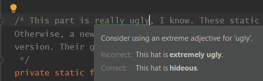

11201 craftsman 
- [ˈkrɑ:ftsmən]  [ˈkræftsmən] 
- n.["工匠","手艺人","名匠","技工"]   
- [人人词典](https://www.91dict.com/words?w=craftsman) [柯林斯](https://www.collinsdictionary.com/zh/dictionary/english/craftsman) [朗文](https://www.ldoceonline.com/dictionary/craftsman) 

11202 forgiving 
- [fəˈgɪvɪŋ]  [fərˈgɪvɪŋ] 
- adj.["宽大的，宽容的，仁慈的"]  adv.["宽大地，宽容地，仁慈地"]  v.["原谅( forgive的现在分词 )","饶恕","对不起","请原谅"]   
- [人人词典](https://www.91dict.com/words?w=forgiving) [柯林斯](https://www.collinsdictionary.com/zh/dictionary/english/forgiving) [朗文](https://www.ldoceonline.com/dictionary/forgiving) 

11203 methodological 
- [ˌmeθədə'lɒdʒɪkl]  [ˌmɛθədəˈlɑdʒɪkl:] 
- adj.["方法的，方法论的","教学法的"]   
- [人人词典](https://www.91dict.com/words?w=methodological) [柯林斯](https://www.collinsdictionary.com/zh/dictionary/english/methodological) [朗文](https://www.ldoceonline.com/dictionary/methodological) 

11204 delusion 
- [dɪˈlu:ʒn]  [dɪˈluʒən] 
- n.["欺骗","谬见","错觉","妄想"]   
- [人人词典](https://www.91dict.com/words?w=delusion) [柯林斯](https://www.collinsdictionary.com/zh/dictionary/english/delusion) [朗文](https://www.ldoceonline.com/dictionary/delusion) 

11205 hideous 
- [ˈhɪdiəs]  [ˈhɪdiəs] 
- adj.["令人惊骇的","极其丑陋的，可怕的","丑恶的，讨厌的","媸"]   
- [人人词典](https://www.91dict.com/words?w=hideous) [柯林斯](https://www.collinsdictionary.com/zh/dictionary/english/hideous) [朗文](https://www.ldoceonline.com/dictionary/hideous)
  

11206 aspiring 
- [əˈspaɪərɪŋ]  [] 
- adj.["有志气的","有抱负的","高耸的"]  v.["渴望","追求"]   
- [人人词典](https://www.91dict.com/words?w=aspiring) [柯林斯](https://www.collinsdictionary.com/zh/dictionary/english/aspiring) [朗文](https://www.ldoceonline.com/dictionary/aspiring) 

11207 mute 
- [mju:t]  [mjut] 
- adj.["缄默的","哑的","无声的","（字母）不发音的"]  n.["哑巴","（乐器上的）弱音器"]  vt.["减轻（声音）","使…柔和"]   
- [人人词典](https://www.91dict.com/words?w=mute) [柯林斯](https://www.collinsdictionary.com/zh/dictionary/english/mute) [朗文](https://www.ldoceonline.com/dictionary/mute) 

11208 physiology 
- [ˌfɪziˈɒlədʒi]  [ˌfɪziˈɑ:lədʒi] 
- n.["生理学","生理机能"]   
- [人人词典](https://www.91dict.com/words?w=physiology) [柯林斯](https://www.collinsdictionary.com/zh/dictionary/english/physiology) [朗文](https://www.ldoceonline.com/dictionary/physiology) 

11209 chuckle 
- [ˈtʃʌkl]  [ˈtʃʌkəl] 
- vi.["轻声地笑","咯咯笑"]  n.["轻笑声"]   
- [人人词典](https://www.91dict.com/words?w=chuckle) [柯林斯](https://www.collinsdictionary.com/zh/dictionary/english/chuckle) [朗文](https://www.ldoceonline.com/dictionary/chuckle) 

11210 ascribe 
- [əˈskraɪb]  [əˈskraɪb] 
- vt.["把…归于，认为…是由于","认为…具有"]   
- [人人词典](https://www.91dict.com/words?w=ascribe) [柯林斯](https://www.collinsdictionary.com/zh/dictionary/english/ascribe) [朗文](https://www.ldoceonline.com/dictionary/ascribe) 

11211 dampen 
- [ˈdæmpən]  [ˈdæmpən] 
- vt.["抑制","使潮湿","使…沮丧","隔音，防音"]  vi.["变得潮湿","丧气"]   
- [人人词典](https://www.91dict.com/words?w=dampen) [柯林斯](https://www.collinsdictionary.com/zh/dictionary/english/dampen) [朗文](https://www.ldoceonline.com/dictionary/dampen) 

11212 trafficker 
- ['træfɪkə(r)]  [ˈtræfikə] 
- n.["商人","贩子","从事违法勾当者"]   
- [人人词典](https://www.91dict.com/words?w=trafficker) [柯林斯](https://www.collinsdictionary.com/zh/dictionary/english/trafficker) [朗文](https://www.ldoceonline.com/dictionary/trafficker) 

11213 rouse 
- [raʊz]  [raʊz] 
- v.["叫醒，惊醒","鼓励，鼓舞","使发脾气","使振奋"]  n.["觉醒","奋起","[军]<英>起床号","干杯"]  vi.["醒来","奋起"]   
- [人人词典](https://www.91dict.com/words?w=rouse) [柯林斯](https://www.collinsdictionary.com/zh/dictionary/english/rouse) [朗文](https://www.ldoceonline.com/dictionary/rouse) 

11214 dormitory 
- [ˈdɔ:mətri]  [ˈdɔ:rmətɔ:ri] 
- n.["（学校等的）宿舍","集体寝室","（在市内工作的人的）郊外住宅区"]  adj.["住宅区的"]   
- [人人词典](https://www.91dict.com/words?w=dormitory) [柯林斯](https://www.collinsdictionary.com/zh/dictionary/english/dormitory) [朗文](https://www.ldoceonline.com/dictionary/dormitory) 

11215 hassle 
- [ˈhæsl]  [ˈhæsəl] 
- n.["困难的事情","麻烦的事情","争论"]  vt.["不断烦扰","与…争辩","使…烦恼"]  vi.["争论，争辩"]   
- [人人词典](https://www.91dict.com/words?w=hassle) [柯林斯](https://www.collinsdictionary.com/zh/dictionary/english/hassle) [朗文](https://www.ldoceonline.com/dictionary/hassle) 

11216 sincerity 
- [sɪn'serətɪ]  [sɪnˈsɛrɪti] 
- n.["真挚，诚心诚意，诚意","笃实","襟怀坦白","愫"]   
- [人人词典](https://www.91dict.com/words?w=sincerity) [柯林斯](https://www.collinsdictionary.com/zh/dictionary/english/sincerity) [朗文](https://www.ldoceonline.com/dictionary/sincerity) 

11217 quirky 
- ['kwɜ:kɪ]  ['kwɜ:kɪ] 
- adj.["诡诈的，离奇的"]   
- [人人词典](https://www.91dict.com/words?w=quirky) [柯林斯](https://www.collinsdictionary.com/zh/dictionary/english/quirky) [朗文](https://www.ldoceonline.com/dictionary/quirky) 

11218 plutonium 
- [plu:ˈtəʊniəm]  [plu:ˈtoʊniəm] 
- n.["[化]钚"]   
- [人人词典](https://www.91dict.com/words?w=plutonium) [柯林斯](https://www.collinsdictionary.com/zh/dictionary/english/plutonium) [朗文](https://www.ldoceonline.com/dictionary/plutonium) 

11219 stricken 
- [ˈstrɪkən]  [ˈstrɪkən] 
- adj.["被打击的","受挫的","患病的","受灾的"]  v.["打击(strike的过去分词)"]   
- [人人词典](https://www.91dict.com/words?w=stricken) [柯林斯](https://www.collinsdictionary.com/zh/dictionary/english/stricken) [朗文](https://www.ldoceonline.com/dictionary/stricken) 

11220 professionalism 
- [prəˈfeʃənəlɪzəm]  [prəˈfɛʃənəˌlɪzəm] 
- n.["职业水准或特性","职业化"]   
- [人人词典](https://www.91dict.com/words?w=professionalism) [柯林斯](https://www.collinsdictionary.com/zh/dictionary/english/professionalism) [朗文](https://www.ldoceonline.com/dictionary/professionalism) 

11221 eject 
- [iˈdʒekt]  [ɪ'dʒekt] 
- vt.["喷出","驱逐","强制离开"]  vi.["弹射出"]   
- [人人词典](https://www.91dict.com/words?w=eject) [柯林斯](https://www.collinsdictionary.com/zh/dictionary/english/eject) [朗文](https://www.ldoceonline.com/dictionary/eject) 

11222 unauthorized 
- [ʌnˈɔ:θəraɪzd]  [ʌnˈɔːθəraɪzd] 
- adj.["未经授权的","未经许可的","未经批准的"]   
- [人人词典](https://www.91dict.com/words?w=unauthorized) [柯林斯](https://www.collinsdictionary.com/zh/dictionary/english/unauthorized) [朗文](https://www.ldoceonline.com/dictionary/unauthorized) 

11223 flatly 
- [ˈflætli]  [ˈflætɪ] 
- adv.["断然地","干脆地","直截了当地","单调地"]   
- [人人词典](https://www.91dict.com/words?w=flatly) [柯林斯](https://www.collinsdictionary.com/zh/dictionary/english/flatly) [朗文](https://www.ldoceonline.com/dictionary/flatly) 

11224 marshal 
- [ˈmɑ:ʃl]  [ˈmɑ:rʃl] 
- n.["元帅","典礼官","执法官","消防局长"]  vt.["整理，排列，集结"]  vi.["排列","编队"]   
- [人人词典](https://www.91dict.com/words?w=marshal) [柯林斯](https://www.collinsdictionary.com/zh/dictionary/english/marshal) [朗文](https://www.ldoceonline.com/dictionary/marshal) 

11225 staffing 
- []  [] 
- n.["安置职工","人员配备"]  v.["staff为…配置（的现在分词）"]   
- [人人词典](https://www.91dict.com/words?w=staffing) [柯林斯](https://www.collinsdictionary.com/zh/dictionary/english/staffing) [朗文](https://www.ldoceonline.com/dictionary/staffing) 

11226 remarry 
- [ˌri:ˈmæri]  [ˌriːˈmæri] 
- vi.["再婚"]  vt.["使再婚"]   
- [人人词典](https://www.91dict.com/words?w=remarry) [柯林斯](https://www.collinsdictionary.com/zh/dictionary/english/remarry) [朗文](https://www.ldoceonline.com/dictionary/remarry) 

11227 stipulate 
- [ˈstɪpjuleɪt]  [ˈstɪpjəˌlet] 
- vt.["（尤指在协议或建议中）规定，约定，讲明（条件等）"]  vi.["规定，明确要求"]  adj.["有托叶的"]   
- [人人词典](https://www.91dict.com/words?w=stipulate) [柯林斯](https://www.collinsdictionary.com/zh/dictionary/english/stipulate) [朗文](https://www.ldoceonline.com/dictionary/stipulate) 

11228 oatmeal 
- [ˈəʊtmi:l]  [ˈoʊtmi:l] 
- n.["燕麦片"]   
- [人人词典](https://www.91dict.com/words?w=oatmeal) [柯林斯](https://www.collinsdictionary.com/zh/dictionary/english/oatmeal) [朗文](https://www.ldoceonline.com/dictionary/oatmeal) 

11229 shred 
- [ʃred]  [ʃrɛd] 
- n.["碎片","破布","少量"]  vt.& vi.["撕碎，切碎","用撕毁机撕毁（文件）"]   
- [人人词典](https://www.91dict.com/words?w=shred) [柯林斯](https://www.collinsdictionary.com/zh/dictionary/english/shred) [朗文](https://www.ldoceonline.com/dictionary/shred) 

11230 watermelon 
- [ˈwɔ:təmelən]  [ˈwɔ:tərmelən] 
- n.["西瓜"]   
- [人人词典](https://www.91dict.com/words?w=watermelon) [柯林斯](https://www.collinsdictionary.com/zh/dictionary/english/watermelon) [朗文](https://www.ldoceonline.com/dictionary/watermelon) 

11231 adultery 
- [əˈdʌltəri]  [əˈdʌltəri,-tri] 
- n.["通奸，私通","通奸行为"]   
- [人人词典](https://www.91dict.com/words?w=adultery) [柯林斯](https://www.collinsdictionary.com/zh/dictionary/english/adultery) [朗文](https://www.ldoceonline.com/dictionary/adultery) 

11232 first-class 
- [ˈfɜ:stˈklæs]  [ˈfɚstˈklæs] 
- adj.["最好的","第一流的","优秀的"]  adv.["最好地","第一流地","优秀地"]   
- [人人词典](https://www.91dict.com/words?w=first-class) [柯林斯](https://www.collinsdictionary.com/zh/dictionary/english/first-class) [朗文](https://www.ldoceonline.com/dictionary/first-class) 

11233 undesirable 
- [ˌʌndɪˈzaɪərəbl]  [ˌʌndɪˈzaɪrəbəl] 
- adj.["不受欢迎的，讨厌的","不合需要的","不方便的","不良的"]  n.["不受欢迎的人","不良分子"]   
- [人人词典](https://www.91dict.com/words?w=undesirable) [柯林斯](https://www.collinsdictionary.com/zh/dictionary/english/undesirable) [朗文](https://www.ldoceonline.com/dictionary/undesirable) 

11234 ATM 
- [ˌeɪ ti: ˈem]  [ˌeɪti:'em] 
- abbr.["Automatic Teller Machine 自动取款（出纳）机","Asynchronous Transfer Mode 异步传输模式"]   
- [人人词典](https://www.91dict.com/words?w=ATM) [柯林斯](https://www.collinsdictionary.com/zh/dictionary/english/ATM) [朗文](https://www.ldoceonline.com/dictionary/ATM) 

11235 angle 
- [ˈæŋgl]  [ˈæŋɡəl] 
- n.["角","[比喻]（考虑、问题的）角度","观点","轮廓鲜明的突出体"]  vt.["使形成（或弯成）角度","把…放置成一角度","调整（或对准）…的角度","使（新闻、报道等）带有倾向性"]  vi.["垂钓","斜移","弯曲成一角度","从（某角度）报道"]   
- [人人词典](https://www.91dict.com/words?w=angle) [柯林斯](https://www.collinsdictionary.com/zh/dictionary/english/angle) [朗文](https://www.ldoceonline.com/dictionary/angle) 

11236 escalating 
- []  [] 
- v.["（使）逐步升级( escalate的现在分词 )","（使）逐步扩大","（使）更高","（使）更大"]   
- [人人词典](https://www.91dict.com/words?w=escalating) [柯林斯](https://www.collinsdictionary.com/zh/dictionary/english/escalating) [朗文](https://www.ldoceonline.com/dictionary/escalating) 

11237 treacherous 
- [ˈtretʃərəs]  [ˈtrɛtʃərəs] 
- adj.["骗人的","不忠的","奸诈的","不可信的"]  adv.["背信弃义地"]  n.["背信弃义，背叛"]   
- [人人词典](https://www.91dict.com/words?w=treacherous) [柯林斯](https://www.collinsdictionary.com/zh/dictionary/english/treacherous) [朗文](https://www.ldoceonline.com/dictionary/treacherous) 

11238 foreman 
- [ˈfɔ:mən]  [ˈfɔ:rmən] 
- n.["工头，领班","首席陪审员"]   
- [人人词典](https://www.91dict.com/words?w=foreman) [柯林斯](https://www.collinsdictionary.com/zh/dictionary/english/foreman) [朗文](https://www.ldoceonline.com/dictionary/foreman) 

11239 memorandum 
- [ˌmeməˈrændəm]  [ˌmɛməˈrændəm] 
- n.["[外]照会，备忘录","[商]便笺，函","记录","[法]（契约等条文的）节略"]   
- [人人词典](https://www.91dict.com/words?w=memorandum) [柯林斯](https://www.collinsdictionary.com/zh/dictionary/english/memorandum) [朗文](https://www.ldoceonline.com/dictionary/memorandum) 

11240 fragmentation 
- [ˌfræɡmen'teɪʃn]  [ˌfræɡmənˈteʃən, -mɛn-] 
- n.["分裂，破碎"]   
- [人人词典](https://www.91dict.com/words?w=fragmentation) [柯林斯](https://www.collinsdictionary.com/zh/dictionary/english/fragmentation) [朗文](https://www.ldoceonline.com/dictionary/fragmentation) 

11241 changed 
- [tʃeɪndʒd]  [tʃendʒd] 
- ["[医]变化的，改变的"]   
- [人人词典](https://www.91dict.com/words?w=changed) [柯林斯](https://www.collinsdictionary.com/zh/dictionary/english/changed) [朗文](https://www.ldoceonline.com/dictionary/changed) 

11242 moderation 
- [ˌmɒdəˈreɪʃn]  [ˌmɑ:dəˈreɪʃn] 
- n.["适度","自我节制","稳定，镇定","（牛津大学）B.A学位的第一次考试"]   
- [人人词典](https://www.91dict.com/words?w=moderation) [柯林斯](https://www.collinsdictionary.com/zh/dictionary/english/moderation) [朗文](https://www.ldoceonline.com/dictionary/moderation) 

11243 outstretched 
- [ˌaʊtˈstretʃt]  [] 
- adj.["伸展的","扩张的"]  v.["伸出","扩展(outstretch的过去分词)"]   
- [人人词典](https://www.91dict.com/words?w=outstretched) [柯林斯](https://www.collinsdictionary.com/zh/dictionary/english/outstretched) [朗文](https://www.ldoceonline.com/dictionary/outstretched) 

11244 rearview 
- ['rɪəvju:]  ['rɪrvju:] 
- ["背面"]   
- [人人词典](https://www.91dict.com/words?w=rearview) [柯林斯](https://www.collinsdictionary.com/zh/dictionary/english/rearview) [朗文](https://www.ldoceonline.com/dictionary/rearview) 

11245 mulch 
- [mʌltʃ]  [mʌltʃ] 
- n.["护根（用以保持水分、消灭杂草等的覆盖物，如稻草、腐叶或塑料膜）"]  vt.["用护根覆盖（植物根部或其周围地面）"]   
- [人人词典](https://www.91dict.com/words?w=mulch) [柯林斯](https://www.collinsdictionary.com/zh/dictionary/english/mulch) [朗文](https://www.ldoceonline.com/dictionary/mulch) 

11246 mythical 
- [ˈmɪθɪkl]  [ˈmɪθɪkəl] 
- adj.["神话的","虚构的"]   
- [人人词典](https://www.91dict.com/words?w=mythical) [柯林斯](https://www.collinsdictionary.com/zh/dictionary/english/mythical) [朗文](https://www.ldoceonline.com/dictionary/mythical) 

11247 mover 
- [ˈmu:və(r)]  [ˈmuvɚ] 
- n.["原动力","搬家工人","鼓动者","搬运公司"]   
- [人人词典](https://www.91dict.com/words?w=mover) [柯林斯](https://www.collinsdictionary.com/zh/dictionary/english/mover) [朗文](https://www.ldoceonline.com/dictionary/mover) 

11248 far-reaching 
- [fɑ: 'ri:tʃɪŋ]  [ˈfɑrˈritʃɪŋ] 
- adj.["深远的，广泛的，深至远处的"]   
- [人人词典](https://www.91dict.com/words?w=far-reaching) [柯林斯](https://www.collinsdictionary.com/zh/dictionary/english/far-reaching) [朗文](https://www.ldoceonline.com/dictionary/far-reaching) 

11249 fitting 
- [ˈfɪtɪŋ]  [ˈfɪtɪŋ] 
- n.["试穿，试衣","设备，器材","装置","装修"]  adj.["适合的，适宜的","适当的","相称的"]  v.["使适合（fit的现在分词）","使合身","与…相符","安装"]   
- [人人词典](https://www.91dict.com/words?w=fitting) [柯林斯](https://www.collinsdictionary.com/zh/dictionary/english/fitting) [朗文](https://www.ldoceonline.com/dictionary/fitting) 

11250 embodiment 
- [ɪmˈbɒdimənt]  [ɪmˈbɑ:dimənt] 
- n.["体现","化身","具体化"]   
- [人人词典](https://www.91dict.com/words?w=embodiment) [柯林斯](https://www.collinsdictionary.com/zh/dictionary/english/embodiment) [朗文](https://www.ldoceonline.com/dictionary/embodiment) 

11251 leukemia 
- [lu:'ki:mɪə]  [lu:'ki:mɪr] 
- n.["<医>白血病（俗称血癌）"]   
- [人人词典](https://www.91dict.com/words?w=leukemia) [柯林斯](https://www.collinsdictionary.com/zh/dictionary/english/leukemia) [朗文](https://www.ldoceonline.com/dictionary/leukemia) 

11252 dwindling 
- []  [] 
- adj.["逐渐减少的"]  v.["逐渐变少或变小( dwindle的现在分词 )"]   
- [人人词典](https://www.91dict.com/words?w=dwindling) [柯林斯](https://www.collinsdictionary.com/zh/dictionary/english/dwindling) [朗文](https://www.ldoceonline.com/dictionary/dwindling) 

11253 intrusive 
- [ɪnˈtru:sɪv]  [ɪnˈtrusɪv, -zɪv] 
- adj.["闯入的，打扰的","侵入的"]   
- [人人词典](https://www.91dict.com/words?w=intrusive) [柯林斯](https://www.collinsdictionary.com/zh/dictionary/english/intrusive) [朗文](https://www.ldoceonline.com/dictionary/intrusive) 

11254 confidently 
- ['kɒnfədəntlɪ]  [ˈkɑnfədəntlɪ] 
- adv.["确信地，肯定地","自信地"]   
- [人人词典](https://www.91dict.com/words?w=confidently) [柯林斯](https://www.collinsdictionary.com/zh/dictionary/english/confidently) [朗文](https://www.ldoceonline.com/dictionary/confidently) 

11255 infinitely 
- [ˈɪnfɪnətli]  [ˈɪnfənɪtlɪ] 
- adv.["无限地，无穷地","极其"]   
- [人人词典](https://www.91dict.com/words?w=infinitely) [柯林斯](https://www.collinsdictionary.com/zh/dictionary/english/infinitely) [朗文](https://www.ldoceonline.com/dictionary/infinitely) 

11256 powerhouse 
- [ˈpaʊəhaʊs]  [ˈpaʊərhaʊs] 
- n.["强大的集团[组织]","精力充沛的人，身强力壮的人","动力室"]   
- [人人词典](https://www.91dict.com/words?w=powerhouse) [柯林斯](https://www.collinsdictionary.com/zh/dictionary/english/powerhouse) [朗文](https://www.ldoceonline.com/dictionary/powerhouse) 

11257 front-runner 
- ['frʌnt'rʌnɚ]  ['frʌnt'rʌnɚ] 
- n.["赛跑中跑在前头的人","竞争中的领先者"]   
- [人人词典](https://www.91dict.com/words?w=front-runner) [柯林斯](https://www.collinsdictionary.com/zh/dictionary/english/front-runner) [朗文](https://www.ldoceonline.com/dictionary/front-runner) 

11258 syndicated 
- ['sɪndɪkeɪtɪd]  ['sɪndɪkeɪtɪd] 
- adj.["成为企业组合的"]  v.["（使）联合组成辛迪加( syndicate的过去式和过去分词 )","（通过报业联合组织）出售（稿件）"]   
- [人人词典](https://www.91dict.com/words?w=syndicated) [柯林斯](https://www.collinsdictionary.com/zh/dictionary/english/syndicated) [朗文](https://www.ldoceonline.com/dictionary/syndicated) 

11259 overdue 
- [ˌəʊvəˈdju:]  [ˌoʊvərˈdu:] 
- adj.["过期的","延误的，迟到的","未兑的","早应完成的"]   
- [人人词典](https://www.91dict.com/words?w=overdue) [柯林斯](https://www.collinsdictionary.com/zh/dictionary/english/overdue) [朗文](https://www.ldoceonline.com/dictionary/overdue) 

11260 metabolic 
- [ˌmetə'bɒlɪk]  [ˌmetə'bɒlɪk] 
- adj.["新陈代谢的","变化的"]   
- [人人词典](https://www.91dict.com/words?w=metabolic) [柯林斯](https://www.collinsdictionary.com/zh/dictionary/english/metabolic) [朗文](https://www.ldoceonline.com/dictionary/metabolic) 

11261 upstairs 
- [ˌʌpˈsteəz]  [ˌʌpˈsterz] 
- adv.["在楼上，往楼上","在高空"]  adj.["楼上的"]  n.["楼上"]   
- [人人词典](https://www.91dict.com/words?w=upstairs) [柯林斯](https://www.collinsdictionary.com/zh/dictionary/english/upstairs) [朗文](https://www.ldoceonline.com/dictionary/upstairs) 

11262 drip 
- [drɪp]  [drɪp] 
- vt.& vi.["（使）滴下"]  vi.["滴出","含有","充满","充溢"]  n.["滴答，滴答滴答的声音","水滴","[医]点滴","点滴（的信息等）"]   
- [人人词典](https://www.91dict.com/words?w=drip) [柯林斯](https://www.collinsdictionary.com/zh/dictionary/english/drip) [朗文](https://www.ldoceonline.com/dictionary/drip) 

11263 flick 
- [flɪk]  [flɪk] 
- v.["轻弹，轻击","轻拂","忽然摇动"]  n.["轻弹，轻拂","快速的轻打","轻弹声","电影"]   
- [人人词典](https://www.91dict.com/words?w=flick) [柯林斯](https://www.collinsdictionary.com/zh/dictionary/english/flick) [朗文](https://www.ldoceonline.com/dictionary/flick) 

11264 shabby 
- [ˈʃæbi]  [ˈʃæbi] 
- adj.["破旧的，衣衫褴褛的","卑鄙的","悭吝的","低劣的，下流的"]   
- [人人词典](https://www.91dict.com/words?w=shabby) [柯林斯](https://www.collinsdictionary.com/zh/dictionary/english/shabby) [朗文](https://www.ldoceonline.com/dictionary/shabby) 

11265 determining 
- [dɪ'tɜ:mɪnɪŋ]  [dɪ'tɜ:mɪnɪŋ] 
- v.["（使）下决心， （使）做出决定( determine的现在分词 )","决定","确定","使决定"]   
- [人人词典](https://www.91dict.com/words?w=determining) [柯林斯](https://www.collinsdictionary.com/zh/dictionary/english/determining) [朗文](https://www.ldoceonline.com/dictionary/determining) 

11266 overhaul 
- [ˈəʊvəhɔ:l]  [ˈoʊvərhɔ:l] 
- vt.["彻底检查","翻修，检修","赶上（他船）","解松（船的）绳索"]  n.["检查","彻底检修","详细检查","大修"]   
- [人人词典](https://www.91dict.com/words?w=overhaul) [柯林斯](https://www.collinsdictionary.com/zh/dictionary/english/overhaul) [朗文](https://www.ldoceonline.com/dictionary/overhaul) 

11267 warmly 
- [wɔ:mlɪ]  [ˈwɔrmlɪ] 
- adv.["温暖地","亲切地","热烈地","热心地"]   
- [人人词典](https://www.91dict.com/words?w=warmly) [柯林斯](https://www.collinsdictionary.com/zh/dictionary/english/warmly) [朗文](https://www.ldoceonline.com/dictionary/warmly) 

11268 unnamed 
- [ˌʌnˈneɪmd]  [ˌʌnˈneɪmd] 
- adj.["未命名的","没有明确指定的"]   
- [人人词典](https://www.91dict.com/words?w=unnamed) [柯林斯](https://www.collinsdictionary.com/zh/dictionary/english/unnamed) [朗文](https://www.ldoceonline.com/dictionary/unnamed) 

11269 trough 
- [trɒf]  [trɔ:f] 
- n.["水槽，食槽","低谷期","[航]深海漕","[气]低气压槽"]   
- [人人词典](https://www.91dict.com/words?w=trough) [柯林斯](https://www.collinsdictionary.com/zh/dictionary/english/trough) [朗文](https://www.ldoceonline.com/dictionary/trough) 

11270 vent 
- [vent]  [vɛnt] 
- n.["通风孔","排气孔","（感情等的）发泄，吐露","（鸟，虫，鱼的）肛门"]  vt.& vi.["表达，发泄（感情，尤指愤怒）","给…开孔","放出","（通过排泄等）减轻压力"]   
- [人人词典](https://www.91dict.com/words?w=vent) [柯林斯](https://www.collinsdictionary.com/zh/dictionary/english/vent) [朗文](https://www.ldoceonline.com/dictionary/vent) 

11271 gladly 
- [ˈglædli]  [ˈɡlædlɪ] 
- adv.["高兴地，乐意地，欣然"]   
- [人人词典](https://www.91dict.com/words?w=gladly) [柯林斯](https://www.collinsdictionary.com/zh/dictionary/english/gladly) [朗文](https://www.ldoceonline.com/dictionary/gladly) 

11272 up 
- [ʌp]  [ʌp] 
- adv.["在上面，在高处","起床，起来","向上","由低到高"]  adj.["向上的","上升的","竖立的，垂直的","举起的"]  vt.& vi.["增加","加速","提高","举起，拿起"]  prep.["在…的上端","向高处","沿…而去","向…上游"]  n.["上升，升高","兴旺，繁荣","上坡","（价格等）上涨"]   
- [人人词典](https://www.91dict.com/words?w=up) [柯林斯](https://www.collinsdictionary.com/zh/dictionary/english/up) [朗文](https://www.ldoceonline.com/dictionary/up) 

11273 prolific 
- [prəˈlɪfɪk]  [prəˈlɪfɪk] 
- adj.["（艺术家、作家等）多产的","众多的","富饶的","（植物、动物等）丰硕的"]   
- [人人词典](https://www.91dict.com/words?w=prolific) [柯林斯](https://www.collinsdictionary.com/zh/dictionary/english/prolific) [朗文](https://www.ldoceonline.com/dictionary/prolific) 

11274 generalized 
- [ˈdʒenrəlaɪzd]  [ˈdʒɛnərəˌlaɪzd] 
- adj.["广泛的","普遍的","非具体的","整体的"]  v.["概括，归纳","推论(generalize的过去式和过去分词)","推广，普及"]   
- [人人词典](https://www.91dict.com/words?w=generalized) [柯林斯](https://www.collinsdictionary.com/zh/dictionary/english/generalized) [朗文](https://www.ldoceonline.com/dictionary/generalized) 

11275 upwards 
- [ˈʌpwədz]  [ˈʌpwərdz] 
- adv.["向上地，上升地","在上面，向上头"]   
- [人人词典](https://www.91dict.com/words?w=upwards) [柯林斯](https://www.collinsdictionary.com/zh/dictionary/english/upwards) [朗文](https://www.ldoceonline.com/dictionary/upwards) 

11276 partner 
- [ˈpɑ:tnə(r)]  [ˈpɑ:rtnə(r)] 
- n.["伙伴","同伙","同伴","配偶"]  vt.["使合作","与…合伙"]  vi.["合伙","合股","成为搭档"]   
- [人人词典](https://www.91dict.com/words?w=partner) [柯林斯](https://www.collinsdictionary.com/zh/dictionary/english/partner) [朗文](https://www.ldoceonline.com/dictionary/partner) 

11277 marginalize 
- [ˈmɑ:dʒɪnəlaɪz]  [ˈmɑ:rdʒɪnəlaɪz] 
- vt.["使处于社会边缘","使脱离社会发展进程","忽视","排斥"]   
- [人人词典](https://www.91dict.com/words?w=marginalize) [柯林斯](https://www.collinsdictionary.com/zh/dictionary/english/marginalize) [朗文](https://www.ldoceonline.com/dictionary/marginalize) 

11278 busy 
- [ˈbɪzi]  [ˈbɪzi] 
- adj.["忙碌的","占线","繁华的","爱管闲事的"]  vt.["忙着做某事","使奔走","使经营"]  n.["〈英俚〉侦探","包打听"]   
- [人人词典](https://www.91dict.com/words?w=busy) [柯林斯](https://www.collinsdictionary.com/zh/dictionary/english/busy) [朗文](https://www.ldoceonline.com/dictionary/busy) 

11279 telling 
- [ˈtelɪŋ]  [ˈtɛlɪŋ] 
- adj.["有效的","显著的","生动的","说明问题的"]  v.["讲述( tell的现在分词)","告诉"]   
- [人人词典](https://www.91dict.com/words?w=telling) [柯林斯](https://www.collinsdictionary.com/zh/dictionary/english/telling) [朗文](https://www.ldoceonline.com/dictionary/telling) 

11280 tilt 
- [tɪlt]  [tɪlt] 
- vt.["使倾斜","（在马上）拿枪扎","抨击，攻击"]  vi.["倾斜","〈美〉有倾向性，偏袒","抨击"]  n.["倾斜，歪斜","斜坡，坡度","马上刺枪比赛","跳动锤，落锤"]   
- [人人词典](https://www.91dict.com/words?w=tilt) [柯林斯](https://www.collinsdictionary.com/zh/dictionary/english/tilt) [朗文](https://www.ldoceonline.com/dictionary/tilt) 

11281 tenderness 
- ['tendənɪs]  [ˈtɛndɚnɪs] 
- n.["柔软","温和","亲切","心软难处理"]   
- [人人词典](https://www.91dict.com/words?w=tenderness) [柯林斯](https://www.collinsdictionary.com/zh/dictionary/english/tenderness) [朗文](https://www.ldoceonline.com/dictionary/tenderness) 

11282 cognition 
- [kɒgˈnɪʃn]  [kɑ:gˈnɪʃn] 
- n.["认识，认知"]   
- [人人词典](https://www.91dict.com/words?w=cognition) [柯林斯](https://www.collinsdictionary.com/zh/dictionary/english/cognition) [朗文](https://www.ldoceonline.com/dictionary/cognition) 

11283 beige 
- [beɪʒ]  [beʒ] 
- n.["米黄色","淡棕色","原色哔叽呢"]  adj.["米色的，淡棕色的"]   
- [人人词典](https://www.91dict.com/words?w=beige) [柯林斯](https://www.collinsdictionary.com/zh/dictionary/english/beige) [朗文](https://www.ldoceonline.com/dictionary/beige) 

11284 Nigerian 
- [naɪ'dʒɪərɪən]  [naɪ'dʒɪrɪrn] 
- n.["尼日利亚人"]   
- [人人词典](https://www.91dict.com/words?w=Nigerian) [柯林斯](https://www.collinsdictionary.com/zh/dictionary/english/Nigerian) [朗文](https://www.ldoceonline.com/dictionary/Nigerian) 

11285 sidebar 
- [ˈsaɪdbɑ:(r)]  ['saɪdbɑ:r] 
- ["工具栏","补充报道 ","（马鞍等的）横挡","花絮"]   
- [人人词典](https://www.91dict.com/words?w=sidebar) [柯林斯](https://www.collinsdictionary.com/zh/dictionary/english/sidebar) [朗文](https://www.ldoceonline.com/dictionary/sidebar) 

11286 conducive 
- [kənˈdju:sɪv]  [kənˈdu:sɪv] 
- adj.["有助于…的"]   
- [人人词典](https://www.91dict.com/words?w=conducive) [柯林斯](https://www.collinsdictionary.com/zh/dictionary/english/conducive) [朗文](https://www.ldoceonline.com/dictionary/conducive) 

11287 defective 
- [dɪˈfektɪv]  [dɪˈfɛktɪv] 
- adj.["有错误的","有缺陷的，有瑕疵的","[语]变化不全的","智力低于正常的"]  n.["身心有缺陷的人","变化不全的词"]   
- [人人词典](https://www.91dict.com/words?w=defective) [柯林斯](https://www.collinsdictionary.com/zh/dictionary/english/defective) [朗文](https://www.ldoceonline.com/dictionary/defective) 

11288 mammoth 
- [ˈmæməθ]  [ˈmæməθ] 
- n.["[动]猛玛（象）","庞然大物"]  adj.["庞大的，巨大的"]   
- [人人词典](https://www.91dict.com/words?w=mammoth) [柯林斯](https://www.collinsdictionary.com/zh/dictionary/english/mammoth) [朗文](https://www.ldoceonline.com/dictionary/mammoth) 

11289 predatory 
- [ˈpredətri]  [ˈpredətɔ:ri] 
- adj.["掠夺成性的","食肉的","捕食生物的"]   
- [人人词典](https://www.91dict.com/words?w=predatory) [柯林斯](https://www.collinsdictionary.com/zh/dictionary/english/predatory) [朗文](https://www.ldoceonline.com/dictionary/predatory) 

11290 treasurer 
- [ˈtreʒərə(r)]  [ˈtrɛʒəɚ] 
- n.["财务主管","司库","出纳员"]   
- [人人词典](https://www.91dict.com/words?w=treasurer) [柯林斯](https://www.collinsdictionary.com/zh/dictionary/english/treasurer) [朗文](https://www.ldoceonline.com/dictionary/treasurer) 

11291 disable 
- [dɪsˈeɪbl]  [dɪsˈebəl] 
- vt.["使无能力","使残废，使伤残","使无资格","使不中用"]   
- [人人词典](https://www.91dict.com/words?w=disable) [柯林斯](https://www.collinsdictionary.com/zh/dictionary/english/disable) [朗文](https://www.ldoceonline.com/dictionary/disable) 

11292 reference 
- [ˈrefrəns]  [ˈrɛfərəns, ˈrɛfrəns] 
- n.["参考","参考书","提及，涉及","证明人，介绍人"]  v.["引用","参照"]   
- [人人词典](https://www.91dict.com/words?w=reference) [柯林斯](https://www.collinsdictionary.com/zh/dictionary/english/reference) [朗文](https://www.ldoceonline.com/dictionary/reference) 

11293 censor 
- [ˈsensə(r)]  ['sensər] 
- n.["监察官，检查员","（牛津大学等的）学监","[心理]潜意识压抑力","[心]抑制性潜意识"]  vt.["审查，检查","审查（书刊等）","检查（信件等）","删改"]   
- [人人词典](https://www.91dict.com/words?w=censor) [柯林斯](https://www.collinsdictionary.com/zh/dictionary/english/censor) [朗文](https://www.ldoceonline.com/dictionary/censor) 

11294 ludicrous 
- [ˈlu:dɪkrəs]  [ˈludɪkrəs] 
- adj.["可笑的","荒唐的"]   
- [人人词典](https://www.91dict.com/words?w=ludicrous) [柯林斯](https://www.collinsdictionary.com/zh/dictionary/english/ludicrous) [朗文](https://www.ldoceonline.com/dictionary/ludicrous) 

11295 articulation 
- [ɑ:ˌtɪkjuˈleɪʃn]  [ɑ:rˌtɪkjuˈleɪʃn] 
- n.["清晰度，咬合，关节","发音","接合"]   
- [人人词典](https://www.91dict.com/words?w=articulation) [柯林斯](https://www.collinsdictionary.com/zh/dictionary/english/articulation) [朗文](https://www.ldoceonline.com/dictionary/articulation) 

11296 chiefly 
- [ˈtʃi:fli]  [ˈtʃifliː] 
- adv.["首先，第一","主要","尤其"]  adj.["领袖（般）的"]   
- [人人词典](https://www.91dict.com/words?w=chiefly) [柯林斯](https://www.collinsdictionary.com/zh/dictionary/english/chiefly) [朗文](https://www.ldoceonline.com/dictionary/chiefly) 

11297 optimum 
- [ˈɒptɪməm]  [ˈɑ:ptɪməm] 
- adj.["最适宜的"]  n.["最佳效果","最适宜条件","[生物学] 最适度"]   
- [人人词典](https://www.91dict.com/words?w=optimum) [柯林斯](https://www.collinsdictionary.com/zh/dictionary/english/optimum) [朗文](https://www.ldoceonline.com/dictionary/optimum) 

11298 treasury 
- [ˈtreʒəri]  [ˈtrɛʒəri] 
- n.["国库，金库","（政府的）财政部","宝库，宝藏","贮藏所，库房"]   
- [人人词典](https://www.91dict.com/words?w=treasury) [柯林斯](https://www.collinsdictionary.com/zh/dictionary/english/treasury) [朗文](https://www.ldoceonline.com/dictionary/treasury) 

11299 trappings 
- [ˈtræpɪŋz]  [ˈtræpɪŋz] 
- n.["马饰","装饰","外部标志","（标志官职的）服饰"]   
- [人人词典](https://www.91dict.com/words?w=trappings) [柯林斯](https://www.collinsdictionary.com/zh/dictionary/english/trappings) [朗文](https://www.ldoceonline.com/dictionary/trappings) 

11300 dagger 
- [ˈdægə(r)]  [ˈdæɡɚ] 
- n.["匕首","短剑"]  vt.["用剑刺"]   
- [人人词典](https://www.91dict.com/words?w=dagger) [柯林斯](https://www.collinsdictionary.com/zh/dictionary/english/dagger) [朗文](https://www.ldoceonline.com/dictionary/dagger) 

11301 want 
- [wɒnt]  [wɑ:nt] 
- v.["想要","希望","打算","需要…在场"]  n.["需要的东西","缺少","贫穷"]   
- [人人词典](https://www.91dict.com/words?w=want) [柯林斯](https://www.collinsdictionary.com/zh/dictionary/english/want) [朗文](https://www.ldoceonline.com/dictionary/want) 

11302 frequent 
- [ˈfri:kwənt]  [ˈfrikwənt] 
- adj.["频繁的，时常发生的，常见的","（脉搏等）急促的，快的"]   
- [人人词典](https://www.91dict.com/words?w=frequent) [柯林斯](https://www.collinsdictionary.com/zh/dictionary/english/frequent) [朗文](https://www.ldoceonline.com/dictionary/frequent) 

11303 thicket 
- [ˈθɪkɪt]  [ˈθɪkɪt] 
- n.["灌木丛","丛状物","错综复杂"]   
- [人人词典](https://www.91dict.com/words?w=thicket) [柯林斯](https://www.collinsdictionary.com/zh/dictionary/english/thicket) [朗文](https://www.ldoceonline.com/dictionary/thicket) 

11304 conceptualize 
- [kənˈseptʃuəlaɪz]  [kənˈsɛptʃuəˌlaɪz] 
- vt.["使有概念"]  vi.["概念化"]   
- [人人词典](https://www.91dict.com/words?w=conceptualize) [柯林斯](https://www.collinsdictionary.com/zh/dictionary/english/conceptualize) [朗文](https://www.ldoceonline.com/dictionary/conceptualize) 

11305 revolver 
- [rɪˈvɒlvə(r)]  [rɪˈvɑ:lvə(r)] 
- n.["左轮手枪","旋转者，旋转式装置","[冶]转炉"]   
- [人人词典](https://www.91dict.com/words?w=revolver) [柯林斯](https://www.collinsdictionary.com/zh/dictionary/english/revolver) [朗文](https://www.ldoceonline.com/dictionary/revolver) 

11306 sweatshirt 
- [ˈswetʃɜ:t]  [ˈswetʃɜ:rt] 
- n.["运动衫"]   
- [人人词典](https://www.91dict.com/words?w=sweatshirt) [柯林斯](https://www.collinsdictionary.com/zh/dictionary/english/sweatshirt) [朗文](https://www.ldoceonline.com/dictionary/sweatshirt) 

11307 determinant 
- [dɪˈtɜ:mɪnənt]  [dɪˈtɜ:rmɪnənt] 
- n.["决定物","决定因素","行列式","免疫因子"]  adj.["决定因素的","限定性的"]   
- [人人词典](https://www.91dict.com/words?w=determinant) [柯林斯](https://www.collinsdictionary.com/zh/dictionary/english/determinant) [朗文](https://www.ldoceonline.com/dictionary/determinant) 

11308 sanity 
- [ˈsænəti]  [ˈsænɪti] 
- n.["神志正常","心智健康","头脑清楚","通情达理"]   
- [人人词典](https://www.91dict.com/words?w=sanity) [柯林斯](https://www.collinsdictionary.com/zh/dictionary/english/sanity) [朗文](https://www.ldoceonline.com/dictionary/sanity) 

11309 idealism 
- [aɪˈdi:əlɪzəm]  [aɪˈdiəˌlɪzəm] 
- n.["理想主义","理想化","唯心主义"]   
- [人人词典](https://www.91dict.com/words?w=idealism) [柯林斯](https://www.collinsdictionary.com/zh/dictionary/english/idealism) [朗文](https://www.ldoceonline.com/dictionary/idealism) 

11310 construe 
- [kənˈstru:]  [kən'stru:] 
- vt.["分析","解释","口译"]   
- [人人词典](https://www.91dict.com/words?w=construe) [柯林斯](https://www.collinsdictionary.com/zh/dictionary/english/construe) [朗文](https://www.ldoceonline.com/dictionary/construe) 

11311 pink 
- [pɪŋk]  [pɪŋk] 
- adj.["粉红色的","淡红色的","略带左翼政治观点的","与同性恋者有关的"]  n.["粉红色","典范","香石竹","顶点，极度"]  vt.["刺、扎","打出小孔图案","戳"]   
- [人人词典](https://www.91dict.com/words?w=pink) [柯林斯](https://www.collinsdictionary.com/zh/dictionary/english/pink) [朗文](https://www.ldoceonline.com/dictionary/pink) 

11312 suggested 
- [sə'dʒestɪd]  [sə'dʒestɪd] 
- adj.["暗示的"]  v.["建议( suggest的过去式和过去分词 )","暗示","使想起","启示"]   
- [人人词典](https://www.91dict.com/words?w=suggested) [柯林斯](https://www.collinsdictionary.com/zh/dictionary/english/suggested) [朗文](https://www.ldoceonline.com/dictionary/suggested) 

11313 burglar 
- [ˈbɜ:glə(r)]  [ˈbɜ:rglə(r)] 
- n.["窃贼","破门盗窃者","夜盗"]   
- [人人词典](https://www.91dict.com/words?w=burglar) [柯林斯](https://www.collinsdictionary.com/zh/dictionary/english/burglar) [朗文](https://www.ldoceonline.com/dictionary/burglar) 

11314 intimate 
- [ˈɪntɪmət]  [ˈɪntəmɪt] 
- adj.["亲密的，亲近的","私人的，个人的","内部的","直接的"]  n.["至交","密友"]  v.["暗示，提示","宣布，通知"]   
- [人人词典](https://www.91dict.com/words?w=intimate) [柯林斯](https://www.collinsdictionary.com/zh/dictionary/english/intimate) [朗文](https://www.ldoceonline.com/dictionary/intimate) 

11315 scoff 
- [skɒf]  [skɔ:f] 
- n.["（特指对宗教的）嘲笑","嘲弄，愚弄","笑柄","食品"]  vi.["嘲笑，嘲弄","掠夺，攫取","狼吞虎咽"]   
- [人人词典](https://www.91dict.com/words?w=scoff) [柯林斯](https://www.collinsdictionary.com/zh/dictionary/english/scoff) [朗文](https://www.ldoceonline.com/dictionary/scoff) 

11316 throng 
- [θrɒŋ]  [θrɔ:ŋ] 
- n.["人群，大群人","众多"]  vt.& vi.["群集","蜂拥而至","挤满"]   
- [人人词典](https://www.91dict.com/words?w=throng) [柯林斯](https://www.collinsdictionary.com/zh/dictionary/english/throng) [朗文](https://www.ldoceonline.com/dictionary/throng) 

11317 prep 
- [prep]  [prɛp] 
- vi.["进入预备学校","预备，准备"]  vt.["使预备好"]  n.["预备学校","准备","预备功课，家庭作业","大学预科生"]  adj.["预备的"]   
- [人人词典](https://www.91dict.com/words?w=prep) [柯林斯](https://www.collinsdictionary.com/zh/dictionary/english/prep) [朗文](https://www.ldoceonline.com/dictionary/prep) 

11318 weight 
- [weɪt]  [wet] 
- n.["重量，体重","重担，重任","重要","[统]权，加重值，权重"]  vt.["加重于，使变重","使负重，使负担或压迫","[统]使加权，附加加重值于"]   
- [人人词典](https://www.91dict.com/words?w=weight) [柯林斯](https://www.collinsdictionary.com/zh/dictionary/english/weight) [朗文](https://www.ldoceonline.com/dictionary/weight) 

11319 specificity 
- [ˌspesɪˈfɪsəti]  [ˌspesɪˈfɪsəti] 
- n.["特异性，特征，种别性","种特性"]   
- [人人词典](https://www.91dict.com/words?w=specificity) [柯林斯](https://www.collinsdictionary.com/zh/dictionary/english/specificity) [朗文](https://www.ldoceonline.com/dictionary/specificity) 

11320 booze 
- [bu:z]  [buz] 
- n.["酒","酒宴","暴饮"]  vi.["暴饮","痛饮"]   
- [人人词典](https://www.91dict.com/words?w=booze) [柯林斯](https://www.collinsdictionary.com/zh/dictionary/english/booze) [朗文](https://www.ldoceonline.com/dictionary/booze) 

11321 perennial 
- [pəˈreniəl]  [pəˈrɛniəl] 
- adj.["终年的，长久的","多年生的","不断生长的","四季不断的"]  n.["多年生植物","长期存在的"]   
- [人人词典](https://www.91dict.com/words?w=perennial) [柯林斯](https://www.collinsdictionary.com/zh/dictionary/english/perennial) [朗文](https://www.ldoceonline.com/dictionary/perennial) 

11322 campfire 
- [ˈkæmpfaɪə(r)]  ['kæmpfaɪər] 
- n.["营火，篝火"]   
- [人人词典](https://www.91dict.com/words?w=campfire) [柯林斯](https://www.collinsdictionary.com/zh/dictionary/english/campfire) [朗文](https://www.ldoceonline.com/dictionary/campfire) 

11323 fervor 
- [ˌfɜ:və]  [ˈfə:vɚ] 
- n.["热烈，热情"]   
- [人人词典](https://www.91dict.com/words?w=fervor) [柯林斯](https://www.collinsdictionary.com/zh/dictionary/english/fervor) [朗文](https://www.ldoceonline.com/dictionary/fervor) 

11324 Taiwanese 
- [ˌtaɪwɑ:'ni:z]  [ˌtaɪwɑ'nɪz] 
- adj.["台湾的，台湾人的"]  n.["台湾人"]   
- [人人词典](https://www.91dict.com/words?w=Taiwanese) [柯林斯](https://www.collinsdictionary.com/zh/dictionary/english/Taiwanese) [朗文](https://www.ldoceonline.com/dictionary/Taiwanese) 

11325 veggie 
- [ˈvedʒi]  [ˈvɛdʒi] 
- n.["素食者"]   
- [人人词典](https://www.91dict.com/words?w=veggie) [柯林斯](https://www.collinsdictionary.com/zh/dictionary/english/veggie) [朗文](https://www.ldoceonline.com/dictionary/veggie) 

11326 pitfall 
- [ˈpɪtfɔ:l]  [ˈpɪtˌfɔl] 
- n.["陷阱","圈套","诱惑"]   
- [人人词典](https://www.91dict.com/words?w=pitfall) [柯林斯](https://www.collinsdictionary.com/zh/dictionary/english/pitfall) [朗文](https://www.ldoceonline.com/dictionary/pitfall) 

11327 shrewd 
- [ʃru:d]  [ʃrud] 
- adj.["精明的，敏锐的","奸诈的，狡猾的","有眼光的","精于盘算的"]   
- [人人词典](https://www.91dict.com/words?w=shrewd) [柯林斯](https://www.collinsdictionary.com/zh/dictionary/english/shrewd) [朗文](https://www.ldoceonline.com/dictionary/shrewd) 

11328 steep 
- [sti:p]  [stip] 
- adj.["陡峭的，险峻的","过分的，夸张的","极高的","急剧升降的"]  vt.["浸泡","使渗透或沉溺","使浸透"]  vi.["在液体中浸泡"]  n.["泡的行为或过程","被浸泡的状态","浸泡液"]   
- [人人词典](https://www.91dict.com/words?w=steep) [柯林斯](https://www.collinsdictionary.com/zh/dictionary/english/steep) [朗文](https://www.ldoceonline.com/dictionary/steep) 

11329 abduction 
- [æb'dʌkʃn]  [æb'dʌkʃn] 
- n.["绑架，拐骗，劫持","<生理>外展","<律>诱拐罪","<逻>不明推论式"]   
- [人人词典](https://www.91dict.com/words?w=abduction) [柯林斯](https://www.collinsdictionary.com/zh/dictionary/english/abduction) [朗文](https://www.ldoceonline.com/dictionary/abduction) 

11330 overlapping 
- [əʊvə'læpɪŋ]  [oʊvə'læpɪŋ] 
- n.["重叠，搭接"]  v.["部分重叠( overlap的现在分词 )","（物体）部份重叠","交叠","（时间上）部份重叠"]   
- [人人词典](https://www.91dict.com/words?w=overlapping) [柯林斯](https://www.collinsdictionary.com/zh/dictionary/english/overlapping) [朗文](https://www.ldoceonline.com/dictionary/overlapping) 

11331 revolutionize 
- [ˌrevəˈlu:ʃənaɪz]  [revəˈluːʃəˌnaɪz] 
- vt.["发动革命","彻底改革","使革命化"]  vi.["革命化","引起革命"]   
- [人人词典](https://www.91dict.com/words?w=revolutionize) [柯林斯](https://www.collinsdictionary.com/zh/dictionary/english/revolutionize) [朗文](https://www.ldoceonline.com/dictionary/revolutionize) 

11332 subtlety 
- [ˈsʌtlti]  [ˈsʌtl:ti] 
- n.["精妙，巧妙","敏锐，敏感","狡猾，阴险","细微的差别等"]   
- [人人词典](https://www.91dict.com/words?w=subtlety) [柯林斯](https://www.collinsdictionary.com/zh/dictionary/english/subtlety) [朗文](https://www.ldoceonline.com/dictionary/subtlety) 

11333 clerical 
- [ˈklerɪkl]  [ˈklɛrɪkəl] 
- adj.["文书或办事员的","教士的，牧师的","教权主义的"]  n.["牧师，教士","牧师服，教士服"]   
- [人人词典](https://www.91dict.com/words?w=clerical) [柯林斯](https://www.collinsdictionary.com/zh/dictionary/english/clerical) [朗文](https://www.ldoceonline.com/dictionary/clerical) 

11334 ooze 
- [u:z]  [uz] 
- vi.["渗出","慢慢地消失或减退","慢而稳地进步","出众"]  vt.["使液体缓缓流出","（秘密等）泄漏","溜走","充分地表露或散发"]  n.["软泥","渗出物","鞣皮用的浸液"]   
- [人人词典](https://www.91dict.com/words?w=ooze) [柯林斯](https://www.collinsdictionary.com/zh/dictionary/english/ooze) [朗文](https://www.ldoceonline.com/dictionary/ooze) 

11335 mommy 
- [ˈmɒmi]  [ˈmɑ:mi] 
- n.["<儿>妈咪"]   
- [人人词典](https://www.91dict.com/words?w=mommy) [柯林斯](https://www.collinsdictionary.com/zh/dictionary/english/mommy) [朗文](https://www.ldoceonline.com/dictionary/mommy) 

11336 cavern 
- [ˈkævən]  [ˈkævərn] 
- n.["大山洞","凹处"]  v.["挖空","置…于山洞中"]   
- [人人词典](https://www.91dict.com/words?w=cavern) [柯林斯](https://www.collinsdictionary.com/zh/dictionary/english/cavern) [朗文](https://www.ldoceonline.com/dictionary/cavern) 

11337 prerequisite 
- [ˌpri:ˈrekwəzɪt]  [priˈrɛkwɪzɪt] 
- n.["先决条件，前提，必要条件"]  adj.["必须先具备的，必要的","先决条件的"]   
- [人人词典](https://www.91dict.com/words?w=prerequisite) [柯林斯](https://www.collinsdictionary.com/zh/dictionary/english/prerequisite) [朗文](https://www.ldoceonline.com/dictionary/prerequisite) 

11338 hem 
- [hem]  [hɛm] 
- n.["（布等的）褶边","用以引起注意的哼声"]  vt.["缝…的褶边","包围"]   
- [人人词典](https://www.91dict.com/words?w=hem) [柯林斯](https://www.collinsdictionary.com/zh/dictionary/english/hem) [朗文](https://www.ldoceonline.com/dictionary/hem) 

11339 prowess 
- [ˈpraʊəs]  [ˈpraʊɪs] 
- n.["英勇","高超技艺"]   
- [人人词典](https://www.91dict.com/words?w=prowess) [柯林斯](https://www.collinsdictionary.com/zh/dictionary/english/prowess) [朗文](https://www.ldoceonline.com/dictionary/prowess) 

11340 involuntary 
- [ɪnˈvɒləntri]  [ɪnˈvɑ:lənteri] 
- adj.["无意识做出的，非故意的","非自愿的，不随意的","不由自主的"]   
- [人人词典](https://www.91dict.com/words?w=involuntary) [柯林斯](https://www.collinsdictionary.com/zh/dictionary/english/involuntary) [朗文](https://www.ldoceonline.com/dictionary/involuntary) 

11341 dugout 
- [ˈdʌgaʊt]  [ˈdʌɡˌaʊt] 
- n.["独木舟","掩护部，防空洞"]   
- [人人词典](https://www.91dict.com/words?w=dugout) [柯林斯](https://www.collinsdictionary.com/zh/dictionary/english/dugout) [朗文](https://www.ldoceonline.com/dictionary/dugout) 

11342 steaming 
- [ˈsti:mɪŋ]  [] 
- adj.["冒热气的"]  adv.["热气腾腾地"]  n.["蒸热","通入蒸汽","蒸汽加工","汽蒸"]  v.["冒蒸汽( steam的现在分词 )","快速行走，疾行","（靠蒸汽）行驶","蒸煮"]   
- [人人词典](https://www.91dict.com/words?w=steaming) [柯林斯](https://www.collinsdictionary.com/zh/dictionary/english/steaming) [朗文](https://www.ldoceonline.com/dictionary/steaming) 

11343 antisocial 
- [ˌæntiˈsəʊʃl]  [ˌæntiˈsoʊʃl] 
- adj.["反社会的","危害社会安宁的","违反公益的","不喜欢社交的"]   
- [人人词典](https://www.91dict.com/words?w=antisocial) [柯林斯](https://www.collinsdictionary.com/zh/dictionary/english/antisocial) [朗文](https://www.ldoceonline.com/dictionary/antisocial) 

11344 astonished 
- [əˈstɒnɪʃt]  [əˈstɑ:nɪʃt] 
- v.["使惊讶，使大为吃惊(astonish的过去式和过去分词)"]  adj.["吃惊的"]   
- [人人词典](https://www.91dict.com/words?w=astonished) [柯林斯](https://www.collinsdictionary.com/zh/dictionary/english/astonished) [朗文](https://www.ldoceonline.com/dictionary/astonished) 

11345 spearhead 
- [ˈspɪəhed]  [ˈspɪrhed] 
- n.["先锋，前锋","先头部队","矛头","枪尖"]  vt.["当…的先锋","带头"]   
- [人人词典](https://www.91dict.com/words?w=spearhead) [柯林斯](https://www.collinsdictionary.com/zh/dictionary/english/spearhead) [朗文](https://www.ldoceonline.com/dictionary/spearhead) 

11346 padded 
- ['pædɪd]  ['pædɪd] 
- adj.["（服装）有衬里的，带衬垫的"]  v.["给…装衬垫，加垫子( pad的过去式和过去分词 )","步行，放轻脚步走"]   
- [人人词典](https://www.91dict.com/words?w=padded) [柯林斯](https://www.collinsdictionary.com/zh/dictionary/english/padded) [朗文](https://www.ldoceonline.com/dictionary/padded) 

11347 hamstring 
- [ˈhæmstrɪŋ]  [ˈhæmˌstrɪŋ] 
- n.["腿筋"]  vt.["割断…的腿筋"]   
- [人人词典](https://www.91dict.com/words?w=hamstring) [柯林斯](https://www.collinsdictionary.com/zh/dictionary/english/hamstring) [朗文](https://www.ldoceonline.com/dictionary/hamstring) 

11348 Argentine 
- ['ɑ:dʒəntaɪn]  [ˈɑrdʒənˌtaɪn, -ˌtin] 
- n.["银","银色素","银色工艺材料","阿根廷人"]  adj.["银的，银色的，阿根廷的"]   
- [人人词典](https://www.91dict.com/words?w=Argentine) [柯林斯](https://www.collinsdictionary.com/zh/dictionary/english/Argentine) [朗文](https://www.ldoceonline.com/dictionary/Argentine) 

11349 fair 
- [feə(r)]  [fer] 
- adj.["公平的","合理的","晴朗的","美丽的"]  adv.["公平地","直接地","清楚地","正大光明地"]  n.["集市，庙会","商品交易会，展览会","美人，美丽的事物"]  vt.["（卡通制作）顺利接合","（动作）衔接协调","（飞机）装配平整","使（飞机接合部）平滑"]  vi.["转晴"]   
- [人人词典](https://www.91dict.com/words?w=fair) [柯林斯](https://www.collinsdictionary.com/zh/dictionary/english/fair) [朗文](https://www.ldoceonline.com/dictionary/fair) 

11350 scrape 
- [skreɪp]  [skrep] 
- vt.["擦，刮","擦去","擦伤，刮破","挖空"]  vi.["刮，擦","搔，抓","掏","发出刺耳的声音"]  n.["擦，刮","刮痕","刮擦声","刮胡子，修面"]   
- [人人词典](https://www.91dict.com/words?w=scrape) [柯林斯](https://www.collinsdictionary.com/zh/dictionary/english/scrape) [朗文](https://www.ldoceonline.com/dictionary/scrape) 

11351 multiculturalism 
- [ˌmʌltiˈkʌltʃərəlɪzəm]  [ˌmʌltiˌkʌltʃərəlɪzəm] 
- n.["多元文化"]   
- [人人词典](https://www.91dict.com/words?w=multiculturalism) [柯林斯](https://www.collinsdictionary.com/zh/dictionary/english/multiculturalism) [朗文](https://www.ldoceonline.com/dictionary/multiculturalism) 

11352 shortcut 
- ['ʃɔ:tkʌt]  [ˈʃɔrtˌkʌt] 
- n.["捷径，近路","被切短的东西"]   
- [人人词典](https://www.91dict.com/words?w=shortcut) [柯林斯](https://www.collinsdictionary.com/zh/dictionary/english/shortcut) [朗文](https://www.ldoceonline.com/dictionary/shortcut) 

11353 quad 
- [kwɒd]  [kwɑ:d] 
- n.["四倍","空铅","（大学的）四周有建筑物围绕的方院","四胞胎之一"]  vt.["在…填补空铅"]   
- [人人词典](https://www.91dict.com/words?w=quad) [柯林斯](https://www.collinsdictionary.com/zh/dictionary/english/quad) [朗文](https://www.ldoceonline.com/dictionary/quad) 

11354 man 
- [mæn]  [mæn] 
- n.["男人","人类","男子汉","雇工"]  vt.["使振作","操纵","给…配置人员","在…就位"]  int.["（表示惊讶、气愤等）嘿，天哪"]   
- [人人词典](https://www.91dict.com/words?w=man) [柯林斯](https://www.collinsdictionary.com/zh/dictionary/english/man) [朗文](https://www.ldoceonline.com/dictionary/man) 

11355 simulated 
- [ˈsɪmjuleɪtɪd]  [ˈsɪmjəˌletɪd] 
- adj.["假装的","冒充的","仿造的","模仿的"]  v.["假装( simulate的过去式和过去分词 )","模仿","（用计算机或模型等）模拟"]   
- [人人词典](https://www.91dict.com/words?w=simulated) [柯林斯](https://www.collinsdictionary.com/zh/dictionary/english/simulated) [朗文](https://www.ldoceonline.com/dictionary/simulated) 

11356 magistrate 
- [ˈmædʒɪstreɪt]  [ˈmædʒɪˌstret, -strɪt] 
- n.["地方法官，治安官","文职官员","治安推事"]   
- [人人词典](https://www.91dict.com/words?w=magistrate) [柯林斯](https://www.collinsdictionary.com/zh/dictionary/english/magistrate) [朗文](https://www.ldoceonline.com/dictionary/magistrate) 

11357 truce 
- [tru:s]  [trus] 
- n.["休战","停战（协定）","停止争辩（的协议）","中止"]  vt.["以休战结束","停止争执"]  vi.["停战"]   
- [人人词典](https://www.91dict.com/words?w=truce) [柯林斯](https://www.collinsdictionary.com/zh/dictionary/english/truce) [朗文](https://www.ldoceonline.com/dictionary/truce) 

11358 threatening 
- [ˈθretnɪŋ]  [ ˈθrɛtnɪŋ] 
- adj.["胁迫的","险恶的","凶兆的","（天气等）要变坏的"]  v.["恐吓","威胁","预示（某事）(threaten的现在分词)"]   
- [人人词典](https://www.91dict.com/words?w=threatening) [柯林斯](https://www.collinsdictionary.com/zh/dictionary/english/threatening) [朗文](https://www.ldoceonline.com/dictionary/threatening) 

11359 intrigue 
- [ɪnˈtri:g]  [ˈɪnˌtriɡ, ɪnˈtriɡ] 
- n.["密谋，阴谋","私通，奸情"]  vi.["耍阴谋"]  vt.["以谋略达成","激起…的好奇心"]   
- [人人词典](https://www.91dict.com/words?w=intrigue) [柯林斯](https://www.collinsdictionary.com/zh/dictionary/english/intrigue) [朗文](https://www.ldoceonline.com/dictionary/intrigue) 

11360 scowl 
- [skaʊl]  [skaʊl] 
- vi.["皱眉","怒视"]  vt.["皱眉表示","对…沉下脸"]  n.["愁容","怒容"]   
- [人人词典](https://www.91dict.com/words?w=scowl) [柯林斯](https://www.collinsdictionary.com/zh/dictionary/english/scowl) [朗文](https://www.ldoceonline.com/dictionary/scowl) 

11361 timer 
- [ˈtaɪmə(r)]  [ˈtaɪmɚ] 
- n.["定时器","计时器","点火调节装置","跑表，时计"]   
- [人人词典](https://www.91dict.com/words?w=timer) [柯林斯](https://www.collinsdictionary.com/zh/dictionary/english/timer) [朗文](https://www.ldoceonline.com/dictionary/timer) 

11362 beak 
- [bi:k]  [bik] 
- n.["（猛禽等的）嘴，喙","鹰钩鼻","地方执法官"]   
- [人人词典](https://www.91dict.com/words?w=beak) [柯林斯](https://www.collinsdictionary.com/zh/dictionary/english/beak) [朗文](https://www.ldoceonline.com/dictionary/beak) 

11363 bristle 
- [ˈbrɪsl]  [ˈbrɪsəl] 
- n.["（猪等的）鬃毛","刚毛","（动，植物的）短硬毛","（人的）胡须茬"]  vi.["发怒","（像鬃毛似的）竖立","（因害怕、激怒等而）毛发直立","密密地覆盖"]  vt.["使（毛发等像鬃毛似的）直立","把…弄粗糙","给（刷子等）安鬃毛","使林立"]   
- [人人词典](https://www.91dict.com/words?w=bristle) [柯林斯](https://www.collinsdictionary.com/zh/dictionary/english/bristle) [朗文](https://www.ldoceonline.com/dictionary/bristle) 

11364 mistakenly 
- [mɪ'steɪkənlɪ]  [mɪˈstekənlɪ] 
- adv.["错误地，被误解地"]   
- [人人词典](https://www.91dict.com/words?w=mistakenly) [柯林斯](https://www.collinsdictionary.com/zh/dictionary/english/mistakenly) [朗文](https://www.ldoceonline.com/dictionary/mistakenly) 

11365 repository 
- [rɪˈpɒzətri]  [rɪˈpɑ:zətɔ:ri] 
- n.["仓库","贮藏室","博物馆","亲信"]   
- [人人词典](https://www.91dict.com/words?w=repository) [柯林斯](https://www.collinsdictionary.com/zh/dictionary/english/repository) [朗文](https://www.ldoceonline.com/dictionary/repository) 

11366 verification 
- [ˌverɪfɪ'keɪʃn]  [ˌvɛrəfɪˈkeʃən] 
- n.["证明","证实","<哲>（指通过经验）证明（某命题正确）","核实"]   
- [人人词典](https://www.91dict.com/words?w=verification) [柯林斯](https://www.collinsdictionary.com/zh/dictionary/english/verification) [朗文](https://www.ldoceonline.com/dictionary/verification) 

11367 shallot 
- [ʃəˈlɒt]  [ʃəˈlɑ:t] 
- n.["葱","红葱","青葱"]   
- [人人词典](https://www.91dict.com/words?w=shallot) [柯林斯](https://www.collinsdictionary.com/zh/dictionary/english/shallot) [朗文](https://www.ldoceonline.com/dictionary/shallot) 

11368 wake-up 
- ['weɪk'ʌp]  ['weɪk'ʌp] 
- ["唤醒"]   
- [人人词典](https://www.91dict.com/words?w=wake-up) [柯林斯](https://www.collinsdictionary.com/zh/dictionary/english/wake-up) [朗文](https://www.ldoceonline.com/dictionary/wake-up) 

11369 rein 
- [reɪn]  [ren] 
- n.["驾驭（法）","统治手段","控制（权）","缰绳"]  vt.["勒缰绳使（马）停步","驾驭","严格控制"]  vi.["勒住马"]   
- [人人词典](https://www.91dict.com/words?w=rein) [柯林斯](https://www.collinsdictionary.com/zh/dictionary/english/rein) [朗文](https://www.ldoceonline.com/dictionary/rein) 

11370 star 
- [stɑ:(r)]  [stɑr] 
- n.["星","星状物","星级","明星"]  v.["主演","（在文字等旁）标星号"]   
- [人人词典](https://www.91dict.com/words?w=star) [柯林斯](https://www.collinsdictionary.com/zh/dictionary/english/star) [朗文](https://www.ldoceonline.com/dictionary/star) 

11371 fancy 
- [ˈfænsi]  [ˈfænsi] 
- vt.["想像","设想","想要","猜想"]  n.["设想","想像力","爱好","怪想"]  adj.["（构思者）奇特的","昂贵的","（价格等）高价的","[美国俚语]真棒"]  vi.["想象，幻想"]   
- [人人词典](https://www.91dict.com/words?w=fancy) [柯林斯](https://www.collinsdictionary.com/zh/dictionary/english/fancy) [朗文](https://www.ldoceonline.com/dictionary/fancy) 

11372 sweetie 
- [ˈswi:ti]  [ˈswiti] 
- n.["<非正> <英>（儿语或用于对儿童说话时）糖果","（用于称呼自己喜欢或所爱的人）亲爱的","好心人","热心肠的人"]   
- [人人词典](https://www.91dict.com/words?w=sweetie) [柯林斯](https://www.collinsdictionary.com/zh/dictionary/english/sweetie) [朗文](https://www.ldoceonline.com/dictionary/sweetie) 

11373 captive 
- [ˈkæptɪv]  [ˈkæptɪv] 
- adj.["被俘的","被监禁的","被关押的","无法逃离的"]  n.["战俘，俘虏","被（爱情等）迷住的人","自保公司"]   
- [人人词典](https://www.91dict.com/words?w=captive) [柯林斯](https://www.collinsdictionary.com/zh/dictionary/english/captive) [朗文](https://www.ldoceonline.com/dictionary/captive) 

11374 locality 
- [ləʊˈkæləti]  [loʊˈkæləti] 
- n.["位置","地区","产地"]   
- [人人词典](https://www.91dict.com/words?w=locality) [柯林斯](https://www.collinsdictionary.com/zh/dictionary/english/locality) [朗文](https://www.ldoceonline.com/dictionary/locality) 

11375 diffusion 
- [dɪ'fju:ʒn]  [dɪˈfjuʒən] 
- n.["扩散","<物，化>扩散","传播","<人>（文化等的）传流"]   
- [人人词典](https://www.91dict.com/words?w=diffusion) [柯林斯](https://www.collinsdictionary.com/zh/dictionary/english/diffusion) [朗文](https://www.ldoceonline.com/dictionary/diffusion) 

11376 tenuous 
- [ˈtenjuəs]  [ˈtɛnjuəs] 
- adj.["薄的，细的","精细的","稀薄的","贫乏的"]   
- [人人词典](https://www.91dict.com/words?w=tenuous) [柯林斯](https://www.collinsdictionary.com/zh/dictionary/english/tenuous) [朗文](https://www.ldoceonline.com/dictionary/tenuous) 

11377 wax 
- [wæks]  [wæks] 
- n.["蜡，蜡状物","耳垢，耳屎","（鞋匠用的）擦线蜡","增大"]  vt.["给…打蜡，给…上蜡","渐渐变大","变为","（月亮）渐圆，渐盈"]  vi.["给…上蜡，给…涂蜡","把…灌制唱片","用热蜡除去毛发"]  adj.["蜡制的，似蜡的"]   
- [人人词典](https://www.91dict.com/words?w=wax) [柯林斯](https://www.collinsdictionary.com/zh/dictionary/english/wax) [朗文](https://www.ldoceonline.com/dictionary/wax) 

11378 chatter 
- [ˈtʃætə(r)]  [ˈtʃætɚ] 
- vi.["唠叨，喋喋不休","（鸟等）鸣，啁啾","（牙齿，机器等）振动，打颤","运动时摇摆或嘎嘎作响"]  vt.["不加思索地说出"]  n.["闲聊","咔哒声","（动物的）啁啾声","潺潺流水声"]   
- [人人词典](https://www.91dict.com/words?w=chatter) [柯林斯](https://www.collinsdictionary.com/zh/dictionary/english/chatter) [朗文](https://www.ldoceonline.com/dictionary/chatter) 

11379 misty 
- [ˈmɪsti]  [ˈmɪsti] 
- adj.["多雾的，被雾笼罩的","模糊的","（眼睛）泪汪汪的","无知识的"]   
- [人人词典](https://www.91dict.com/words?w=misty) [柯林斯](https://www.collinsdictionary.com/zh/dictionary/english/misty) [朗文](https://www.ldoceonline.com/dictionary/misty) 

11380 collage 
- [ˈkɒlɑ:ʒ]  [kəˈlɑ:ʒ] 
- n.["拼贴画","大杂烩","拼贴艺术"]  vt.["拼贴","把…创作成拼贴画"]  vi.["制作拼贴"]   
- [人人词典](https://www.91dict.com/words?w=collage) [柯林斯](https://www.collinsdictionary.com/zh/dictionary/english/collage) [朗文](https://www.ldoceonline.com/dictionary/collage) 

11381 underside 
- [ˈʌndəsaɪd]  [ˈʌndərsaɪd] 
- n.["下侧","下部表面","底面","阴暗面"]   
- [人人词典](https://www.91dict.com/words?w=underside) [柯林斯](https://www.collinsdictionary.com/zh/dictionary/english/underside) [朗文](https://www.ldoceonline.com/dictionary/underside) 

11382 splendor 
- ['splendə]  [ˈsplɛndɚ] 
- n.["华丽","壮丽","光辉","显赫"]   
- [人人词典](https://www.91dict.com/words?w=splendor) [柯林斯](https://www.collinsdictionary.com/zh/dictionary/english/splendor) [朗文](https://www.ldoceonline.com/dictionary/splendor) 

11383 falling 
- ['fɔ:lɪŋ]  ['fɔ:lɪŋ] 
- n.["落下","坠落","下降","陷落"]  adj.["落下的，下降的"]  v.["降低( fall的现在分词 )","来临","成为","降落"]   
- [人人词典](https://www.91dict.com/words?w=falling) [柯林斯](https://www.collinsdictionary.com/zh/dictionary/english/falling) [朗文](https://www.ldoceonline.com/dictionary/falling) 

11384 relational 
- [rɪˈleɪʃənl]  [rɪ'leɪʃənl] 
- adj.["亲属的，相关的，有关的"]   
- [人人词典](https://www.91dict.com/words?w=relational) [柯林斯](https://www.collinsdictionary.com/zh/dictionary/english/relational) [朗文](https://www.ldoceonline.com/dictionary/relational) 

11385 perjury 
- [ˈpɜ:dʒəri]  [ˈpɜ:rdʒəri] 
- n.["假誓，伪证，伪证罪"]   
- [人人词典](https://www.91dict.com/words?w=perjury) [柯林斯](https://www.collinsdictionary.com/zh/dictionary/english/perjury) [朗文](https://www.ldoceonline.com/dictionary/perjury) 

11386 hanger 
- [ˈhæŋə(r)]  [ˈhæŋɚ] 
- n.["衣架","挂钩","挂东西的人","绞刑执行者"]   
- [人人词典](https://www.91dict.com/words?w=hanger) [柯林斯](https://www.collinsdictionary.com/zh/dictionary/english/hanger) [朗文](https://www.ldoceonline.com/dictionary/hanger) 

11387 shingle 
- [ˈʃɪŋgl]  [ˈʃɪŋɡəl] 
- n.["鹅卵石","木瓦板","小招牌"]  vt.["用木瓦板盖（屋顶）","把（女子头发）剪短"]   
- [人人词典](https://www.91dict.com/words?w=shingle) [柯林斯](https://www.collinsdictionary.com/zh/dictionary/english/shingle) [朗文](https://www.ldoceonline.com/dictionary/shingle) 

11388 knowingly 
- [ˈnəʊɪŋli]  [ˈnoʊɪŋli] 
- adv.["会意地","故意地","狡黠地，机警地","“knowing”的派生"]   
- [人人词典](https://www.91dict.com/words?w=knowingly) [柯林斯](https://www.collinsdictionary.com/zh/dictionary/english/knowingly) [朗文](https://www.ldoceonline.com/dictionary/knowingly) 

11389 canister 
- [ˈkænɪstə(r)]  [ˈkænɪstɚ] 
- n.["（通常为金属的）小罐（装茶叶、咖啡等）","霰弹筒","滤毒罐"]   
- [人人词典](https://www.91dict.com/words?w=canister) [柯林斯](https://www.collinsdictionary.com/zh/dictionary/english/canister) [朗文](https://www.ldoceonline.com/dictionary/canister) 

11390 reassuring 
- [ˌri:əˈʃʊərɪŋ]  [ˌri:əˈʃʊrɪŋ] 
- adj.["令人安心的","鼓气的","可靠的"]  vt.["reassure的现在分词"]   
- [人人词典](https://www.91dict.com/words?w=reassuring) [柯林斯](https://www.collinsdictionary.com/zh/dictionary/english/reassuring) [朗文](https://www.ldoceonline.com/dictionary/reassuring) 

11391 strikingly 
- ['straɪkɪŋlɪ]  ['straɪkɪŋlɪ] 
- adv.["醒目地，引人侧目地","斐然可观"]   
- [人人词典](https://www.91dict.com/words?w=strikingly) [柯林斯](https://www.collinsdictionary.com/zh/dictionary/english/strikingly) [朗文](https://www.ldoceonline.com/dictionary/strikingly) 

11392 meticulous 
- [məˈtɪkjələs]  [mɪˈtɪkjələs] 
- adj.["谨小慎微的","过度重视细节的"]   
- [人人词典](https://www.91dict.com/words?w=meticulous) [柯林斯](https://www.collinsdictionary.com/zh/dictionary/english/meticulous) [朗文](https://www.ldoceonline.com/dictionary/meticulous) 

11393 pedagogical 
- [ˌpedə'ɡɒdʒɪkl]  [ˌpɛdəˈɡɑdʒɪkl] 
- adj.["教师的，适宜于教师的，教学（法）的(pedagogical)","师范"]   
- [人人词典](https://www.91dict.com/words?w=pedagogical) [柯林斯](https://www.collinsdictionary.com/zh/dictionary/english/pedagogical) [朗文](https://www.ldoceonline.com/dictionary/pedagogical) 

11394 foul 
- [faʊl]  [faʊl] 
- adj.["[体]违反规则的，犯规的","邪恶的","难闻的，有恶臭的","下流的"]  vt.& vi.["纠缠，纠结","[体]违反规则的"]  vt.["弄脏，使污秽","使纠缠","使阻塞"]  vi.["腐烂","缠结"]  n.["犯规","缠结","碰撞"]  adv.["不正当地，犯规地","碰撞地","争执不和地"]   
- [人人词典](https://www.91dict.com/words?w=foul) [柯林斯](https://www.collinsdictionary.com/zh/dictionary/english/foul) [朗文](https://www.ldoceonline.com/dictionary/foul) 

11395 bumper 
- [ˈbʌmpə(r)]  [ˈbʌmpɚ] 
- n.["减震器","保险杠","干杯中的满杯","〈口〉巨物"]  adj.["特大的，丰盛的"]  vt.["装满","为…祝酒"]  vi.["干杯"]   
- [人人词典](https://www.91dict.com/words?w=bumper) [柯林斯](https://www.collinsdictionary.com/zh/dictionary/english/bumper) [朗文](https://www.ldoceonline.com/dictionary/bumper) 

11396 refute 
- [rɪˈfju:t]  [rɪˈfjut] 
- vt.["驳斥，驳倒","否认真实性"]   
- [人人词典](https://www.91dict.com/words?w=refute) [柯林斯](https://www.collinsdictionary.com/zh/dictionary/english/refute) [朗文](https://www.ldoceonline.com/dictionary/refute) 

11397 spontaneously 
- [spɒn'teɪnɪəslɪ]  [spɔnˈtenɪəslɪ] 
- adv.["自然地，自发地，不由自主地","不禁","油然"]   
- [人人词典](https://www.91dict.com/words?w=spontaneously) [柯林斯](https://www.collinsdictionary.com/zh/dictionary/english/spontaneously) [朗文](https://www.ldoceonline.com/dictionary/spontaneously) 

11398 crank 
- [kræŋk]  [kræŋk] 
- n.["[机]曲柄","妙语，奇想","〈美俚〉想法古怪的人","〈口〉脾气乖戾的人"]  vt.["转动曲柄移动","使弯曲","给…装上用于转动的曲柄","转动曲柄开动（引擎）"]  adj.["奇异的，古怪的","易怒的"]   
- [人人词典](https://www.91dict.com/words?w=crank) [柯林斯](https://www.collinsdictionary.com/zh/dictionary/english/crank) [朗文](https://www.ldoceonline.com/dictionary/crank) 

11399 pee 
- [pi:]  [pi] 
- vi.["小便，撒尿"]  n.["小便，尿"]   
- [人人词典](https://www.91dict.com/words?w=pee) [柯林斯](https://www.collinsdictionary.com/zh/dictionary/english/pee) [朗文](https://www.ldoceonline.com/dictionary/pee) 

11400 sympathize 
- [ˈsɪmpəθaɪz]  [ˈsɪmpəˌθaɪz] 
- vi.["同情，怜悯","共鸣，同感","支持，赞成","安慰"]   
- [人人词典](https://www.91dict.com/words?w=sympathize) [柯林斯](https://www.collinsdictionary.com/zh/dictionary/english/sympathize) [朗文](https://www.ldoceonline.com/dictionary/sympathize) 

