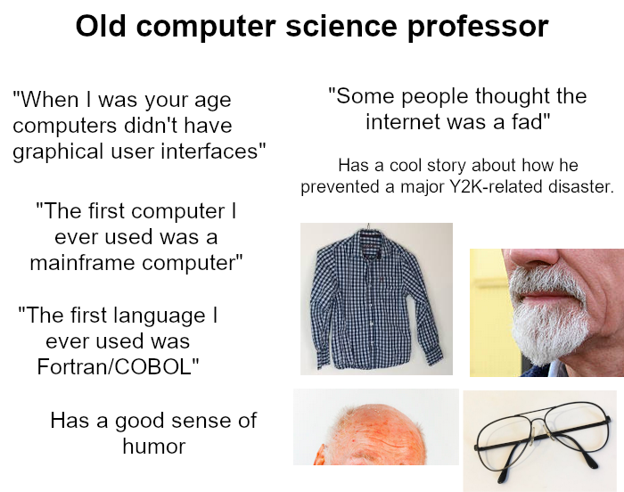

11401 iris 
- [ˈaɪrɪs]  [ˈaɪrɪs] 
- n.["虹膜","鸢尾属植物"]   
- [人人词典](https://www.91dict.com/words?w=iris) [柯林斯](https://www.collinsdictionary.com/zh/dictionary/english/iris) [朗文](https://www.ldoceonline.com/dictionary/iris) 

11402 showroom 
- [ˈʃəʊru:m]  [ˈʃoʊru:m] 
- n.["陈列室"]  v.["去实体店体验之后用更少的钱在网上购买"]   
- [人人词典](https://www.91dict.com/words?w=showroom) [柯林斯](https://www.collinsdictionary.com/zh/dictionary/english/showroom) [朗文](https://www.ldoceonline.com/dictionary/showroom) 

11403 stillness 
- [ˈstɪlnəs]  [ˈstɪlnɪs] 
- n.["静止","不动","沉静","镇定自若"]   
- [人人词典](https://www.91dict.com/words?w=stillness) [柯林斯](https://www.collinsdictionary.com/zh/dictionary/english/stillness) [朗文](https://www.ldoceonline.com/dictionary/stillness) 

11404 overhead 
- [ˌəʊvəˈhed]  [ˌoʊvərˈhed] 
- adj.["上面的，高架的","头顶上的","（费用等）经常的，管理的"]  n.["天花板","管理费用，经常费用","船舱的顶板","[体]（网球等的）扣杀"]  adv.["在头顶上","在空中","在楼上","向上"]   
- [人人词典](https://www.91dict.com/words?w=overhead) [柯林斯](https://www.collinsdictionary.com/zh/dictionary/english/overhead) [朗文](https://www.ldoceonline.com/dictionary/overhead) 

11405 neglected 
- [nɪˈglektɪd]  [] 
- adj.["被忽视的"]  v.["疏忽( neglect的过去式和过去分词 )","忽略","遗漏","疏于照顾"]   
- [人人词典](https://www.91dict.com/words?w=neglected) [柯林斯](https://www.collinsdictionary.com/zh/dictionary/english/neglected) [朗文](https://www.ldoceonline.com/dictionary/neglected) 

11406 onslaught 
- [ˈɒnslɔ:t]  [ˈɑ:nslɔ:t] 
- n.["猛攻，攻击","突击","大量的倾泻"]   
- [人人词典](https://www.91dict.com/words?w=onslaught) [柯林斯](https://www.collinsdictionary.com/zh/dictionary/english/onslaught) [朗文](https://www.ldoceonline.com/dictionary/onslaught) 

11407 garner 
- [ˈgɑ:nə(r)]  [ˈgɑ:rnə(r)] 
- vt.["获得","贮藏，积累"]  n.["谷仓"]   
- [人人词典](https://www.91dict.com/words?w=garner) [柯林斯](https://www.collinsdictionary.com/zh/dictionary/english/garner) [朗文](https://www.ldoceonline.com/dictionary/garner) 

11408 schoolchild 
- [ˈsku:ltʃaɪld]  [ˈskulˌtʃaɪld] 
- n.["学童"]   
- [人人词典](https://www.91dict.com/words?w=schoolchild) [柯林斯](https://www.collinsdictionary.com/zh/dictionary/english/schoolchild) [朗文](https://www.ldoceonline.com/dictionary/schoolchild) 

11409 militarily 
- []  [] 
- adv.["以武力，以军事行动"]   
- [人人词典](https://www.91dict.com/words?w=militarily) [柯林斯](https://www.collinsdictionary.com/zh/dictionary/english/militarily) [朗文](https://www.ldoceonline.com/dictionary/militarily) 

11410 blah 
- [blɑ:]  [blɑ] 
- n.["废话","空谈","胡扯","浮夸的文章"]  adj.["无聊的","枯燥的"]  int.["废话"]   
- [人人词典](https://www.91dict.com/words?w=blah) [柯林斯](https://www.collinsdictionary.com/zh/dictionary/english/blah) [朗文](https://www.ldoceonline.com/dictionary/blah) 

11411 net 
- [net]  [nɛt] 
- n.["网","网状织物","球网","网罩"]  vt.["用网捕","捕获","净赚","踢入球门"]  adj.["净的","净得的","最后的"]   
- [人人词典](https://www.91dict.com/words?w=net) [柯林斯](https://www.collinsdictionary.com/zh/dictionary/english/net) [朗文](https://www.ldoceonline.com/dictionary/net) 

11412 eminent 
- [ˈemɪnənt]  [ˈɛmənənt] 
- adj.["（指人）知名的，杰出的，卓越的","（指品质、特性）明显的，显着的，突出的","显赫的","闻达"]   
- [人人词典](https://www.91dict.com/words?w=eminent) [柯林斯](https://www.collinsdictionary.com/zh/dictionary/english/eminent) [朗文](https://www.ldoceonline.com/dictionary/eminent) 

11413 richly 
- [ˈrɪtʃli]  [ˈrɪtʃli] 
- adv.["丰富地","富裕地","完全地"]   
- [人人词典](https://www.91dict.com/words?w=richly) [柯林斯](https://www.collinsdictionary.com/zh/dictionary/english/richly) [朗文](https://www.ldoceonline.com/dictionary/richly) 

11414 submerge 
- [səbˈmɜ:dʒ]  [səbˈmɜ:rdʒ] 
- vt.& vi.["淹没","把…浸入","沉没，下潜","使沉浸"]  vt.["淹没","把…浸入","沉浸"]  vi.["淹没","潜入水中","湮没"]   
- [人人词典](https://www.91dict.com/words?w=submerge) [柯林斯](https://www.collinsdictionary.com/zh/dictionary/english/submerge) [朗文](https://www.ldoceonline.com/dictionary/submerge) 

11415 realistically 
- [ˌri:əˈlɪstɪkli]  [ˌrɪəˈlɪstɪklɪ] 
- adv.["现实地","实际地","逼真地"]   
- [人人词典](https://www.91dict.com/words?w=realistically) [柯林斯](https://www.collinsdictionary.com/zh/dictionary/english/realistically) [朗文](https://www.ldoceonline.com/dictionary/realistically) 

11416 decorated 
- ['dekəreɪtɪd]  ['dekəreɪtɪd] 
- v.["装饰( decorate的过去式和过去分词 )","点缀","粉刷","授予（某人）勋章"]   
- [人人词典](https://www.91dict.com/words?w=decorated) [柯林斯](https://www.collinsdictionary.com/zh/dictionary/english/decorated) [朗文](https://www.ldoceonline.com/dictionary/decorated) 

11417 backseat 
- [bæk'si:t]  [bæk'si:t] 
- n.["后座，次要位置"]   
- [人人词典](https://www.91dict.com/words?w=backseat) [柯林斯](https://www.collinsdictionary.com/zh/dictionary/english/backseat) [朗文](https://www.ldoceonline.com/dictionary/backseat) 

11418 pastime 
- [ˈpɑ:staɪm]  [ˈpæstaɪm] 
- n.["消遣，娱乐"]   
- [人人词典](https://www.91dict.com/words?w=pastime) [柯林斯](https://www.collinsdictionary.com/zh/dictionary/english/pastime) [朗文](https://www.ldoceonline.com/dictionary/pastime) 

11419 third-party 
- ['θɜ:dpa:tɪ]  ['θɜ:dpa:tɪ] 
- ["第三方的"]   
- [人人词典](https://www.91dict.com/words?w=third-party) [柯林斯](https://www.collinsdictionary.com/zh/dictionary/english/third-party) [朗文](https://www.ldoceonline.com/dictionary/third-party) 

11420 fraudulent 
- [ˈfrɔ:djələnt]  [ˈfrɔ:dʒələnt] 
- adj.["欺骗的，不诚实的","奸诈"]   
- [人人词典](https://www.91dict.com/words?w=fraudulent) [柯林斯](https://www.collinsdictionary.com/zh/dictionary/english/fraudulent) [朗文](https://www.ldoceonline.com/dictionary/fraudulent) 

11421 sinner 
- [ˈsɪnə(r)]  [ˈsɪnɚ] 
- n.["罪人"]   
- [人人词典](https://www.91dict.com/words?w=sinner) [柯林斯](https://www.collinsdictionary.com/zh/dictionary/english/sinner) [朗文](https://www.ldoceonline.com/dictionary/sinner) 

11422 ferry 
- [ˈferi]  [ˈfɛri] 
- n.["渡船","渡口","摆渡","用船渡运"]  vt.["航海","渡运","（乘渡船）渡过（河等）"]  vi.["摆渡"]   
- [人人词典](https://www.91dict.com/words?w=ferry) [柯林斯](https://www.collinsdictionary.com/zh/dictionary/english/ferry) [朗文](https://www.ldoceonline.com/dictionary/ferry) 

11423 stroll 
- [strəʊl]  [stroʊl] 
- n.["闲逛","漫步"]  vi.["散步","奔波"]  vt.["溜达"]   
- [人人词典](https://www.91dict.com/words?w=stroll) [柯林斯](https://www.collinsdictionary.com/zh/dictionary/english/stroll) [朗文](https://www.ldoceonline.com/dictionary/stroll) 

11424 vaccination 
- [ˌvæksɪ'neɪʃn]  [ˌvæksəˈneʃən] 
- n.["<医>种痘，接种","牛痘疤"]   
- [人人词典](https://www.91dict.com/words?w=vaccination) [柯林斯](https://www.collinsdictionary.com/zh/dictionary/english/vaccination) [朗文](https://www.ldoceonline.com/dictionary/vaccination) 

11425 pebble 
- [ˈpebl]  [ˈpɛbəl] 
- n.["卵石","水晶","水晶透镜","卵石花纹"]  vt.["用卵石铺","用石子扔","使纹理粗糙"]   
- [人人词典](https://www.91dict.com/words?w=pebble) [柯林斯](https://www.collinsdictionary.com/zh/dictionary/english/pebble) [朗文](https://www.ldoceonline.com/dictionary/pebble) 

11426 housekeeper 
- [ˈhaʊski:pə(r)]  [ˈhaʊsˌkipɚ] 
- n.["主妇","女管家","房屋管理人"]   
- [人人词典](https://www.91dict.com/words?w=housekeeper) [柯林斯](https://www.collinsdictionary.com/zh/dictionary/english/housekeeper) [朗文](https://www.ldoceonline.com/dictionary/housekeeper) 

11427 blister 
- [ˈblɪstə(r)]  [ˈblɪstɚ] 
- n.["水疱","水肿","疱","气泡"]  vt.& vi.["（使）起水泡"]  vi.["（使表皮等）涨破，爆裂"]   
- [人人词典](https://www.91dict.com/words?w=blister) [柯林斯](https://www.collinsdictionary.com/zh/dictionary/english/blister) [朗文](https://www.ldoceonline.com/dictionary/blister) 

11428 institutionalize 
- [ˌɪnstɪˈtju:ʃənəlaɪz]  [ˌɪnstɪˈtu:ʃənəlaɪz] 
- vt.["使…制度化","使成为惯例","把（某人）置于公共机构下"]   
- [人人词典](https://www.91dict.com/words?w=institutionalize) [柯林斯](https://www.collinsdictionary.com/zh/dictionary/english/institutionalize) [朗文](https://www.ldoceonline.com/dictionary/institutionalize) 

11429 hindsight 
- [ˈhaɪndsaɪt]  [ˈhaɪndˌsaɪt] 
- n.["后见之明","（步枪的）照尺","表尺"]   
- [人人词典](https://www.91dict.com/words?w=hindsight) [柯林斯](https://www.collinsdictionary.com/zh/dictionary/english/hindsight) [朗文](https://www.ldoceonline.com/dictionary/hindsight) 

11430 sputter 
- [ˈspʌtə(r)]  [ˈspʌtɚ] 
- n.["喷溅声","劈啪声","急语","咕哝"]  v.["唾沫飞溅","发劈啪声","喷出","飞溅出"]   
- [人人词典](https://www.91dict.com/words?w=sputter) [柯林斯](https://www.collinsdictionary.com/zh/dictionary/english/sputter) [朗文](https://www.ldoceonline.com/dictionary/sputter) 

11431 budge 
- [bʌdʒ]  [bʌdʒ] 
- vt.& vi.["（使）稍微移动","（使）改变主意，（使）让步","（立场等）动摇","推动"]  n.["（毛向外翻的）羔羊皮","革囊","〈美方〉酒"]  adj.["用羔羊皮装饰的","<古>浮夸的","自负的","庄严的"]   
- [人人词典](https://www.91dict.com/words?w=budge) [柯林斯](https://www.collinsdictionary.com/zh/dictionary/english/budge) [朗文](https://www.ldoceonline.com/dictionary/budge) 

11432 saturate 
- [ˈsætʃəreɪt]  [ˈsætʃəˌret] 
- vt.["浸湿，浸透","使充满","[化]使饱和","使渗进，使湿透"]  adj.["浸透的，渗透的","饱和的","颜色浓[深]的"]   
- [人人词典](https://www.91dict.com/words?w=saturate) [柯林斯](https://www.collinsdictionary.com/zh/dictionary/english/saturate) [朗文](https://www.ldoceonline.com/dictionary/saturate) 

11433 jut 
- [dʒʌt]  [dʒʌt] 
- vi.["突出，伸出"]  vt.["使伸出，使突出"]  n.["突出，突出物"]   
- [人人词典](https://www.91dict.com/words?w=jut) [柯林斯](https://www.collinsdictionary.com/zh/dictionary/english/jut) [朗文](https://www.ldoceonline.com/dictionary/jut) 

11434 incorrectly 
- [ˌɪnkə'rektlɪ]  [ˌɪnkə'rektlɪ] 
- adv.["不正确地，错误地"]   
- [人人词典](https://www.91dict.com/words?w=incorrectly) [柯林斯](https://www.collinsdictionary.com/zh/dictionary/english/incorrectly) [朗文](https://www.ldoceonline.com/dictionary/incorrectly) 

11435 usable 
- [ˈju:zəbl]  [ˈjuzəbəl] 
- adj.["可用的","合用的","便于使用的","使得"]   
- [人人词典](https://www.91dict.com/words?w=usable) [柯林斯](https://www.collinsdictionary.com/zh/dictionary/english/usable) [朗文](https://www.ldoceonline.com/dictionary/usable) 

11436 imposition 
- [ˌɪmpəˈzɪʃn]  [ˌɪmpəˈzɪʃən] 
- n.["强加","被迫接受","过分的要求","税收"]   
- [人人词典](https://www.91dict.com/words?w=imposition) [柯林斯](https://www.collinsdictionary.com/zh/dictionary/english/imposition) [朗文](https://www.ldoceonline.com/dictionary/imposition) 

11437 methane 
- [ˈmi:θeɪn]  [ˈmeθeɪn] 
- n.["<化>甲烷，沼气"]   
- [人人词典](https://www.91dict.com/words?w=methane) [柯林斯](https://www.collinsdictionary.com/zh/dictionary/english/methane) [朗文](https://www.ldoceonline.com/dictionary/methane) 

11438 biotech 
- ['baɪəʊtek]  [ˌbaɪoˈtɛk] 
- n.["生物技术"]   
- [人人词典](https://www.91dict.com/words?w=biotech) [柯林斯](https://www.collinsdictionary.com/zh/dictionary/english/biotech) [朗文](https://www.ldoceonline.com/dictionary/biotech) 

11439 whereabouts 
- [ˈweərəbaʊts]  [ˈwerəbaʊts] 
- adv.["在什么地方","靠近什么地方"]  n.["下落","行踪","去向","所在之处"]   
- [人人词典](https://www.91dict.com/words?w=whereabouts) [柯林斯](https://www.collinsdictionary.com/zh/dictionary/english/whereabouts) [朗文](https://www.ldoceonline.com/dictionary/whereabouts) 

11440 bedding 
- [ˈbedɪŋ]  [ˈbɛdɪŋ] 
- n.["寝具","基底，基坑"]  adj.["适于花坛种植的"]  v.["“bed“的现在分词"]   
- [人人词典](https://www.91dict.com/words?w=bedding) [柯林斯](https://www.collinsdictionary.com/zh/dictionary/english/bedding) [朗文](https://www.ldoceonline.com/dictionary/bedding) 

11441 raging 
- [ˈreɪdʒɪŋ]  [ˈredʒɪŋ] 
- adj.["猛烈的，狂暴的","非凡的","奰","熊熊"]   
- [人人词典](https://www.91dict.com/words?w=raging) [柯林斯](https://www.collinsdictionary.com/zh/dictionary/english/raging) [朗文](https://www.ldoceonline.com/dictionary/raging) 

11442 peacekeeper 
- [ˈpi:ski:pə(r)]  [ˈpisˌkipɚ] 
- n.["维和士兵"]   
- [人人词典](https://www.91dict.com/words?w=peacekeeper) [柯林斯](https://www.collinsdictionary.com/zh/dictionary/english/peacekeeper) [朗文](https://www.ldoceonline.com/dictionary/peacekeeper) 

11443 imperialism 
- [ɪmˈpɪəriəlɪzəm]  [ɪmˈpɪriəlɪzəm] 
- n.["帝国主义，帝国主义政策"]   
- [人人词典](https://www.91dict.com/words?w=imperialism) [柯林斯](https://www.collinsdictionary.com/zh/dictionary/english/imperialism) [朗文](https://www.ldoceonline.com/dictionary/imperialism) 

11444 rebellious 
- [rɪˈbeljəs]  [rɪˈbɛljəs] 
- adj.["反叛的","造反的","难控制的"]   
- [人人词典](https://www.91dict.com/words?w=rebellious) [柯林斯](https://www.collinsdictionary.com/zh/dictionary/english/rebellious) [朗文](https://www.ldoceonline.com/dictionary/rebellious) 

11445 throttle 
- [ˈθrɒtl]  [ˈθrɑ:tl] 
- n.["节流阀","喉咙，气管","[机]风门"]  vt.& vi.["扼杀，压制","勒死，使窒息","使节流","（用节汽阀等）调节"]  vi.["节流，减速","窒息"]   
- [人人词典](https://www.91dict.com/words?w=throttle) [柯林斯](https://www.collinsdictionary.com/zh/dictionary/english/throttle) [朗文](https://www.ldoceonline.com/dictionary/throttle) 

11446 shrinking 
- [ʃrɪŋkɪŋ]  [ʃrɪŋkɪŋ] 
- v.["收缩( shrink的现在分词 )","（使）缩水","退缩","畏缩"]   
- [人人词典](https://www.91dict.com/words?w=shrinking) [柯林斯](https://www.collinsdictionary.com/zh/dictionary/english/shrinking) [朗文](https://www.ldoceonline.com/dictionary/shrinking) 

11447 illumination 
- [ɪˌlu:mɪˈneɪʃn]  [ɪˌluməˈneʃən] 
- n.["照明","阐明，解释清楚","<物>照度","彩饰，图案花饰"]   
- [人人词典](https://www.91dict.com/words?w=illumination) [柯林斯](https://www.collinsdictionary.com/zh/dictionary/english/illumination) [朗文](https://www.ldoceonline.com/dictionary/illumination) 

11448 sliver 
- [ˈslɪvə(r)]  [ˈslɪvɚ] 
- n.["条子，梳条","细片，长条","裂片","（作鱼饵用的）小鱼片"]  vt.& vi.["使成薄片","使裂成小片","裂开","把…剖成长条"]   
- [人人词典](https://www.91dict.com/words?w=sliver) [柯林斯](https://www.collinsdictionary.com/zh/dictionary/english/sliver) [朗文](https://www.ldoceonline.com/dictionary/sliver) 

11449 discreet 
- [dɪˈskri:t]  [dɪˈskrit] 
- adj.["谨慎的，慎重的","考虑周到的","小心的","持重"]   
- [人人词典](https://www.91dict.com/words?w=discreet) [柯林斯](https://www.collinsdictionary.com/zh/dictionary/english/discreet) [朗文](https://www.ldoceonline.com/dictionary/discreet) 

11450 uniformly 
- ['ju:nɪfɔ:mlɪ]  [junəˈfɔrmlɪ] 
- adv.["一致地","相同地"]   
- [人人词典](https://www.91dict.com/words?w=uniformly) [柯林斯](https://www.collinsdictionary.com/zh/dictionary/english/uniformly) [朗文](https://www.ldoceonline.com/dictionary/uniformly) 

11451 newsroom 
- [ˈnju:zru:m]  [ˈnu:zru:m] 
- n.["新闻编辑室","报刊阅览室"]   
- [人人词典](https://www.91dict.com/words?w=newsroom) [柯林斯](https://www.collinsdictionary.com/zh/dictionary/english/newsroom) [朗文](https://www.ldoceonline.com/dictionary/newsroom) 

11452 allusion 
- [əˈlu:ʒn]  [əˈluʒən] 
- n.["暗指，间接提到","影射","典故"]   
- [人人词典](https://www.91dict.com/words?w=allusion) [柯林斯](https://www.collinsdictionary.com/zh/dictionary/english/allusion) [朗文](https://www.ldoceonline.com/dictionary/allusion) 

11453 salute 
- [səˈlu:t]  [səˈlut] 
- vt.& vi.["欢迎，致敬"]  vt.["向…致意","赞扬，赞颂"]  vi.["致意，打招呼","行礼"]  n.["致敬，欢迎","敬礼","举枪，举刀（礼）"]   
- [人人词典](https://www.91dict.com/words?w=salute) [柯林斯](https://www.collinsdictionary.com/zh/dictionary/english/salute) [朗文](https://www.ldoceonline.com/dictionary/salute) 

11454 garnish 
- [ˈgɑ:nɪʃ]  [ˈgɑ:rnɪʃ] 
- vt.["装饰，文饰","给…加配菜","[法]传讯"]  n.["装饰，装饰品","华丽的词藻","配菜","<俚>勒索金"]   
- [人人词典](https://www.91dict.com/words?w=garnish) [柯林斯](https://www.collinsdictionary.com/zh/dictionary/english/garnish) [朗文](https://www.ldoceonline.com/dictionary/garnish) 

11455 divergent 
- [daɪ'vɜ:dʒənt]  [dɪˈvə:dʒənt, daɪ-] 
- adj.["有分歧的","叉开的","发散的","扩散的"]   
- [人人词典](https://www.91dict.com/words?w=divergent) [柯林斯](https://www.collinsdictionary.com/zh/dictionary/english/divergent) [朗文](https://www.ldoceonline.com/dictionary/divergent) 

11456 swivel 
- [ˈswɪvl]  [ˈswɪvəl] 
- n.["转节","转环","旋轴","旋转接头"]  vt.& vi.["（使）旋转","在枢轴上转动","（把身子或脸等）转向另一方","转身"]   
- [人人词典](https://www.91dict.com/words?w=swivel) [柯林斯](https://www.collinsdictionary.com/zh/dictionary/english/swivel) [朗文](https://www.ldoceonline.com/dictionary/swivel) 

11457 forage 
- [ˈfɒrɪdʒ]  [ˈfɔ:rɪdʒ] 
- n.["牛马饲料","寻找粮草"]  vi.["搜寻（食物），尤指动物觅（食）","（尤指用手）搜寻（东西）"]   
- [人人词典](https://www.91dict.com/words?w=forage) [柯林斯](https://www.collinsdictionary.com/zh/dictionary/english/forage) [朗文](https://www.ldoceonline.com/dictionary/forage) 

11458 certain 
- [ˈsɜ:tn]  [ˈsɜ:rtn] 
- adj.["某一","必然的","已确定的"]  pron.["[动词用复数]某些"]   
- [人人词典](https://www.91dict.com/words?w=certain) [柯林斯](https://www.collinsdictionary.com/zh/dictionary/english/certain) [朗文](https://www.ldoceonline.com/dictionary/certain) 

11459 partisan 
- [ˌpɑ:tɪˈzæn]  [ˈpɑ:rtəzn] 
- adj.["党派性的","偏袒的","游击队的"]  n.["党羽，强硬支持者","游击队员","戟的一种"]   
- [人人词典](https://www.91dict.com/words?w=partisan) [柯林斯](https://www.collinsdictionary.com/zh/dictionary/english/partisan) [朗文](https://www.ldoceonline.com/dictionary/partisan) 

11460 binary 
- [ˈbaɪnəri]  [ˈbaɪnəri] 
- adj.["双重的，由两个东西组成的","二态的","二元的","二进制的"]  n.["一双","双体","二进制数","双子星"]   
- [人人词典](https://www.91dict.com/words?w=binary) [柯林斯](https://www.collinsdictionary.com/zh/dictionary/english/binary) [朗文](https://www.ldoceonline.com/dictionary/binary) 

11461 dated 
- [ˈdeɪtɪd]  [ˈdetɪd] 
- adj.["有日期的","陈旧的"]  v.["过时( date的过去式和过去分词 )","使…显老","显示出…时代（或年龄）","鉴定…的年代"]   
- [人人词典](https://www.91dict.com/words?w=dated) [柯林斯](https://www.collinsdictionary.com/zh/dictionary/english/dated) [朗文](https://www.ldoceonline.com/dictionary/dated) 

11462 sprout 
- [spraʊt]  [spraʊt] 
- vi.["发芽","抽芽"]  vt.["使发芽","使生长"]  n.["幼芽，新梢","[植]球芽甘蓝","幼苗状物，年轻人","美俚〉后代"]   
- [人人词典](https://www.91dict.com/words?w=sprout) [柯林斯](https://www.collinsdictionary.com/zh/dictionary/english/sprout) [朗文](https://www.ldoceonline.com/dictionary/sprout) 

11463 Dane 
- [deɪn]  [den] 
- n.["丹麦人","戴恩（男子名）"]   
- [人人词典](https://www.91dict.com/words?w=Dane) [柯林斯](https://www.collinsdictionary.com/zh/dictionary/english/Dane) [朗文](https://www.ldoceonline.com/dictionary/Dane) 

11464 antioxidant 
- [ˌæntiˈɒksɪdənt]  [ˌæntiˈɑ:ksɪdənt] 
- n.["抗氧化剂，硬化防止剂"]   
- [人人词典](https://www.91dict.com/words?w=antioxidant) [柯林斯](https://www.collinsdictionary.com/zh/dictionary/english/antioxidant) [朗文](https://www.ldoceonline.com/dictionary/antioxidant) 

11465 thorn 
- [θɔ:n]  [θɔ:rn] 
- n.["刺","棘刺，荆棘","带刺的植物","刺痛"]   
- [人人词典](https://www.91dict.com/words?w=thorn) [柯林斯](https://www.collinsdictionary.com/zh/dictionary/english/thorn) [朗文](https://www.ldoceonline.com/dictionary/thorn) 

11466 tangle 
- [ˈtæŋgl]  [ˈtæŋɡəl] 
- n.["纠缠，纠纷","混乱，慌乱","昏乱的状态","争论"]  vt.& vi.["（使）缠结，（使）乱作一团","使陷入，捕获","使纠纷","参加辩论、争执或冲突"]   
- [人人词典](https://www.91dict.com/words?w=tangle) [柯林斯](https://www.collinsdictionary.com/zh/dictionary/english/tangle) [朗文](https://www.ldoceonline.com/dictionary/tangle) 

11467 blackout 
- [ˈblækaʊt]  [ˈblækˌaʊt] 
- n.["灯火管制","灯火熄灭","暂时失去知觉"]   
- [人人词典](https://www.91dict.com/words?w=blackout) [柯林斯](https://www.collinsdictionary.com/zh/dictionary/english/blackout) [朗文](https://www.ldoceonline.com/dictionary/blackout) 

11468 cop 
- [kɒp]  [kɑ:p] 
- n.["〈俚〉警察","管纱","〈英方〉（山）顶"]  vt.["偷盗","抓住，获得","取走"]   
- [人人词典](https://www.91dict.com/words?w=cop) [柯林斯](https://www.collinsdictionary.com/zh/dictionary/english/cop) [朗文](https://www.ldoceonline.com/dictionary/cop) 

11469 inward 
- [ˈɪnwəd]  [ˈɪnwərd] 
- adj.["向内的","内部的","本质上的","亲密的"]  adv.["向内","内心里"]  n.["内部","内脏"]   
- [人人词典](https://www.91dict.com/words?w=inward) [柯林斯](https://www.collinsdictionary.com/zh/dictionary/english/inward) [朗文](https://www.ldoceonline.com/dictionary/inward) 

11470 quarrel 
- [ˈkwɒrəl]  [ˈkwɔ:rəl] 
- n.["争吵，口角","反目","抱怨…的原因（理由）","[史]方镞箭，角镞箭"]  vi.["争辩，争吵","不同意","挑剔","责备，埋怨"]   
- [人人词典](https://www.91dict.com/words?w=quarrel) [柯林斯](https://www.collinsdictionary.com/zh/dictionary/english/quarrel) [朗文](https://www.ldoceonline.com/dictionary/quarrel) 

11471 topping 
- [ˈtɒpɪŋ]  [ˈtɑ:pɪŋ] 
- n.["构成顶部的东西","糕点上的装饰配料"]  adj.["杰出的，一流的","高耸的"]  v.["加顶","到达顶部(top的现在分词形式)"]   
- [人人词典](https://www.91dict.com/words?w=topping) [柯林斯](https://www.collinsdictionary.com/zh/dictionary/english/topping) [朗文](https://www.ldoceonline.com/dictionary/topping) 

11472 pricey 
- [ˈpraɪsi]  [ˈpraɪsi] 
- adj.["价格高的，昂贵的"]   
- [人人词典](https://www.91dict.com/words?w=pricey) [柯林斯](https://www.collinsdictionary.com/zh/dictionary/english/pricey) [朗文](https://www.ldoceonline.com/dictionary/pricey) 

11473 ignition 
- [ɪgˈnɪʃn]  [ɪɡˈnɪʃən] 
- n.["（汽油引擎的）发火装置","着火，燃烧","点火，点燃"]   
- [人人词典](https://www.91dict.com/words?w=ignition) [柯林斯](https://www.collinsdictionary.com/zh/dictionary/english/ignition) [朗文](https://www.ldoceonline.com/dictionary/ignition) 

11474 grandma 
- [ˈgrænmɑ:]  [ˈɡrændˌmɑ,] 
- n.["奶奶，外婆"]  na.["<口>奶奶，外婆"]   
- [人人词典](https://www.91dict.com/words?w=grandma) [柯林斯](https://www.collinsdictionary.com/zh/dictionary/english/grandma) [朗文](https://www.ldoceonline.com/dictionary/grandma) 

11475 Arabian 
- [əˈreɪbiən]  [əˈrebiən] 
- adj.["阿拉伯的，阿拉伯人的"]  n.["阿拉伯人，阿拉伯半岛居民"]   
- [人人词典](https://www.91dict.com/words?w=Arabian) [柯林斯](https://www.collinsdictionary.com/zh/dictionary/english/Arabian) [朗文](https://www.ldoceonline.com/dictionary/Arabian) 

11476 murderous 
- [ˈmɜ:dərəs]  [ˈmɜ:rdərəs] 
- adj.["蓄意谋杀的","杀人的，残忍的","凶残的"]   
- [人人词典](https://www.91dict.com/words?w=murderous) [柯林斯](https://www.collinsdictionary.com/zh/dictionary/english/murderous) [朗文](https://www.ldoceonline.com/dictionary/murderous) 

11477 heady 
- [ˈhedi]  [ˈhɛdi] 
- adj.["顽固的","任性的","兴奋的","（酒等）易使人醉的"]   
- [人人词典](https://www.91dict.com/words?w=heady) [柯林斯](https://www.collinsdictionary.com/zh/dictionary/english/heady) [朗文](https://www.ldoceonline.com/dictionary/heady) 

11478 restored 
- [rɪ'stɔ:d]  [rɪ'stɔ:d] 
- v.["归还( restore的过去式和过去分词 )","交还","使恢复","修复"]   
- [人人词典](https://www.91dict.com/words?w=restored) [柯林斯](https://www.collinsdictionary.com/zh/dictionary/english/restored) [朗文](https://www.ldoceonline.com/dictionary/restored) 

11479 repel 
- [rɪˈpel]  [rɪˈpɛl] 
- vt.["击退","使厌恶","抵制","使不愉快"]   
- [人人词典](https://www.91dict.com/words?w=repel) [柯林斯](https://www.collinsdictionary.com/zh/dictionary/english/repel) [朗文](https://www.ldoceonline.com/dictionary/repel) 

11480 bookshelf 
- [ˈbʊkʃelf]  [ˈbʊkˌʃɛlf] 
- n.["书架","书橱"]   
- [人人词典](https://www.91dict.com/words?w=bookshelf) [柯林斯](https://www.collinsdictionary.com/zh/dictionary/english/bookshelf) [朗文](https://www.ldoceonline.com/dictionary/bookshelf) 

11481 fad 
- [fæd]  [fæd] 
- n.["一时的流行","一时的风尚","一时的怪念头"]  abbr.["[生化](=flavin adenine dinucleotide)黄素腺嘌呤二核苷酸"]   
- [人人词典](https://www.91dict.com/words?w=fad) [柯林斯](https://www.collinsdictionary.com/zh/dictionary/english/fad) [朗文](https://www.ldoceonline.com/dictionary/fad)
  
11482 espionage 
- [ˈespiənɑ:ʒ]  [ˈɛspiəˌnɑʒ, -nɪdʒ] 
- n.["侦察","间谍活动"]   
- [人人词典](https://www.91dict.com/words?w=espionage) [柯林斯](https://www.collinsdictionary.com/zh/dictionary/english/espionage) [朗文](https://www.ldoceonline.com/dictionary/espionage) 

11483 prenatal 
- [ˌpri:ˈneɪtl]  [priˈnetl:] 
- adj.["出生前的，胎儿期的"]   
- [人人词典](https://www.91dict.com/words?w=prenatal) [柯林斯](https://www.collinsdictionary.com/zh/dictionary/english/prenatal) [朗文](https://www.ldoceonline.com/dictionary/prenatal) 

11484 censored 
- []  [] 
- adj.["受审查的，被删剪的"]  v.["删剪（书籍、电影等中被认为犯忌、违反道德或政治上危险的内容）( censor的过去式和过去分词 )"]   
- [人人词典](https://www.91dict.com/words?w=censored) [柯林斯](https://www.collinsdictionary.com/zh/dictionary/english/censored) [朗文](https://www.ldoceonline.com/dictionary/censored) 

11485 condone 
- [kənˈdəʊn]  [kənˈdoʊn] 
- vt.["容忍，宽恕，原谅"]   
- [人人词典](https://www.91dict.com/words?w=condone) [柯林斯](https://www.collinsdictionary.com/zh/dictionary/english/condone) [朗文](https://www.ldoceonline.com/dictionary/condone) 

11486 ferocious 
- [fəˈrəʊʃəs]  [fəˈroʊʃəs] 
- adj.["残忍的","极度的","凶猛","恶"]   
- [人人词典](https://www.91dict.com/words?w=ferocious) [柯林斯](https://www.collinsdictionary.com/zh/dictionary/english/ferocious) [朗文](https://www.ldoceonline.com/dictionary/ferocious) 

11487 bulldozer 
- [ˈbʊldəʊzə(r)]  [ˈbʊldoʊzə(r)] 
- n.["推土机","恐吓者，威胁者"]   
- [人人词典](https://www.91dict.com/words?w=bulldozer) [柯林斯](https://www.collinsdictionary.com/zh/dictionary/english/bulldozer) [朗文](https://www.ldoceonline.com/dictionary/bulldozer) 

11488 mentor 
- [ˈmentɔ:(r)]  ['mentɔ:r] 
- n.["（无经验之人的）有经验可信赖的顾问"]  vt.["做…的良师；指导"]   
- [人人词典](https://www.91dict.com/words?w=mentor) [柯林斯](https://www.collinsdictionary.com/zh/dictionary/english/mentor) [朗文](https://www.ldoceonline.com/dictionary/mentor) 

11489 contemplation 
- [ˌkɒntəmˈpleɪʃn]  [ˌkɑ:ntəmˈpleɪʃn] 
- n.["注视","凝视","沉思","意图"]   
- [人人词典](https://www.91dict.com/words?w=contemplation) [柯林斯](https://www.collinsdictionary.com/zh/dictionary/english/contemplation) [朗文](https://www.ldoceonline.com/dictionary/contemplation) 

11490 graphite 
- [ˈgræfaɪt]  [ˈɡræfˌaɪt] 
- n.["<化>石墨，黑铅","铅笔粉"]   
- [人人词典](https://www.91dict.com/words?w=graphite) [柯林斯](https://www.collinsdictionary.com/zh/dictionary/english/graphite) [朗文](https://www.ldoceonline.com/dictionary/graphite) 

11491 hitch 
- [hɪtʃ]  [hɪtʃ] 
- vt.& vi.["（免费）搭乘他人之车","猛拉","蹒跚","（使）结婚"]  vt.["（用环、钩等）套住，钩住（某物）"]  n.["故障，挫折","系住，勾住","急拉"]   
- [人人词典](https://www.91dict.com/words?w=hitch) [柯林斯](https://www.collinsdictionary.com/zh/dictionary/english/hitch) [朗文](https://www.ldoceonline.com/dictionary/hitch) 

11492 rehabilitate 
- [ˌri:əˈbɪlɪteɪt]  [ˌrihəˈbɪlɪˌtet] 
- vt.["使康复","使复原，修复","使恢复原状","使恢复名誉"]   
- [人人词典](https://www.91dict.com/words?w=rehabilitate) [柯林斯](https://www.collinsdictionary.com/zh/dictionary/english/rehabilitate) [朗文](https://www.ldoceonline.com/dictionary/rehabilitate) 

11493 gulp 
- [gʌlp]  [ɡʌlp] 
- vt.["狼吞虎咽地吃，吞咽","大口地吸（气）"]  vi.["哽住"]  n.["吞咽","一大口（尤指液体）"]   
- [人人词典](https://www.91dict.com/words?w=gulp) [柯林斯](https://www.collinsdictionary.com/zh/dictionary/english/gulp) [朗文](https://www.ldoceonline.com/dictionary/gulp) 

11494 subdued 
- [səbˈdju:d]  [səbˈdu:d] 
- adj.["制服的，被抑制的","缓和的","有节制的，抑制","顺从"]  v.["征服( subdue的过去式 )","克制","制服"]   
- [人人词典](https://www.91dict.com/words?w=subdued) [柯林斯](https://www.collinsdictionary.com/zh/dictionary/english/subdued) [朗文](https://www.ldoceonline.com/dictionary/subdued) 

11495 lag 
- [læg]  [læɡ] 
- vi.["走得极慢，落后"]  vt.["落后于","给…加上外套","把…关进牢里","逮捕"]  n.["滞后，（两事件之间的）时间间隔","囚犯","防护套","桶板"]   
- [人人词典](https://www.91dict.com/words?w=lag) [柯林斯](https://www.collinsdictionary.com/zh/dictionary/english/lag) [朗文](https://www.ldoceonline.com/dictionary/lag) 

11496 community-based 
- undefined 
- undefined 
- [人人词典](https://www.91dict.com/words?w=community-based) [柯林斯](https://www.collinsdictionary.com/zh/dictionary/english/community-based) [朗文](https://www.ldoceonline.com/dictionary/community-based) 

11497 ethos 
- [ˈi:θɒs]  [ˈi:θɑ:s] 
- n.["民族精神","社会思潮","气质"]   
- [人人词典](https://www.91dict.com/words?w=ethos) [柯林斯](https://www.collinsdictionary.com/zh/dictionary/english/ethos) [朗文](https://www.ldoceonline.com/dictionary/ethos) 

11498 shame 
- [ʃeɪm]  [ʃem] 
- n.["羞愧","羞辱","可耻的人","羞愧感"]  vt.["使蒙羞","玷辱","使感到羞愧","使相形见绌"]   
- [人人词典](https://www.91dict.com/words?w=shame) [柯林斯](https://www.collinsdictionary.com/zh/dictionary/english/shame) [朗文](https://www.ldoceonline.com/dictionary/shame) 

11499 homecoming 
- [ˈhəʊmkʌmɪŋ]  [ˈhoʊmkʌmɪŋ] 
- n.["归国","同学会","省亲回家","校友日"]   
- [人人词典](https://www.91dict.com/words?w=homecoming) [柯林斯](https://www.collinsdictionary.com/zh/dictionary/english/homecoming) [朗文](https://www.ldoceonline.com/dictionary/homecoming) 

11500 gaping 
- ['gæpɪŋ]  [ˈɡepɪŋ] 
- adj.["口的","张口的","敞口的","多洞穴的"]  v.["目瞪口呆地凝视( gape的现在分词 )","张开，张大"]   
- [人人词典](https://www.91dict.com/words?w=gaping) [柯林斯](https://www.collinsdictionary.com/zh/dictionary/english/gaping) [朗文](https://www.ldoceonline.com/dictionary/gaping) 

11501 rationality 
- [ˌræʃə'nælətɪ]  [ˌræʃəˈnælɪti] 
- n.["合理性","（常复数）合理的行动（或见解、措施等）"]   
- [人人词典](https://www.91dict.com/words?w=rationality) [柯林斯](https://www.collinsdictionary.com/zh/dictionary/english/rationality) [朗文](https://www.ldoceonline.com/dictionary/rationality) 

11502 bloated 
- [ˈbləʊtɪd]  [ˈbloʊtɪd] 
- adj.["发胀的","浮肿的","傲慢的"]  v.["使膨胀，使肿胀( bloat的过去式和过去分词)","用盐腌"]   
- [人人词典](https://www.91dict.com/words?w=bloated) [柯林斯](https://www.collinsdictionary.com/zh/dictionary/english/bloated) [朗文](https://www.ldoceonline.com/dictionary/bloated) 

11503 woodland 
- [ˈwʊdlənd]  [ˈwʊdlənd, -ˌlænd] 
- n.["林地，森林"]  adj.["林地的，树林的","林栖的"]   
- [人人词典](https://www.91dict.com/words?w=woodland) [柯林斯](https://www.collinsdictionary.com/zh/dictionary/english/woodland) [朗文](https://www.ldoceonline.com/dictionary/woodland) 

11504 homogeneous 
- [ˌhɒməˈdʒi:niəs]  [ˌhoʊməˈdʒi:niəs] 
- adj.["同性质的，同类的","由相同（或同类型）事物（或人）组成的","均匀的","[数]齐性的，齐次的"]   
- [人人词典](https://www.91dict.com/words?w=homogeneous) [柯林斯](https://www.collinsdictionary.com/zh/dictionary/english/homogeneous) [朗文](https://www.ldoceonline.com/dictionary/homogeneous) 

11505 headset 
- [ˈhedset]  [ˈhɛdˌsɛt] 
- n.["戴在头上的耳机或听筒"]   
- [人人词典](https://www.91dict.com/words?w=headset) [柯林斯](https://www.collinsdictionary.com/zh/dictionary/english/headset) [朗文](https://www.ldoceonline.com/dictionary/headset) 

11506 profitability 
- [ˌprɒfɪtə'bɪlətɪ]  [ˌprɑfɪtəˈbɪlətɪ] 
- n.["获利（状况），盈利（情况）","[经]收益性","利益率","有利"]   
- [人人词典](https://www.91dict.com/words?w=profitability) [柯林斯](https://www.collinsdictionary.com/zh/dictionary/english/profitability) [朗文](https://www.ldoceonline.com/dictionary/profitability) 

11507 dementia 
- [dɪˈmenʃə]  [dɪˈmɛnʃə] 
- n.["[医]痴呆"]   
- [人人词典](https://www.91dict.com/words?w=dementia) [柯林斯](https://www.collinsdictionary.com/zh/dictionary/english/dementia) [朗文](https://www.ldoceonline.com/dictionary/dementia) 

11508 sociological 
- [ˌsəʊsɪə'lɒdʒɪkl]  [ˌsoʊsɪr'lɒdʒɪkl] 
- adj.["社会学的，社会学上的"]   
- [人人词典](https://www.91dict.com/words?w=sociological) [柯林斯](https://www.collinsdictionary.com/zh/dictionary/english/sociological) [朗文](https://www.ldoceonline.com/dictionary/sociological) 

11509 blossom 
- [ˈblɒsəm]  [ˈblɑ:səm] 
- n.["花，群花","开花时期，（发育的）初期","兴旺时期"]  vi.["（植物）开花","繁荣，兴旺","长成"]   
- [人人词典](https://www.91dict.com/words?w=blossom) [柯林斯](https://www.collinsdictionary.com/zh/dictionary/english/blossom) [朗文](https://www.ldoceonline.com/dictionary/blossom) 

11510 speaking 
- ['spi:kɪŋ]  [ˈspikɪŋ] 
- n.["说话","讲话","谈话","演讲"]  adj.["演讲的","富于表情的","（肖像）栩栩如生的","雄辩的"]  v.["讲，谈(speak的现在分词 )"]   
- [人人词典](https://www.91dict.com/words?w=speaking) [柯林斯](https://www.collinsdictionary.com/zh/dictionary/english/speaking) [朗文](https://www.ldoceonline.com/dictionary/speaking) 

11511 pertaining 
- [pə(:)'teɪnɪŋ]  [pə(:)'teɪnɪŋ] 
- n.["与…有关系的，附属…的，为…固有的(to)"]  v.["关于( pertain的现在分词 )","有关","存在","适用"]   
- [人人词典](https://www.91dict.com/words?w=pertaining) [柯林斯](https://www.collinsdictionary.com/zh/dictionary/english/pertaining) [朗文](https://www.ldoceonline.com/dictionary/pertaining) 

11512 iced 
- [aɪst]  [aɪst] 
- adj.["冰冷的，装冰的，冰冻的"]  v.["（使）结冰( ice的过去式)","（使）结冰( ice的过去式和过去分词)"]   
- [人人词典](https://www.91dict.com/words?w=iced) [柯林斯](https://www.collinsdictionary.com/zh/dictionary/english/iced) [朗文](https://www.ldoceonline.com/dictionary/iced) 

11513 bogus 
- [ˈbəʊgəs]  [ˈboʊgəs] 
- adj.["假冒的，伪造的","佯作"]   
- [人人词典](https://www.91dict.com/words?w=bogus) [柯林斯](https://www.collinsdictionary.com/zh/dictionary/english/bogus) [朗文](https://www.ldoceonline.com/dictionary/bogus) 

11514 delicacy 
- [ˈdelɪkəsi]  [ˈdɛlɪkəsi] 
- n.["精美","美味佳肴","敏锐，敏感","世故，圆滑"]   
- [人人词典](https://www.91dict.com/words?w=delicacy) [柯林斯](https://www.collinsdictionary.com/zh/dictionary/english/delicacy) [朗文](https://www.ldoceonline.com/dictionary/delicacy) 

11515 titanium 
- [tɪˈteɪniəm]  [taɪˈteniəm, tɪ-] 
- n.["<化>钛"]   
- [人人词典](https://www.91dict.com/words?w=titanium) [柯林斯](https://www.collinsdictionary.com/zh/dictionary/english/titanium) [朗文](https://www.ldoceonline.com/dictionary/titanium) 

11516 seismic 
- [ˈsaɪzmɪk]  [ˈsaɪzmɪk] 
- adj.["地震的","由地震引起的","震撼世界的"]   
- [人人词典](https://www.91dict.com/words?w=seismic) [柯林斯](https://www.collinsdictionary.com/zh/dictionary/english/seismic) [朗文](https://www.ldoceonline.com/dictionary/seismic) 

11517 spree 
- [spri:]  [spri] 
- n.["欢闹","狂欢","无节制的狂热行为"]  vi.["狂欢","狂饮"]   
- [人人词典](https://www.91dict.com/words?w=spree) [柯林斯](https://www.collinsdictionary.com/zh/dictionary/english/spree) [朗文](https://www.ldoceonline.com/dictionary/spree) 

11518 masculinity 
- [ˌmæskjuˈlɪnəti]  [ˌmæskjəˈlinɪti] 
- n.["男性","男子气概"]   
- [人人词典](https://www.91dict.com/words?w=masculinity) [柯林斯](https://www.collinsdictionary.com/zh/dictionary/english/masculinity) [朗文](https://www.ldoceonline.com/dictionary/masculinity) 

11519 flair 
- [fleə(r)]  [fler] 
- n.["天资","天分","眼光","鉴别力"]   
- [人人词典](https://www.91dict.com/words?w=flair) [柯林斯](https://www.collinsdictionary.com/zh/dictionary/english/flair) [朗文](https://www.ldoceonline.com/dictionary/flair) 

11520 delve 
- [delv]  [dɛlv] 
- vi.["探究","挖掘"]  vt.["钻研","挖掘"]  n.["穴","洞"]   
- [人人词典](https://www.91dict.com/words?w=delve) [柯林斯](https://www.collinsdictionary.com/zh/dictionary/english/delve) [朗文](https://www.ldoceonline.com/dictionary/delve) 

11521 handcuff 
- [ˈhændkʌf]  [ˈhændˌkʌf] 
- n.["手铐","思想上的桎梏"]  vt.["给…戴上手铐","限制"]   
- [人人词典](https://www.91dict.com/words?w=handcuff) [柯林斯](https://www.collinsdictionary.com/zh/dictionary/english/handcuff) [朗文](https://www.ldoceonline.com/dictionary/handcuff) 

11522 inland 
- [ˌɪnˈlænd]  [ˈɪnlənd] 
- adj.["内地的，内陆的","国内的"]  adv.["向内地，在内地","向内陆，在内陆"]  n.["内地，内陆","国内"]   
- [人人词典](https://www.91dict.com/words?w=inland) [柯林斯](https://www.collinsdictionary.com/zh/dictionary/english/inland) [朗文](https://www.ldoceonline.com/dictionary/inland) 

11523 troll 
- [trɒl]  [troʊl] 
- v.["（使）旋转","合唱中的轮唱","放声高唱","钓（鱼）"]  n.["旋转，轮唱，钓鱼"]   
- [人人词典](https://www.91dict.com/words?w=troll) [柯林斯](https://www.collinsdictionary.com/zh/dictionary/english/troll) [朗文](https://www.ldoceonline.com/dictionary/troll) 

11524 dock 
- [dɒk]  [dɑ:k] 
- n.["码头","被告席","草本植物","尾巴的骨肉部份"]  vt.& vi.["（使）船停靠码头","剪短（尾巴等）","削减，缩减（工资等）","在…设置船坞"]  vi.["入船坞"]   
- [人人词典](https://www.91dict.com/words?w=dock) [柯林斯](https://www.collinsdictionary.com/zh/dictionary/english/dock) [朗文](https://www.ldoceonline.com/dictionary/dock) 

11525 unpublished 
- [ʌnˈpʌblɪʃt]  [] 
- adj.["未公开出版发行的","未发表过的"]   
- [人人词典](https://www.91dict.com/words?w=unpublished) [柯林斯](https://www.collinsdictionary.com/zh/dictionary/english/unpublished) [朗文](https://www.ldoceonline.com/dictionary/unpublished) 

11526 giddy 
- [ˈgɪdi]  [ˈɡɪdi] 
- adj.["头晕的","眼花的","轻浮的，轻佻的","轻狂的"]  vt.& vi.["使眩晕","使眼花"]   
- [人人词典](https://www.91dict.com/words?w=giddy) [柯林斯](https://www.collinsdictionary.com/zh/dictionary/english/giddy) [朗文](https://www.ldoceonline.com/dictionary/giddy) 

11527 adamant 
- [ˈædəmənt]  [ˈædəmənt, -ˌmænt] 
- adj.["坚硬无比的","牢不可破的","坚定不移的","坚决的"]  n.["坚硬的物质","<地质>硬石","<诗>牢不可破"]   
- [人人词典](https://www.91dict.com/words?w=adamant) [柯林斯](https://www.collinsdictionary.com/zh/dictionary/english/adamant) [朗文](https://www.ldoceonline.com/dictionary/adamant) 

11528 cashier 
- [kæˈʃɪə(r)]  [kæˈʃɪr] 
- n.["出纳员"]  vt.["解雇","抛弃"]   
- [人人词典](https://www.91dict.com/words?w=cashier) [柯林斯](https://www.collinsdictionary.com/zh/dictionary/english/cashier) [朗文](https://www.ldoceonline.com/dictionary/cashier) 

11529 afloat 
- [əˈfləʊt]  [əˈfloʊt] 
- adj.& adv.["在船上（的）","浮在水面（的）","漂流着的","漂浮不定"]  adj.["在船上（的）"]   
- [人人词典](https://www.91dict.com/words?w=afloat) [柯林斯](https://www.collinsdictionary.com/zh/dictionary/english/afloat) [朗文](https://www.ldoceonline.com/dictionary/afloat) 

11530 galley 
- [ˈgæli]  [ˈɡæli] 
- n.["单层甲板大帆船","军舰舰长用的大划艇","（船舰，飞机上的）厨房","活版盘，长条校样"]   
- [人人词典](https://www.91dict.com/words?w=galley) [柯林斯](https://www.collinsdictionary.com/zh/dictionary/english/galley) [朗文](https://www.ldoceonline.com/dictionary/galley) 

11531 puree 
- [ˈpjʊəreɪ]  [pjʊˈreɪ] 
- n.["浓汤","果泥","菜泥"]  vt.["煮成浓汤或者酱"]   
- [人人词典](https://www.91dict.com/words?w=puree) [柯林斯](https://www.collinsdictionary.com/zh/dictionary/english/puree) [朗文](https://www.ldoceonline.com/dictionary/puree) 

11532 gossip 
- [ˈgɒsɪp]  [ˈgɑ:sɪp] 
- n.["流言蜚语，谣言","爱讲闲话的人","谈话，闲话","关系亲密的伙伴"]  vi.["传播流言，说长道短"]   
- [人人词典](https://www.91dict.com/words?w=gossip) [柯林斯](https://www.collinsdictionary.com/zh/dictionary/english/gossip) [朗文](https://www.ldoceonline.com/dictionary/gossip) 

11533 fella 
- ['felə(r)]  ['felər] 
- n.["伙伴，伙计","小伙子"]   
- [人人词典](https://www.91dict.com/words?w=fella) [柯林斯](https://www.collinsdictionary.com/zh/dictionary/english/fella) [朗文](https://www.ldoceonline.com/dictionary/fella) 

11534 sob 
- [sɒb]  [sɑ:b] 
- vi.["呜咽","发呜咽声"]  vt.["哭诉，呜咽着说","哭得使…"]  n.["啜泣（声），呜咽（声）"]   
- [人人词典](https://www.91dict.com/words?w=sob) [柯林斯](https://www.collinsdictionary.com/zh/dictionary/english/sob) [朗文](https://www.ldoceonline.com/dictionary/sob) 

11535 frigid 
- [ˈfrɪdʒɪd]  [ˈfrɪdʒɪd] 
- adj.["寒冷的","极冷的","冷漠的","（尤指女人）性冷淡的"]  adv.["寒冷地，冷漠地"]  n.["寒冷，冷漠"]   
- [人人词典](https://www.91dict.com/words?w=frigid) [柯林斯](https://www.collinsdictionary.com/zh/dictionary/english/frigid) [朗文](https://www.ldoceonline.com/dictionary/frigid) 

11536 itinerary 
- [aɪˈtɪnərəri]  [aɪˈtɪnəreri] 
- n.["旅程，路线","旅行日程","旅行指南","旅行日记"]  adj.["旅程的","巡回的，流动的","旅行途中的"]   
- [人人词典](https://www.91dict.com/words?w=itinerary) [柯林斯](https://www.collinsdictionary.com/zh/dictionary/english/itinerary) [朗文](https://www.ldoceonline.com/dictionary/itinerary) 

11537 overrun 
- [ˌəʊvəˈrʌn]  [ˌoʊvəˈrʌn] 
- vt.["超过（范围）","（尤指坏事或不欲之事）泛滥","蹂躏","蔓延"]  n.["泛滥成灾","超过限度"]  vi.["泛滥","超过限度"]   
- [人人词典](https://www.91dict.com/words?w=overrun) [柯林斯](https://www.collinsdictionary.com/zh/dictionary/english/overrun) [朗文](https://www.ldoceonline.com/dictionary/overrun) 

11538 jig 
- [dʒɪg]  [dʒɪɡ] 
- n.["吉格舞","吉格舞曲","玩笑，诡计","[矿]筛选机"]  vi.["跳吉格舞，演奏吉格舞曲","急动，蹦蹦跳跳","用鱼钩钓"]  vt.["上下晃动","用夹具辅助加工（一物件）","淘汰选矿，筛选"]   
- [人人词典](https://www.91dict.com/words?w=jig) [柯林斯](https://www.collinsdictionary.com/zh/dictionary/english/jig) [朗文](https://www.ldoceonline.com/dictionary/jig) 

11539 hepatitis 
- [ˌhepəˈtaɪtɪs]  [ˌhɛpəˈtaɪtɪs] 
- n.["肝炎"]   
- [人人词典](https://www.91dict.com/words?w=hepatitis) [柯林斯](https://www.collinsdictionary.com/zh/dictionary/english/hepatitis) [朗文](https://www.ldoceonline.com/dictionary/hepatitis) 

11540 ecologist 
- [iˈkɒlədʒɪst]  [iˈkɑ:lədʒɪst] 
- n.["生态学者"]   
- [人人词典](https://www.91dict.com/words?w=ecologist) [柯林斯](https://www.collinsdictionary.com/zh/dictionary/english/ecologist) [朗文](https://www.ldoceonline.com/dictionary/ecologist) 

11541 swirl 
- [swɜ:l]  [swɜ:rl] 
- vi.["旋转，打旋","眩晕","盘绕","大口喝酒"]  vt.["使成漩涡","使眼花","打转","弯曲盘旋"]  n.["（水，风等的）旋转，漩涡","<美>弯曲","涡状形","卷状的东西"]   
- [人人词典](https://www.91dict.com/words?w=swirl) [柯林斯](https://www.collinsdictionary.com/zh/dictionary/english/swirl) [朗文](https://www.ldoceonline.com/dictionary/swirl) 

11542 gloss 
- [glɒs]  [glɔ:s] 
- n.["光彩，光泽，光滑","注释，注解","假象"]  vt.["发光，给…加光泽","注释，注解","掩饰（错误）"]   
- [人人词典](https://www.91dict.com/words?w=gloss) [柯林斯](https://www.collinsdictionary.com/zh/dictionary/english/gloss) [朗文](https://www.ldoceonline.com/dictionary/gloss) 

11543 insistent 
- [ɪnˈsɪstənt]  [ɪnˈsɪstənt] 
- adj.["坚持的","引人注意的","显眼的","紧急的"]   
- [人人词典](https://www.91dict.com/words?w=insistent) [柯林斯](https://www.collinsdictionary.com/zh/dictionary/english/insistent) [朗文](https://www.ldoceonline.com/dictionary/insistent) 

11544 disturbed 
- [dɪˈstɜ:bd]  [dɪˈstɜ:rbd] 
- adj.["被扰乱的","心理失常的","为心理失常者服务的"]  v.["干扰(disturb的过去分词)"]   
- [人人词典](https://www.91dict.com/words?w=disturbed) [柯林斯](https://www.collinsdictionary.com/zh/dictionary/english/disturbed) [朗文](https://www.ldoceonline.com/dictionary/disturbed) 

11545 economical 
- [ˌi:kəˈnɒmɪkl]  [ˌi:kəˈnɑ:mɪkl] 
- adj.["节约的","经济的","合算的"]   
- [人人词典](https://www.91dict.com/words?w=economical) [柯林斯](https://www.collinsdictionary.com/zh/dictionary/english/economical) [朗文](https://www.ldoceonline.com/dictionary/economical) 

11546 diet 
- [ˈdaɪət]  [ˈdaɪɪt] 
- n.["日常饮食","规定饮食"]  vt.& vi.["（使）节制饮食"]  vi.["节食","进规定饮食"]   
- [人人词典](https://www.91dict.com/words?w=diet) [柯林斯](https://www.collinsdictionary.com/zh/dictionary/english/diet) [朗文](https://www.ldoceonline.com/dictionary/diet) 

11547 imaginable 
- [ɪˈmædʒɪnəbl]  [ɪˈmædʒənəbəl] 
- adj.["可想像的","可能的"]   
- [人人词典](https://www.91dict.com/words?w=imaginable) [柯林斯](https://www.collinsdictionary.com/zh/dictionary/english/imaginable) [朗文](https://www.ldoceonline.com/dictionary/imaginable) 

11548 covenant 
- [ˈkʌvənənt]  [ˈkʌvənənt] 
- n.["协议，协定","盖印合同","[法律]契约条款","[宗教]誓约"]  vi.["立约，立誓","订立盟约","订立契约"]  vt.["立约承诺","缔结盟约","订协定"]   
- [人人词典](https://www.91dict.com/words?w=covenant) [柯林斯](https://www.collinsdictionary.com/zh/dictionary/english/covenant) [朗文](https://www.ldoceonline.com/dictionary/covenant) 

11549 gush 
- [gʌʃ]  [ɡʌʃ] 
- v.["喷涌","迸出"]  n.["涌出","迸发"]   
- [人人词典](https://www.91dict.com/words?w=gush) [柯林斯](https://www.collinsdictionary.com/zh/dictionary/english/gush) [朗文](https://www.ldoceonline.com/dictionary/gush) 

11550 wildflower 
- ['waɪldˌflaʊə]  [ˈwaɪldˌflaʊɚ] 
- n.["野花"]   
- [人人词典](https://www.91dict.com/words?w=wildflower) [柯林斯](https://www.collinsdictionary.com/zh/dictionary/english/wildflower) [朗文](https://www.ldoceonline.com/dictionary/wildflower) 

11551 flipping 
- [ˈflɪpɪŋ]  ['flɪpɪŋ] 
- adj.["讨厌之极的"]  v.["轻弹( flip的现在分词 )","按（开关）","快速翻转","急挥"]   
- [人人词典](https://www.91dict.com/words?w=flipping) [柯林斯](https://www.collinsdictionary.com/zh/dictionary/english/flipping) [朗文](https://www.ldoceonline.com/dictionary/flipping) 

11552 infinity 
- [ɪnˈfɪnəti]  [ɪnˈfɪnɪti] 
- n.["<数>无穷大","无限的时间或空间"]   
- [人人词典](https://www.91dict.com/words?w=infinity) [柯林斯](https://www.collinsdictionary.com/zh/dictionary/english/infinity) [朗文](https://www.ldoceonline.com/dictionary/infinity) 

11553 full-scale 
- [ˈfʊlˈskeɪl]  [ˈfʊlˈskel] 
- adj.["全面的","彻底的","极大限度的","照原物尺寸的"]   
- [人人词典](https://www.91dict.com/words?w=full-scale) [柯林斯](https://www.collinsdictionary.com/zh/dictionary/english/full-scale) [朗文](https://www.ldoceonline.com/dictionary/full-scale) 

11554 dichotomy 
- [daɪˈkɒtəmi]  [daɪˈkɑ:təmi] 
- n.["一分成二，对分"]   
- [人人词典](https://www.91dict.com/words?w=dichotomy) [柯林斯](https://www.collinsdictionary.com/zh/dictionary/english/dichotomy) [朗文](https://www.ldoceonline.com/dictionary/dichotomy) 

11555 nibble 
- [ˈnɪbl]  [ˈnɪbəl] 
- vt.& vi.["啃，一点一点地咬（吃）"]  vt.["啃出（洞），一点一点咬出（洞）"]  vi.["慢慢减少","小口咬","（对提议、建议等）显出略有兴趣的样子","表示对…稍感兴趣"]  n.["轻咬","显出有兴趣","很少量食物"]   
- [人人词典](https://www.91dict.com/words?w=nibble) [柯林斯](https://www.collinsdictionary.com/zh/dictionary/english/nibble) [朗文](https://www.ldoceonline.com/dictionary/nibble) 

11556 further 
- [ˈfɜ:ðə(r)]  [ˈfɜ:rðə(r)] 
- adj.["更远的，较远的","更进一步的，深一层的","更多的"]  adv.["进一步地","更远地","而且"]  vt.["促进，推动","增进"]   
- [人人词典](https://www.91dict.com/words?w=further) [柯林斯](https://www.collinsdictionary.com/zh/dictionary/english/further) [朗文](https://www.ldoceonline.com/dictionary/further) 

11557 boycott 
- [ˈbɔɪkɒt]  [ˈbɔɪkɑ:t] 
- vt.["联合抵制","抵制（货物等）","拒绝参加"]  n.["联合抵制","联合拒绝购买","拒绝参加"]   
- [人人词典](https://www.91dict.com/words?w=boycott) [柯林斯](https://www.collinsdictionary.com/zh/dictionary/english/boycott) [朗文](https://www.ldoceonline.com/dictionary/boycott) 

11558 high-rise 
- [haɪ raɪz]  [ˈhaɪˈraɪz] 
- adj.["（建筑物）有多层的，高楼的","超高层的"]  n.["高楼，大厦，多层建筑物"]   
- [人人词典](https://www.91dict.com/words?w=high-rise) [柯林斯](https://www.collinsdictionary.com/zh/dictionary/english/high-rise) [朗文](https://www.ldoceonline.com/dictionary/high-rise) 

11559 astonishment 
- [əˈstɒnɪʃmənt]  [əˈstɑ:nɪʃmənt] 
- n.["惊讶，惊奇","令人惊讶的事物或人"]   
- [人人词典](https://www.91dict.com/words?w=astonishment) [柯林斯](https://www.collinsdictionary.com/zh/dictionary/english/astonishment) [朗文](https://www.ldoceonline.com/dictionary/astonishment) 

11560 convent 
- [ˈkɒnvənt]  [ˈkɑ:nvent] 
- n.["女修道院"]   
- [人人词典](https://www.91dict.com/words?w=convent) [柯林斯](https://www.collinsdictionary.com/zh/dictionary/english/convent) [朗文](https://www.ldoceonline.com/dictionary/convent) 

11561 dwarf 
- [dwɔ:f]  [dwɔ:rf] 
- n.["侏儒，矮子","矮小的动物（植物）","[天]矮星"]  vt.["（使）显得矮小","使（发育，智能等）受阻碍","使相形见绌"]  vi.["变矮小"]  adj.["矮小的"]   
- [人人词典](https://www.91dict.com/words?w=dwarf) [柯林斯](https://www.collinsdictionary.com/zh/dictionary/english/dwarf) [朗文](https://www.ldoceonline.com/dictionary/dwarf) 

11562 ghostly 
- [ˈgəʊstli]  [ˈgoʊstli] 
- adj.["鬼似的，幽灵似的","可怕的"]   
- [人人词典](https://www.91dict.com/words?w=ghostly) [柯林斯](https://www.collinsdictionary.com/zh/dictionary/english/ghostly) [朗文](https://www.ldoceonline.com/dictionary/ghostly) 

11563 stylist 
- [ˈstaɪlɪst]  [ˈstaɪlɪst] 
- n.["发型师","文体家","造型设计师"]   
- [人人词典](https://www.91dict.com/words?w=stylist) [柯林斯](https://www.collinsdictionary.com/zh/dictionary/english/stylist) [朗文](https://www.ldoceonline.com/dictionary/stylist) 

11564 corpus 
- [ˈkɔ:pəs]  [ˈkɔ:rpəs] 
- n.["全集，文集","资金，本金","[计]语料库","器官"]   
- [人人词典](https://www.91dict.com/words?w=corpus) [柯林斯](https://www.collinsdictionary.com/zh/dictionary/english/corpus) [朗文](https://www.ldoceonline.com/dictionary/corpus) 

11565 foul 
- [faʊl]  [faʊl] 
- adj.["[体]违反规则的，犯规的","邪恶的","难闻的，有恶臭的","下流的"]  vt.& vi.["纠缠，纠结","[体]违反规则的"]  vt.["弄脏，使污秽","使纠缠","使阻塞"]  vi.["腐烂","缠结"]  n.["犯规","缠结","碰撞"]  adv.["不正当地，犯规地","碰撞地","争执不和地"]   
- [人人词典](https://www.91dict.com/words?w=foul) [柯林斯](https://www.collinsdictionary.com/zh/dictionary/english/foul) [朗文](https://www.ldoceonline.com/dictionary/foul) 

11566 mini 
- ['mɪnɪ]  [ˈmɪni] 
- n.["袖珍型的东西","微型汽车","微型电脑","迷你短裙"]  adj.["袖珍的，微型的","（裙）超短的"]   
- [人人词典](https://www.91dict.com/words?w=mini) [柯林斯](https://www.collinsdictionary.com/zh/dictionary/english/mini) [朗文](https://www.ldoceonline.com/dictionary/mini) 

11567 expulsion 
- [ɪkˈspʌlʃn]  [ɪkˈspʌlʃən] 
- n.["驱逐","开除","排出","喷出"]   
- [人人词典](https://www.91dict.com/words?w=expulsion) [柯林斯](https://www.collinsdictionary.com/zh/dictionary/english/expulsion) [朗文](https://www.ldoceonline.com/dictionary/expulsion) 

11568 undocumented 
- [ˌʌn'dɒkjʊmentɪd]  [ˌʌn'dɑ:kjʊmentɪd] 
- adj.["无正式文件的，无事实证明的"]   
- [人人词典](https://www.91dict.com/words?w=undocumented) [柯林斯](https://www.collinsdictionary.com/zh/dictionary/english/undocumented) [朗文](https://www.ldoceonline.com/dictionary/undocumented) 

11569 esteem 
- [ɪˈsti:m]  [ɪˈstim] 
- vt.["尊敬，敬重","认为，以为","考虑","估价"]  n.["尊敬，尊重","意见，看法","评价","名声"]   
- [人人词典](https://www.91dict.com/words?w=esteem) [柯林斯](https://www.collinsdictionary.com/zh/dictionary/english/esteem) [朗文](https://www.ldoceonline.com/dictionary/esteem) 

11570 tinker 
- [ˈtɪŋkə(r)]  [ˈtɪŋkɚ] 
- n.["〈英〉小炉匠，补锅匠，修补匠，补锅，修补","拙劣的工人，粗劣的修补","〈美〉杂活工人，打杂工 4。吉卜赛人，流浪工人，流浪者","<美>小鲭鱼"]  vi.["做焊锅匠","焊补","胡乱修补","笨手笨脚地做某事"]  vt.["粗修","修补","（尤指不起作用地）修修补补","小修理"]   
- [人人词典](https://www.91dict.com/words?w=tinker) [柯林斯](https://www.collinsdictionary.com/zh/dictionary/english/tinker) [朗文](https://www.ldoceonline.com/dictionary/tinker) 

11571 wink 
- [wɪŋk]  [wɪŋk] 
- vt.["使眼色","递眼色（表示友好或高兴等）","（指光）闪烁","闪亮"]  n.["眨眼","一眨眼间","闪烁"]  vi.["眨眼","使眼色","闪烁"]   
- [人人词典](https://www.91dict.com/words?w=wink) [柯林斯](https://www.collinsdictionary.com/zh/dictionary/english/wink) [朗文](https://www.ldoceonline.com/dictionary/wink) 

11572 contextual 
- [kənˈtekstʃuəl]  [kənˈtɛkstʃuəl, kɑn-] 
- adj.["文脉上的，前后关系的"]   
- [人人词典](https://www.91dict.com/words?w=contextual) [柯林斯](https://www.collinsdictionary.com/zh/dictionary/english/contextual) [朗文](https://www.ldoceonline.com/dictionary/contextual) 

11573 quartet 
- [kwɔ:ˈtet]  [kwɔ:rˈtet] 
- n.["四重唱（奏）曲","四重唱（奏）组","四件一套"]   
- [人人词典](https://www.91dict.com/words?w=quartet) [柯林斯](https://www.collinsdictionary.com/zh/dictionary/english/quartet) [朗文](https://www.ldoceonline.com/dictionary/quartet) 

11574 barricade 
- [ˌbærɪˈkeɪd]  [ˈbærɪˌked, ˌbærɪˈked] 
- n.["路障，障碍物","防御，阻碍"]  vt.["设路障于，以障碍物阻塞","封锁，阻挡"]   
- [人人词典](https://www.91dict.com/words?w=barricade) [柯林斯](https://www.collinsdictionary.com/zh/dictionary/english/barricade) [朗文](https://www.ldoceonline.com/dictionary/barricade) 

11575 build 
- [bɪld]  [bɪld] 
- vt.["建造，构筑","建立","开发","为…建立基础"]  vi.["建造，营造","扩大，扩展","发展，达到"]  n.["体格，构造","〈俚〉优美的体型，肉体美"]   
- [人人词典](https://www.91dict.com/words?w=build) [柯林斯](https://www.collinsdictionary.com/zh/dictionary/english/build) [朗文](https://www.ldoceonline.com/dictionary/build) 

11576 taint 
- [teɪnt]  [tent] 
- n.["污点，污名","<废〉气味","传染，腐败"]  vt.["使变质","使污染","败坏","玷污"]  vi.["被污染","败坏","腐坏"]   
- [人人词典](https://www.91dict.com/words?w=taint) [柯林斯](https://www.collinsdictionary.com/zh/dictionary/english/taint) [朗文](https://www.ldoceonline.com/dictionary/taint) 

11577 truthful 
- [ˈtru:θfl]  [ˈtruθfəl] 
- adj.["说实话的，真实的","诚实的，老实的"]   
- [人人词典](https://www.91dict.com/words?w=truthful) [柯林斯](https://www.collinsdictionary.com/zh/dictionary/english/truthful) [朗文](https://www.ldoceonline.com/dictionary/truthful) 

11578 homelessness 
- ['həʊmləsnəs]  ['hoʊmləsnəs] 
- ["无家可归"]   
- [人人词典](https://www.91dict.com/words?w=homelessness) [柯林斯](https://www.collinsdictionary.com/zh/dictionary/english/homelessness) [朗文](https://www.ldoceonline.com/dictionary/homelessness) 

11579 concerted 
- [kənˈsɜ:tɪd]  [kənˈsɜ:rtɪd] 
- adj.["协调的","协定的","协商好的","[乐]合拍调的"]   
- [人人词典](https://www.91dict.com/words?w=concerted) [柯林斯](https://www.collinsdictionary.com/zh/dictionary/english/concerted) [朗文](https://www.ldoceonline.com/dictionary/concerted) 

11580 trample 
- [ˈtræmpl]  [ˈtræmpəl] 
- vt.["践踏","蹂躏","无视，蔑视","侵犯，伤害"]  vi.["践踏，重重地踩","脚步沉重地走"]  n.["践踏","践踏声"]   
- [人人词典](https://www.91dict.com/words?w=trample) [柯林斯](https://www.collinsdictionary.com/zh/dictionary/english/trample) [朗文](https://www.ldoceonline.com/dictionary/trample) 

11581 dummy 
- [ˈdʌmi]  [ˈdʌmi] 
- n.["仿制品","沉默寡言的人","笨蛋，蠢货","挂名代表，傀儡"]  vt.["制作样本，制作样张","不吭声，缄口","〈美俚〉装聋作哑","替别人占领土地"]  adj.["假的","摆样子的，做样品的","挂名的","虚设的"]   
- [人人词典](https://www.91dict.com/words?w=dummy) [柯林斯](https://www.collinsdictionary.com/zh/dictionary/english/dummy) [朗文](https://www.ldoceonline.com/dictionary/dummy) 

11582 composite 
- [ˈkɒmpəzɪt]  [kəmˈpɑ:zət] 
- adj.["混合成的，综合成的","[建]综合式的","[数]可分解的","[植]菊科的"]  n.["合成物，混合物，复合材料","[植]菊科植物"]   
- [人人词典](https://www.91dict.com/words?w=composite) [柯林斯](https://www.collinsdictionary.com/zh/dictionary/english/composite) [朗文](https://www.ldoceonline.com/dictionary/composite) 

11583 subversive 
- [səbˈvɜ:sɪv]  [səbˈvɜ:rsɪv] 
- adj.["颠覆性的，破坏性的"]  n.["危险分子，颠覆分子"]   
- [人人词典](https://www.91dict.com/words?w=subversive) [柯林斯](https://www.collinsdictionary.com/zh/dictionary/english/subversive) [朗文](https://www.ldoceonline.com/dictionary/subversive) 

11584 bog 
- [bɒg]  [bɔ:g] 
- n.["沼泽，泥塘","沼泽地区","<英口>户外厕所"]  vt.["（使）陷入泥沼"]  vi.["阻碍，使不能前进"]   
- [人人词典](https://www.91dict.com/words?w=bog) [柯林斯](https://www.collinsdictionary.com/zh/dictionary/english/bog) [朗文](https://www.ldoceonline.com/dictionary/bog) 

11585 rut 
- [rʌt]  [rʌt] 
- n.["车辙","发情期","老一套，惯例"]  vt.["犁"]  vi.["处于发情发动期"]   
- [人人词典](https://www.91dict.com/words?w=rut) [柯林斯](https://www.collinsdictionary.com/zh/dictionary/english/rut) [朗文](https://www.ldoceonline.com/dictionary/rut) 

11586 riding 
- [ˈraɪdɪŋ]  [ˈraɪdɪŋ] 
- n.["骑马","乘车","自找麻烦，自讨苦吃","区"]  v.["骑，驾驶( ride的现在分词)","乘坐"]   
- [人人词典](https://www.91dict.com/words?w=riding) [柯林斯](https://www.collinsdictionary.com/zh/dictionary/english/riding) [朗文](https://www.ldoceonline.com/dictionary/riding) 

11587 madden 
- [ˈmædn]  [ˈmædn:] 
- vt.["使狂怒，使发狂"]   
- [人人词典](https://www.91dict.com/words?w=madden) [柯林斯](https://www.collinsdictionary.com/zh/dictionary/english/madden) [朗文](https://www.ldoceonline.com/dictionary/madden) 

11588 timid 
- [ˈtɪmɪd]  [ˈtɪmɪd] 
- adj.["胆小的","羞怯的","怕人","羞手羞脚"]   
- [人人词典](https://www.91dict.com/words?w=timid) [柯林斯](https://www.collinsdictionary.com/zh/dictionary/english/timid) [朗文](https://www.ldoceonline.com/dictionary/timid) 

11589 landslide 
- [ˈlændslaɪd]  [ˈlændˌslaɪd] 
- n.["[地]山崩","大胜利"]   
- [人人词典](https://www.91dict.com/words?w=landslide) [柯林斯](https://www.collinsdictionary.com/zh/dictionary/english/landslide) [朗文](https://www.ldoceonline.com/dictionary/landslide) 

11590 fieldwork 
- [ˈfi:ldwɜ:k]  [ˈfi:ldwɜ:rk] 
- n.["野战工事","野外工作","实地调查","现场工作"]   
- [人人词典](https://www.91dict.com/words?w=fieldwork) [柯林斯](https://www.collinsdictionary.com/zh/dictionary/english/fieldwork) [朗文](https://www.ldoceonline.com/dictionary/fieldwork) 

11591 deduct 
- [dɪˈdʌkt]  [dɪˈdʌkt] 
- vt.["扣除，减去","演绎"]   
- [人人词典](https://www.91dict.com/words?w=deduct) [柯林斯](https://www.collinsdictionary.com/zh/dictionary/english/deduct) [朗文](https://www.ldoceonline.com/dictionary/deduct) 

11592 rummage 
- [ˈrʌmɪdʒ]  [ˈrʌmɪdʒ] 
- v.["翻查","搜出","翻箱倒柜"]  n.["翻查，搜查","杂物，七零八碎的东西"]   
- [人人词典](https://www.91dict.com/words?w=rummage) [柯林斯](https://www.collinsdictionary.com/zh/dictionary/english/rummage) [朗文](https://www.ldoceonline.com/dictionary/rummage) 

11593 academia 
- [ˌækəˈdi:miə]  [ˌækəˈdimiə] 
- n.["学术界，学术环境"]   
- [人人词典](https://www.91dict.com/words?w=academia) [柯林斯](https://www.collinsdictionary.com/zh/dictionary/english/academia) [朗文](https://www.ldoceonline.com/dictionary/academia) 

11594 tandem 
- [ˈtændəm]  [ˈtændəm] 
- n.["两匹[数匹]前后串联在马车上的马","双马串联马车","双人自行车","串联"]  adv.["一个跟着一个地","纵排地"]  adj.["（两匹马）前后纵列的","串联的"]   
- [人人词典](https://www.91dict.com/words?w=tandem) [柯林斯](https://www.collinsdictionary.com/zh/dictionary/english/tandem) [朗文](https://www.ldoceonline.com/dictionary/tandem) 

11595 doze 
- [dəʊz]  [doʊz] 
- vi.["打盹儿，打瞌睡","假寐"]  vt.["打瞌睡度过"]  n.["瞌睡"]   
- [人人词典](https://www.91dict.com/words?w=doze) [柯林斯](https://www.collinsdictionary.com/zh/dictionary/english/doze) [朗文](https://www.ldoceonline.com/dictionary/doze) 

11596 urgently 
- ['ɜ:dʒəntlɪ]  [ˈə:dʒəntlɪ] 
- adv.["紧急地，急迫地"]   
- [人人词典](https://www.91dict.com/words?w=urgently) [柯林斯](https://www.collinsdictionary.com/zh/dictionary/english/urgently) [朗文](https://www.ldoceonline.com/dictionary/urgently) 

11597 penalize 
- [ˈpi:nəlaɪz]  ['pi:nəlaɪz] 
- vt.["对…予以惩罚","使处于不利地位"]   
- [人人词典](https://www.91dict.com/words?w=penalize) [柯林斯](https://www.collinsdictionary.com/zh/dictionary/english/penalize) [朗文](https://www.ldoceonline.com/dictionary/penalize) 

11598 vice 
- [vaɪs]  [vaɪs] 
- n.["恶习","不道德行为","（肉体的）缺陷，疾病","（文体等的）缺点，瑕疵"]  prep.["代替","取代"]  adj.["副的","代替的"]  vt.["用老虎钳夹紧","钳制"]   
- [人人词典](https://www.91dict.com/words?w=vice) [柯林斯](https://www.collinsdictionary.com/zh/dictionary/english/vice) [朗文](https://www.ldoceonline.com/dictionary/vice) 

11599 vulgar 
- [ˈvʌlgə(r)]  [ˈvʌlɡɚ] 
- adj.["庸俗的，俚俗的，粗俗的","一般大众的，老百姓的","粗野的，下流的"]  n.["[古语]平民，百姓"]   
- [人人词典](https://www.91dict.com/words?w=vulgar) [柯林斯](https://www.collinsdictionary.com/zh/dictionary/english/vulgar) [朗文](https://www.ldoceonline.com/dictionary/vulgar) 

11600 improperly 
- []  [] 
- adv.["不正确地，不适当地"]   
- [人人词典](https://www.91dict.com/words?w=improperly) [柯林斯](https://www.collinsdictionary.com/zh/dictionary/english/improperly) [朗文](https://www.ldoceonline.com/dictionary/improperly) 

